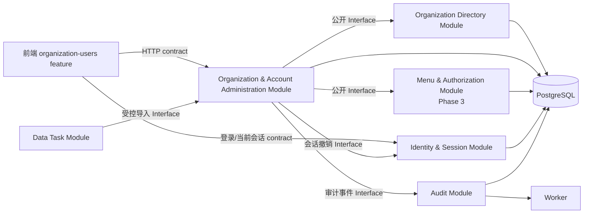

# IAM 正式开发准入与模块化实施路径

> 状态：IAM-01 已实现，等待本地人工验收；IAM-02 已独立立项待开始  
> 日期：2026-08-27  
> 范围：P1 的登录、组织、部门、用户、账号生命周期；菜单与权限管理作为后续独立功能  
> 关联事实：[SPEC-IAM-01](../../requirements/specs/organization_user_account_spec.md)、[SPEC-IAM-02](../../requirements/specs/role_permission_spec.md)、[ADR-001](../../technical/adr/ADR-001-application-runtime-shape.md)、[ADR-005](../../technical/adr/ADR-005-local-identity-authentication-and-session.md)、[前端组件规范](../../technical/designs/frontend/FRONTEND_COMPONENT_STANDARD.md)  
> 非目标：不把现有 `WI-004` 的浏览器内 Mock 原型升级为正式实现；不替代对应 SPEC、ADR 或后续 work-item。

## 1. 目的与当前事实

项目已进入正式本地开发和 IAM-01 验证阶段。`WI-004` 仅验证了工作台视觉、信息架构和表单模式；`WI-006` 已将其替换为 PostgreSQL、Flyway、真实会话、组织/用户 API 和模块化前端。最后的真实浏览器闭环等待本机初始化管理员密码配置。正式开发仍以模块化单体的公开 Interface、数据所有权、真实前后端契约、数据库迁移、安全控制和端到端验收为交付单位。

| 主题     | 当前事实                                                                                                                                                   | 对正式开发的结论                                               |
| -------- | ---------------------------------------------------------------------------------------------------------------------------------------------------------- | -------------------------------------------------------------- |
| 需求规格 | `SPEC-IAM-01` 已用于 WI-006 实现；`SPEC-IAM-02 v0.3` 是独立菜单与权限管理草案，实施由 WI-007 跟踪                                                          | IAM-01 等待本地浏览器闭环；IAM-02 不得被用户页的角色下拉框替代 |
| 前端     | 组织用户运行态已拆为 1 个查询组合层、组织目录、用户目录、组织抽屉、用户抽屉、详情抽屉、账号动作抽屉和共享 UI/纯函数；`mock-data.ts` 已退出运行路径         | 页面职责可单独验证；查询/写入协调不再与表格或表单耦合          |
| 后端     | 已有 Identity & Session、Organization Directory、Organization & Account Administration、Audit Module，以及 Spring Security、PostgreSQL、Flyway 和 4 个测试 | IAM-01 的安全和持久化已有本地自动化证据；人工浏览器闭环待执行  |
| 交付基础 | 本地 PostgreSQL/运行时/检查命令可用；Git 尚无初始提交，公司 GitLab 远程、主分支保护与 CI 尚未建立                                                          | 本地单人开发可继续；三人并行和正式合并前仍需关闭协作与质量门   |
| 技术基线 | ADR-001 已接受“模块化单体＋独立 Worker”；ADR-005 已接受“自建员工账号、服务端会话撤销、未来身份 Adapter”                                                    | 正式实现必须让 Module 的 Interface 成为跨 Module 调用和测试面  |

## 2. 采用的模块化标准

本路径采用 Matt `codebase-design` 的术语和约束：

- **Module** 以小而稳定的 **Interface** 隐藏复杂业务实现；调用方和测试跨越同一个 **Seam**。
- **Depth** 以调用方获得的能力衡量，而非以文件数量或层数衡量；禁止把 Controller、Service、Repository 的机械三层拆分误认为模块化。
- 只有确有变化时才建立 **Adapter**；Module 外不得直连另一个 Module 的数据表或内部 Repository。
- 每个 Module 的公开 Interface 是自动化测试面，形成变更的 **Locality**，而不是让页面、Controller 和表查询各自拼装状态规则。

## 3. 正式 IAM Module 拓扑（提议）



图中的箭头是公开 Interface 或最终冻结的 HTTP contract，不是跨 Module 任意访问。`TASK` 在首个 IAM 垂直切片只保留导入任务关联，不实现批量导入本体。

### 3.1 Module、数据所有权与 Interface

| Module                                | 负责的正式事实                                                                                            | 面向调用方的 Interface（示例级，不等同于 HTTP 路由）                                                                                         | 不允许承担的职责                                                         |
| ------------------------------------- | --------------------------------------------------------------------------------------------------------- | -------------------------------------------------------------------------------------------------------------------------------------------- | ------------------------------------------------------------------------ |
| Organization Directory                | `ORG_UNIT`、组织树约束、节点启停、直属统计                                                                | `readTree(scope)`、`createUnit(command)`、`updateUnit(command)`、`changeUnitStatus(command)`                                                 | 不直接维护账号凭证、角色矩阵或前端树状态                                 |
| Organization & Account Administration | `USER_ACCOUNT`、当前组织归属、`ACCOUNT_STATUS_HISTORY`、用户生命周期工作流                                | `queryUsers(query)`、`getUser(id)`、`createUser(command)`、`updateUser(command)`、`moveUser(command)`、`transitionAccount(command)`          | 不直接计算有效权限，不存储可回显凭证，不让 Controller 或 UI 拼装状态转换 |
| Identity & Session                    | 凭证验证、登录失败中性化、服务端会话、账户停用后的会话撤销                                                | `authenticate(command)`、`currentPrincipal(session)`、`revokeSessionsForAccount(accountId, reason)`                                          | 不拥有组织树、用户档案或角色授权规则                                     |
| Menu & Authorization                  | `MENU_RESOURCE`、`ROLE`、`PERMISSION_ITEM`、`ROLE_PERMISSION`、`USER_ROLE_ASSIGNMENT`、临时授权和权限决策 | `listNavigation(subject)`、`decide(subject, action, resourceContext)`、`replaceSystemRoleAssignments(command)`、`listAssignableRoles(scope)` | 不直接修改用户档案、项目业务事实或把页面可见性作为唯一安全控制           |
| Audit                                 | 不可篡改的管理与安全事件、关联 ID、前后值摘要                                                             | `record(event)`；由可靠事件/任务机制保证可追溯                                                                                               | 不决定业务是否允许，也不成为业务数据的第二事实来源                       |
| Data Task                             | 导入批次、错误行、重试和结果回执                                                                          | `startUserImport(command)`、`getImportResult(batchId)`                                                                                       | 不绕过 Organization & Account Administration 的唯一性、权限或审计校验    |

`Organization & Account Administration` 是用户管理前端和 HTTP 层唯一可见的写入 Module。它在一个事务内编排账号唯一性、启用组织校验、版本控制、审计事件和必要的会话撤销；这些规则不能散落在 React 状态、Controller、Repository 或导入脚本中。首期不可配置的初始化系统管理员仅是 Identity/Account 的安全桥接；角色分配和动态菜单只在 `Menu & Authorization` 独立 Module 中实现。

### 3.2 前端 Module 落位

当前 `apps/web/src/features/organization-users/` 已按职责拆开，不把“目录”本身误当成架构边界：

```text
features/organization-users/
├── organization-user-api.ts         # 已冻结 HTTP contract 的客户端与 DTO 映射
├── organization-user-types.ts        # UI 必需的稳定类型
├── organization-user-helpers.ts      # 状态显示与纯查询/转换规则
├── organization-user-workspace.tsx   # 查询、缓存失效、写入协调和 Module 组合
├── organization-directory-panel.tsx  # 组织树与当前组织操作
├── user-directory-panel.tsx          # 用户查询、表格、筛选和分页
├── organization-unit-drawer.tsx      # 组织/部门表单
├── user-editor-drawer.tsx            # 用户创建和资料编辑表单
├── user-detail-drawer.tsx            # 用户详情
├── user-account-action-drawer.tsx    # 调动、状态和密码重置表单
└── organization-user-workspace.test.tsx # 交互与边界测试
```

`mock-data.ts` 只可作为测试 fixture 或视觉参考；运行时代码已通过功能 API 消费已冻结的 HTTP contract。页面局部草稿留在各自的表单 Module，组织、用户、分页、筛选和写入结果由工作区的查询/协调层管理，不能再由单一工作区组件直接修改模拟数组。

### 3.3 后端 Module 落位

正式后端以 `apps/backend/src/main/java/com/winh/workplan/iam/` 为共同前缀，并按上表的 Module 建立代码包。每个 Module 内部可按领域、应用、持久化与 Web Adapter 组织；跨 Module 只能依赖其公开 Interface。数据库迁移跟随其数据所有权，由单个后端 Module 负责，不允许另一个 Module 直接写同一张业务表。

是否使用额外架构测试库、OpenAPI 生成方式及 HTTP 错误格式，必须在共享设计和对应 implementation work-item 中确定；在确定前不预装框架或虚构接口。

## 4. 强制准入门

| Gate               | 必须产生的证据                                                                                       | 关闭条件                                                                |
| ------------------ | ---------------------------------------------------------------------------------------------------- | ----------------------------------------------------------------------- |
| G0：工程流程       | Matt 的 issue tracker 和 domain-doc 布局已配置，且不与项目现有 `work-items`/GitLab MR 形成双重事实源 | 项目负责人确认 tracker 方案；完成 `setup-matt-pocock-skills` 的交互配置 |
| G1：产品与安全设计 | IAM-01 的认证、凭证、会话、初始组织、最后管理员保护已有明确结论；IAM-02 的权限模型在独立阶段闭合     | 当前仅阻断 IAM-01 的未决项；不要求先完成角色/权限引擎                   |
| G2：共享契约       | 身份会话、HTTP 错误、分页、审计与迁移的跨功能规则有唯一维护位置                                      | 建立并评审必要共享设计；不在单功能 SPEC 复制冲突规则                    |
| G3：实现 SPEC      | IAM-01 的 API 方法、DTO、错误码、并发/幂等、表/索引/迁移顺序与测试矩阵冻结                           | `SPEC-IAM-01` 达到 `ready-for-implementation`；IAM-02 维持独立草案      |
| G4：交付基础       | 本地运行时、PostgreSQL、工作项责任边界和本地自动化检查可用；Git/CI 作为后续协作门                    | 本地单人开发不被 Git 阻断；三人并行、MR 合并和共享部署前完成 Git/CI 门  |
| G5：实现验收       | Module Interface 测试、数据库迁移测试、权限/安全集成测试、前端 contract 测试和关键 E2E 证据          | 完整垂直切片通过，Mock 原型不得替代其中任一项                           |

## 5. 阶段与依赖顺序（GSD 编排草案）

| 阶段                              | 目标                                                                             | 输入 / 阻断                                      | 可交付的完成条件                                         |
| --------------------------------- | -------------------------------------------------------------------------------- | ------------------------------------------------ | -------------------------------------------------------- |
| Phase 0：正式化准备               | 配置 Matt 运行前提、冻结工作项来源、建立需求与 Module 设计缺口清单               | 项目负责人对 issue tracker 与 domain docs 的确认 | G0 关闭；当前原型已与正式实现隔离                        |
| Phase 1：登录与用户设计闭合       | 完成身份、会话、审计、API、迁移和测试设计                                        | G0；IAM-01 的待确认项                            | G1-G3（IAM-01）关闭；形成可执行 implementation work-item |
| Phase 2：登录与用户垂直切片       | 自建登录、组织/用户读写、Flyway、服务端会话、初始化管理员保护和正式前端集成      | Phase 1；PostgreSQL 本地环境                     | G5 的 IAM-01 核心场景通过                                |
| Phase 3：菜单与权限管理（WI-007） | 菜单资源注册、动态导航、权限项目录、角色、数据范围、权限决策、临时授权与安全回归 | Phase 2；IAM-02 冻结                             | IAM-02 验收通过，其他业务 Module 可调用 `decide`         |
| Phase 4：客户与商机               | 依赖用户、角色和权限 Interface 的客户/商机垂直切片                               | IAM Foundation 已验收                            | 客户、商机 SPEC 的独立验收通过                           |
| Phase 5：项目空间                 | 从已验收商机创建空间，保留成员/角色协作关联                                      | 客户/商机和 IAM 可用                             | 项目空间 SPEC 的独立验收通过                             |

每一个正式阶段按 Matt 主链执行：设计尚未收敛时先完成 discovery；多会话构建将已确认范围沉淀为实现侧 SPEC，再拆为带阻断边的 tickets；每张实施 ticket 走 test-first 实现与对照 SPEC 的 code review。GSD 只负责编排阶段、依赖、持久状态和验收，不取代项目内的 PRD、SPEC、ADR 或 work-item。

## 6. 可验证的模块化验收

1. 后端架构测试证明任一 IAM Module 不直接依赖另一个 Module 的持久化实现或业务表；跨 Module 调用只穿过声明的 Interface。
2. 每个公开 Interface 至少有一组行为测试；状态转换、账号唯一性、组织循环、越权、会话撤销和幂等失败均由 Module 测试或集成测试覆盖。
3. OpenAPI 或等价的唯一 HTTP contract 能驱动前端 contract 测试；前端不能以本地 Mock 数据绕过服务器错误、分页、无权限或并发版本结果。
4. Flyway 迁移在干净 PostgreSQL 实例可重复执行；每张表的数据所有权、索引、历史策略和回退限制在 implementation work-item 中可追溯。
5. 浏览器 E2E 覆盖登录失败中性化、已停用/锁定账号拒绝、组织范围越权拒绝、用户创建/调动/状态变更历史和关键表单错误。
6. 前端的 AppShell、Theme Token 和共享模式只在已有稳定的两个以上消费者时提取；功能专用的字段、列、查询与权限判断保留在 feature Module。

## 7. 已确认的本地开发约束

1. 项目 `docs/development-testing/work-items/` 是当前任务事实源；GitLab MR 仅在后续远程协作时承担评审与合并证据，不额外创建本地 tracker。
2. 本地 Git、远程和 CI 不阻断当前单人正式实现，但不因此跳过 SPEC、共享契约、数据库迁移、安全测试与浏览器功能验证。
3. Phase 2 只实现登录与用户管理；菜单管理、权限资源、角色授权、数据范围和动态导航必须在 Phase 3 作为独立完整功能交付。
