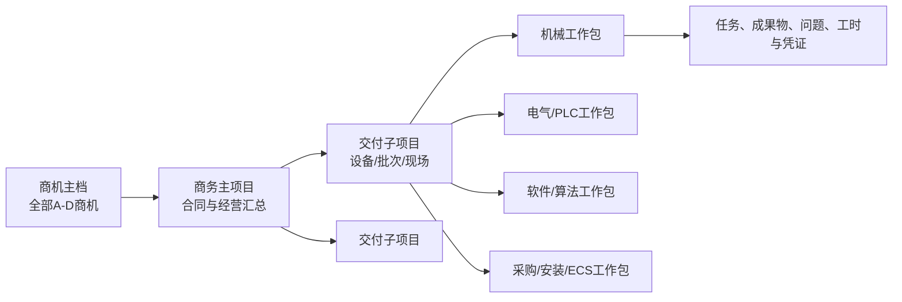
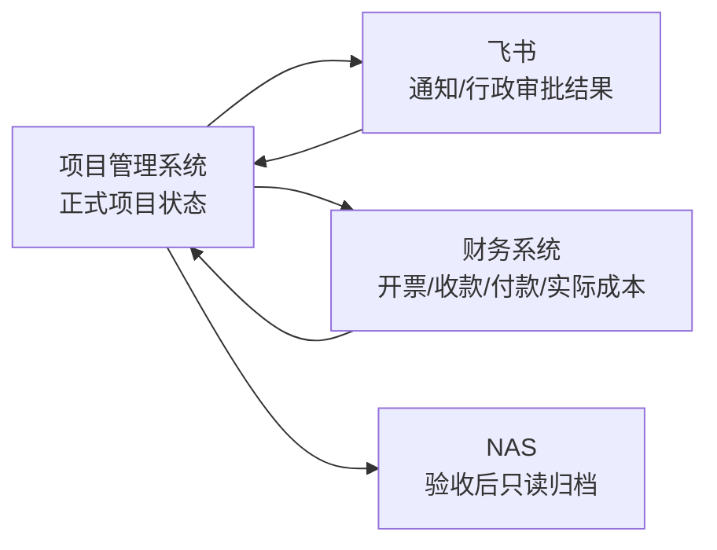

> [!IMPORTANT]
> **兼容路径提示**：本文件保留用于兼容历史引用，正式需求事实已迁移至 [`docs/requirements/BRD.md`](../../requirements/BRD.md)。后续评审与引用请使用正式路径；下方保留原始业务内容。

# 项目全生命周期管理系统业务需求与流程蓝图 V0.1

> 文档类型：业务需求方案 / 流程蓝图  
> 编制日期：2026-07-15  
> 适用范围：商务部门、产研部门、PMO事业部及公司管理层  
> 配套附件：[项目规定动作与成果物主清单 V0.1](../../requirements/references/项目规定动作与成果物主清单_v0.1.xlsx)
> 图形化附件：[业务需求蓝图导航](../../requirements/product-flows/index.html)

## 1. 文档目的

本方案用于统一公司从商机、售前、交付、验收到维护关闭的项目管理规则，明确跨部门权责、阶段门、规定动作、成果物、数据口径和MVP边界。

本方案回答“系统管理什么、业务如何运行、什么状态才算完成”。项目建设计划、实施组织、技术架构、技术选型和详细接口方案在本方案确认后另行编制。

## 2. 建设背景

### 2.1 组织分工

| 组织 | 当前核心职责 |
|---|---|
| 商务部门 | 销售、商机、售前方案、立项、招投标、采购及商务协调 |
| 产研部门 | 算法、通用软件、机械设计、电气设计及专业质量保障 |
| PMO事业部 | 项目经理/集成经理、PLC开发、电气调试、施工安装及现场交付 |

### 2.2 业务特点

- 公司以非标自动化项目为主，非标约占60%，标准化或迭代型项目约占40%。
- 主要项目覆盖堆取料机、装船机、卸船机、门机、装车楼等设备。
- 即使复用标准产品，硬件适配、PLC、软件配置和现场调试仍持续产生工作量。
- 项目经理背景不同，既有软件项目经理，也有集成和电气背景人员，因此不能假设项目经理具备全部专业判断能力。
- 所有商机从出现开始即可能产生调研、方案、差旅和人力投入，需要纳入成本与资源管理。

### 2.3 主要问题及因果关系

本项目优先解决商务移交、计划责任、人员资源和资料版本问题，同时将问题闭环、安全、成本、采购和绩效证据纳入统一数据底座。

## 3. 建设目标与成功标准

### 3.1 总体目标

建立一条贯穿商机、商务、交付、验收和维护的统一项目主线，使所有项目参与者基于同一项目编号、同一计划、同一任务状态、同一文件版本和同一审计记录协作。

### 3.2 业务成功标准

1. 所有商机均建立生命周期主档，并记录售前投入、资源占用和输赢原因。
2. 项目未通过正式移交门或提前开工例外审批时，不能无痕进入交付。
3. 每个里程碑、工作包和任务均有明确责任、期限、状态、成果与验证记录。
4. 部门负责人能够看到未来人员负荷，跨项目冲突在人员承诺前被发现。
5. 日报、周报和周期性经营报告优先从项目事实自动汇总，减少重复填报。
6. 问题、风险、变更和安全事项具备分级、责任、时限、升级、验证和关闭记录。
7. 项目成员能够确认当前有效文件；验收时系统能够生成完整归档清单和不可变快照。
8. 管理层能够穿透查看项目组合、合同约束、生产窗口、首台套风险、经营预测和待决策事项。

具体比例、时限和预警阈值不在本版主观设定。试点准备阶段应先采集现状基线，再把阈值固化为系统配置和验收口径。

## 4. 核心设计原则

1. **一条项目主线**：从商机开始保留数据，不在售前、交付和维护之间重复建档。
2. **统一主干、差异模板**：所有项目共享关键阶段门，标准复用、配置迭代、非标、首台套采用不同动作深度。
3. **矩阵制权责**：项目经理对结果与计划负责，部门负责人对人员供给和专业质量负责，工作包负责人对专业成果负责。
4. **过程是源，报表是结果**：台账、周报、看板和绩效证据从业务过程自动形成。
5. **正常流程加受控例外**：不以僵硬流程阻止合理开工，但例外必须限范围、限预算、限期限并保留审计。
6. **成果物受控**：文件具备编制、评审、批准、发布、替代和归档状态，附件不等于正式成果物。
7. **系统为唯一事实来源**：飞书负责沟通与提醒，NAS负责验收后长期归档，正式项目状态保存在新系统。
8. **MVP验证、全量推广**：架构按全量目标设计，先以双项目验证，再覆盖所有新商机和在建项目。

## 5. 项目对象模型

### 5.1 层级规则

| 层级 | 作用 | 关键规则 |
|---|---|---|
| 商机主档 | 记录客户机会、A-D等级、售前活动和投入 | 商机失败或取消后关闭并保留投入及原因 |
| 商务主项目 | 汇总合同、客户、金额、付款节点和总体经营 | 中标、签约或提前开工获批后沿用原商机数据 |
| 交付子项目 | 按设备、批次、现场或验收单元管理交付 | 小项目可以不拆；大型合同可拆多个子项目 |
| 专业工作包 | 承载机械、电气、采购、PLC、软件、算法、安装和ECS等专业交付 | 由项目配置自动启用，不要求所有项目全量生成 |
| 任务与成果 | 明确责任、期限、工时、成果物、问题和验证 | 任务完成不等于成果物批准，二者分别留痕 |

### 5.2 商机等级

| 等级 | 定义 |
|---|---|
| A | 项目已较明确，主要等待招标或落单 |
| B | 项目基本可靠，但金额、验收时间等细项尚未明确 |
| C | 存在竞争，结果不确定 |
| D | 只有初步商机信息，需要持续跟进 |

商机等级只衡量成交确定性，不直接等同于交付项目优先级。

### 5.3 项目优先级

交付项目优先级为独立属性，由公司级授权人综合以下因素裁决：

- 合同工期、违约责任和验收期限；
- 客户生产窗口、停机条件和安全紧急程度；
- 首台套、重大技术风险和产品战略价值。

首台套或高风险项目不能机械地“永远优先”，但必须配置公司级负责人、专项评审、风险预备和关键资源保护。

## 6. 生命周期与阶段门

### 6.1 交付阶段门

| 阶段门 | 关键通过条件 | 未通过处理 |
|---|---|---|
| DG-01 交付准入 | 商务依据、范围、技术资料、验收目标、计划约束、初始投入和风险达到要求 | 退回缺项；特殊情况走提前开工例外 |
| DG-02 项目基线 | 团队、角色、工作包、主计划和实施预算已评审 | 不得进入无基线执行；分阶段预算需有批准范围 |
| DG-03 需求基线 | 调研成果、需求、接口、现场约束和资料包已确认 | 生成缺项或变更，不允许口头替代 |
| DG-04 设计冻结 | 机械、电气、软件、供货清单、验收标准完成必要评审 | 评审问题未关闭的受影响范围不得放行 |
| DG-05 出厂/进场就绪 | 采购、制造、开发、接口、测试和安全准备达到进场要求 | 关联任务延迟并升级，不得用现场返工常态化补救 |
| DG-06 调试就绪 | 到货验收、安装复核、通电通网、配置、安全培训和测试缺陷达到要求 | 关键前置缺失时禁止进入对应调试等级 |
| DG-07 验收就绪 | 合同范围内调试、空重载、培训和试运行证据齐全 | 生成未完成项、责任和补齐期限 |
| DG-08 验收归档/维护移交 | 验收签署、有效文件、归档清单、离场和维护资料齐全 | 不得仅凭会议口头结论关闭项目 |
| DG-09 项目关闭 | 质保或维护责任完成，遗留问题关闭，复盘和知识沉淀完成 | 保持维护状态并继续跟踪责任 |

### 6.2 提前开工例外

提前开工必须填写并审批：

- 启动依据与必要性；
- 允许执行的临时范围；
- 临时预算上限和资源承诺；
- 缺失资料、责任人及补齐期限；
- 风险承担人、停止条件和到期日期；
- 公司级授权审批记录。

到期未转正时，系统冻结新增承诺并升级公司裁决。已批准范围内的安全止损和收尾不受冻结影响。

## 7. 项目模板与工作包

### 7.1 项目模板

| 模板 | 适用情形 | 管理深度 |
|---|---|---|
| 标准复用 | 主要复用已批准产品基线 | 聚焦现场差异、配置、安装、回归测试和验收 |
| 配置/迭代 | 有明确差异或局部设计开发 | 启用受影响工作包、差异评审和回归验证 |
| 非标定制 | 需要完整调研、设计和开发 | 执行完整调研、评审、开发、测试和现场交付 |
| 首台套/特殊 | 首次落地、海外、重大创新或高风险项目 | 在完整流程上增加公司级评审、原型验证、预备金和资源保护 |

### 7.2 工作包

项目配置由“产品复用程度＋合同交付范围＋工作量等级”共同决定。可启用的工作包包括：

- 机械设计与制造；
- 电气设计与制造；
- 采购与分包；
- PLC与电控开发；
- 通用软件开发；
- 算法开发；
- 安装、调试与培训；
- ECS与外部系统接口。

远程手动、远程半自动、远程全自动和全流程ECS仅在合同或项目范围中启用。已启用等级必须具有自己的前置条件、测试用例、空重载记录和通过证据。

## 8. 治理与权责

### 8.1 矩阵制治理

| 角色 | 核心责任 |
|---|---|
| 项目经理/集成经理 | 对范围、计划、进度、协调、风险、经营预测和最终交付负责 |
| 技术负责人 | 对跨专业方案、接口、技术决策和技术风险负责 |
| 工作包负责人 | 对本专业计划、任务分解、成果质量和验收负责 |
| 部门负责人 | 对人员供给、资源优先级、专业质量和能力建设负责 |
| 项目成员 | 对承诺任务、实际投入、日报、成果和问题反馈负责 |
| PMO | 负责项目组合监督、标准动作执行、冲突汇总和升级 |
| 公司级授权人 | 裁决重大资源冲突、重大变更、提前开工和优先级 |

### 8.2 资源冲突处理

售前资源采用分级审批：少量内部投入由部门负责人确认，超过工时、差旅或外部费用阈值时提交公司级审批。阈值由试点前的现状数据校准后配置。

## 9. 计划、任务、工时与报告

### 9.1 四层计划

1. 项目主计划：合同、验收和关键交付里程碑，由项目经理维护。
2. 工作包计划：各专业交付计划，由工作包负责人维护。
3. 周滚动计划：未来若干周的任务和资源安排，由负责人和成员确认。
4. 个人任务与日报：当天执行、实际投入、问题、现场事实和下一步计划。

下层执行数据自动向上汇总，里程碑、周计划、任务、日报之间不得形成独立重复数据源。

### 9.2 计划基线

- 计划评审通过后形成基线版本并锁定。
- 变更必须说明原因、范围、工期、成本、资源和验收影响。
- 新版本生效后保留原基线，系统能够比较原计划、当前计划和实际执行。

### 9.3 工时

- 实际投入按天或半天记录，按周由本人和负责人确认。
- 工时用于资源负荷、项目投入和绩效证据，不直接以“工时越多越好”评价绩效。

### 9.4 日报与周报

日报记录任务进展、实际投入、问题阻塞、现场/安全事实、图片成果和下一步计划。周报由系统汇总里程碑偏差、工作包状态、人员负荷、重大问题和下周计划，项目经理补充管理判断并确认。

## 10. 问题、风险、变更与安全

### 10.1 分类

| 类型 | 定义 |
|---|---|
| 问题/缺陷 | 已经发生并影响执行的Bug、接口异常、到货不符、现场阻塞等 |
| 风险 | 尚未发生但可能影响项目的事项，记录概率、影响、触发条件和预案 |
| 变更 | 范围、技术、工期、预算、合同或验收基线发生调整 |
| 安全事项 | 隐患、违章、事故、培训、保险及复工条件 |

### 10.2 统一闭环

发现登记 → 分级分派 → 分析处置 → 提交验证 → 验证关闭。

处理人只能申请完成，提出方或指定验收人确认后才能关闭。重大问题和逾期事项自动进入周报并升级。重复问题按产品、机型、专业、供应商和根因进行穿透分析。

### 10.3 变更控制

变更必须完成范围、技术、工期、成本、合同、验收和安全影响评估，再按等级审批。紧急情况下允许先执行安全或止损措施，但必须在限定时间内补录依据、影响和审批。

### 10.4 安全管理

安全管理覆盖保险与资质、内部/外部培训、专项作业方案、日常检查、隐患整改、事件响应、停工、复工审批和统计复盘，不以单纯上传培训表代替闭环。

## 11. 项目知识库与归档

### 11.1 项目知识库

每个项目按阶段和工作包自动生成标准目录，至少包括：基础与合同、商务移交、计划预算、调研、设计评审、采购到货、开发版本、测试/FAT、安装调试、验收维护。

文件记录以下属性：项目/子项目、阶段/工作包、版本、生效日期、编制/审核/批准角色、密级、关联任务/问题/变更和归档要求。

### 11.2 文件状态

草稿 → 评审中 → 已批准/已发布 → 已替代/已作废。

已替代和已作废版本保留历史但禁止误用，并指向当前有效版本。

### 11.3 公司知识库

公司知识库保存制度、模板、安全手册、产品说明和标准配置。项目成果经复盘、脱敏和评审后才可发布为公司知识，项目原始客户资料不能自动进入公共知识库。

### 11.4 验收归档

系统按项目模板检查必备成果物，缺项自动生成责任待办。通过后生成文件目录、有效版本、审批记录和校验信息组成的不可变归档快照。

- 新系统继续保留在线只读版本，用于维护、追溯和知识引用。
- NAS保存独立长期归档副本，用于长期保存、灾备和审计。

## 12. 成本、采购与经营预测

### 12.1 项目成本口径

| 口径 | 定义 |
|---|---|
| 批准预算 | 当前有效预算基线 |
| 已承诺成本 | 已批准但可能尚未付款的采购、分包、差旅和人员计划 |
| 实际成本 | 到货、报销、付款和实际工时形成的成本 |
| 完工预测 | 实际成本加剩余预计成本，用于提前识别最终超支 |

售前投入从商机阶段累计。未中标商机仍保留投入和输赢原因。提前开工受临时预算上限约束。

### 12.2 采购闭环

采购需求 → 预算校验 → 询比价/供应商/合同 → 到货验收 → 入库/领用/付款回写。

采购延期影响关联任务，到货不合格自动生成问题，备品备件和工具进入相应台账。

### 12.3 收入、回款与周期上报

合同付款节点关联里程碑、签字文件和触发条件，记录计划与实际开票、收款日期及逾期原因。系统按项目事实生成下月预计收入、预计回款、采购需求、重点项目和经营报告。

新系统负责项目管理与预测口径；财务/飞书继续负责会计核算、付款、开票、报销和出差审批，并通过项目编号回写或对账。

## 13. 管理台账、看板与绩效

### 13.1 管理台账

项目、人员、采购、车辆、宿舍、保险、备品备件、工具和资产台账从立项、分配、领用、投保、住宿、归还和关闭等业务事件自动形成，不要求在线下重复维护主表。

### 13.2 三层看板

| 看板 | 主要内容 |
|---|---|
| 项目看板 | 里程碑、工作包、人员、问题、预算、采购、资料完整度和验收节点 |
| 部门看板 | 人员负荷、跨项目任务、专业交付、逾期问题、质量缺陷和未来资源需求 |
| 公司经营看板 | 项目组合、优先级、进度风险、预计收入回款、成本偏差和待决策项 |

### 13.3 KPI、OKR与绩效证据

- KPI是交付基准线和岗位履职要求，强调目标、口径、结果确认和周期结算。
- OKR用于目标管理、协同和突破，强调关键结果、持续检查、调整依据、复盘和下一周期承接。
- 一般岗位以岗位KPI和项目贡献为主；项目/工作包负责人使用交付KPI和项目目标；管理岗位使用经营/资源KPI和组织OKR；首台套团队使用基础交付KPI和专项OKR。
- 项目任务不是天然的KPI或OKR。只有进入指标模板、明确口径和责任后，项目事实才转化为绩效证据。
- 系统提供数据、公式、证据、调整原因和周期快照，负责人完成最终评价；系统不直接决定奖金或自动排名。

不得以工时越多、关闭任务越多、问题越少或日报字数越多作为简单正向绩效。主动暴露风险并推动闭环应得到正向识别。

## 14. 权限与安全

### 14.1 权限模型

权限由“组织岗位 ∩ 项目角色 ∩ 数据密级 ∩ 数据状态”共同决定。临时授权必须记录原因、范围和到期时间。

### 14.2 数据密级

| 等级 | 示例 | 默认范围 |
|---|---|---|
| L1 一般资料 | 普通计划、公开手册 | 项目成员按角色查看 |
| L2 项目内部 | 现场资料、设计过程、问题记录 | 限定项目成员 |
| L3 商务/经营敏感 | 合同价格、利润、采购价格、预算明细 | 商务、财务、项目经理及授权管理者按需查看 |
| L4 核心技术 | 核心算法、源代码、密钥、受控图纸 | 最小范围、下载控制、全量审计 |

项目经理可查看批准预算、已承诺、实际成本、完工预测和偏差，但默认不能查看个人工资、内部费率明细和其他项目的敏感经营数据。

### 14.3 外网访问

首期仅允许公司员工登录，支持公司外安全访问。外网登录应采用统一身份、多因素认证、会话与设备控制、下载水印/审批、操作审计和离职即时停权。

已批准或已归档数据原则上不可直接修改；更正通过变更、替代或冲销机制保留原记录。

## 15. WEB、移动端与外部系统

### 15.1 终端分工

| 入口 | 适用场景 |
|---|---|
| 桌面WEB | 主计划、甘特图、资源排期、预算采购、知识库评审、看板和系统配置 |
| 移动响应式WEB | 今日任务、日报、工时、问题/风险/隐患、拍照视频、安全检查、审批和验收 |
| 飞书 | 消息提醒、待办摘要和进入新系统的深度链接 |

首期不需要离线能力。现场网络条件变化时，再增加离线草稿、断点续传和任务/检查单缓存。

### 15.2 集成边界

飞书聊天中的“已完成”不能直接关闭系统事项。只有在新系统提交成果并完成验证才构成正式闭环。

## 16. MVP范围与推广

### 16.1 MVP必做

- 组织、员工、项目角色、权限和员工外网访问；
- 全部商机建档、A-D等级、售前投入与资源申请；
- 商务移交、正常准入和提前开工例外；
- 主项目、子项目、工作包、里程碑、周计划和任务；
- 人员承诺、实际投入、负荷和冲突预警；
- 日报、周报和基础项目/部门看板；
- 问题、风险、变更和安全事项基础闭环；
- 项目知识库、文件版本、评审和阶段门成果物；
- 基础预算、采购需求与经营节点；
- 飞书提醒、深度链接和移动响应式使用。

### 16.2 MVP暂缓深化

- 完整财务自动化、会计核算和复杂对账；
- 车辆、宿舍、保险、工具等辅助台账的深度功能；
- 完整KPI/OKR校准、申诉和奖金联动平台；
- 独立原生APP和全功能离线；
- 客户、供应商和分包商外部门户；
- 全部历史聊天、作废版本和无效表格迁移。

上述领域的数据模型和扩展边界在首期预留，但不进入MVP验收范围。

### 16.3 试点与推广路线

### 16.4 在建项目最小迁移包

在建项目迁移项目主档、当前阶段、团队权限、有效计划、未结任务/问题/风险、当前有效文件和预算采购口径。历史聊天、作废版本和无效表格不强制迁入，但保留来源索引。

## 17. MVP验收维度

| 目标 | 验收证据 |
|---|---|
| 商务移交完整 | 缺项能够识别；正常准入和例外审批均可追溯 |
| 计划与责任透明 | 里程碑、工作包、任务、责任、期限和偏差可穿透查看 |
| 资源冲突前置 | 人员承诺前显示未来负荷和跨项目冲突，并保留裁决记录 |
| 问题形成闭环 | 重大事项具备分级、责任、期限、处理证据、验证和升级 |
| 文件版本可信 | 项目成员能找到当前有效版本及完整评审/替代历史 |
| 报告减少重复 | 日报、周报和看板主要从执行数据生成，重复字段不要求二次填写 |
| 用户真实使用 | 试点项目的关键工作在系统完成，不依赖长期线下补表绕过 |
| 安全与审计 | 权限、下载、修改、审批、例外和归档操作可追溯 |

验收阈值在试点前基于现状数据确认，并写入MVP验收方案；不能在没有基线的情况下主观设置改善比例。

## 18. 需求附件与后续产物

### 18.1 规定动作与成果物清单

配套Excel以PMO《项目全生命周期管理流程20260209》为底稿，形成一张主表和多个视图，覆盖：

- 动作编号、阶段、阶段门和工作包；
- 项目模板适用性和必做规则；
- 责任、协作、审核与批准角色；
- 前置条件、规定动作、成果物、版本和完成标准；
- 例外、升级、知识库和归档要求；
- 原始PMO动作与本次需求补充动作的来源区分。

图形化附件新增[《规定动作与成果物全景》](../../requirements/product-flows/12-action-deliverable-panorama.html)，用于查看100项动作的阶段分布、项目模板深度、专业工作包覆盖、7项制度缺口及可检索目录；Excel仍是完整明细和后续模板配置的结构化来源。

### 18.2 后续产物顺序

1. 用户审阅并确认本业务需求与流程蓝图及Excel清单；
2. 编制项目建设方案，明确建设范围、组织、投资估算、总体路线、里程碑、迁移、培训、推广和风险；
3. 编制项目级PRD，把业务蓝图细化为产品范围、用户场景、功能清单、核心流程、SPEC索引和产品级验收；
4. PRD期间同步完成关键技术可行性验证，随后编制详细技术方案，明确架构、数据、流程引擎、权限、集成、部署和非功能设计；
5. 在PRD与技术方案基线之上编制详细实施计划、测试方案和试点验收方案。

## 19. 已确认的关键决策

| 决策 | 结论 |
|---|---|
| 项目类型 | 非标约60%，标准化/迭代约40%，采用统一主干加差异模板 |
| 项目颗粒度 | 商务主项目＋可选交付子项目＋专业工作包 |
| 项目治理 | 矩阵制；公司级授权人裁决重大资源冲突 |
| 商机范围 | 所有A-D商机从出现开始登记并统计售前投入 |
| 提前开工 | 允许受控例外，限范围、预算、期限并到期升级 |
| 计划颗粒度 | 主计划、工作包、周滚动、个人任务/日报四层 |
| 工时 | 按天或半天记录，按周确认 |
| 文件边界 | 过程文件在新系统；验收后新系统只读保留并同步NAS归档 |
| 外部访问 | 首期仅公司员工，允许安全外网登录 |
| 系统边界 | 新系统为项目事实来源；飞书沟通提醒；财务执行交易；NAS长期归档 |
| 绩效 | KPI为履职基线，OKR为目标管理，系统提供证据，负责人最终评定 |
| MVP路径 | 双项目验证后覆盖所有新商机和全部在建项目 |
| 移动端 | MVP采用移动响应式WEB，无离线和独立原生APP |

## 20. 本版边界说明

本版已经确认业务模型、流程原则、MVP边界和验收维度。审批阈值、预警时限、KPI公式、角色到具体人员的映射及各成果物模板内容，需要在项目建设阶段结合公司制度、真实项目数据和试点组织完成配置。这些配置不得改变本方案已确认的生命周期、权责和审计原则。
