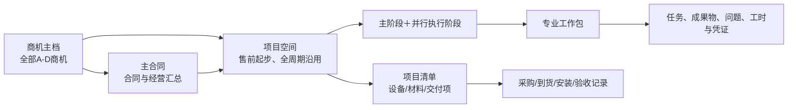
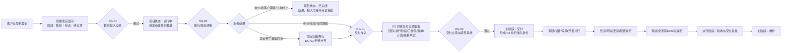
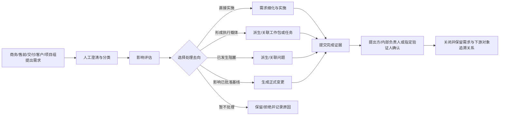
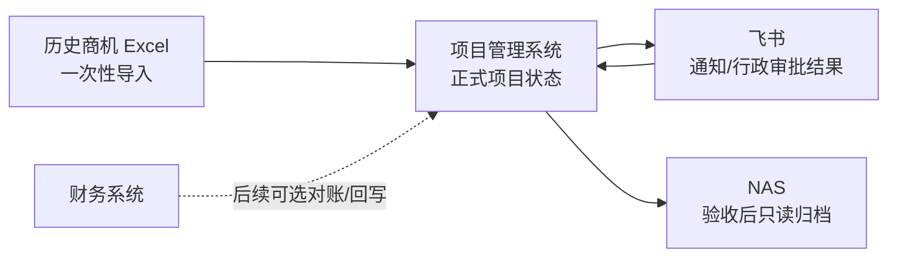

# 项目全生命周期管理系统业务需求文档（BRD）V0.4

> 文档类型：业务需求文档（BRD）  
> 文档别名：需求蓝图 / 业务流程蓝图  
> 编制日期：2026-07-23  
> 本次修订：以“主阶段＋并行执行阶段”替代交付单元主轴，补充项目清单、独立需求池、风险入口、经营责任、手写日报及周报—例会—待办闭环  
> 适用范围：商务部门、产研部门、PMO事业部及公司管理层  
> 来源附件：[项目规定动作与成果物主清单 V0.1](./references/项目规定动作与成果物主清单_v0.1.xlsx)（保留原始盘点与追溯，不直接作为 V0.4 执行基线）
> 图形化附件：[业务需求蓝图导航](./product-flows/index.html)

## 1. 文档目的

本方案用于统一公司从商机、售前、交付到维护的项目管理规则，明确跨部门权责、阶段门、规定动作、成果物、数据口径和MVP边界。验收作为交付主阶段内的执行阶段；项目关闭流程暂不纳入本版设计。

本方案回答“系统管理什么、业务如何运行、什么状态才算完成”。项目建设计划、实施组织、技术架构、技术选型和详细接口方案在本方案确认后另行编制。

## 2. 建设背景

### 2.1 组织分工

| 组织 | 当前核心职责 |
|---|---|
| 商务部门 | 销售、商机、售前方案、售前投入立项、招投标、采购及商务协调；商务与售前属于同一部门，但系统角色分开配置并允许同一人兼任 |
| 产研部门 | 算法、通用软件、机械设计、电气设计及专业质量保障 |
| PMO事业部 | 项目经理/集成经理、PLC开发、电气调试、施工安装及现场交付 |

### 2.2 业务特点

- 公司以非标自动化项目为主，非标约占60%，标准化或迭代型项目约占40%。
- 主要项目覆盖堆取料机、装船机、卸船机、门机、装车楼等设备。
- 即使复用标准产品，硬件适配、PLC、软件配置和现场调试仍持续产生工作量。
- 项目经理背景不同，既有软件项目经理，也有集成和电气背景人员，因此不能假设项目经理具备全部专业判断能力。
- 所有商机从出现开始即可能产生调研、方案、差旅和人力投入，需要纳入成本与资源管理。

### 2.3 主要问题及因果关系

本项目优先解决商务移交、计划责任、人员资源和资料版本问题，同时将问题闭环、安全、成本和采购纳入统一数据底座。绩效管理当前暂缓，系统只保留真实、可审计的业务事实，不在本阶段生成绩效证据或评分。

## 3. 建设目标与成功标准

### 3.1 总体目标

建立一条贯穿商机、商务、交付、验收和维护的统一项目主线，使所有项目参与者基于同一项目编号、同一计划、同一任务状态、同一文件版本和同一审计记录协作。

### 3.2 业务成功标准

1. 所有商机均建立生命周期主档，并记录售前投入、资源占用和业务结果；业务结果在商机、项目空间和分析看板中一致回显。
2. 项目未通过正式移交门或提前开工例外审批时，不能无痕进入交付。
3. 每个里程碑、工作包和任务均有明确责任、期限、状态、成果与验证记录。
4. 部门负责人能够看到未来人员负荷，跨项目冲突在人员承诺前被发现。
5. 项目经理每日手写项目日报；项目成员按项目提交周报，系统汇总形成项目周报草稿，由项目经理补充审核并用于项目例会。
6. 问题、风险、变更和安全事项具备责任、时限、处理、验证和关闭记录；风险等级、规则、验证人及转问题关系由人员维护。
7. 项目成员能够从项目空间快速找到、搜索和分享当前有效文件；验收时系统能够生成完整归档清单和不可变快照。
8. 管理层能够穿透查看项目组合、合同约束、生产窗口、首台套风险、经营预测和待决策事项。
9. 商务、售前、交付、客户及项目组内部需求均进入同一需求池，原需求保留并可由人员派生问题、工作包、任务或变更。

具体比例、时限和预警阈值不在本版主观设定。试点准备阶段应先采集现状基线，再把阈值固化为系统配置和验收口径。

## 4. 核心设计原则

1. **一条项目主线**：从商机开始保留数据，不在售前、交付和维护之间重复建档；同一项目空间贯穿全周期。
2. **统一主干、差异模板**：所有项目共享售前、交付、维护主阶段，按项目类型从版本化模板选择适用执行阶段、规定动作、里程碑和成果物。
3. **矩阵制权责**：项目经理对结果与计划负责，部门负责人对人员供给和专业质量负责，工作包负责人对专业成果负责。
4. **过程是源，报告有责任人**：台账和看板来自业务过程；日报由项目经理手写，项目周报从成员周报汇总并由项目经理审核。
5. **正常流程加受控例外**：不以僵硬流程阻止合理开工，但例外必须限范围、限预算、限期限并保留审计。
6. **成果物受控**：文件具备编制、评审、批准、发布、替代和归档状态，附件不等于正式成果物。
7. **系统为唯一事实来源**：新系统保存商机、项目状态、业务结果和当前有效资料；飞书仅负责沟通与提醒，NAS仅负责验收后的长期归档副本。
8. **分段 MVP、连续主线**：架构按全量目标设计，首期先跑通商机、售前和 DG-01；交付管理从 DG-02 接续深化，沿用同一项目空间、项目清单、需求与历史。
9. **阶段、状态与结果独立回显**：主阶段、当前重点阶段、项目状态和业务结果是四个独立事实，任何页面不得用“已关闭”替代“未中标、客户取消或主动终止”等业务结论。

## 5. 项目对象模型

“项目空间”是贯穿售前、交付和维护的协作容器，也是项目阶段、清单、需求、计划、风险、问题、报告、会议、成员和资料的统一入口。商机、主合同与项目保持可追溯关系，但系统不再以“交付单元”作为主要管理层级。

### 5.1 层级与阶段规则

| 对象 | 作用 | 关键规则 |
|---|---|---|
| 商机主档 | 记录客户机会、A-D等级、商务/售前活动和投入 | 商机失败或取消后关闭并保留投入及原因；需要正式售前投入时创建项目空间 |
| 主合同 | 汇总合同主体、客户、金额、付款节点和总体经营 | 正式签约后沿用商机数据建立；补充协议和合同变更关联原主合同 |
| 项目空间 | 承载售前、交付和维护阶段的协作与治理 | 同一项目不因进入交付而重新建档；固定提供项目概览、项目阶段、里程碑、项目清单、需求池、资金计划、风险管理、问题管理、项目例会、日报周报、成员和项目资料入口 |
| 项目清单 | 统一管理设备、材料及其他交付项 | 每项可记录品牌、型号、规格、数量、供应商、采购、到货、安装、验收、附件以及关联需求/风险/问题 |
| 专业工作包 | 承载机械、电气、采购、PLC、软件、算法、安装和ECS等专业执行 | 由需求、项目阶段或项目经理建立并关联阶段、里程碑和成果物 |
| 任务与成果 | 明确责任、期限、工时、成果物、问题和验证 | 任务完成不等于成果物批准，二者分别留痕 |

项目采用两层阶段表达：

1. **主阶段**：售前、交付、维护。一个项目同一时点只有一个当前主阶段。
2. **并行执行阶段**：项目启动、交付立项、调研、设计、采购、开发、到货、测试、安装及配置、远程手动、远程半自动、远程自动、全流程ECS、试运行、验收、交付复盘等；项目可同时启用多个执行阶段，并指定一个“当前重点阶段”用于项目台账、日报和看板默认展示。

执行阶段由版本化项目阶段模板生成。模板区分必选、可选和条件启用阶段，配置默认负责人、前置条件、并行规则、里程碑、规定动作、成果物和完成条件。创建项目时选择模板并形成项目快照；模板新版本不自动改写运行中项目。项目经理可启用、开始、暂停、跳过、完成或重新打开阶段并留痕；阶段负责人可更新本阶段进度、里程碑、成果、风险和问题，但不能改变主阶段。

多设备、多现场或分开验收不再创建交付单元，而是在同一项目清单中按设备、材料、现场、安装位置和验收范围记录、筛选及汇总。分次进场、分阶段实施或分阶段交付通过阶段、里程碑、清单状态、任务分组或时间窗口表达，不新增平行业务对象。

提前开工阶段的承诺与实际先挂接商机、项目空间及提前开工审批，不建立虚假主合同。DG-01 通过并进入 P2 后，项目经理在同一项目空间准备团队、执行阶段、工作包、项目清单、主计划和预算草案；正式签约后绑定主合同，并保留签约前投入、预算和执行记录。

项目空间在确认需要正式售前工作时由商机创建，创建后主阶段即为“售前”、项目状态为“待立项”；这里的待立项特指等待 SG-01 售前投入立项，不等于 DG-02 交付立项。SG-01 通过后项目状态变为“进行中”；商机未中标或终止时关闭同一空间并转为只读；中标、合同签署或获批提前开工后，同一空间继续承载 DG-01 商务移交和后续 DG-02 交付立项。

### 5.2 商机等级

| 等级 | 定义 |
|---|---|
| A | 项目已较明确，主要等待招标或落单 |
| B | 项目基本可靠，但金额、验收时间等细项尚未明确 |
| C | 存在竞争，结果不确定 |
| D | 只有初步商机信息，需要持续跟进 |

商机等级只衡量成交确定性，不直接等同于交付项目优先级。

### 5.3 项目优先级

交付项目优先级为独立属性，由公司级授权人综合以下因素裁决：

- 合同工期、违约责任和验收期限；
- 客户生产窗口、停机条件和安全紧急程度；
- 首台套、重大技术风险和产品战略价值。

首台套或高风险项目不能机械地“永远优先”，但必须配置公司级负责人、专项评审、风险预备和关键资源保护。

### 5.4 项目空间与业务结果

项目空间必须同时显示以下四个独立字段：

| 字段 | 作用 | 示例 |
|---|---|---|
| 项目主阶段 | 表示项目处于哪一段宏观生命周期 | 售前、交付、维护 |
| 当前重点阶段 | 表示当前最需要管理和汇报的执行阶段 | 设计、采购、开发、安装、验收等；不排斥其他执行阶段并行 |
| 项目状态 | 表示该项目当前是否在正常运行 | 待立项、进行中、暂停、已关闭 |
| 业务结果 | 表示商务层面的最终或当前结论 | 待定、中标/成交、未中标/未成交、客户取消、主动终止 |

系统内部将“成功”和“失败”作为稳定结果类别，并按采购方式显示业务用语：招投标场景显示“中标/未中标”，非招标成交场景显示“成交/未成交”。例如招投标结束但未中标时，主阶段显示“售前”、当前重点阶段显示“投标评审”、项目状态显示“已关闭”、业务结果显示“未中标”。项目列表、项目空间页头、项目详情、商机详情、关闭记录和分析看板使用同一来源并同步回显，组合展示为“售前｜投标评审｜已关闭｜未中标”。

- 未中标、客户取消或主动终止后，商机与项目空间关闭并只读保留，售前资料、投入、原因和复盘仍可检索和统计，不进入 DG-01；
- 招投标延期时保持“进行中”或“暂停”，不得误记为未中标；招投标取消时以“客户取消”关闭；
- 同一采购事件恢复时受控重开原商机与项目空间；新一轮独立采购事件新建商机，并关联历史记录。

## 6. 生命周期与阶段门

售前调研用于形成初步需求、方案、工程量、采购估算、报价和投标依据，允许保留已声明的假设；交付后的深化调研用于形成正式需求基线、设计输入、接口边界和验收依据。所有商机均需登记，但只有发生跨部门人力、差旅、外部费用或其他实质投入时，才按阈值进入相应层级的售前投入立项/资源审批。

“主阶段”“执行阶段”“项目状态”“阶段门”和“规定动作”不得混用：

| 概念 | 业务含义 | 本方案口径 |
|---|---|---|
| 主阶段 | 项目处于哪段宏观生命周期 | 售前、交付、维护 |
| 执行阶段 | 项目当前开展的执行主题，可并行 | 售前内的商务/技术动作，以及交付内的项目启动、调研、设计、采购、开发、安装、调试、验收等 |
| 项目状态 | 当前是否运行 | 待立项、进行中、暂停、已关闭 |
| 阶段门 | 是否满足进入下一段的检查点 | SG-01、SG-02、DG-01 至 DG-09；阶段门本身不是项目阶段 |
| 售前规定动作 | 售前阶段需要开展的工作与成果 | 调研、需求梳理、方案、工程量/采购估算、报价、招投标、技术交底准备等 |
| 专业工作包 | 跨阶段按专业范围组织执行 | 机械、电气、PLC、软件、算法、采购、安装、ECS 等 |

售前规定动作经常并行、反复和局部回退，不按“调研完成后才能做方案、方案完成后才能招投标”的固定顺序推进。交付阶段的设计、采购、开发，以及安装、配置和测试也可能并行。系统分别记录各执行阶段及规定动作的责任、状态、成果版本、问题和评审结论，并以一个当前重点阶段承载台账和汇报默认回显。

### 6.1 售前控制点与交付阶段门

| 阶段门 | 关键通过条件 | 未通过处理 |
|---|---|---|
| SG-01 售前投入立项 | 调研目的、拟投入人员/差旅/费用、预期成果、责任人和退出条件明确 | 不得形成未授权的跨部门或外部投入；少量内部投入按授权阈值简化确认 |
| SG-02 报价/投标评审 | 售前调研、方案、工程量、采购估算、关键假设、交付约束和主要风险已评审 | 缺失项显式列为假设、风险或待澄清项；高风险项目必须增加交付可行性评审 |
| DG-01 交付准入 | 商务依据、范围、技术资料、验收目标、计划约束、初始投入和风险达到要求 | 退回缺项；提前开工只允许限定范围先行，不自动视为 DG-01 通过 |
| DG-02 交付立项与项目基线 | 团队、角色、执行阶段、工作包、项目清单、主计划和实施预算已评审 | 不得进入无基线执行；分阶段预算需有批准范围 |
| DG-03 深化需求基线 | 交付调研成果、需求、接口、现场约束和资料包已确认 | 生成缺项或变更，不允许口头替代 |
| DG-04 设计基线与采购/开发放行 | 机械、电气、软件、供货清单、接口和验收标准形成受控版本并完成必要评审 | 评审问题未关闭的受影响范围不得采购、制造、开发或发布 |
| DG-05 出厂/进场就绪 | 采购、制造、开发、接口、测试和安全准备达到进场要求 | 关联任务延迟并升级，不得用现场返工常态化补救 |
| DG-06 调试就绪 | 到货验收、安装复核、通电通网、配置、安全培训和测试缺陷达到要求 | 关键前置缺失时禁止进入对应调试等级 |
| DG-07 验收就绪 | 合同范围内调试、空重载、培训和试运行证据齐全 | 生成未完成项、责任和补齐期限 |
| DG-08 验收归档/维护移交 | 验收签署、有效文件、归档清单、离场和维护资料齐全 | 不得仅凭会议口头结论关闭项目 |
| DG-09 项目关闭 | 当前版本仅保留未来扩展位，不设计项目关闭流程 | 维护期结束、关闭责任和归档规则在后续批次单独确认 |

设计基线表示“当前批准版本可以作为采购、制造、开发和验证依据”，不表示后续永久禁止修改。到货、测试、安装、调试或运行阶段发现变化时，项目保持当前主阶段，只对受影响的执行阶段、项目清单项、工作包、采购项和验证活动开启变更分支：

1. 设计错误或质量返工进入问题闭环，记录责任、返工工时和成本；
2. 客户需求、现场条件、合同范围或验收口径变化进入正式变更，评估范围、技术、工期、成本、合同、验收和安全影响；
3. 紧急安全或止损调整允许先处置，但必须限时补录依据、影响和审批；
4. 变更批准后生成新的有效设计版本，旧版本标记为已替代，并按影响范围重新采购、开发、测试、FAT或现场验证。

### 6.2 提前开工例外

提前开工必须填写并审批：

- 启动依据与必要性；
- 允许执行的临时范围；
- 临时预算上限和资源承诺；
- 缺失资料、责任人及补齐期限；
- 风险承担人、停止条件和到期日期；
- 公司级授权审批记录。

P1 提供最小“提前开工承诺台账”，逐笔记录承诺类型、范围说明、金额或工时、责任人、发生日期、依据和实际发生，并自动汇总预算占用、资源承诺和剩余额度。它只服务例外控制，不替代 P2 的交付立项与基线能力，也不替代 P3 的完整资源、预算、采购和交付执行模块。

到期、超出批准范围或超过临时预算上限时，系统冻结新增承诺并升级公司裁决。已批准范围内的安全止损和收尾不受冻结影响。

提前开工申请获批后可作为批准范围内的开工依据，但它不自动通过 DG-01，也不是中标、合同签署或完整 DG-02 基线的替代物。系统必须在同一项目空间持续显示“提前开工”标识、批准范围、预算上限、到期日、缺项和停止条件；先行活动期间项目阶段仍为“售前”，业务结果可以保持“待定”。后续转为正式合同路径时补齐并通过 DG-01，再由 P2 准备和完成 DG-02，同时保留完整例外历史。

## 7. 项目阶段模板与工作包

### 7.1 项目阶段模板

| 模板类型 | 适用情形 | 默认阶段深度 |
|---|---|---|
| 标准复用 | 主要复用已批准产品基线 | 聚焦现场差异、配置、安装、回归测试和验收 |
| 配置/迭代 | 有明确差异或局部设计开发 | 启用受影响工作包、差异评审和回归验证 |
| 非标定制 | 需要完整调研、设计和开发 | 执行完整调研、评审、开发、测试和现场交付 |
| 首台套/特殊 | 首次落地、海外、重大创新或高风险项目 | 在完整流程上增加公司级评审、原型验证、预备金和资源保护 |

阶段模板不是菜单，而是生成具体项目阶段结构的配置。后台“项目阶段模板”按主阶段组织执行阶段，配置必选/可选/条件启用、默认负责人、前置条件、是否允许并行、默认里程碑、规定动作、成果物和完成条件。项目空间的“项目阶段”入口以阶段地图、列表和时间轴展示模板生成的项目阶段实例。

模板发布形成版本。新建项目选择模板并可按项目实际启用可选阶段、标记不适用并说明原因；运行中项目保存自己的模板快照，模板升级不自动覆盖项目事实。当前重点阶段由项目经理设置；阶段负责人只能维护所负责阶段的进度和内容。

### 7.2 工作包

工作包由需求、执行阶段或项目经理建立，用于承载跨成员的专业执行，不再依附交付单元。可启用的工作包包括：

- 机械设计与制造；
- 电气设计与制造；
- 采购与分包；
- PLC与电控开发；
- 通用软件开发；
- 算法开发；
- 安装、调试与培训；
- ECS与外部系统接口。

远程手动、远程半自动、远程全自动和全流程ECS仅在合同或项目范围中启用。已启用等级必须具有自己的前置条件、测试用例、空重载记录和通过证据。

## 8. 治理与权责

### 8.1 矩阵制治理

| 角色 | 核心责任 |
|---|---|
| 项目经理/集成经理 | 对范围、计划、进度、协调、风险、经营预测和最终交付负责 |
| 技术负责人 | 对跨专业方案、接口、技术决策和技术风险负责 |
| 工作包负责人 | 对本专业计划、任务分解、成果质量和验收负责 |
| 部门负责人 | 对人员供给、资源优先级、专业质量和能力建设负责 |
| 项目成员 | 对承诺任务、实际投入、任务进展、成果、问题反馈和个人周报负责 |
| 商务/售前 | 负责商务信息与售前成果，并可查看项目资金摘要、风险、问题和成员；不得查看成本、利润等受限经营字段 |
| PMO管理职能 | 负责项目组合监督、标准动作执行、冲突汇总和升级；提交实际确认收入，发布付款计划和采购计划 |
| 营销 | 确认实际确认收入，发布回款计划并维护实际回款 |
| 公司级授权人 | 裁决重大资源冲突、重大变更、提前开工和优先级 |

本表中的“PMO管理职能”不等同于整个PMO事业部。PMO事业部人员根据具体任命，分别以项目经理、工作包负责人、PLC/调试/安装专业人员或项目成员身份承担交付责任。

### 8.2 资源冲突处理

售前资源采用分级审批：少量内部投入由部门负责人确认，超过工时、差旅或外部费用阈值时提交公司级审批。阈值由试点前的现状数据校准后配置。

## 9. 计划、任务、工时、报告与例会

### 9.1 四层计划

1. 项目主计划：合同、验收和关键交付里程碑，由项目经理维护。
2. 工作包计划：各专业交付计划，由工作包负责人维护。
3. 周滚动计划：未来若干周的任务和资源安排，由负责人和成员确认。
4. 个人任务与执行事实：成员按实际发生更新任务进展、投入、问题、现场事实和成果，并提交项目成员周报。

下层执行数据向上汇总，里程碑、周计划、任务、成员周报、项目周报和项目例会之间形成可追溯闭环。项目日报作为项目经理每日手写的管理记录，不由系统从执行数据自动生成正文。

### 9.2 计划基线

- 计划评审通过后形成基线版本。
- 项目经理可直接调整里程碑和预算，提交时必须说明调整原因，可附线下审批或确认依据。
- 新版本直接生效并保留历史版本，系统能够比较原计划、当前计划和实际执行；首期不建设复杂的系统内审批流。

### 9.3 工时

- 实际投入按天或半天记录，按周由本人和负责人确认。
- 工时用于资源负荷、项目投入和绩效证据，不直接以“工时越多越好”评价绩效。

### 9.4 项目日报

- 每个执行中的项目每天由项目经理填写一份项目日报，正文采用纯手写方式；
- 系统只提供日期、项目、填报人、模板、历史记录和附件等基础能力，不自动生成日报正文；
- 首期不限制提交时间、节假日、补录、逾期锁定或代填规则；
- 日报不替代任务、问题、风险和成果物记录。

### 9.5 成员周报与项目周报

- 项目组成员按项目提交个人周报，记录本周完成、下周计划、问题风险和需要协调的事项；
- 系统汇总成员周报以及项目内的里程碑、阶段、任务、风险和问题事实，生成项目周报初稿；
- 项目经理对初稿进行补充、修订和审核后发布正式项目周报；
- 正式项目周报保留来源范围、生成时间、补充内容、审核人和版本，能够下钻到成员周报及关联事项。

### 9.6 项目例会与会后待办

- 项目例会由用户手动创建，系统不承载音视频会议，可记录线上会议链接；
- 单项目例会可关联一份或多份项目周报，PMO级例会可聚合多个项目的项目周报；
- 会议过程中可补充议题、讨论记录、结论和决策；
- 会后待办明确责任人、期限和状态，并可关联或派生任务、需求、问题、风险、工作包以及里程碑/预算变更；
- 周报提供汇报依据，例会形成决策与待办，待办执行结果再进入后续周报，构成管理闭环。

## 10. 问题、风险、变更与安全

### 10.1 分类

| 类型 | 定义 |
|---|---|
| 问题/缺陷 | 已经发生并影响执行的Bug、接口异常、到货不符、现场阻塞等 |
| 风险 | 尚未发生但可能影响项目的事项，记录概率、影响、触发条件和预案 |
| 变更 | 范围、技术、工期、预算、合同或验收基线发生调整 |
| 安全事项 | 隐患、违章、事故、培训、保险及复工条件 |

### 10.2 统一闭环

发现登记 → 分级分派 → 分析处置 → 提交验证 → 验证关闭。

处理人只能申请完成，提出方或指定验收人确认后才能关闭。风险等级、判定规则、负责人、验证人、应对方案以及与派生问题的关系均由人员维护，系统不自动评分、不自动把风险转换为问题。风险实际发生时，由人员手动派生或关联问题，并保留原风险与问题的追溯关系。重大问题和逾期事项进入周报并升级。重复问题按产品、机型、专业、供应商和根因进行穿透分析。

### 10.3 变更控制

变更必须完成范围、技术、工期、成本、合同、验收和安全影响评估，再按等级审批。紧急情况下允许先执行安全或止损措施，但必须在限定时间内补录依据、影响和审批。

设计基线发布后的问题和变化必须区分处理：内部设计错误作为质量问题及返工记录，客户/现场/合同条件变化作为变更申请。变更批准后只重新打开受影响的执行阶段、项目清单项、工作包、采购项、任务和验证活动，不要求整个项目生命周期回退；新版本生效后保留原版本、变更依据和重新验证证据。

### 10.4 安全管理

安全管理覆盖保险与资质、内部/外部培训、专项作业方案、日常检查、隐患整改、事件响应、停工、复工审批和统计复盘，不以单纯上传培训表代替闭环。

### 10.5 项目需求池

“需求池”是项目空间内的独立入口，贯穿售前、交付和维护，用于统一承接商务、售前、交付、客户及项目组内部提出的需求、澄清事项和后续调整。需求对象始终保留，不因后续转化而被覆盖；需求池与问题、风险、变更和安全闭环共用“责任—处理—验证—关闭”的治理原则，但保持对象语义独立。

- 正式需求基线建立前，需求调整属于需求澄清与细化；正式基线建立后，影响范围、技术、工期、成本、合同、验收或安全的变化必须生成正式变更；
- 需求可由人员派生或关联问题、工作包、任务和变更，也可保留或拒绝；系统不自动判断处理去向；
- 处理人只能提交完成，需求提出方、内部需求负责人或指定验证人确认后才能关闭；
- 重要客户需求关闭时应保留客户确认、会议纪要、邮件或其他等效证据；
- 原需求始终保留，需求与关联方案、工作包、任务、成果物、问题、风险、变更和验证记录可双向追溯。

## 11. 项目知识库与归档

### 11.1 项目知识库

每个项目空间提供唯一且显眼的“项目资料”入口。项目成员不需要询问或记忆另一个资料地址，即可在权限范围内按主阶段、执行阶段、售前规定动作、专业工作包、资料类型、状态和关键词查找当前资料。系统按阶段和工作包自动生成标准目录，至少包括：基础与合同、商务移交、计划预算、调研、设计评审、采购到货、开发版本、测试/FAT、安装调试、验收维护。

文件记录以下属性：项目空间、主阶段/执行阶段/工作包/项目清单项、版本、生效日期、编制/审核/批准角色、密级、关联需求/任务/问题/变更和归档要求。

### 11.2 文件状态

草稿 → 评审中 → 已批准/已发布 → 已替代/已作废。

已替代和已作废版本保留历史但禁止误用，并指向当前有效版本。

项目成员可为权限内文件生成“外网分享链接＋访问密码”。分享访问者不需要系统账号；链接应至少支持有效期、主动撤销、查看/下载方式和访问日志。首期不按文件密级额外增加差异化审批，所有文件类型在技术上均可分享，但“分享权限”独立于“查看/下载权限”：只有同时拥有目标文件查看/下载权和对应密级分享权的成员才能生成链接。链接只授予所选文件，不暴露项目目录、其他文件或项目空间权限。该口径属于业务已确认的便利性选择，安全方案仍需验证密码强度、转发泄露、日志留存和紧急撤销。

系统不建设客户、供应商或分包商门户。分享链接主要用于员工在互联网环境下受控访问；如确需向客户或供应商提供资料，由员工下载后在系统外自行发送，不赋予外部人员项目空间访问权。

### 11.3 公司知识库

公司知识库保存制度、模板、安全手册、产品说明和标准配置。项目成果经复盘、脱敏和评审后才可发布为公司知识，项目原始客户资料不能自动进入公共知识库。

### 11.4 验收归档

系统按项目模板生成归档清单，并依据“是否适用＋是否存在当前有效版本＋是否完成必要评审/批准/发布”自动判断每项完成状态。缺项自动生成责任待办；人工只进行最终核验，或对不适用、例外和豁免填写原因并留痕，不能仅凭勾选把无有效文件的条目标记为完成。通过后生成文件目录、有效版本、审批记录和校验信息组成的不可变归档快照。

- 新系统继续保留在线只读版本，用于维护、追溯和知识引用。
- NAS只保存验收后的独立长期归档副本，用于长期保存、灾备和审计；系统记录归档快照编号、同步时间、NAS路径和同步结果，过程协作不回到 NAS。
- 归档成功后，项目空间“项目资料”固定展示权限内可访问的“长期归档/NAS”路径或链接，成员无需另行询问资料位置；链接指向对应归档快照，不替代系统内的过程资料与受控分享。

## 12. 成本、采购与经营预测

### 12.1 项目成本口径

| 口径 | 定义 |
|---|---|
| 批准预算 | 当前有效预算基线 |
| 已承诺成本 | 已批准但可能尚未付款的采购、分包、差旅和人员计划 |
| 实际成本 | 到货、报销、付款和实际工时形成的成本 |
| 完工预测 | 实际成本加剩余预计成本，用于提前识别最终超支 |

售前投入从商机阶段累计。未中标商机仍保留投入和输赢原因。提前开工受临时预算上限约束。

### 12.2 采购闭环

采购分为售前估算与交付执行两个阶段。售前工程量/采购估算清单用于方案、报价和投标，不等于已批准采购需求；提前开工获批后只能在批准范围和临时预算上限内形成例外承诺。P2 完成 DG-02 后，才能将经移交确认的差异转为正式采购预算基线和采购需求。设备、物料及其采购、到货、安装、验收状态统一回写“项目清单”，不再通过交付单元拆分管理。

- 商务/售前牵头售前工程量与采购估算，相关专业负责人确认技术规格和工程量，商务采购岗位核实供应商、估算价格和交期；
- 常规、标准化、低风险项目由PMO事业部在交付准入时接收并检查售前成果物；
- 非标程度高、交期紧、现场实施复杂、存在长周期设备、重大验收风险或计划投标前采购的项目，必须由拟任项目经理或PMO事业部指定代表在投标前参加交付可行性评审；
- 交付立项后由项目经理组织确认正式采购范围、计划和预算，售前清单与交付采购基线之间的增减差异必须留痕；
- 未经预算批准或提前开工/提前采购例外审批，售前估算清单不得直接触发下单。

采购延期影响关联任务，到货不合格自动生成问题，备品备件和工具进入相应台账。

自动化项目的公司级“采购清单库”放入后续阶段建设。未来由公司维护标准物料、设备、规格、供应商和参考价格，售前可从库中选择性配置采购估算，经交付复核后形成正式项目采购清单与采购计划，再进入采购执行、到货、安装和验收，并回写项目清单。本期只预留关联边界，不建设采购清单库及其配置器。

### 12.3 项目经营台账与周期上报

P4 建立与客户、主合同、项目空间和经营节点关联的内部项目经营台账，区分计划、实际、确认状态和维护责任：

| 数据对象 | 业务口径 | 提交/发布与维护 | 生效规则 |
|---|---|---|---|
| 实际确认收入 | 已经完成的确认收入事实，不是预计收入 | PMO提交，营销确认 | 营销确认后进入正式项目经营台账 |
| 回款计划 | 未来回款节点与金额 | 营销发布，PMO知晓 | 发布后直接生效，可版本迭代 |
| 付款计划 | 未来付款节点与金额 | PMO发布 | 发布后直接生效，可版本迭代 |
| 采购计划 | 未来采购节点、对象与金额 | PMO发布 | 发布后直接生效，可版本迭代 |
| 实际回款 | 已发生的回款事实 | 商务/营销维护 | 保存后进入授权范围内台账 |
| 实际付款 | 已发生的付款事实 | 项目经理维护 | 保存后进入授权范围内台账 |
| 采购执行 | 已发生的采购执行事实 | 项目经理维护 | 保存后进入授权范围内台账并关联项目清单 |

回款、付款和采购计划的新版本直接生效，必须保留历史版本、调整原因、修改人和时间。实际确认收入必须保留PMO提交人、营销确认人、确认时间和依据；未确认记录不得计入正式确认收入汇总。实际数据保留依据附件、修改、更正和冲销记录。

上述数据用于项目管理和公司经营分析，不替代财务会计核算，也不直接作为法定财务报表；在未与财务系统核对前，界面和导出必须标明“项目管理口径”，不得展示为会计已核对事实。报表支持按期间、客户、主合同、项目空间和经营节点汇总并下钻到来源记录。

### 12.4 合同主档与归档

系统只承接签署后的合同主档和受控归档，不建设合同审批、法务审查、电子签署、用印申请、纸质原件保管或借还流程。

合同主档至少关联客户、来源商机，并在项目空间中聚合展示；多个设备、现场或验收对象通过项目清单项及其分组关联。主档记录合同编号、签约主体、金额、签署/生效日期、状态、付款与验收节点、当前有效签署文件，以及补充协议、变更、终止与原合同的关系。中标通知、委托函和提前开工审批属于 DG-01 商务依据，不伪装成已签合同。合同文件和关键字段按商务敏感数据控制权限，修改、替代、下载和归档留痕，并在项目验收归档时与 NAS 快照保持关联。

## 13. 管理台账、看板与绩效

### 13.1 管理台账

项目、人员、采购、车辆、宿舍、保险、备品备件、工具和资产台账从立项、分配、领用、投保、住宿、归还和关闭等业务事件自动形成，不要求在线下重复维护主表。

### 13.2 三层看板

| 看板 | 主要内容 |
|---|---|
| 项目看板 | 主阶段、当前重点阶段、并行执行阶段、项目状态、业务结果、里程碑、项目清单、需求、工作包、人员、风险、问题、资金摘要、资料完整度和验收节点 |
| 部门看板 | 人员负荷、跨项目任务、专业交付、逾期问题、质量缺陷和未来资源需求 |
| 公司经营看板 | 商机与项目组合、业务结果、优先级、进度风险、计划/实际收入回款付款采购、成本偏差和待决策项 |

### 13.3 绩效范围暂缓

绩效考核表、KPI/OKR、评分、校准、申诉和奖金联动本阶段暂不设计，也不进入 MVP 验收。系统只需保留可审计的业务过程事实，避免为了未来绩效而重复填表；如后续确认需要，再基于真实岗位职责和已积累数据单独立项讨论。

## 14. 权限与安全

### 14.1 权限模型

权限由“组织岗位 ∩ 项目角色 ∩ 数据密级 ∩ 数据状态”共同决定。临时授权必须记录原因、范围和到期时间。

### 14.2 数据密级

| 等级 | 示例 | 默认范围 |
|---|---|---|
| L1 一般资料 | 普通计划、公开手册 | 项目成员按角色查看 |
| L2 项目内部 | 现场资料、设计过程、问题记录 | 限定项目成员 |
| L3 商务/经营敏感 | 合同价格、利润、采购价格、预算明细 | 商务、财务、项目经理及授权管理者按需查看 |
| L4 核心技术 | 核心算法、源代码、密钥、受控图纸 | 最小范围、下载控制、全量审计 |

项目经理可查看批准预算、已承诺、实际成本、完工预测和偏差，但默认不能查看个人工资、内部费率明细和其他项目的敏感经营数据。

商务/售前可查看其参与项目的资金计划与实际摘要、风险、问题和成员信息，以支持客户沟通与商务协同；成本明细、采购价格、利润、内部费率等字段对售前默认隐藏，除非另行授权。

### 14.3 外网访问

首期仅为公司员工建立系统账号，支持公司外安全登录；登录访问采用统一身份、会话与设备控制、操作审计和离职即时停权。客户、供应商和分包商不建立账号。

除登录访问外，项目资料允许按第 11.2 节生成“外网分享链接＋访问密码”，访问方无需公司账号。分享能力主要服务员工临时访问，采用独立分享权限、有效期、撤销、访问方式和日志等基础控制；首期不增加按密级区分的分享审批。该便利性口径不改变内部角色和数据权限，不授予项目空间浏览权，也不构成外部项目门户。

已批准或已归档数据原则上不可直接修改；更正通过变更、替代或冲销机制保留原记录。

## 15. WEB、移动端与外部系统

### 15.1 终端分工

| 入口 | 适用场景 |
|---|---|
| 桌面WEB | 主计划、甘特图、资源排期、预算采购、知识库评审、看板和系统配置 |
| 移动响应式WEB | 今日任务、执行事实、项目日报、成员周报、工时、问题/风险/隐患、拍照视频、安全检查、审批和验收 |
| 飞书 | 可选的消息提醒、待办摘要和进入新系统的深度链接；不再维护正式商机台账，且不进入 P1 必验范围 |

首期不需要离线能力。现场网络条件变化时，再增加离线草稿、断点续传和任务/检查单缓存。

### 15.2 集成边界

飞书聊天中的“已完成”不能直接关闭系统事项。只有在新系统提交成果并完成验证才构成正式闭环。

现有飞书多维表格商机台账在迁移完成后停用。全部约 30—50 条历史和当前商机通过一次性 Excel 导入新系统，只迁移当前行中的结构化字段，不迁移附件、评论和跟进历史；导入需提供预览校验、状态/结果映射、客户与责任人映射、重复识别、错误行处理和批次审计。迁移后新系统成为唯一商机事实来源，不建设飞书商机双向同步。

P4 的实际确认收入由PMO提交、营销确认；回款计划由营销发布并通知PMO，付款计划和采购计划由PMO发布；实际回款由商务/营销维护，实际付款与采购执行由项目经理维护。财务系统集成属于后续可选对账/回写，不作为 P4 首版闭环前提。P1 不实现经营台账流程。

## 16. MVP范围与推广

### 16.1 首期 MVP（P1）必做

首期先完整跑通“商机 → 售前 → DG-01 交付准入/移交边界”，交付执行在下一阶段深化。P1 包含：

- 客户主档、全部 A—D 商机、销售进展、跟进、业务结果、关闭/重开和商机分析看板；
- 一次性 Excel 导入全部约 30—50 条历史与当前商机，并在迁移后停用飞书商机表；
- 从商机创建项目空间，统一显示主阶段、当前重点阶段、项目状态和业务结果；
- SG-01 售前投入立项、商务/售前双角色、并行规定动作、成果版本、SG-02 报价/投标评审；
- 项目空间固定导航框架：项目概览、项目阶段、里程碑、项目清单、需求池、资金计划、风险管理、问题管理、项目例会、日报周报、成员和项目资料；P1只开放本阶段需要的能力，其余入口按阶段逐步启用；
- 独立需求池从多来源记录、人工澄清分类、影响评估到派生/关联问题、工作包、任务或变更，再到验证和关闭的基础闭环；
- DG-01 移交资料包、正常交付准入，以及提前开工审批、最小承诺台账和到期/超额冻结；
- 最小合同主档与签署件归档；中标通知、委托函和提前开工审批作为独立 DG-01 商务依据；
- 资料统一入口、检索、版本、外网链接＋密码分享、移交清单和操作审计；
- 权限管理、商机规则和移动响应式基础使用。

P1 的结束点是 DG-01 通过并形成可供下一阶段接续的交付移交包；DG-02 交付立项与项目基线属于 P2 起点。即使同一项目空间继续使用，也不能据此跳过 DG-02。

### 16.2 后续深化范围

- P2：从 DG-01 移交包接续，组建团队，按模板快照配置主阶段与并行执行阶段，建立专业工作包、项目清单、主计划和预算草案；DG-02 通过后进入交付主阶段并形成 P3 执行准入条件；
- P3：在已通过 DG-02 的基线对象下开展完整阶段、资源、预算、采购、项目清单、风险、问题、日报、成员周报、项目周报、例会和交付执行，并完成验收归档与 NAS 自动同步；
- P4：项目经营台账、PMO提交且营销确认的实际确认收入、营销发布的回款计划、PMO发布的付款/采购计划、实际回款/付款/采购执行、合同履约深化和组合经营分析；
- 后续候选：自动化项目采购清单库、售前选择性配置采购估算及向正式采购清单的转化；
- 暂缓：项目关闭流程、绩效考核、完整财务自动化与会计核算、复杂对账、辅助资产台账、独立原生 APP、全功能离线和外部用户门户。

后续范围的数据模型和扩展边界在首期预留，但不进入 P1 验收。

### 16.3 试点与推广路线

### 16.4 数据迁移边界

P1 一次性迁移现有 Excel 中全部商机的结构化当前字段，包含进行中、已关闭和历史商机，保留来源、原状态和业务结果供后续分析；附件、评论和跟进历史不迁移。

进入 P2 时，在建项目再按“最小可运行包”迁移项目主档、主阶段与并行执行阶段、当前重点阶段、项目状态、团队权限、项目清单、有效计划、未结需求/任务/问题/风险、当前有效文件和预算采购口径。历史聊天、作废版本和无效表格不强制迁入，但保留来源索引。

## 17. MVP验收维度

| 目标 | 验收证据 |
|---|---|
| 商机全量迁移 | 约 30—50 条商机通过一次性 Excel 导入完成校验，来源、状态和业务结果可核对，飞书商机表停止作为事实源 |
| 四类事实回显 | 项目列表、空间页头、详情与分析中分别显示主阶段、当前重点阶段、项目状态和业务结果；未中标示例不被“已关闭”替代 |
| 售前协同真实 | 调研、需求、方案、估算、报价/投标等规定动作可并行、反复和留存成果版本 |
| 商务移交完整 | DG-01 缺项能够识别；提前开工不自动通过 DG-01，限定范围、承诺、占用、到期与冻结均可追溯，DG-02 未被越过 |
| 需求形成闭环 | 售前需求可记录、评估、转变更、验证和关闭，并能追溯成果与证据 |
| 项目空间结构统一 | 固定导航中可区分项目阶段、项目清单、独立需求池、独立风险管理、问题、例会、日报周报、成员和资料，并按阶段开放能力 |
| 文件查找与分享 | 项目成员能从统一入口找到当前有效版本，生成可撤销的链接＋密码分享，并查看访问日志 |
| 结果可复盘 | 未中标/未成交、客户取消和主动终止的空间只读保留，投入、原因和资料可统计分析 |
| 用户真实使用 | 试点商机和售前工作的关键事实在系统完成，不依赖继续维护飞书商机主表 |
| 安全与审计 | 权限、分享、下载、修改、关闭、重开、例外和归档操作可追溯 |

验收阈值在试点前基于现状数据确认，并写入MVP验收方案；不能在没有基线的情况下主观设置改善比例。

## 18. 需求附件与后续产物

### 18.1 规定动作与成果物清单

配套Excel以PMO《项目全生命周期管理流程20260209》为底稿，形成一张主表和多个视图，覆盖：

- 动作编号、阶段、阶段门和工作包；
- 项目模板适用性和必做规则；
- 责任、协作、审核与批准角色；
- 前置条件、规定动作、成果物、版本和完成标准；
- 例外、升级、知识库和归档要求；
- 原始PMO动作与本次需求补充动作的来源区分。

图形化附件[《P1 能力与成果物映射》](./product-flows/12-action-deliverable-panorama.html)只展示已经按 V0.4 口径收敛的 P1 能力、成果物和验收关系；Excel V0.1 保留为原始盘点明细和来源追溯，不再把其中的动作数量、必做统计或绩效条目展示成当前可执行基线。

配套Excel V0.1仍是“原始底稿＋新增治理动作”的需求盘点清单，不直接等于100条系统流程。后续形成系统落地矩阵V0.2时，必须同步本版已经调整的口径：取消交付单元主对象，采用主阶段＋并行执行阶段和项目清单；DG-04为设计基线与采购/开发放行；项目经理每日手写日报；成员周报经系统汇总提炼、项目经理补充审核后形成项目周报，并与项目例会和会后待办闭环；售前采购估算与正式采购执行分开。

### 18.2 后续产物顺序

1. 用户审阅并确认本业务需求与流程蓝图及Excel清单；
2. 编制项目建设方案，明确建设范围、组织、投资估算、总体路线、里程碑、迁移、培训、推广和风险；
3. 编制项目级PRD，把业务蓝图细化为产品范围、用户场景、功能清单、核心流程、SPEC索引和产品级验收；
4. PRD期间同步完成关键技术可行性验证，随后编制详细技术方案，明确架构、数据、流程引擎、权限、集成、部署和非功能设计；
5. 在PRD与技术方案基线之上编制详细实施计划、测试方案和试点验收方案。

## 19. 已确认的关键决策

| 决策 | 结论 |
|---|---|
| 项目类型 | 非标约60%，标准化/迭代约40%，采用统一主干加差异模板 |
| 项目颗粒度 | 主合同＋项目空间＋项目清单＋专业工作包；不设置交付单元或批次对象，多设备、多现场和分批验收通过项目清单及阶段、里程碑表达 |
| 项目治理 | 矩阵制；公司级授权人裁决重大资源冲突 |
| 商机范围 | 所有A-D商机从出现开始登记并统计售前投入 |
| 项目空间 | 作为贯穿售前、交付和维护的协作容器，不新增业务主档层级；固定入口常驻，子功能逐步开放 |
| 阶段口径 | 售前、交付、维护为主阶段；执行阶段可并行并指定当前重点阶段；验收属于交付执行阶段；阶段模板版本化并在项目中保留快照 |
| 业务结果 | 待定、成功、失败、客户取消、主动终止独立记录；招投标场景显示中标/未中标，非招标场景显示成交/未成交，并在商机、项目空间和分析中同步回显 |
| 提前开工 | 允许受控例外，P1 以最小承诺台账限制范围、预算、期限并在到期/超额时冻结新增承诺；不自动通过 DG-01 |
| 计划颗粒度 | 主计划、工作包、周滚动、个人任务与执行事实四层；成员通过项目成员周报反馈周度执行 |
| 报告机制 | 项目经理每日纯手写项目日报且首期不设提交限制；成员按项目提交周报，系统汇总提炼项目周报草稿，项目经理补充审核，并与项目例会、会后待办闭环 |
| 采购前置 | 售前形成工程量和采购估算；高风险项目由拟任项目经理/PMO事业部代表前置评审，正式采购须经预算或例外批准 |
| 工时 | 按天或半天记录，按周确认 |
| 需求池 | 项目空间独立入口，贯穿售前、交付和维护；接收商务、售前、交付、客户和项目组需求，可人工派生/关联问题、工作包、任务或变更，原需求始终保留 |
| 风险管理 | 项目空间独立入口；风险等级、规则、负责人、验证人和派生关系由人员维护，风险发生后人工派生/关联问题 |
| 里程碑与预算变更 | 项目经理调整后新版本直接生效，必须填写原因，可附线下依据，历史版本完整保留；首期无复杂系统审批 |
| 文件边界 | 过程文件在新系统统一查找和分享；验收后新系统只读保留并同步 NAS 长期归档 |
| 分享访问 | 有权员工可为各类文件生成外网链接＋密码；分享权限与查看/下载权限分开授予，首期无额外分享审批，不建设客户/供应商门户 |
| 商机迁移 | 飞书商机表停用；全部约30—50条商机一次性通过 Excel 导入，不建设持续同步 |
| 经营台账 | 实际确认收入由PMO提交、营销确认；回款计划由营销发布并通知PMO，付款/采购计划由PMO发布且直接生效；计划可版本迭代，实际回款、付款和采购执行按责任维护 |
| 合同归档 | 只做签署后合同主档、签署件、补充/变更/终止关系和权限审计，不做审批、法务、电子签署和纸质原件管理 |
| 外部访问 | 仅公司员工建立账号；允许安全外网登录及链接＋密码的资料分享 |
| 系统边界 | 新系统为项目事实与当前有效资料来源；飞书沟通提醒；NAS长期归档；财务集成后续可选 |
| 绩效 | 当前阶段暂缓设计，仅保留业务事实供后续讨论 |
| MVP路径 | P1完成商机→售前→DG-01，P2从DG-02开始深化交付管理 |
| 移动端 | MVP采用移动响应式WEB，无离线和独立原生APP |
| 项目关闭 | 当前版本不设计关闭流程，仅保留未来扩展位 |
| 采购清单库 | 自动化项目公司级采购清单库及售前选择性配置放入后续阶段，本期仅预留数据关联边界 |

## 20. 本版边界说明

本版已经确认业务模型、流程原则、P1/P2 边界和验收维度。审批阈值、预警时限、角色到具体人员的映射及各成果物模板内容，需要在项目建设阶段结合公司制度、真实项目数据和试点组织完成配置。这些配置不得改变本方案已确认的生命周期、权责、业务结果回显和审计原则。
