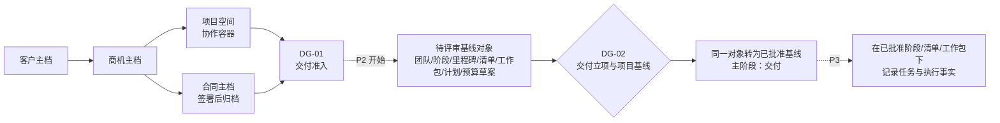
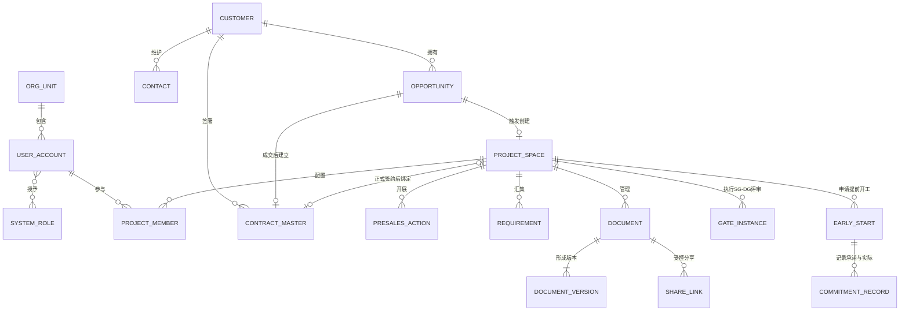
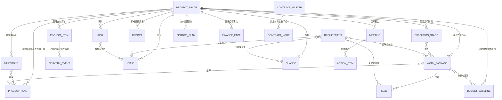
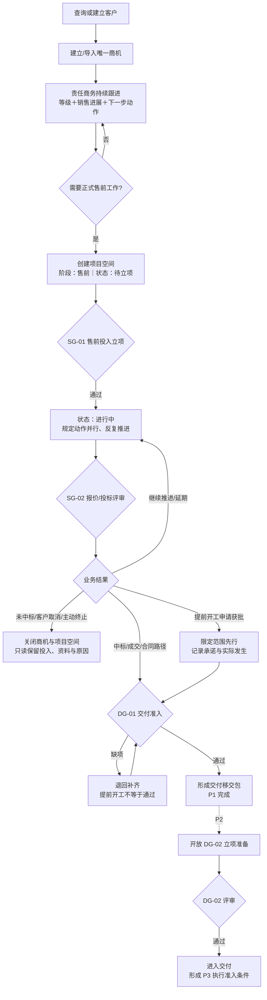
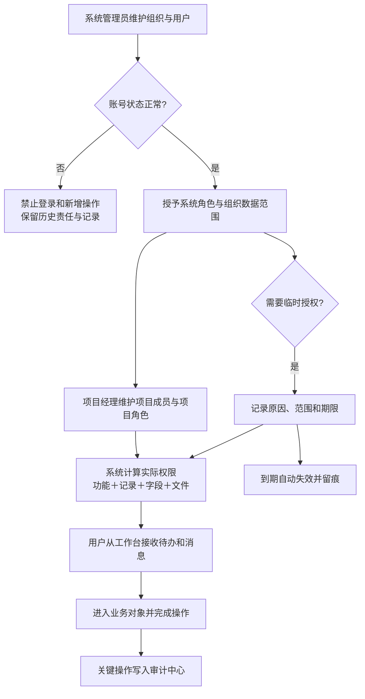
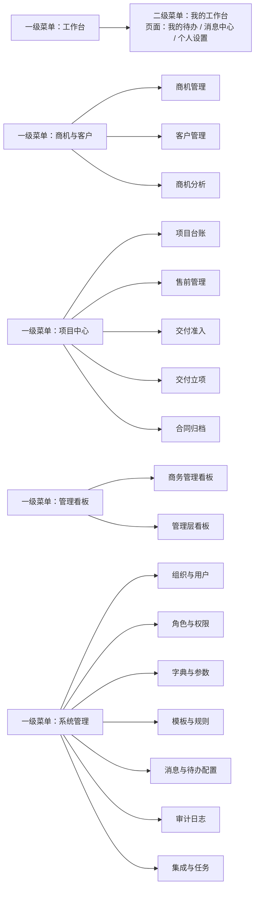
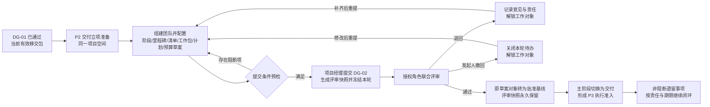

# 项目全生命周期管理系统产品需求文档（PRD）V0.4

> 文档状态：P1/P2 产品基线稿  
> 当前批次：商机 → 售前 → DG-01 交付准入 → DG-02 交付立项与项目基线  
> 编制日期：2026-07-23  
> 最近修订：2026-07-24（深化 DG-02 与 P2 交付立项、项目基线及验收口径）  
> 上游基线：[业务需求文档（BRD）V0.4](./BRD.md)  
> 来源附件：[项目规定动作与成果物主清单 V0.1](./references/项目规定动作与成果物主清单_v0.1.xlsx)（仅用于原始盘点与追溯，不直接作为当前产品基线）  
> 后续明细：docs/requirements/specs/ 下的单功能 SPEC

## 0. 文档说明

### 0.1 编制批次

本 PRD 是全系统唯一的项目级产品需求文档，按业务闭环分批细化，不按部门建立互相独立的平行 PRD。

| 批次 | 主题 | 边界 | 本版状态 |
|---|---|---|---|
| P1 | 商机、售前与交付准入 MVP | 从客户/商机建档到 DG-01 通过并形成交付移交包 | 当前基线 |
| P2 | 交付立项与项目基线 | 从 DG-01 移交包接续，组建团队，配置主阶段/并行执行阶段，建立里程碑、工作包、项目清单、主计划和预算草案；DG-02 通过后同一批对象转为批准基线并进入交付 | 当前基线 |
| P3 | 交付执行、报告与归档 | 阶段执行、采购、项目清单、风险问题、日报周报、项目例会、验收和 NAS 归档 | 待深化 |
| P4 | 经营与合同深化 | 实际确认收入、回款/付款/采购计划及实际、合同履约和组合经营分析 | 待深化 |
| 独立后续 | 绩效管理 | 另行立项讨论，不纳入当前 MVP | 暂缓 |

“编制批次”不是系统菜单，也不是项目阶段。P1 和 P2 使用同一个项目空间，但 P1 不能因此跳过 P2 的 DG-02 交付立项与项目基线。

### 0.2 本版确认口径

- 商务与售前属于同一部门，但系统保留“责任商务”和“售前负责人”两个角色，同一人可以兼任。
- 项目空间是贯穿售前、交付和维护的协作容器，不是新的业务主档层级。
- 主阶段、并行执行阶段、当前重点阶段、项目状态、阶段门、售前规定动作、专业工作包和业务结果分别管理。
- 主阶段固定为售前、交付、维护；验收属于交付内的执行阶段。
- 取消交付单元主对象，多设备、多现场、采购、到货、安装和验收由项目清单统一承载。
- 需求池和风险管理是项目空间内独立入口。
- 售前调研、需求、方案、估算、报价、招投标和技术交底准备可以并行、反复和局部回退。
- 业务结果必须在商机和项目空间中回显，不能只显示“已关闭”。
- P1 结束于 DG-01；P2 先开放 DG-02 立项准备能力，DG-02 通过后切换项目阶段并形成 P3 执行准入条件；完整交付执行由 P3 提供。

---

## 1. 产品定位、目标与范围

### 1.1 产品定位

P1 不是建设一个通用 CRM，也不是提前建设完整交付系统，而是形成公司自己的“商机—售前—交付准入”工作主线：

1. 客户和全部商机在新系统形成唯一主档；
2. 需要正式售前时，从商机创建项目空间并开展受控投入；
3. 商务与售前在同一空间协同调研、需求、方案、估算、报价和投标；
4. 中标/成交、未中标/未成交、客户取消或主动终止均形成可回显、可分析的业务结果；
5. 中标或获批提前开工后，在同一空间完成 DG-01 商务移交；
6. DG-01 通过后形成 P2 可直接接续的交付移交包。

P2 在这条主线上完成“从可接收移交到可执行基线”的转换：项目团队、阶段、里程碑、项目清单、工作包、主计划和实施预算先形成可协同的草案，经 DG-02 评审后原位转为批准基线。P2 不是完整项目执行平台，任务、采购/到货/安装/验收事实和报告例会由 P3 在该基线上继续展开。

### 1.2 P1/P2 产品目标

| 目标 | 可见产品结果 |
|---|---|
| 全量纳入 | 现有约 30—50 条商机一次性从 Excel 导入，后续所有新商机直接在系统维护 |
| 客户统一 | 商机必须关联明确客户主档，客户、联系人和历史商机可聚合查看 |
| 唯一主线 | 商机、项目空间、合同依据和交付准入互相关联，不重复建档 |
| 售前协同 | SG-01、并行规定动作、成果版本和 SG-02 在同一项目空间完成 |
| 结果清晰 | 主阶段、当前重点阶段、项目状态和业务结果独立显示，未中标不会被“已关闭”吞掉 |
| 需求闭环 | 商务、售前、交付、客户和项目组需求进入独立需求池，可人工派生/关联问题、工作包、任务或变更 |
| 资料易找 | 每个项目空间都有统一资料入口、检索、当前版本和受控分享 |
| 移交可验 | DG-01 按适用清单自动检查成果与缺项，正常路径和提前开工均可追溯 |
| 管理可视 | 商务负责人和管理层可分析机会结构、推进、停滞、输赢及售前投入 |
| 权限可控 | 功能、数据范围、敏感信息、分享和关键操作可审计 |
| 基础可管 | 组织、用户、账号、角色、项目成员、待办消息、配置和审计具备可运营的管理闭环 |

P2 在 P1 移交结果上增加以下产品目标：

| 目标 | 可见产品结果 |
|---|---|
| 无缝接续 | DG-01 通过后在原项目空间启动 P2，不复制项目、资料、需求或移交对象 |
| 责任落位 | 项目经理、技术负责人、工作包负责人、部门资源责任及必要会签角色清晰，换任与承诺可追溯 |
| 结构适配 | 从版本化阶段模板形成项目快照，按项目实际配置并行执行阶段、当前重点阶段及适用性差异 |
| 范围成基线 | 项目清单和专业工作包共同表达设备、物料、交付项及专业责任，不恢复“交付单元”层级 |
| 计划可执行 | 合同/验收里程碑、主计划、工作包计划、关键依赖及资源承诺形成一致的待评审方案 |
| 预算受控 | 实施预算草案与范围、工作包和关键采购需求可追溯；DG-02 通过前不得冒充批准预算 |
| 阶段门闭环 | DG-02 支持提交、退回、补齐重提、撤回和通过，评审轮次、意见和对象版本完整保留 |
| 基线连续 | 通过后原草案对象转为批准基线并解锁 P3；后续变更形成新版本，不复制第二套执行对象 |
| 遗留可控 | 非阻断遗留事项有责任人、期限、关闭标准和影响范围；阻断事项不得以“遗留”名义绕过阶段门 |

### 1.3 P1 不包含

- DG-02 交付立项及之后的执行阶段、里程碑、项目清单、专业工作包、主计划、资源和预算执行；P1 仅保留提前开工的最小承诺台账；
- 完整项目经营台账及实际确认收入、回款/付款/采购计划与实际报表；
- 验收后的 NAS 自动归档执行；
- 合同审批、法务审查、电子签署、用印、纸质原件保管和借还；
- 客户、供应商或分包商门户；
- 绩效考核表、KPI/OKR、评分、校准、申诉和奖金联动；
- 独立原生 APP、完整离线能力及飞书商机双向同步。

### 1.4 目标用户

| 角色 | 核心责任 |
|---|---|
| 责任商务 | 客户关系、商机主档、销售推进、商务结果、合同依据和 DG-01 发起 |
| 售前负责人 | 售前目标、规定动作、资源投入、成果组织、技术/交付风险和 SG-02 准备 |
| 售前协作人员 | 承担调研、需求、方案、工程量、采购估算、报价/投标等具体工作 |
| 商务负责人 | 管理团队商机质量、资源投入、重点机会、结果和异常 |
| 部门/公司授权人 | 按规则完成售前投入、报价投标或提前开工授权 |
| 项目经理/拟任项目经理 | 在 DG-01 检查交付可接收性；P2 组织团队、阶段、清单、工作包、计划、预算和 DG-02 提交，对交付结果与基线完整性负责 |
| 技术负责人 | 复核跨专业方案、接口、技术依赖、阶段/工作包边界及重大技术遗留 |
| 工作包负责人 | 对本专业范围、计划、资源需求、成果和验收负责，参与 DG-02 专业预检 |
| 部门负责人 | 承诺人员供给与可用时间，对专业质量和资源冲突处理负责 |
| PMO 管理职能 | 组织治理完整性检查、阶段门协同、组合冲突汇总、基线与遗留事项监督；不替代项目经理维护项目内容 |
| 业务/专业会签角色 | 按项目类型、金额与风险参与范围、预算、采购、安全或质量评审，只对授权范围形成意见 |
| 公司级授权人 | 对 DG-02 通过/退回及超权限范围、分阶段预算和重大例外作最终决策 |
| 管理层 | 查看商机组合、重大机会、业务结果、投入和待决策事项 |
| 系统管理员 | 维护组织、用户账号、角色权限、字典参数、模板规则、消息配置、集成和数据任务 |
| 审计角色 | 按授权查询权限变更、敏感访问、导入导出和关键业务操作记录，不默认拥有业务数据修改权 |

责任商务与售前负责人可以由同一人兼任，但系统仍分别记录两类责任，避免“同一个部门”变成“没有清晰责任”。

---

## 2. 核心产品模型

### 2.1 业务对象与项目空间

项目空间承载协作，不改变 BRD 的业务对象层级；图中的空间和阶段门只表达聚合与流程关系，不表示新增业务主档。空间固定入口从售前开始持续存在，并按批次开放子功能；P2 开始即开放完成 DG-02 所需的立项准备能力，DG-02 通过后同一批草案对象转为已批准基线并切换主阶段。P3 已部署时，再在这些已批准对象下解锁任务与执行事实能力，不重复创建阶段、清单或工作包。

### 2.2 产品级概念 ERD

本节用概念 ERD 明确核心业务实体、关系基数和分批扩展边界，供业务、产品与技术统一对象理解。它不等于数据库表设计；字段类型、主外键、索引、历史表、软删除和存储方案进入对应 SPEC 与总体技术方案。

#### 2.2.1 P1 核心实体关系

#### 2.2.2 P2—P4 扩展实体关系

实体中文含义如下：

| ERD 实体 | 中文业务对象 | 批次 |
|---|---|---|
| ORG_UNIT / USER_ACCOUNT / SYSTEM_ROLE | 组织单元 / 用户账号 / 系统角色 | P1 基础能力 |
| CUSTOMER / CONTACT | 客户主档 / 联系人 | P1 |
| OPPORTUNITY | 商机主档；一条记录对应一个独立采购事件 | P1 |
| PROJECT_SPACE | 项目空间；贯穿售前、交付和维护的协作聚合实体 | P1 起持续使用 |
| CONTRACT_MASTER / CONTRACT_NODE | 主合同 / 合同付款与验收节点 | P1 最小主档，P4 深化 |
| PROJECT_MEMBER | 项目成员及项目角色 | P1 起持续使用 |
| PRESALES_ACTION | 售前规定动作及成果关联 | P1 |
| REQUIREMENT | 项目需求及其澄清、评估和验证记录 | P1 起持续使用 |
| DOCUMENT / DOCUMENT_VERSION / SHARE_LINK | 项目资料 / 文件版本 / 受控分享链接 | P1 起持续使用 |
| GATE_INSTANCE | SG、DG 阶段门在具体项目中的评审实例 | P1 起按批次增加 |
| EARLY_START / COMMITMENT_RECORD | 提前开工申请 / 最小承诺与实际发生记录 | P1 |
| EXECUTION_STAGE / MILESTONE | 并行执行阶段 / 里程碑 | P2 起 |
| PROJECT_ITEM / DELIVERY_EVENT | 项目清单项 / 采购、到货、安装、验收等执行事实 | P2 建基线，P3 执行 |
| WORK_PACKAGE / TASK | 专业工作包 / 执行任务 | P2 建基线，P3 执行 |
| PROJECT_PLAN | 项目主计划与工作包计划版本 | P2 建基线，P3 执行与滚动 |
| BUDGET_BASELINE | 交付实施预算草案、批准版本及替代关系 | P2 建基线，P3 执行监控 |
| RISK / ISSUE / CHANGE | 风险 / 问题 / 变更 | P3 |
| REPORT / MEETING / ACTION_ITEM | 日报周报 / 项目例会 / 会后待办 | P3 |
| FINANCE_PLAN / FINANCE_FACT | 项目经营计划 / 实际经营事实 | P4 |

关系规则：

1. 组织与用户账号只承载本系统所需的身份、归属和权限关系，不替代完整人力资源系统。
2. 一个用户账号可拥有多个系统角色，并可作为项目成员承担一个或多个项目角色；账号停用后立即失去登录和新增业务操作能力，但历史责任与操作记录继续保留。
3. 一个客户可有多个联系人、商机和主合同；每个商机、主合同必须归属一个明确客户。
4. 一条商机对应一个独立采购事件，最多创建一个项目空间；同一采购事件恢复时重开原记录，新一轮独立采购事件新建商机并关联历史。
5. 项目空间虽不新增业务管理层级，但在产品和技术上是持久化协作聚合实体，拥有独立标识、成员、状态、权限和子对象关系。
6. 项目空间可在合同签署前存在；正式签约后绑定当前主合同。补充协议、合同变更和终止记录归属于原主合同，不通过新建项目空间表达。
7. 文件记录与文件版本分开；当前有效版本、历史版本、替代关系和分享记录均须保留。分享链接只暴露获授权的所选文件，是否固定到特定版本由 `SPEC-DOC-02` 明确。
8. P2 的团队责任快照、阶段、里程碑、项目清单、工作包、主计划和实施预算先以待评审状态建立；DG-02 通过后原对象转为已批准基线，不复制建立第二套对象。
9. 需求、风险、问题、变更、工作包和任务之间允许多对多关联；派生必须由人员确认并保留原始对象、关系类型和操作审计。
10. 本 ERD 中的多对多关系只表示产品追溯要求，具体关系记录、唯一性、删除限制和历史保留规则进入对应 SPEC。

### 2.3 必须分开的概念

| 概念 | 回答的问题 | P1 口径 |
|---|---|---|
| 商机等级 A—D | 成交有多确定 | 独立于销售进展和项目优先级 |
| 销售进展 | 商务推进到了哪里 | 由商机规则配置 |
| 主阶段 | 项目处于哪段宏观生命周期 | 售前、交付、维护 |
| 执行阶段 | 项目当前开展哪些执行主题 | 可并行执行，可指定一个当前重点阶段；验收属于交付执行阶段 |
| 项目状态 | 项目当前是否运行 | 待立项、进行中、暂停、已关闭 |
| 阶段门 | 是否满足进入下一段的检查点 | SG-01、SG-02、DG-01 等；不是项目阶段 |
| 售前规定动作 | 售前阶段正在做什么 | 调研、需求、方案、估算、报价、招投标、技术交底准备等 |
| 专业工作包 | 交付按什么专业范围执行 | 机械、电气、PLC、软件等；P2 才启用 |
| 业务结果 | 商务上的结论是什么 | 稳定类别为待定、成功、失败、客户取消、主动终止；招投标显示中标/未中标，非招标显示成交/未成交 |

### 2.4 阶段、状态与业务结果的组合

| 业务情形 | 项目阶段 | 项目状态 | 业务结果 |
|---|---|---|---|
| 项目空间已创建，待 SG-01 | 售前 | 待立项 | 待定 |
| 正常售前推进 | 售前 | 进行中 | 待定 |
| 招投标延期 | 售前 | 进行中或暂停 | 待定 |
| 未中标/丢标 | 售前 | 已关闭 | 未中标 |
| 客户取消采购 | 售前 | 已关闭 | 客户取消 |
| 公司决定停止投入 | 售前 | 已关闭 | 主动终止 |
| 中标并准备移交 | 售前 | 进行中 | 中标 |
| 提前开工、结果尚未确定 | 售前 | 进行中 | 待定 |
| DG-02 通过，业务已成功 | 交付 | 进行中 | 中标/成交 |
| DG-02 通过，提前开工结果仍未确定 | 交付 | 进行中 | 待定 |

业务结果必须在以下位置使用同一事实同步回显：

- 商机台账和商机详情；
- 项目台账；
- 项目空间页头和项目概览；
- 关闭记录与重开记录；
- 商机分析、输赢分析和管理看板。

项目台账和项目空间页头应并列显示“主阶段｜当前重点阶段｜项目状态｜业务结果”四个明确标签。例如：售前｜投标评审｜已关闭｜未中标。

---

## 3. 系统概述

### 3.1 P1 目标业务流程与 P2 接续

流程规则：

1. 项目空间在需要正式售前支持时创建。SG-01 前可进行少量基础信息收集和资料准备；跨部门人力、差旅、外部费用或正式方案投入必须按规则授权。
2. 售前规定动作不是固定串行子阶段。调研、需求、方案、估算和招投标可并行、反复、重新打开受影响项。
3. 招投标是售前规定动作，技术交底是售前到交付边界的规定动作/成果物，二者都不是项目主阶段。
4. 提前开工申请获批后可作为批准范围内的开工依据，但必须限范围、预算和期限，并在最小承诺台账中记录承诺及实际发生；它不自动通过 DG-01，也不替代合同事实或 DG-02。
5. 同一采购事件恢复时重开原商机和空间；新一轮独立采购事件新建商机并关联历史。

---

### 3.2 P1 系统基础管理流程

系统基础管理先建立“组织与账号”，再配置系统角色和数据范围；用户进入具体项目后，由项目经理或获授权人员维护项目成员及项目角色。系统在每次访问和操作时联合计算系统角色、组织范围、项目参与关系、数据密级、记录状态和临时授权，形成实际可见、可操作范围。用户从工作台接收待办与消息并进入业务对象，关键操作统一进入审计中心。

流程规则：

1. 组织调动、岗位变化和离职不删除历史用户；管理员调整归属、角色或账号状态，系统保留原业务责任和操作记录。
2. 系统角色定义通用功能和组织数据范围，项目角色定义参与项目后的职责与数据边界；两者不得相互替代。
3. 项目成员变更、负责人交接、角色调整和临时授权必须记录操作人、时间、原因、生效范围和失效状态。
4. 待办用于承接需要用户处理的业务动作，消息用于告知结果和变化；两者均应深链到有权限的原业务对象。
5. 具体登录方式、密码或单点登录策略、加密实现、备份恢复和服务监控进入对应 SPEC 与总体技术方案。

---

### 3.3 功能结构说明

功能结构同时承担导航归属、建设能力、核心价值和批次优先级的范围管理，不再另设一章重复列能力清单。项目空间内的固定入口不提升为系统二级菜单，其详细结构在 3.5 节展开。

### 3.4 产品功能结构与建设清单

本节按“一级菜单 → 二级菜单 → 页面/对象 → 能力编号 → 主要子功能”定义，并同步说明核心价值和批次优先级。一级、二级均是菜单级结构，项目空间内的固定入口不冒充菜单；能力编号用于追溯后续需求说明、批次边界和 SPEC 管理清单。

| 一级菜单 | 二级菜单 | 页面/对象 | 能力编号 | 主要子功能 | 核心价值 | 批次/优先级 |
|---|---|---|---|---|---|---|
| 工作台 | 我的工作台 | 我的待办、消息中心、个人设置 | WB-01 | 聚合待处理事项、到期/超期提醒、业务消息、已读状态、原对象深链及个人通知偏好 | 为跨模块协作提供统一入口，避免任务散落在各页面 | P1 基础 |
| 商机与客户 | 商机管理 | 商机台账、商机详情、结果与复盘、Excel 导入 | OM-01～OM-04、MIG-01 | 建档、筛选、责任、等级、销售进展、跟进、下一步动作、业务结果、关闭/重开、导入导出 | 建立唯一商机事实源并完整保留推进与结果 | P1 核心 |
| 商机与客户 | 客户管理 | 客户台账、客户详情 | CM-01 | 客户建档、联系人、查重合并、关联商机与历史 | 统一客户身份与历史关系 | P1 核心 |
| 商机与客户 | 商机分析 | 分析页 | AN-01 | 结构、转化、停滞、周期、输赢、售前投入及下钻 | 支持机会组合判断和输赢复盘 | P1 核心 |
| 项目中心 | 项目台账 | 项目空间列表、项目概览及固定入口 | PW-01、PW-02 | 创建项目空间，回显主阶段/重点阶段/状态/结果，进入各固定入口 | 同一空间贯穿售前、移交、交付与维护 | P1 核心 |
| 项目中心 | 项目台账 | 项目空间—项目阶段 | ST-01 | 选择阶段模板版本并形成项目快照，配置适用执行阶段、负责人、前置/并行关系、当前重点阶段和完成条件 | 让不同类型项目在统一主干上形成可治理的执行结构 | P2 核心 |
| 项目中心 | 项目台账 | 项目空间—里程碑 | MS-01 | 建立合同、验收和关键交付里程碑，与主计划、阶段、工作包及遗留事项保持追溯 | 将外部承诺和内部计划锚定到同一时间基线 | P2 核心 |
| 项目中心 | 项目台账 | 项目空间—项目清单 | CL-01 | 建立设备、物料和其他交付项范围，支持分组及关联阶段、工作包、里程碑与验收范围 | 以统一清单表达多设备、多现场和分批交付范围 | P2 核心；P3 执行 |
| 项目中心 | 项目台账 | 项目空间—资金计划 | BG-01、FN-01 | P2 建立实施预算草案/基线，P3 进行预算调整与执行监控，P4 增加经营计划和实际 | 让预算、经营与执行分批深化且保持同一事实链 | P2 起持续 |
| 项目中心 | 项目台账 | 项目空间—需求池 | RR-01 | 多来源需求登记、澄清、影响评估、人工派生/关联和验证关闭 | 保留原需求及其下游处理结果的完整追溯 | P1 核心 |
| 项目中心 | 项目台账 | 项目空间—项目资料 | DOC-01、DOC-02 | 统一资料入口、检索、版本、归档清单及链接＋密码分享 | 快速找到当前有效资料并支持受控访问 | P1 核心 |
| 项目中心 | 售前管理 | 售前立项、规定动作、报价/投标 | PS-01～PS-03 | SG-01、资源投入、并行协同、成果版本、SG-02 | 让售前投入、成果和评审可协同、可追溯 | P1 核心 |
| 项目中心 | 交付准入 | DG-01 清单、移交包、提前开工 | HG-01、HG-02 | 适用性检查、缺项、正常准入、受控例外、移交结论 | 确保交付可接收并控制提前开工风险 | P1 核心 |
| 项目中心 | 交付立项 | DG-02 准备、评审与基线总览 | DG2-01、TM-01、WP-01、PL-01、BG-01 | 接收 DG-01 移交包，组建团队，汇总阶段/里程碑/清单/工作包/主计划/预算草案，完成提交、退回、重提、撤回和通过 | 在无重复建档的前提下形成可执行、可审计的项目基线 | P2 核心 |
| 项目中心 | 合同归档 | 合同台账、合同详情 | CT-01 | 最小合同主档、签署件、补充/变更/终止关系、付款与验收节点 | 保存签署后合同事实并关联项目主线 | P1 核心 |
| 管理看板 | 商务管理看板 | 团队视图 | BI-01 | 重点机会、行动异常、售前投入、待处理事项和业务结果 | 支持商务团队的日常推进与异常管理 | P1 核心 |
| 管理看板 | 管理层看板 | 公司视图 | BI-01 | 商机组合、重大机会、输赢、投入和趋势 | 从同一事实支持公司级判断 | P1 核心 |
| 系统管理 | 组织与用户 | 组织树、用户台账、账号详情 | IAM-01 | 组织维护、用户导入/创建、账号启停、锁定/解锁、重置、调动、离职回收和历史保留 | 建立全系统统一身份与责任归属 | P1 核心 |
| 系统管理 | 角色与权限 | 系统角色、项目角色、授权记录、权限预览 | IAM-02 | 菜单/操作、组织与记录范围、字段密级、文件查看/下载/分享、临时授权、生效结果预览 | 保障最小授权、项目协作和敏感数据隔离 | P1 核心 |
| 系统管理 | 字典与参数 | 字典列表、参数配置 | CFG-01 | 项目类型、风险/问题分类、优先级、结果原因、提醒阈值等基础字典及适用状态 | 统一跨模块业务口径，减少硬编码 | P1 基础；按批次扩展 |
| 系统管理 | 模板与规则 | 商机、售前、DG-01 与归档规则 | OR-01、CFG-02 | 销售进展、结果/关闭原因、提醒时限、SG-01 阈值、售前动作、DG-01 清单、成果适用性、归档和编号规则；版本化发布 | 以版本化配置适配业务规则变化并保持历史口径 | P1 核心 |
| 系统管理 | 模板与规则 | 项目阶段模板 | ST-01 | 配置必选/可选/条件阶段、负责人、前置条件、并行规则、里程碑、动作、成果物和完成条件；发布新版本不覆盖运行中项目快照 | 以模板快照支持差异化项目阶段治理 | P2 |
| 系统管理 | 消息与待办配置 | 事件规则、通知模板、发送记录 | MSG-01 | 配置业务事件、接收角色、站内待办/消息、提醒时间、升级规则和后续外部通知渠道 | 保证需要处理的动作可达、可查、可回到原对象 | P1 基础；渠道随批次接入 |
| 系统管理 | 审计日志 | 审计查询、敏感操作记录 | AUD-01 | 登录与账号、权限、成员、数据变更、导入导出、文件访问分享和关键确认操作的查询与导出 | 支撑问题追踪、越权核查和责任追溯 | P1 核心 |
| 系统管理 | 集成与任务 | 数据任务中心、集成配置、同步记录 | OPS-01、INT-01 | 导入导出任务、执行进度、失败明细和重试；按批次管理飞书通知、NAS 及后续系统的连接状态和同步记录 | 让批量处理和外部连接状态可见、失败可恢复 | P1 提供数据任务；外部集成随批次 |

### 3.5 项目空间固定入口

项目空间采用“固定入口常驻＋子功能按阶段逐步开放”的结构。模板不是项目空间菜单，每个项目始终从固定“项目阶段”入口查看自身的模板快照与执行情况。

| 固定入口 | 页面/对象 | 主要子功能与开放规则 |
|---|---|---|
| 项目概览 | 项目摘要、异常和动态 | 创建空间后开放；回显主阶段、当前重点阶段、状态、业务结果、责任人和关键异常 |
| 项目阶段 | 阶段总览、阶段详情、模板快照 | P1显示售前；P2基于模板快照配置待评审执行阶段及当前重点阶段；DG-02 通过后同一阶段对象转为批准基线，P3支持项目经理启用/开始/暂停/跳过/完成/重开，阶段负责人维护本阶段内容 |
| 里程碑 | 里程碑台账、主计划、版本对比 | P2建立待评审里程碑和主计划，DG-02 通过后转为批准基线；通过后的项目经理调整生成直接生效的新版本，必填原因，可附线下依据，保留历史版本 |
| 项目清单 | 设备/物料/交付项清单 | P2建立待评审范围并随 DG-02 转为批准基线；P3在原清单项上跟踪采购、到货、安装、验收及关联需求/风险/问题 |
| 需求池 | 需求列表、详情、转化关系 | 创建空间后开放，贯穿售前、交付和维护 |
| 资金计划 | 实施预算、收入/回款/付款/采购计划及实际 | P2开放实施预算草案与批准基线，P3开放预算调整及执行监控，P4开放经营计划和实际；敏感数据按项目角色和字段权限控制 |
| 风险管理 | 风险台账、详情、处置与验证 | P3开放；人工定级、维护规则/责任/验证和派生问题关系 |
| 问题管理 | 问题台账、详情、处置与验证 | P3开放；问题闭环并可关联风险、需求、阶段和清单项 |
| 项目例会 | 例会列表、会议详情、会后待办 | P3开放；手动创建、关联项目周报或多项目周报，记录线上链接、纪要、结论和待办 |
| 日报周报 | 项目日报、成员周报、项目周报 | P3开放；项目经理每日手写日报，成员提交周报，系统汇总项目周报草稿并由项目经理补充审核 |
| 成员 | 成员、项目角色、阶段角色、资源承诺 | 创建空间后开放；P2完成核心团队与资源责任配置，控制项目、阶段和敏感字段权限并保留换任历史 |
| 项目资料 | 目录、文件、版本、分享和归档 | 创建空间后开放，统一查找当前有效版本及后续 NAS 归档 |

工作包和 DG-02 不新增项目空间固定入口：工作包从“交付立项”汇总、项目阶段及其关联对象进入；DG-02 评审从系统二级菜单“交付立项”发起，并回到原项目空间查看和维护基线对象。这样既保留固定入口的一致性，也避免把流程动作或专业对象提升为新的项目层级。

---

## 4. 产品需求说明

### 4.1 客户与商机

**PRD-CM-01｜客户作为独立主档**  
每条商机必须关联明确客户或潜在客户。客户主档聚合联系人、关联商机、关键时间线，并支持疑似重复提示和受控合并。

**PRD-OM-01｜所有商机尽早建档**  
所有 A—D 商机均进入系统。首录允许只填写可识别客户、机会主题、责任商务和信息来源的最小信息，其他字段渐进补齐。

**PRD-OM-02｜等级和销售进展分离**  
A—D 只表示成交确定性；销售进展表示商务推进位置。两者分别维护、分别统计，并保留变更人、时间、原值、新值和说明。

**PRD-OM-03｜进行中商机必须有行动**  
进行中商机应有责任商务、最近业务事实、下一步动作、责任人和计划时间。系统按配置识别长期无进展、行动缺失和逾期。

**PRD-OM-04｜同一主线不得重复建档**  
售前立项、项目空间、合同归档和 DG-01 必须从原商机发起或关联；不能为同一采购事件建立平行商机。

### 4.2 项目空间与责任

**PRD-PW-01｜正式售前时创建同一项目空间**  
需要正式售前支持时，从商机创建项目空间，继承客户、商机、责任商务和已有背景；创建后主阶段为“售前”、项目状态为“待立项”。这里的待立项指等待 SG-01 售前投入立项，不等于 DG-02 交付立项。

**PRD-PW-02｜公共区持续存在**  
项目概览、项目阶段、里程碑、项目清单、需求池、资金计划、风险管理、问题管理、项目例会、日报周报、成员和项目资料作为固定入口持续存在；各入口的子功能按 P1—P4 渐进开放，后续交付不另建空间。

**PRD-PW-03｜双角色允许兼任**  
空间同时记录责任商务和售前负责人。两者可以为同一人，但商务结果责任和售前成果责任分别呈现。

**PRD-PW-04｜阶段、状态与结果必须独立回显**  
项目列表和空间页头必须并列显示主阶段、当前重点阶段、项目状态和业务结果；详情页和分析页使用相同来源。关闭不能自动推断业务结果；但在售前关闭流程中，用户必须显式提交“项目状态＝已关闭”和一个独立业务结果，两个字段在同一次操作中分别更新并分别留痕。

**PRD-PW-05｜售前保留项目协同可见性**  
责任商务和售前负责人在参与项目中可查看资金计划与实际摘要、风险、问题和成员信息；成本明细、采购价格、利润和内部费率字段默认不可见，除非另行授权。

### 4.3 售前立项、规定动作与成果

**PRD-PS-01｜SG-01 控制实质投入**  
跨部门人力、差旅、外部费用或正式方案投入应明确目的、范围、预计资源/费用、预期成果、责任人、有效期和退出条件。少量内部准备可按授权阈值简化。

**PRD-PS-02｜规定动作支持并行和反复**  
调研、需求梳理、方案、工程量/采购估算、报价、招投标和技术交底准备分别记录状态、责任、计划、成果和问题，允许并行、重新打开和局部回退。

**PRD-PS-03｜规定动作不是项目阶段**  
界面不得把“招投标”或“技术交底”显示为宏观项目阶段，也不得把售前规定动作称为交付专业工作包。

**PRD-PS-04｜成果受版本控制**  
调研记录、需求说明、方案、估算、报价和投标文件应记录成果类型、责任人、版本、适用范围、评审结论和当前有效状态。

**PRD-PS-05｜SG-02 控制对外报价/投标**  
对外提交前检查技术可行性、范围边界、工程量/采购估算、价格授权、交付约束、关键假设、风险和最终版本。

**PRD-PS-06｜投入持续归集**  
项目空间和商机同时回显已申请、已批准、已承诺和实际发生的人员、费用及外部资源投入；未中标后不清零。

### 4.4 业务结果、关闭与重开

**PRD-OM-05｜业务结果使用明确字典**  
P1 的稳定结果类别至少支持：待定、成功、失败、客户取消、主动终止。界面按采购方式显示业务用语：招投标场景显示“中标/未中标”，非招标场景显示“成交/未成交”。延期不是结果，使用进行中或暂停状态表达。

**PRD-OM-06｜关闭前必须选择结果**  
售前项目关闭时必须独立选择业务结果并填写公司级原因分类和必要说明，不能由“已关闭”自动推断。系统分别保存状态变更和结果变更的时间、依据、操作人，并保留售前投入和关联资料。

**PRD-OM-07｜未成交关闭后只读保留**  
未中标/未成交、客户取消或主动终止后，商机和项目空间已关闭、默认只读，不进入 DG-01；资料、投入、原因和复盘继续参与检索和分析。

**PRD-OM-08｜中标不等于合同已签**  
中标/成交、合同签署、提前开工获批和 DG-01 通过分别记录，不能用一个“成交日期”吞掉不同事实。

**PRD-OM-09｜同一事件重开，新事件新建**  
同一采购事件恢复时受控重开原记录并保留关闭历史；独立的新一轮采购事件新建商机并关联原记录。

### 4.5 项目需求池

**PRD-RR-01｜需求池是全周期独立入口**  
需求池贯穿售前、交付和维护，接收商务、售前、交付、客户及项目组内部提出的需求，支持来源、提出人、责任人、优先级、状态、期望时间、关联资料和历史。

**PRD-RR-02｜需求先澄清再评估**  
需求进入后完成澄清、分类以及范围、技术、工期、成本、合同、验收和安全影响评估。

**PRD-RR-03｜人工选择需求处理去向**  
人员可将需求派生或关联为问题、工作包、任务或正式变更，也可直接实施、保留或拒绝；系统不自动决定处理去向。影响已批准基线时必须生成正式变更并保留关联关系。

**PRD-RR-04｜处理人不能自行关闭**  
处理人提交完成证据后，由需求提出方、内部需求负责人或指定验证人确认关闭。重要客户需求保留客户确认或等效证据。

**PRD-RR-05｜原需求保留且全链路可追溯**  
需求转化后原记录仍然保留，可追溯到方案、工作包、任务、成果物、问题、风险、变更和验证记录，未来交付和维护阶段继续沿用。

### 4.6 项目资料、分享与归档清单

**PRD-DOC-01｜统一资料入口**  
每个项目空间固定提供项目资料入口，支持按主阶段、执行阶段、售前规定动作、专业工作包、项目清单项、资料类型、状态和关键词查找。

**PRD-DOC-02｜当前有效版本明确**  
文件状态至少包含草稿、评审中、已批准/已发布、已替代/已作废。历史版本保留并指向当前有效版本。

**PRD-DOC-03｜文件与业务对象关联**  
资料可关联商机、规定动作、需求、成果、问题、变更、DG-01 清单和合同主档，不以孤立附件替代业务关系。

**PRD-DOC-04｜外网链接＋密码分享**  
所有文件类型在技术上均可生成外网分享链接，但生成者必须同时拥有目标文件的查看/下载权限和独立的对应密级分享权限；首期不增加分享审批流程。访问者无需系统账号并使用密码访问，链接只暴露所选文件，不授予目录或项目空间权限，并至少支持有效期、主动撤销、查看/下载方式和访问日志。

**PRD-DOC-05｜不建设外部门户**  
客户、供应商和分包商不登录项目空间。分享机制主要服务员工的互联网受控访问；如确需对外发送，由员工下载后自行提供。

**PRD-DOC-06｜归档清单由系统判定**  
系统按适用性、当前有效版本及必要评审/批准/发布状态自动判定完成度。人工只做最终核验或填写不适用、例外和豁免理由，不能仅勾选完成。

**PRD-DOC-07｜NAS 是验收后的长期归档**  
P1 只建立归档清单和移交数据结构。P3 验收通过后生成不可变快照并同步 NAS，系统保留只读记录、快照号、同步时间、NAS 路径和结果；项目空间“项目资料”固定显示权限内可访问的“长期归档/NAS”路径或链接，成员无需另行询问资料位置。

### 4.7 DG-01 与提前开工

**PRD-HG-01｜DG-01 使用适用性清单**  
系统按项目类型生成移交清单，至少覆盖项目基础、商务依据、范围与技术、验收与计划、投入与风险，并关联当前有效成果。

**PRD-HG-02｜缺项可见且可追责**  
缺少必需项、文件未批准或版本无效时，系统显示缺项、责任人、期限和补齐状态；普通路径不得无痕通过。

**PRD-HG-03｜DG-01 只确认交付可接收**  
DG-01 通过后形成移交包和准入结论，但主阶段仍不自动变为交付。P2 开始即开放团队、执行阶段、里程碑、项目清单、工作包、主计划和预算草案等立项准备能力；这些内容评审通过后，同一批草案对象转为 DG-02 已批准基线，主阶段进入交付，并形成 P3 执行准入条件。P3 不得重新创建另一套阶段、清单或工作包。

**PRD-HG-04｜提前开工是受控开工依据**  
提前开工申请获批后，可在批准范围内作为开工依据，但不自动通过 DG-01。系统持续显示临时范围、预算上限、有效期、缺项、风险承担人、停止条件和转正状态，并提供最小承诺台账，逐笔记录承诺类型、金额或工时、责任人、发生日期、依据和实际发生。

**PRD-HG-05｜例外到期受控**  
到期、超出批准范围或超过临时预算上限时停止新增承诺并升级处理；已批准范围内的安全止损和收尾可继续。转正时先补齐并通过 DG-01，再由 P2 准备和完成 DG-02；完整例外历史永久保留。

### 4.8 最小合同主档

**PRD-CT-01｜只管理签署后主档与归档**  
P1 不提供合同审批、法务、电子签署、用印和纸质原件管理。

**PRD-CT-02｜合同关联主线**  
合同归属客户和来源商机，并在项目空间中聚合展示；多个设备、现场或验收对象通过项目清单项及其分组关联。合同记录编号、主体、金额、签署/生效日期、状态、付款和验收节点。中标通知、委托函和提前开工审批作为 DG-01 商务依据独立记录，不写成虚假合同主档。

**PRD-CT-03｜当前有效签署文件可识别**  
签署件、补充协议、合同变更和终止文件保留版本及关系，并明确当前有效版本。

**PRD-CT-04｜合同按敏感数据保护**  
合同字段和文件按商务敏感权限控制，查看、下载、替代和归档可审计。

### 4.9 商机 Excel 一次性迁移

**PRD-MIG-01｜迁移全部商机**  
一次性导入飞书多维表格导出的全部约 30—50 条商机，包括进行中、已关闭和历史记录。

**PRD-MIG-02｜只迁移结构化当前字段**  
迁移 Excel 当前行中的结构化字段，不迁移附件、评论和跟进历史；保留原来源编号、状态和业务结果。

**PRD-MIG-03｜导入前预览和映射**  
系统提供字段预览、必填校验、销售进展/状态/业务结果映射、客户映射、责任人映射和重复识别。

**PRD-MIG-04｜错误行不阻塞正确数据**  
错误行可下载、修正和重试；成功行、失败行、操作人、导入时间和批次来源可审计。

**PRD-MIG-05｜迁移后停止双维护**  
迁移验收后冻结飞书商机表，新系统成为唯一事实来源，不建设持续同步。

### 4.10 分析与看板

**PRD-AN-01｜分析使用同源事实**  
商机分析至少支持客户、A—D 等级、销售进展、责任人、团队、时间、项目状态、业务结果和售前投入等维度。

**PRD-AN-02｜输赢和投入联合分析**  
中标/成交、未中标/未成交、客户取消和主动终止应与原因、周期、售前动作及投入联合查看；汇总可下钻到原商机和项目空间。

**PRD-BI-01｜按角色提供管理看板**  
商务负责人关注团队机会、下一步异常、售前投入和待处理事项；管理层关注公司机会结构、重大商机、业务结果、转化和投入趋势。

### 4.11 工作台、组织用户与权限

**PRD-WB-01｜工作台统一聚合本人待办**  
用户登录后可以查看来自商机、售前、阶段门、项目成员、资料和后续项目执行模块的本人待办，并按状态、来源、项目和期限筛选。待办完成、取消或失效后应同步更新，不能形成与原业务对象脱节的第二套处理结果。

**PRD-WB-02｜消息与待办分开但可追溯**  
需要用户采取行动的事项进入待办，仅告知结果或变化的事项进入消息。两者均记录来源、产生时间、已读/处理状态并深链到原业务对象；用户无权访问原对象时，不得通过消息摘要泄露敏感内容。

**PRD-WB-03｜个人设置不授予业务权限**  
用户可以维护个人基础展示信息和通知偏好；组织归属、系统角色、项目角色、数据范围和密级权限只能由获授权人员维护，不能通过个人设置自行扩大。

**PRD-IAM-01｜组织与用户只承载系统身份**  
系统维护公司、部门等必要组织层级，以及人员、账号、组织归属和在职/停用状态，用于责任分配和权限计算；不建设考勤、薪酬、绩效和完整人事档案。

**PRD-IAM-02｜账号生命周期可管理且不删除历史**  
管理员可以创建或导入用户，完成账号启用、停用、锁定、解锁、必要的凭证重置、组织调动和离职回收。账号停用后应立即阻止登录和新增操作，同时保留其历史责任、业务记录和审计关系。

**PRD-IAM-03｜系统角色与项目角色分层**  
系统角色决定通用菜单、操作及组织数据范围；项目角色决定用户进入某个项目后的职责和数据边界；阶段角色进一步限制阶段内容维护。一个用户可以拥有多个角色，同一项目角色可由不同成员承担，但负责人唯一性等业务约束进入对应 SPEC。

**PRD-IAM-04｜权限按对象和动作分别判断**  
权限至少区分菜单与功能、业务记录范围、敏感字段、文件查看、文件下载、文件分享和管理配置。实际权限联合考虑组织、系统角色、项目参与关系、项目/阶段角色、数据密级、记录状态和临时授权，默认不得因拥有某一菜单权限而自动获得全部数据或敏感字段。

**PRD-IAM-05｜项目成员变更保留交接历史**  
获授权人员可以添加、移除项目成员，分配责任商务、售前负责人、项目经理、阶段负责人和其他项目角色。移除或换任前应识别未完成责任并完成交接或明确例外，角色变更不得改写历史操作人。

**PRD-IAM-06｜敏感经营与文件权限独立控制**  
责任商务和售前负责人可按参与关系查看资金计划及实际摘要、风险、问题和成员；成本明细、采购价格、利润、内部费率及合同敏感字段默认不可见。文件查看、下载和外网分享分别授权，拥有查看权限不自动获得下载或分享权限。

**PRD-IAM-07｜临时授权自动失效且可核查**  
临时授权记录发起人、授权人、原因、对象、动作范围、生效和失效时间，到期自动失效。管理员可以预览指定用户对指定对象的实际权限及主要来源，越权访问被拒绝并形成安全记录。

### 4.12 配置、消息、审计与集成

**PRD-CFG-01｜字典和参数统一维护**  
项目类型、结果/关闭原因、风险与问题分类、优先级、提醒阈值等跨模块口径由系统管理统一维护。已被业务数据引用的值不得直接删除，可停用并继续供历史记录显示。

**PRD-CFG-02｜规则和模板版本化发布**  
销售进展、SG-01 阈值、售前规定动作、DG-01 清单、成果适用性、归档、编号及后续项目阶段模板均区分草稿与已发布版本。新版本发布后只作用于规定范围的新业务或显式升级对象，不静默改写历史业务事实和运行中项目快照。

**PRD-MSG-01｜通知规则面向业务事件配置**  
系统按业务事件产生待办或消息，配置接收角色、触发时点、提醒和必要升级规则，并保留发送结果。P1 必须提供站内待办与消息；飞书等外部渠道只作为提醒和系统深链，按实施批次接入。

**PRD-AUD-01｜关键管理与业务操作统一审计**  
账号状态、组织与角色、项目成员、临时授权、建档、导入导出、责任变更、结果、关闭重开、文件查看下载分享、DG-01、提前开工及后续确认发布操作应记录操作人、时间、对象、动作和必要的前后值。审计角色可按授权查询和导出，普通用户不能编辑或删除审计记录。

**PRD-OPS-01｜批量数据任务可见且可恢复**  
导入导出等耗时任务进入数据任务中心，显示发起人、任务类型、进度、成功/失败数量和结果文件；失败明细可下载，允许修正后重试，不能因单条错误掩盖已成功或失败的数据。

**PRD-INT-01｜外部集成按批次管理运行状态**  
飞书通知、NAS 及后续财务或其他系统接入时，管理员可以查看连接状态、最近同步、成功/失败结果和重试情况。凭证、网络、接口协议和容灾实现属于技术方案；PRD 不预设通用集成平台，也不建设与已确认业务无关的通用工作流引擎。

### 4.13 DG-02 交付立项与项目基线

#### 4.13.1 产品目的与批次边界

**PRD-DG2-01｜DG-02 在原项目空间接续，不建立第二套项目对象**  
DG-01 通过后，系统在同一项目空间产生 P2 交付立项待办，并开放团队、项目阶段、里程碑、项目清单、专业工作包、主计划和实施预算草案。此时主阶段仍为“售前”、项目状态保持“进行中”；只有 DG-02 通过，系统才把主阶段切换为“交付”。提前开工批准、DG-01 通过和 DG-02 通过是三个独立事实，任何一个都不得替代另一个。

**PRD-DG2-02｜P2 建基线，P3 记执行事实**  
P2 只完成交付组织和执行载体的准备、评审与批准，不在 DG-02 通过前记录无基线任务、采购、到货、安装或验收执行。DG-02 通过后，P3 在原阶段、清单、工作包、计划和预算对象上增加任务与执行事实，不复制新对象；P3 尚未部署时，只展示批准基线和执行准入结果，不以线下执行数据伪装为已上线能力。

#### 4.13.2 核心流程

项目经理组织各责任角色把 DG-01 移交信息转化为可评审的项目基线方案。系统负责完整性校验、评审快照、状态流转、待办和审计，但不替代专业判断或批准责任。每次提交形成独立评审轮次，保留当轮对象版本和结论；退回、撤回后修改的是同一批工作对象，重提时形成新轮次，不复制项目或基线对象。

#### 4.13.3 角色责任与权限边界

| 角色 | P2/DG-02 核心责任 | 产品权限边界 |
|---|---|---|
| 项目经理/拟任项目经理 | 组织接续、组建团队、协调基线对象、发起预检、提交/撤回 DG-02、落实退回意见，并对基线一致性负责 | 可维护项目级草案并在授权范围内提交/撤回；不能代替最终批准人通过自己的申请 |
| 技术负责人 | 复核跨专业方案、接口、技术依赖、阶段与工作包边界，确认重大技术风险和遗留 | 维护或会签授权技术范围；不能修改预算敏感内容或改变主阶段 |
| 工作包负责人 | 明确本专业范围、计划、资源需求、成果和验收关系，完成专业预检 | 维护所负责工作包及关联计划；不能修改其他工作包或项目主阶段 |
| 部门负责人 | 承诺人员、可用时间和专业质量，处理本部门资源冲突 | 只确认本部门资源承诺与专业责任，不直接改写项目计划或基线内容 |
| 商务/售前 | 解释 DG-01 移交包，确认商务依据、范围、验收目标和未决承诺的来源 | 可补充和确认移交事实；交付基线由交付责任角色维护 |
| PMO 管理职能 | 检查治理完整性、组织阶段门、汇总跨项目冲突并监督遗留闭环 | 可组织和监督，不默认替代项目经理编辑项目内容或代替授权人批准 |
| 业务/专业会签角色 | 按项目类型、金额、采购、安全、质量或风险规则评审授权范围 | 仅对被分配的评审范围给出结论；系统管理员不得因配置权限取得业务批准权 |
| 公司级授权人 | 对 DG-02 通过、退回及超权限范围、分阶段预算和重大例外形成最终决定 | 通过/退回权限按公司授权配置；具体角色到人员、金额阈值和升级路径在试点前配置确认 |

评审人组合由项目类型、预算规模、风险等级和公司授权规则配置，本 PRD 不擅自固化具体部门或人员。项目经理或获授权代办人负责提交与撤回，具备阶段门批准权的角色负责通过与退回；评审人不能直接编辑申报内容后替申请人“通过”。

#### 4.13.4 提交条件

**PRD-DG2-03｜提交先做完整性预检，质量判断仍由评审人负责**  
系统在提交前检查以下产品级条件，并把缺失项返回到原对象；满足检查只表示“可进入评审”，不表示已经通过：

1. DG-01 已通过，且引用的是当前有效移交包；提前开工批准不能代替该条件。
2. 商务/合同依据、交付范围、验收目标、关键时间约束和 DG-01 遗留已完成接收确认或明确差异。
3. 项目经理、技术负责人、适用工作包负责人及必要会签责任已经落实；关键资源已由责任部门承诺或形成明确冲突处理结论。
4. 已选择已发布的阶段模板版本并形成项目快照；适用执行阶段、跳过/新增差异、负责人、前置/并行关系、当前重点阶段和完成条件清晰。
5. 合同/验收里程碑、项目主计划与各工作包计划能够互相追溯，关键依赖、交付窗口和资源约束没有自相矛盾。
6. 项目清单覆盖当前已知设备、物料和其他交付项，并与工作包、里程碑、验收范围及关键采购需求建立关联；允许渐进细化，但不得用空清单绕过范围评审。
7. 实施预算草案与批准范围、工作包、资源和关键采购需求一致；采用分阶段预算时，首个批准范围、额度、期限和后续补齐节点明确。
8. 风险、假设和遗留事项已分类；阻断项关闭，非阻断项具备责任人、期限、关闭标准、影响范围和跟踪入口。
9. 申报对象无未解决的并发版本冲突，提交人和评审人具备相应权限，预算及合同敏感内容的可见范围正确。

#### 4.13.5 基线对象与通过后的连续使用

**PRD-DG2-04｜通过时原草案对象原位转为批准基线**  
DG-02 通过不是复制一套“正式数据”，而是把本轮评审引用的原对象版本标记为首个批准基线，并建立不可变的评审快照。工作对象继续保留原标识和关联关系，P3 在其当前有效版本下记录执行。

| 基线对象 | DG-02 提交时应表达 | 通过后的处理与 P3 接续 |
|---|---|---|
| 项目团队与责任快照 | 项目经理、技术负责人、工作包负责人、部门资源责任、会签角色及已确认资源承诺 | 保留批准时责任快照；后续成员换任走交接并保留前后责任，不改写原评审记录 |
| 阶段模板快照与执行阶段 | 模板版本、适用阶段、项目差异、负责人、前置/并行关系、当前重点阶段和完成条件 | 原阶段对象转批准；新模板版本不覆盖项目，P3在这些阶段下记录启停和执行事实 |
| 里程碑与项目主计划 | 合同、验收和关键交付节点，阶段/工作包依赖、交付窗口及资源约束 | 形成首个计划基线；P3持续比较原基线、当前有效计划和实际 |
| 项目清单 | 当前已知设备、物料和交付项范围、分组、验收范围及与工作包/里程碑的关系 | 原清单项转批准；P3在同一清单项上追加采购、到货、安装、验收等事实 |
| 专业工作包 | 专业范围、负责人、计划、资源需求、成果和验收关系 | 原工作包转批准；P3在其下分解任务、记录投入和成果 |
| 实施预算 | 预算范围、分解口径、资源/采购需求映射；分阶段预算的批准范围和后续节点 | 形成首个批准预算；P3记录占用、实际和预测，敏感可见性继续受控 |
| DG-02 评审记录与遗留清单 | 各轮提交快照、评审意见、结论、非阻断遗留及责任期限 | 评审记录不可改写；遗留转为 P3 可跟踪待办并回写关闭证据 |

#### 4.13.6 状态、退回、重提、撤回与通过

| 状态 | 产品含义与允许动作 |
|---|---|
| 准备中 | P2 工作对象可按权限协同编辑；系统持续显示提交条件和阻断项，不产生评审结论 |
| 待评审 | 项目经理已提交并生成本轮评审快照；本轮引用内容冻结，向评审角色产生待办 |
| 评审中 | 至少一名评审人已开始处理；意见、会签进度和未完成评审可见，但不得静默修改申报内容 |
| 已退回 | 授权评审人记录退回原因、责任和需补齐内容；本轮快照与意见保留，工作对象重新可编辑 |
| 已撤回 | 最终结论前由提交人撤回，必须说明原因；关闭本轮评审待办并解锁工作对象，不删除已发生的意见 |
| 已通过 | 授权人完成最终决定；本轮快照永久保留，原对象版本转批准基线，主阶段切换为“交付”并形成 P3 执行准入 |

**PRD-DG2-05｜重提产生新评审轮次，不覆盖上一轮**  
退回或撤回后，责任人继续在原对象上补齐；再次提交时引用最新工作版本并产生新轮次。系统应能够比较两轮之间的对象版本、阻断项处理和遗留变化。DG-02 通过后不得再“撤回通过结论”；确需纠正时进入基线变更或经公司规则触发新的复审记录。

#### 4.13.7 遗留事项与通过条件

**PRD-DG2-06｜阻断项不能包装成遗留事项**  
直接影响合法开工、范围/验收可执行性、关键责任、首段资源、关键里程碑或批准预算范围的事项属于阻断项，未关闭不得通过。只影响后续细化、且不破坏当前批准范围可执行性的事项可作为非阻断遗留随 DG-02 通过，但必须明确责任人、期限、关闭标准、影响对象和超期升级路径。

DG-02 结论仍统一为“已通过”，不另设含义模糊的“有条件通过”状态；如存在非阻断遗留，应在基线总览、项目概览和 P3 执行准入中显式展示数量、最高风险、最近期限及逾期情况。遗留关闭需要提交证据并由指定验证角色确认，不能由责任人单方面隐藏或删除。

#### 4.13.8 通过后锁定与变更

**PRD-DG2-07｜批准快照永久锁定，当前有效基线通过版本演进**  
DG-02 通过时的评审快照和基线 V1 不可编辑或删除；后续变化不得改写当时的批准事实。项目成员在权限范围内变更的是“当前有效版本”，系统保留原版本、变更原因、依据、影响范围、生效时间和替代关系。

- 里程碑和预算由项目经理调整，必填原因，可附线下确认依据；新版本直接生效并通知受影响角色，首期不建设复杂系统内审批流。
- 项目成员或负责人换任不重跑 DG-02，但必须完成未结责任识别、交接和权限回收/授予，并保留批准时责任快照。
- 阶段适用性、项目清单范围、工作包边界或主计划发生实质变化时，应先记录变更与影响，再按公司既有授权规则确认并发布受影响对象的新版本；只重开受影响范围，不让整个项目生命周期回退。
- 是否因重大范围、预算或资源变化触发 DG-02 复审，以及具体阈值、批准角色和升级路径，属于 P2 试点前待确认配置；系统需预留复审关联，不默认静默重开或自动通过。

#### 4.13.9 消息待办、审计与安全

**PRD-DG2-08｜待办回到原对象，状态变化同步关闭**  
DG-01 通过后向拟任项目经理/PMO产生 P2 接续待办；团队责任分配和阻断项产生责任待办；DG-02 提交向评审人产生评审待办；退回向项目经理及对应责任人产生补齐待办；重提重新激活评审待办；撤回关闭本轮评审待办并通知已参与评审者；通过向项目团队和相关管理角色发送基线生效消息，并为非阻断遗留产生持续待办。待办只保存来源和处理入口，真实状态始终以 DG-02、基线对象和遗留事项为准。

**PRD-DG2-09｜关键决定和对象版本全过程审计**  
审计至少覆盖 P2 接续来源、模板及版本选择、项目差异、团队/角色与资源承诺、各基线对象版本、提交预检、每轮提交/撤回/退回/重提/通过、评审人和意见、遗留变化与验证、主阶段切换、基线后变更及权限变化。预算、合同和内部费率等敏感信息按字段权限展示；审计角色可查动作与必要前后值，但不因审计权限获得业务编辑或批准权。

#### 4.13.10 P2 不包含

- P3 的任务执行、采购/到货/安装/验收事实、日报周报、项目例会、风险问题完整执行和 NAS 验收归档；
- P4 的实际确认收入、回款/付款/采购计划发布及经营实际；
- 用 DG-02 代替合同签署、DG-01 或提前开工审批；
- 为工作包、设备、现场或分批交付建立新的“交付单元”主对象；
- 为里程碑和预算版本变更建设复杂系统内审批流；
- 固化尚未由公司确认的金额阈值、会签部门、重大变更复审阈值或具体人员映射。

---

## 5. P2 延续规则与后续批次已确认边界

| 能力 | 已确认业务口径 | 进入批次 |
|---|---|---|
| DG-02 与交付立项 | 以 4.13 节为 P2 产品基线；同一项目空间接续，原草案对象通过后原位转批准基线、进入交付并形成 P3 执行准入，不复制第二套对象 | P2 |
| 项目阶段模板 | 系统管理维护版本化模板；模板定义必选/可选/条件阶段及负责人、前置、并行、里程碑、动作、成果和完成条件；项目采用模板快照，后续模板版本不覆盖运行项目 | P2 |
| 阶段执行权限 | 项目经理可启用、开始、暂停、跳过、完成、重开阶段及切换主阶段；阶段负责人只维护本阶段内容，不能改变主阶段 | P2/P3 |
| 项目清单 | 替代交付单元，统一管理设备、物料和交付项，并在 P3 跟踪采购、到货、安装、验收及关联事项 | P2/P3 |
| 里程碑与预算版本 | 项目经理调整，必填原因，可附线下依据，新版本直接生效，历史版本保留；首期不做复杂系统内审批 | P2/P3 |
| 交付执行 | 在 P2 已批准的阶段、清单、工作包、计划与预算基线上记录资源、采购、任务和执行事实，不重复建对象 | P3 |
| 风险管理 | 独立入口；风险等级、规则、负责人、验证人、应对及派生关系人工维护；风险发生后由人员手动派生/关联问题 | P3 |
| 日报 | 每个执行中项目由项目经理每天纯手写；系统不自动生成正文，首期不限制提交时间、节假日、补录、逾期锁定或代填 | P3 |
| 周报 | 成员按项目提交周报；系统汇总成员周报和项目事实形成项目周报草稿，项目经理补充、审核和发布 | P3 |
| 项目例会 | 用户手动创建并可填写线上会议链接；单项目例会关联一/多份项目周报，PMO例会聚合多项目周报；记录纪要、结论和可派生事项的会后待办 | P3 |
| 实际确认收入 | 表示已经完成的确认收入；PMO提交、营销确认，确认后才进入正式项目经营台账 | P4 |
| 回款计划 | 营销发布，发布后直接生效并通知PMO；支持版本迭代和历史追溯 | P4 |
| 付款/采购计划 | PMO发布，发布后直接生效；支持版本迭代和历史追溯 | P4 |
| 实际经营事实 | 实际回款由商务/营销维护，实际付款和采购执行由项目经理维护；保留依据、修改、更正和冲销历史 | P4 |
| 合同深化 | 在 P1 最小主档上补充履约、经营节点和更完整分析；仍不包含合同审批、法务、电子签署和纸质原件管理 | P4 |
| NAS 归档 | 验收后生成不可变快照并同步 NAS，NAS 仅为长期归档副本 | P3 |
| 采购清单库 | 公司级标准采购清单库支持自动化项目售前选择性配置，经交付复核形成正式采购清单和计划；本期仅预留关联边界 | 后续候选 |
| 项目关闭 | 当前不设计关闭流程，只保留未来扩展位 | 暂缓 |
| 飞书通知 | 仅可作为消息提醒、待办摘要和新系统深链，不再承载商机主表；不进入 P1 必验范围 | 后续按实施排期 |
| 绩效管理 | 当前暂缓，未来如需另行讨论和立项 | 独立后续 |

---

## 6. 非功能与安全要求

| 类别 | P1/P2 要求 |
|---|---|
| 易用性 | D 级商机可用最小信息快速建档；项目资料入口在空间内固定可见 |
| 连续性 | 商机、项目空间、合同和 DG-01 互相追溯；P2 沿用同一空间 |
| 一致性 | 主阶段、当前重点阶段、状态和业务结果在列表、详情、页头和分析中使用同一数据源 |
| 数据质量 | 导入、建档和关键阶段门有明确校验；渐进补齐不等于长期缺失 |
| 身份安全 | 停用、锁定或离职账号不能继续登录和新增操作；身份验证失败不得泄露账号是否存在或业务数据 |
| 权限 | 系统角色、组织范围、项目参与、项目/阶段角色、DG-02 评审授权、密级、状态和临时授权共同决定功能、记录、字段与文件动作 |
| 基线完整性 | DG-02 每轮提交引用确定的对象版本；通过时原对象原位转基线且评审快照不可变，P3 不得复制第二套执行对象 |
| 并发一致性 | DG-02 提交前识别对象版本冲突；评审期间冻结本轮引用内容，退回或撤回后才允许在工作版本继续修改 |
| 分享安全 | 分享权限独立于查看/下载权限；链接只暴露所选文件，具有密码、有效期、撤销、访问方式和日志，泄露时可立即失效 |
| 审计 | 账号、权限、成员、业务结果、关闭重开、导入导出、分享、文件版本、DG-01、DG-02 各轮评审、基线生效与后续变更全过程留痕 |
| 分析可信 | 指标显示统计范围、口径和更新时间，并可下钻到来源记录 |
| 响应式 | 桌面 WEB 完成主要管理；移动响应式支持查看、跟进、资料和必要处理 |
| 可扩展性 | P2 建立阶段/里程碑/清单/工作包/计划/预算基线；为 P3 执行事实、报告例会与 NAS 归档、P4 经营台账及未来采购清单库保留关系，不提前实现后续流程 |

量化的性能、并发、备份恢复、密码规则和日志保留时长在总体技术方案及对应 SPEC 中确定。

---

## 7. 产品级验收

| 编号 | 验收场景 | 通过条件 |
|---|---|---|
| AC-01 | Excel 全量迁移 | 约 30—50 条商机完成预览、映射、校验和导入；历史状态/结果可核对，失败行可重试 |
| AC-02 | 停止飞书双维护 | 迁移验收后新商机只在新系统创建，飞书表不再作为正式来源 |
| AC-03 | 客户与商机主线 | 商机关联客户，售前、空间、合同和 DG-01 不重复建档并可互相追溯 |
| AC-04 | 阶段状态结果回显 | 项目台账、空间页头、详情和分析均独立显示主阶段、当前重点阶段、项目状态和业务结果 |
| AC-05 | 失败结果按场景回显 | 招投标失败显示“售前｜已关闭｜未中标”，非招标失败显示“售前｜已关闭｜未成交”；资料、投入和原因仍可查并进入分析 |
| AC-06 | 延期与取消区分 | 招投标延期保持进行中/暂停＋结果待定；取消采购以已关闭＋客户取消表达 |
| AC-07 | SG-01 与角色 | 从商机创建空间，责任商务/售前负责人可分别配置或同人兼任，实质投入有授权依据 |
| AC-08 | 售前并行协同 | 调研、需求、方案、估算和招投标可并行、反复和局部重开，成果版本可追溯 |
| AC-09 | SG-02 评审 | 最终报价/投标版本、假设、风险和评审结论可查 |
| AC-10 | 需求池闭环 | 商务、售前、交付、客户和项目组需求可澄清、评估，人工派生/关联问题、工作包、任务或变更，原需求保留，并可验证关闭、追溯证据 |
| AC-11 | 资料查找 | 成员从项目空间统一入口按多维条件找到当前有效文件及历史版本 |
| AC-12 | 资料分享 | 只有同时具备文件权限和独立分享权限的成员能生成链接＋密码；链接只访问所选文件，可设置有效期和查看/下载方式、撤销并查看访问日志 |
| AC-13 | 归档清单 | 清单按适用性、有效版本和评审/发布状态自动判定，缺项不能靠人工勾选绕过 |
| AC-14 | DG-01 正常路径 | 缺项退回、补齐、评审和通过记录完整，输出可供 P2 接续的移交包 |
| AC-15 | 提前开工路径 | 获批例外可作为限定开工依据但不自动通过 DG-01；承诺逐笔入账，到期/超范围/超预算停止新增承诺，转正历史清晰 |
| AC-16 | P1/P2/P3 边界 | DG-01 通过后仍不自动进入交付；P2 可先配置团队、阶段、里程碑、清单、工作包、计划和预算，只有 DG-02 通过才切换主阶段并形成 P3 执行准入条件；P3 沿用同一批基线对象 |
| AC-17 | 合同归档 | 项目可查到当前有效签署件和补充/变更关系，未出现合同审批或纸质原件流程 |
| AC-18 | 分析与下钻 | 商机结构、推进、停滞、输赢和投入汇总与明细一致，业务结果可下钻核对 |
| AC-19 | 组织与账号生命周期 | 管理员可创建或导入用户并处理启停、锁定、调动和离职；停用账号无法继续登录或新增操作，历史责任仍可查询 |
| AC-20 | 分层角色与项目成员 | 系统角色、组织范围、项目成员、项目角色和阶段角色分别生效；成员换任保留交接与历史责任 |
| AC-21 | 敏感权限与临时授权 | 售前只能查看授权的资金摘要，不能默认查看成本利润；文件查看/下载/分享分别控制；临时授权到期自动失效且实际权限可核查 |
| AC-22 | 工作台闭环 | 用户可从统一待办和消息进入有权限的原对象，原业务完成、取消或失效后状态同步，不产生第二套处理结果 |
| AC-23 | 字典、规则与模板版本 | 已引用字典可停用但历史可读；发布新规则或模板不静默改写历史业务事实和运行中项目快照 |
| AC-24 | 审计与数据任务 | 账号权限、成员、导入导出、敏感文件及关键业务操作可追溯；批量任务显示进度和失败明细并支持修正重试 |
| AC-25 | DG-01 到 P2 无缝接续 | DG-01 通过后在原项目空间生成 P2 接续待办和准备对象；主阶段仍为售前，不复制项目、移交包、需求或资料 |
| AC-26 | 团队与责任落位 | 项目经理、技术负责人、工作包负责人、部门资源责任和必要会签角色可按项目配置；换任、承诺和敏感权限边界可核查 |
| AC-27 | 阶段模板与项目快照 | 项目引用已发布模板形成快照，可说明适用/跳过/新增差异并配置并行阶段、当前重点阶段、负责人和完成条件；模板升级不覆盖项目 |
| AC-28 | 基线对象完整一致 | 团队、阶段、里程碑、项目清单、工作包、主计划和预算草案能互相追溯，范围、时间、资源与预算的冲突在提交前可见 |
| AC-29 | DG-02 评审闭环 | 准备、提交、评审、退回、补齐重提、撤回和通过均按权限流转；每轮快照、意见、责任和版本差异完整保留 |
| AC-30 | 遗留事项受控 | 阻断项不能提交或通过；非阻断遗留具有责任人、期限、关闭标准、影响范围和验证证据，并在通过后持续提醒、逾期升级 |
| AC-31 | 通过与 P3 准入 | DG-02 通过时原草案对象原位转为批准基线，评审快照锁定，主阶段切换为交付并形成 P3 准入；P3 沿用原对象记录执行 |
| AC-32 | 通过后变更留痕 | DG-02 基线 V1 不可改写；里程碑/预算调整生成直接生效的新版本并记录原因，其他实质基线变化记录影响、授权确认和替代关系 |
| AC-33 | 消息待办与审计 | P2 接续、责任分配、提交、退回、重提、撤回、通过、遗留到期和基线变更产生正确待办/消息，状态回到原对象且关键动作可审计 |
| AC-34 | 固定入口与批次边界 | 成员从既定项目空间入口查看阶段、里程碑/主计划、清单、预算和成员；工作包由交付立项/阶段关联进入，P2 未提前实现 P3 执行或 P4 经营事实 |

P1 通过的必要条件：

1. 商务部门用真实的进行中、中标/成交、未中标/未成交、客户取消和主动终止案例完成验收；
2. 主阶段、当前重点阶段、项目状态和业务结果没有混用；
3. 售前规定动作能够真实表达并行和反复；
4. DG-01 输出能够被 P2 直接接续，且未提前实现或绕过 DG-02；
5. Excel 迁移完成后不再保留长期双主表；
6. 真实组织、用户、系统角色和首批项目角色完成配置，权限、待办、审计及账号停用场景通过验证。

P2 通过的必要条件：

1. 至少选择一个真实项目从已通过 DG-01 的移交包接续，完整走通 DG-02 的提交—退回/撤回—补齐重提—通过路径；
2. 该项目的团队、阶段模板快照、里程碑、项目清单、工作包、主计划、实施预算和遗留事项通过跨对象一致性核对；
3. DG-02 通过前后主阶段、评审快照、对象标识和批准状态变化正确，P3 在原对象上接续而非重复建档；
4. 用真实角色验证项目经理、工作包负责人、部门负责人、评审人、敏感预算查看者和审计角色的最小权限；
5. 用一次通过后里程碑或预算调整验证“新版本直接生效＋原因/依据＋历史保留”，并用一次其他实质基线变更验证影响与授权记录；
6. 非阻断遗留的待办、提醒、验证关闭和逾期升级可追溯，阻断项无法被伪装为遗留绕过阶段门。

---

## 8. SPEC 管理清单

2026-09-12 实施批次：WI-008 优先交付客户商机、售前与需求池。新增 [9 月 8 日经营财务输入](references/2026-09-08-business-finance-notes.md)，经营与资金的计划/申请/确认/实际事实按输入独立保存；付款计划与采购申请的具体触发关系待澄清，不自动推断。新增财务输入按本次用户授权进入后续同系统交付范围，保留原有主阶段和基线连续性。

2026-09-13 实施追踪：WI-010 已验证 DG-02 与原对象基线、责任交接和整组范围变更；八份 P2 SPEC 已建立。该本地基线验收不替代公司模板/授权试点，也不代表统一消息待办、P3 完整执行或 P4 经营财务已经交付。

| SPEC | 建议文件 | 细化范围 | 批次/状态 |
|---|---|---|---|
| SPEC-CM-01 | [specs/customer_master_spec.md](specs/customer_master_spec.md) | 客户、联系人、查重、合并与关联 | P1｜当前启动 |
| SPEC-OM-01 | [specs/opportunity_master_spec.md](specs/opportunity_master_spec.md) | 商机建档、等级、销售进展、责任、跟进与主线 | P1｜当前启动 |
| SPEC-OM-02 | [specs/opportunity_result_spec.md](specs/opportunity_result_spec.md) | 业务结果、关闭、复盘、重开及各页面回显 | P1｜当前启动 |
| SPEC-MIG-01 | specs/opportunity_excel_import_spec.md | Excel 模板、映射、校验、去重、错误行与批次审计 | P1｜当前启动 |
| SPEC-PW-01 | [specs/project_space_spec.md](specs/project_space_spec.md) | 项目空间、固定入口、阶段能力及主阶段/重点阶段/状态/结果回显 | P1｜当前启动 |
| SPEC-DG2-01 | [specs/dg02_project_baseline_spec.md](specs/dg02_project_baseline_spec.md) | P2 接续、提交条件、评审轮次、退回/重提/撤回/通过、遗留事项、基线生效、成组范围变更与产品验收 | P2｜基线本地验证；统一消息接续 |
| SPEC-TM-01 | [specs/project_team_formation_spec.md](specs/project_team_formation_spec.md) | P2 团队组建、项目/阶段责任、资源申请、部门承诺、容量校验、冲突协调与升级、承诺变更、换任交接和权限生效边界 | P2｜本地验证 |
| SPEC-ST-01 | [specs/project_stage_spec.md](specs/project_stage_spec.md) | 主阶段、并行执行阶段、当前重点阶段、模板快照、阶段权限和变更留痕 | P2｜基线本地验证；P3 执行接续 |
| SPEC-INC-01 | [specs/income_forecast_spec.md](specs/income_forecast_spec.md) | 月度预测发布与比较、实际收入独立确认、冲销与原依据追溯、月份/币种汇总 | P4｜WI-013 本地验证；其余经营域接续 |
| SPEC-TASK-01 | [specs/delivery_task_spec.md](specs/delivery_task_spec.md) | 原工作包任务拆解/原任务接纳、计划实际与成果、独立核验、完成门与历史 | P3｜WI-012 本地验证；周计划/工时接续 |
| SPEC-EXEC-01 | [specs/project_execution_spec.md](specs/project_execution_spec.md) | 原批准阶段/清单/里程碑实际、数量独立核验、冲回重开、执行职责与原附件追溯 | P3｜WI-011 本地验证；其他 P3 能力接续 |
| SPEC-MS-01 | [specs/project_milestone_spec.md](specs/project_milestone_spec.md) | 合同/验收/关键交付里程碑、主计划入口、版本、生效和关联追溯 | P2｜本地验证 |
| SPEC-CL-01 | [specs/project_item_spec.md](specs/project_item_spec.md) | 项目清单、采购/到货/安装/验收状态及关联对象 | P2｜基线本地验证；P3 扩展 |
| SPEC-WP-01 | [specs/work_package_spec.md](specs/work_package_spec.md) | 专业工作包的范围、责任、计划、资源、成果、验收及关联阶段/清单/里程碑 | P2｜基线本地验证；P3 扩展 |
| SPEC-PL-01 | [specs/project_master_plan_spec.md](specs/project_master_plan_spec.md) | 项目主计划、工作包计划、关键依赖、资源约束、计划基线和版本比较 | P2｜基线本地验证；P3 扩展 |
| SPEC-BG-01 | [specs/project_budget_baseline_spec.md](specs/project_budget_baseline_spec.md) | 实施预算草案、分阶段预算、DG-02 批准基线、敏感权限、直接生效版本与执行接续 | P2｜基线本地验证；P3 扩展 |
| SPEC-PS-01 | [specs/presales_initiation_spec.md](specs/presales_initiation_spec.md) | SG-01、投入、责任和授权边界 | P1｜当前启动 |
| SPEC-PS-02 | [specs/presales_actions_spec.md](specs/presales_actions_spec.md) | 并行规定动作、状态、成果、版本和 SG-02 | P1｜当前启动 |
| SPEC-RR-01 | [specs/requirement_pool_spec.md](specs/requirement_pool_spec.md) | 需求池、影响评估、变更、验证和关闭 | P1｜当前启动；后续扩展 |
| SPEC-DOC-01 | specs/project_document_spec.md | 资料入口、目录、版本、关联和检索 | P1｜当前启动；P3 扩展 |
| SPEC-DOC-02 | specs/document_sharing_spec.md | 独立分享权限、链接密码、文件级范围、有效期、撤销、访问方式和日志 | P1｜当前启动 |
| SPEC-HG-01 | specs/dg01_handover_spec.md | 移交清单、完整性、缺项、结论和移交包 | P1｜当前启动 |
| SPEC-HG-02 | specs/early_start_spec.md | 提前开工、最小承诺台账、范围预算期限、到期冻结和转正 | P1｜当前启动 |
| SPEC-CT-01 | specs/contract_archive_spec.md | 最小合同主档、签署件、补充/变更/终止关系 | P1｜当前启动；P4 扩展 |
| SPEC-AN-01 | specs/opportunity_analysis_spec.md | 指标口径、输赢投入、筛选、权限和下钻 | P1｜当前启动 |
| SPEC-BI-01 | specs/business_dashboard_spec.md | 商务与管理层看板 | P1｜当前启动 |
| SPEC-WB-01 | specs/workbench_notification_spec.md | 我的待办、消息中心、深链、状态同步和个人通知偏好 | P1｜当前启动；后续扩展 |
| SPEC-IAM-01 | specs/organization_user_account_spec.md | 组织、用户、账号生命周期、调动离职和历史保留 | P1｜当前启动 |
| SPEC-IAM-02 | specs/role_permission_spec.md | 系统/项目/阶段角色、数据范围、字段与文件动作、临时授权和权限预览 | P1｜当前启动；后续扩展 |
| SPEC-CFG-01 | specs/system_configuration_spec.md | 字典、参数、编号、停用规则和历史引用 | P1｜当前启动；后续扩展 |
| SPEC-OR-01 | specs/rules_configuration_spec.md | 商机规则、项目与归档规则、版本发布和历史适用边界 | P1｜当前启动；P2 扩展 |
| SPEC-MSG-01 | specs/message_todo_configuration_spec.md | 业务事件、待办与消息、接收角色、提醒升级和发送记录 | P1｜当前启动；后续扩展 |
| SPEC-AUD-01 | specs/audit_center_spec.md | 账号、权限、成员、数据变更、敏感访问和关键操作审计 | P1｜当前启动；后续扩展 |
| SPEC-OPS-01 | specs/data_task_center_spec.md | 导入导出任务、进度、错误明细、结果文件和重试 | P1｜当前启动 |
| SPEC-INT-01 | specs/integration_management_spec.md | 飞书、NAS 及后续外部系统的配置、同步状态和失败恢复 | P1 框架｜当前启动；后续接入 |
| SPEC-RK-01 | specs/risk_management_spec.md | 人工定级、责任、应对、验证及风险派生问题 | P3｜后续占位 |
| SPEC-RP-01 | specs/project_reporting_spec.md | 手写日报、成员周报、项目周报生成、补充审核和版本 | P3｜后续占位 |
| SPEC-MT-01 | specs/project_meeting_spec.md | 例会创建、周报聚合、线上链接、纪要、结论和会后待办 | P3｜后续占位 |
| SPEC-FN-01 | specs/project_finance_spec.md | 实际确认收入确认、回款/付款/采购计划发布与版本、实际事实维护 | P4｜INC-01 已本地验证；回款/付款/采购等接续 |

P2 的“资源申请 → 部门承诺 → 容量校验 → 冲突协调与升级 → 承诺变更和历史”统一由 `SPEC-TM-01` 定义产品流程、状态、责任与验收；`SPEC-DG2-01` 只引用其确认结果作为提交条件，`SPEC-WP-01` 和 `SPEC-PL-01` 只维护、消费与计划关联的资源需求和已确认承诺，不重复定义资源冲突流程或裁决权限。

SPEC 只细化字段、状态机、交互、异常和验收用例，不得改变本 PRD 已确认的 P1/P2 边界、DG-02 基线连续性和业务结果回显原则；跨多个 P2 对象的阶段门规则以 `SPEC-DG2-01` 为入口，各对象 SPEC 不得另建互相冲突的通过条件。

---

## 9. 风险、配置项与已确认决策

### 9.1 主要风险

| 风险 | 影响 | 控制方式 |
|---|---|---|
| 把售前动作当项目阶段 | 阶段频繁跳转且无法表达并行反复 | 主阶段只保留售前/交付/维护；验收及其他主题作为可并行执行阶段，售前动作独立管理 |
| 用交付单元拆分设备或现场 | 形成额外层级并重复维护计划、采购和验收 | 取消交付单元，使用项目清单、执行阶段、里程碑和任务分组表达 |
| 系统自动判断风险或需求去向 | 业务责任被算法替代，错误派生难以追责 | 等级、规则、验证人和派生关系由人员明确维护，系统只保留关联和审计 |
| 用“已关闭”代替业务结果 | 无法区分未中标、取消和主动终止 | 主阶段、当前重点阶段、状态和结果独立字段并跨页面一致回显 |
| 项目空间被误解为新业务层级 | 商机、合同和项目关系重复 | 空间只做协作容器，业务对象仍按 BRD 管理 |
| DG-01 与 DG-02 合并 | 商务移交完成就被误认为交付已立项 | P1/P2 明确分界并单独验收 |
| DG-02 准备能力开放过晚 | 必须先过门才能填写过门材料，形成循环 | P2 开始开放立项准备，DG-02 通过后同一对象转为批准基线；P3 再沿用该基线执行 |
| DG-02 通过时复制“正式数据” | 草案、正式和执行形成三套对象，版本和责任无法对齐 | 每轮提交保留评审快照，原草案对象原位转批准基线，P3 继续沿用原标识和关系 |
| 用“遗留事项”绕过阻断条件 | 无责任、无预算或无可执行范围的项目被放行 | 阻断/非阻断分级；非阻断遗留必须有责任、期限、关闭标准、影响和验证 |
| DG-02 角色或阈值未配置 | 提交后无人评审，或无授权人员作出通过结论 | 试点前确认项目类型/金额/风险对应的会签、批准、升级和复审矩阵，并以授权配置生效 |
| 飞书与新系统长期双维护 | 数据冲突、结果不可信 | 一次性迁移验收后冻结飞书商机表 |
| 分享链接泄露 | 文件被非预期人员访问 | 密码、有效期、撤销和日志；安全方案做泄露场景验证 |
| 只勾选归档清单 | 无有效成果也显示完成 | 系统依据适用性、有效版本和评审状态自动判定 |
| 看板与台账口径不一致 | 管理层无法信任数据 | 同一数据源、口径说明和下钻核对 |
| 系统管理只做菜单授权 | 能登录但无法表达组织范围、项目责任和敏感数据边界 | 以真实组织、账号生命周期、系统/项目角色、字段与文件权限场景联合验收 |

### 9.2 后续配置项

以下是实施配置，不再作为产品方向待决策：

- 公司实际销售进展名称及进入/退出条件；
- SG-01 投入分级阈值和对应授权人；
- 客户唯一性识别字段和重复合并责任人；
- 结果/关闭原因字典、停滞和提醒时限；
- DG-01 各项目类型的必需、条件必需、可选成果；
- DG-02 各项目类型的提交清单、会签角色、最终批准角色、评审时限和升级规则；
- 分阶段预算适用条件、批准范围、补齐节点，以及重大范围/预算/资源变化触发 DG-02 复审的阈值；
- 阻断项判定补充规则、非阻断遗留的默认提醒与逾期升级时限；
- 首批组织树、账号来源、系统角色、项目角色、组织数据范围和敏感字段分级；
- 账号认证方式、初始化管理员和异常账号处置责任人；
- 业务事件到待办/消息的映射、接收角色、提醒时间和升级规则；
- 分享权限角色、密码强度、默认有效期、日志保留期和紧急撤销责任人；
- 看板统计周期、刷新频率和首批布局。

### 9.3 已确认决策摘要

| 主题 | 结论 |
|---|---|
| MVP 边界 | 先完成商机→售前→DG-01；P2 从移交包接续，先准备再通过 DG-02 并形成执行准入条件；P3 沿用已批准对象开展交付执行 |
| DG-02 基线方式 | 每轮提交生成不可变评审快照；通过时原草案对象原位转首个批准基线，主阶段切换为交付，P3 不复制对象 |
| DG-02 遗留与变更 | 阻断项不得通过；非阻断遗留带责任/期限/标准进入 P3；通过后批准快照锁定，当前有效对象以版本演进 |
| 项目空间 | 同一空间贯穿售前、交付和维护；固定入口常驻、子功能渐进开放 |
| 系统基础能力 | P1 同步建设工作台、组织用户、账号生命周期、系统/项目角色、字典参数、消息待办、审计和数据任务中心；不扩张为 HR、通用工作流或运维平台 |
| 项目表达 | 售前/交付/维护主阶段、并行执行阶段、当前重点阶段、状态、阶段门、售前动作、工作包和业务结果分开 |
| 项目清单 | 取消交付单元，设备、物料、多现场及采购/到货/安装/验收统一由项目清单管理 |
| 业务结果 | 未中标属于“售前＋已关闭＋未中标”，且必须多处回显 |
| 售前方式 | 商务与售前同部门，角色分开且可同人兼任；动作可并行反复 |
| 提前开工 | 获批后是限定范围的开工依据，以最小承诺台账控制并在到期/超额时冻结新增承诺；不自动通过 DG-01，也不替代合同或 DG-02 |
| 需求池 | 独立入口并贯穿全周期，接收多来源需求；人工派生/关联问题、工作包、任务或变更，原需求保留 |
| 风险管理 | 独立入口，等级、规则、责任、验证和派生均由人员维护；风险发生后人工关联问题 |
| 报告例会 | 项目经理每日手写日报；成员周报汇总为项目周报草稿，项目经理补充审核；项目例会关联周报并形成会后待办闭环 |
| 资料与 NAS | 新系统用于查找、分享和过程协作；NAS 仅做验收后长期归档 |
| 分享 | 外网链接＋密码，无外部账号；所有文件类型技术上可分享，但生成者必须另有分享权限，首期无额外审批 |
| 商机迁移 | 全部约 30—50 条一次性 Excel 导入，迁移后停用飞书商机表 |
| 经营台账 | 实际确认收入由PMO提交、营销确认；回款计划由营销发布并通知PMO，付款/采购计划由PMO发布且可版本迭代；不替代财务会计核算 |
| 合同 | P1 做最小主档和签署后归档，不做审批、法务、签署和纸质原件 |
| 绩效 | 当前跳过，后续另议 |
| 项目关闭 | 当前不设计流程，只保留未来扩展位 |
| 采购清单库 | 自动化项目公司级采购清单库和售前选择性配置放入后续候选 |

---

## 附录 A：对原功能清单的校正

| 原表达 | 本 PRD 校正 |
|---|---|
| 商机台账/详情/阶段/关闭 | 重构为唯一商机主线、等级与销售进展、业务结果及关闭重开 |
| 售前阶段顺序流转 | 改为售前主阶段内的并行规定动作和成果版本 |
| 招投标阶段 | 招投标是售前规定动作，不是项目主阶段 |
| 技术交底后转交付 | 技术交底是边界成果；DG-01 后仍需 P2 的 DG-02 才进入交付 |
| 项目空间作为新项目对象 | 项目空间只做协作容器，不新增业务主档层级；项目以清单和工作包承载交付颗粒度 |
| 归档完成勾选框 | 改为系统判定＋人工最终核验/例外说明 |
| 飞书商机状态同步 | 改为一次性 Excel 全量迁移，迁移后新系统唯一维护 |
| 项目状态“已关闭” | 增加独立业务结果，明确未中标、客户取消和主动终止 |

## 附录 B：上游追溯

| PRD 范围 | BRD V0.4 依据 |
|---|---|
| 项目空间和业务结果 | 4、5、5.4、6 |
| 商机、售前和阶段门 | 5.2、6、6.1、6.2 |
| 需求池与变更闭环 | 10、10.5 |
| 项目资料、分享和 NAS | 11、14.3、15 |
| 经营台账和合同归档 | 12.3、12.4 |
| P1/P2 分期与迁移 | 16、17、19 |
| P2 交付立项、阶段模板、工作包、计划和基线 | 6.1、7、8、9、16.2、16.4 |

2026-09-13 实施追踪：WI-013 已通过经营预测与收入确认的本地验收，见 [ACCEPT-013](../development-testing/accept/ACCEPT-013-income-local.md)。预测发布、实际确认、现金回款、开票及付款/采购等仍为独立事实；本批不自动扩大 FN-01 其他子域的完成范围。
