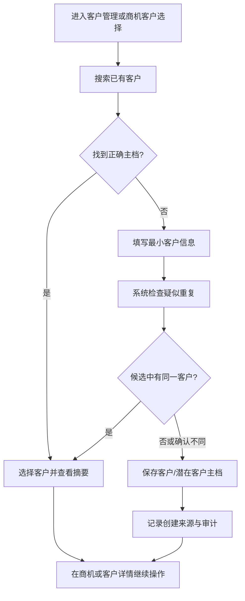
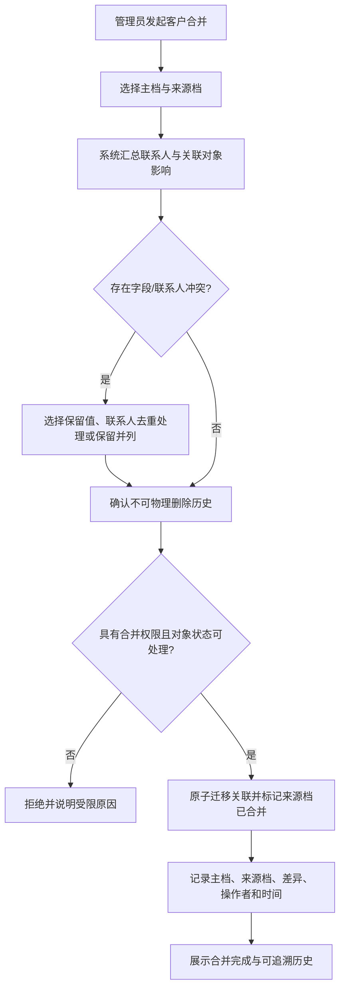

# 客户主档单功能需求规格说明书

> 文档信息  
> 版本：v0.2 本地实施基线  
> Owner：项目负责人  
> 作者：Codex  
> 最后更新：2026-09-12  
> 所属 PRD：[PRD V0.4](../PRD.md)  
> 功能路径：商机与客户 / 客户管理  
> 状态：ready-for-implementation（WI-008 本地范围）

## 1. 功能概览

| 项目 | 内容 |
|---|---|
| 功能名称 | SPEC-CM-01｜客户、联系人、查重、合并与关联 |
| 优先级 | P1 |
| 使用者 | 商务、售前负责人、项目参与者、客户主档管理员、管理层（按数据范围） |
| 入口位置 | 商机与客户 / 客户管理；新建商机时的客户选择与快速建档；项目空间中的客户链接 |
| 前置条件 | 已有可用用户与组织范围；客户唯一性识别字段和合并责任人已配置 |
| 相关模块 | 商机管理、项目空间、合同归档、数据任务中心、角色权限、审计中心 |
| 相关文件或流程 | PRD-CM-01、PRD-OM-01、PRD-OM-04、PRD 第 2.2 实体关系、[前端组件规范](../../technical/designs/frontend/FRONTEND_COMPONENT_STANDARD.md) |

## 2. 功能范围与产品设计

### 2.1 功能列表

| 序号 | 功能点 | 功能描述 | 优先级 |
|---:|---|---|---|
| 1 | 客户主档目录 | 查询、筛选和查看独立客户/潜在客户主档，避免把客户信息复制到每条商机 | P1 |
| 2 | 最小客户建档 | 以可识别名称和必要联系/来源信息快速建立客户或潜在客户，支持在商机创建中返回选择结果 | P1 |
| 3 | 客户详情 | 汇总基本信息、联系人、关联商机、项目空间/合同引用摘要和关键时间线 | P1 |
| 4 | 联系人管理 | 在客户详情维护多个联系人、职位和受权限保护的联系方式 | P1 |
| 5 | 疑似重复提示 | 新建、编辑和导入时按配置的客户识别字段返回候选重复项，供人员判断 | P1 |
| 6 | 受控合并 | 有专门权限的人员选择主档和来源档，预览迁移影响后合并并保留来源与审计历史 | P1 |
| 7 | 关联跳转 | 从客户详情下钻关联商机、项目空间、合同和时间线的原始对象，不复制第二套数据 | P1 |

### 2.2 背景与目标

一条商机对应一个独立采购事件，但同一客户往往拥有多个联系人、商机、合同和项目空间。如果客户只作为商机内的自由文本，重复、错别字和联系人分散会导致商机统计失真，也无法从客户视角复盘长期关系。PRD 要求每条商机都关联明确客户或潜在客户，并由客户主档聚合联系人、关联商机、关键时间线和受控合并。

本功能的目标是将客户作为稳定的主数据来源：商务能以最少字段快速建立潜在客户，后续逐步丰富；所有关联业务从一个客户主档下钻，而不是复制数据；系统帮助发现疑似重复，但不自动合并或覆盖事实。合并必须保证既有商机、项目空间、合同、联系人和审计记录仍可追溯到合并前来源。

### 2.3 方案取舍

| 方案 | 内容 | 结论 | 原因 |
|---|---|---|---|
| 独立客户主档＋关联对象 | 客户作为独立实体，商机和合同只引用客户 | 采用 | 满足客户长期关系和一致性要求 |
| 将客户信息复制在商机内 | 每条商机各自填写客户名称、联系人 | 不采用 | 无法控制重复或聚合关联事实 |
| 自动合并相似客户 | 系统按名称或联系方式直接合并 | 不采用 | 误合并会破坏采购事件和历史追溯 |
| 疑似重复提示＋受控合并 | 系统提供候选和影响预览，人确认主档及合并 | 采用 | 在效率与数据质量之间保留人工判断 |
| 物理删除已使用客户 | 无效客户直接删除 | 不采用 | 商机、项目、合同和审计关联必须保留 |
| 在客户页记录完整销售跟进 | 将商机行动直接写成客户动态 | 不采用 | 进行中商机的事实、下一步动作和逾期规则由商机主线管理 |

### 2.4 产品形态与范围边界

客户管理采用已确认的浅色工作台视觉基准：左侧全局导航保持白色与轻量图标，内容区为浅蓝灰画布；顶部使用面包屑、页面页签、关键词搜索和主要动作；数据区用白色卡片和细线高密度表格承载。客户详情不是“巨型信息墙”，而是一个有明确标题区、核心资料、联系人、关联商机和关键时间线的分区页面，支持快速扫读和原对象下钻。

目录页的主要动作是“新建客户”，并在输入名称后立即呈现右侧疑似重复卡片；详情页的高风险动作“合并客户”仅出现在具备权限的更多操作中，以分步确认引导选择主档、来源档、联系人处理和关联对象影响。快速建档以轻量抽屉在商机表单内完成，保存后必须返回新建客户的稳定引用，不得留下自由文本替代关系。

本功能不定义商机进展、关闭、商机导入或合同详情，不把客户主档扩张成 CRM 营销自动化。客户状态、行业、地区、来源和唯一性规则可由后续字典参数配置；已引用字典不得被硬删除。

## 3. 流程说明与流程图

### 3.1 主流程：建立客户并供商机引用

商务可从客户目录或新建商机中的客户选择器开始。系统先让用户搜索已有主档；若未找到，用户填写最小客户信息，系统依据已配置的名称、统一标识或联系方式等规则返回疑似重复候选。用户确认“使用已有客户”或“仍需新建”后保存主档；新建商机时，系统将保存的客户标识而非客户文本写入商机。

### 3.2 分支流程：受控合并疑似重复客户

仅具有客户合并权限的人员可从疑似重复提示或客户详情发起合并。操作者必须明确选择保留的主档和来源档，并先查看联系人、商机、项目空间、合同、附件/时间线引用的迁移数量与冲突。保存后系统将活跃关联迁移到主档，来源档标记为“已合并到主档”并保留不可删除的追溯关系；任何旧链接都应可解析到合并结果或历史说明。

取消合并不改动任何客户或关联对象；合并完成后本 P1 页面不提供无审查的一键撤销。若确需纠正，必须由有权限人员按后续受控恢复流程处理并保留新的审计关系。

## 4. 特殊业务规则

1. 每条商机必须关联一个明确的客户或潜在客户主档；不能只保存客户名称自由文本。
2. 一个客户可关联多个联系人、商机和主合同；项目空间通过商机/合同关系引用客户，不新建平行客户关系。
3. 客户新建时允许最小信息，但“可识别名称”和至少一项配置要求的识别/联系信息必须满足；其余信息可渐进补齐。
4. 疑似重复是提示而不是自动结论。系统只按配置输出候选和匹配依据，最终是否同一客户由有业务上下文的人员判断。
5. 已关联商机、项目空间、合同或审计的客户不可物理删除；可按规则停用或标记合并来源，但历史记录必须可读。
6. 合并必须选择唯一主档；来源档被标记为已合并并保留原始标识、合并时间、操作者、主档指向和字段处理历史。
7. 合并过程不得丢弃关联商机、联系人、项目空间、合同、时间线或审计记录。对重复联系人应明确选择保留、合并或并列，而不是静默覆盖。
8. 客户时间线只聚合关键客户、商机、项目和合同事实及其跳转，不将商机下一步动作复制为客户主档字段。
9. 联系方式属于受保护数据，查看、导出和编辑应受数据范围及字段权限控制。
10. 客户行业、地区、来源、状态和去重键依赖公司配置；已被引用的字典项可停用但不可硬删除。

## 5. 页面与状态说明

| 页面 / 状态 | 说明 | 可用操作 |
|---|---|---|
| 客户主档目录 | 客户/潜在客户的搜索、筛选、高密度列表与统计摘要 | 搜索、筛选、新建、打开详情、发起合并（按权限） |
| 新建/编辑客户抽屉 | 以最小字段起步；名称输入后持续显示疑似重复候选 | 保存、取消、选择已有客户、继续完善 |
| 客户详情 | 页头展示客户名称、类型/状态、负责人摘要；下方以标签页或分区展示概览、联系人、关联对象、时间线 | 编辑、添加联系人、下钻商机/项目、更多操作 |
| 联系人编辑抽屉 | 编辑联系人身份、职位、联系方式和状态 | 保存、取消、设为主要联系人（如配置启用） |
| 疑似重复面板 | 展示匹配字段、候选客户、关联数量和“查看/使用/申请合并”入口 | 查看详情、选择已有、发起合并 |
| 客户合并向导 | 分步确认主档、字段值、联系人处理、影响对象和不可逆提示 | 下一步、返回、确认合并、取消 |
| 加载 / 空态 / 无权限 / 失败 | 目录、详情和关联分区各自有加载/空态/错误状态 | 重试、新建、返回、申请权限 |

## 6. 查询条件

| 字段 | 类型 | 内容 | 默认值 | 查询规则 |
|---|---|---|---|---|
| 关键词 | 文本 | 客户名称、简称、识别码、联系人姓名 | 空 | 在有权字段范围内模糊匹配；关键词不得绕过字段脱敏 |
| 客户类型 | 多选 | 客户、潜在客户 | 全部 | 以主档事实筛选 |
| 状态 | 多选 | 启用、停用、已合并来源等配置状态 | 默认启用 | 已合并来源默认隐藏，可在历史筛选中查看 |
| 负责人 / 创建人 | 用户选择 | 当前维护责任或创建来源 | 空 | 仅显示当前数据范围内可见用户 |
| 行业 / 地区 / 来源 | 多选 | 配置字典项 | 空 | 使用已启用字典；历史记录可查询停用项 |
| 关联商机状态 | 多选 | 是否存在进行中、已关闭等关联商机 | 空 | 从商机事实聚合，不另存重复状态 |
| 更新时间 | 日期范围 | 主档或联系人最近更新 | 空 | 使用系统保存时间 |

## 7. 列表与状态字段

| 字段 | 内容 | 排序 | 显示规则 |
|---|---|---|---|
| 客户名称 | 法定/可识别名称和简称 | 支持 | 主视觉显示名称；简称次级显示 |
| 类型 / 状态 | 客户、潜在客户；启用、停用、已合并来源 | 支持 | 文字标签完整表达，已合并来源不作为正常新建关联候选 |
| 行业 / 地区 | 配置的基础属性 | 支持 | 空值显示“待补充”，不以默认推断 |
| 主要联系人 | 姓名、职位、脱敏联系方式 | 否 | 无权限时只显示受限提示或摘要 |
| 进行中商机 | 当前有权限范围内的进行中商机数量 | 支持 | 可点击下钻到商机列表筛选结果 |
| 关联项目空间 | 当前有权限范围内的项目空间数量 | 支持 | 只汇总，不把项目状态复制到客户字段 |
| 最近动态 | 最近可见关联事实的时间与类型 | 支持 | 链接到原始对象或时间线 |
| 最近更新 | 主档最后修改时间和操作者 | 支持 | 详情页可查看历史 |
| 操作 | 查看、编辑、合并、停用/恢复 | 否 | 按数据范围和操作权限收敛 |

## 8. 表单字段

| 字段 | 类型 | 内容 | 默认值 | 格式规则 |
|---|---|---|---|---|
| 客户名称 | 单行文本 | 可识别的正式名称 | 空 | 必填；保存前触发疑似重复检查 |
| 客户简称 | 单行文本 | 列表和业务引用的简称 | 空 | 可选；不代替正式名称 |
| 客户类型 | 单选 | 客户、潜在客户 | 潜在客户或按入口预填 | 必填；变更需保留历史 |
| 统一识别码 | 单行文本 | 企业统一标识或公司配置的唯一识别字段 | 空 | 按地区/公司规则校验；有值时参与去重 |
| 行业 / 地区 | 选择器 | 配置字典项 | 空 | 可选；字典已停用项仅历史可见 |
| 来源 | 选择器 | 客户/线索来源 | 空 | 由公司字典提供；可按配置必填 |
| 当前维护责任人 | 用户选择 | 负责维护主档的人 | 当前创建人 | 必须为启用账号且在可选组织范围内 |
| 状态 | 单选 | 启用、停用等配置状态 | 启用 | 停用需影响确认，不能删除已关联主档 |
| 联系人姓名 | 单行文本 | 客户联系人名称 | 空 | 新建联系人必填；同一客户内疑似重复提示 |
| 职位 / 部门 | 单行文本 | 联系人角色信息 | 空 | 可选；不与系统内部部门混用 |
| 手机 / 邮箱 | 文本 | 联系方式 | 空 | 至少一项按配置要求；格式校验和字段权限控制 |
| 联系人状态 | 单选 | 在职、失效等配置状态 | 在职 | 失效联系人保留历史关联 |
| 合并主档 | 客户选择 | 合并后保留的唯一客户 | 空 | 必填；不能选择来源档自身 |
| 合并字段处理 | 差异选择 | 对冲突字段选择主档值、来源值或并列保留 | 主档值 | 每个冲突项需明确决定 |

## 9. 交互、提示与异常

| 场景 | 系统处理 | 用户反馈 | 是否阻塞 |
|---|---|---|---|
| 输入客户名称 | 实时或保存前查询疑似重复候选 | 侧栏显示匹配依据和已有主档摘要 | 否 |
| 保存客户 | 校验最小字段、唯一标识、状态和数据范围 | 成功提示并进入详情/返回商机选择；错误精准回填 | 是 |
| 快速建档 | 在商机表单中打开轻量抽屉 | 保存后自动选中新主档；取消则不留下自由文本 | 视用户选择 |
| 添加联系人 | 校验客户归属和联系方式格式 | 成功后刷新联系人区；重复提示不阻塞人工判断 | 是 |
| 发起合并 | 加载两档及关联影响，逐步确认 | 明确提示将保留历史、不提供无审查撤销 | 是 |
| 合并冲突 | 展示字段/联系人冲突，要求逐项处理 | 未解决冲突时禁止提交 | 是 |
| 停用客户 | 检查活跃关联和新建引用影响 | 说明不能作为新关联默认候选，历史仍可见 | 是 |
| 无权限 / 失败 | 不泄露无权客户或联系人；失败保留未提交选择 | 受限说明、可重试错误或联系管理员入口 | 视操作而定 |

## 10. 数据、权限与边界

### 10.1 数据记录

| 数据项 | 来源 | 用途 |
|---|---|---|
| 客户主档（CUSTOMER） | 商务/管理员创建、受控导入 | 所有商机、合同和客户关系的唯一引用 |
| 联系人（CONTACT） | 客户详情维护 | 表达客户联系人与受保护的联系方式 |
| 客户识别与疑似重复结果 | 保存/导入时规则计算 | 辅助人工判断与数据质量治理 |
| 客户合并关系 | 受控合并操作 | 记录主档、来源档、字段/联系人处理和关联迁移 |
| 关联商机/项目/合同摘要 | 原始业务对象聚合 | 客户详情和列表的可下钻摘要 |
| 关键时间线 | 客户及关联对象的可见事件 | 回显关系历程，不生成第二套业务事实 |

### 10.2 权限与边界

1. 客户目录、详情、创建、编辑、停用、联系人、合并和导出权限必须独立配置，并受组织/客户数据范围限制。
2. 客户合并是高风险动作，仅限专门授权角色；操作者必须能查看两个客户和受影响关联对象的必要摘要。
3. 联系人手机号、邮箱、导出和下载等应遵守字段级权限；无权用户不能通过搜索、列表或错误消息推断完整联系方式。
4. 商机、项目空间和合同的可见性仍由各自权限模型决定；客户详情只汇总当前用户有权看到的数量和对象。
5. 客户停用/合并状态影响新建关联候选，但不改变历史商机、项目空间或合同的原始客户归属与审计。

## 11. 功能详细设计

WI-008 已补齐首批本地实施契约，具体约束见 11.8；公司制度配置与真实数据迁移仍需独立验证。

### 11.1 模块责任与复用边界

| 层次 | 责任 | 新增或复用 | 关联模块 / 共享设计 |
|---|---|---|---|
| 前端 | 客户目录、详情、联系人抽屉、疑似重复面板、合并向导 | 后续新增，复用 AppShell、Table、Drawer、Steps、Descriptions | [前端组件规范](../../technical/designs/frontend/FRONTEND_COMPONENT_STANDARD.md) |
| 后端 | 客户/联系人读写、查重候选、受控合并、关联摘要、权限复核和审计 | 后续新增 | 商机、项目空间、合同、数据任务中心 |
| 数据 | CUSTOMER、CONTACT、客户合并关系、关联摘要索引 | 后续新增 | PRD 第 2.2 实体关系 |

### 11.2 前端页面与组件设计

| 页面 / 区域 | 建议路由 | 使用的共享组件 | 本功能组件 | 状态与数据来源 | 响应式 / 无障碍要求 |
|---|---|---|---|---|---|
| 客户目录 | `/customers` | AppShell、Breadcrumb、Table、Filter、Card | `CustomerListPage` | 客户列表、筛选、数据范围 | 窄屏保留名称/类型/最近动态，筛选移入抽屉 |
| 客户详情 | `/customers/:customerId` | Descriptions、Tabs、Timeline、Tag | `CustomerProfile`、`RelatedObjectSummary` | 客户、联系人、关联摘要、时间线 | 标签页可键盘切换，统计不可替代文字说明 |
| 客户编辑 | 当前页右侧抽屉 | Drawer、Form、Select、Alert | `CustomerForm`、`DuplicateCandidatePanel` | 表单草稿和疑似重复结果 | 字段错误与重复候选可被屏幕阅读器识别 |
| 合并向导 | `/customers/merge` 或受控弹层 | Steps、Table、Result、Modal | `CustomerMergeWizard` | 两个主档、差异、关联影响 | 每步明确当前位置；危险确认不可只用颜色 |

### 11.3 API 契约

当前冻结资源边界：客户目录/详情、客户创建/编辑/停用、联系人、疑似重复查询、合并预览/提交、关联对象摘要和时间线。具体接口、分页、合并锁、错误码、幂等与导入映射在实现工作项中设计；合并提交必须是可审计的原子操作。

### 11.4 数据模型与迁移

| 对象 / 表 | 字段或关系 | 约束与索引 | 历史 / 审计 | 迁移与兼容 |
|---|---|---|---|---|
| CUSTOMER | 名称、简称、类型、识别码、属性、状态、责任人 | 按配置建立去重索引；已引用不可删除 | 字段变更、状态、合并关系 | 历史客户导入由 SPEC-MIG-01 定义 |
| CONTACT | 客户、姓名、职位、联系方式、状态 | 属于一个客户；配置必要联系方式 | 失效和合并处理留痕 | 导入规则待确认 |
| CUSTOMER_MERGE | 主档、来源档、处理明细、操作者、时间 | 来源档只能有一个当前主档指向 | 不可被普通编辑覆盖 | 需支持历史链接解析 |
| CUSTOMER_DUPLICATE_CANDIDATE | 规则版本、匹配依据、候选 | 不等同于业务实体 | 查询与判定可审计 | 阈值由配置管理 |

### 11.5 事务、并发、幂等与失败恢复

1. 新建客户与商机快速建档返回的客户引用必须在同一成功链路中稳定可用；失败时不得留下无法识别的半成品客户。
2. 合并客户、迁移关联对象和写入合并关系必须为原子事务；任一冲突或权限失败时全部回滚。
3. 合并操作使用幂等标识、实体版本校验和来源档锁定，避免两个管理员并发将同一来源档合并到不同主档。
4. 编辑客户出现版本冲突时提示刷新对比；不得静默覆盖联系人或识别字段。

### 11.6 安全、权限与审计实现

| 动作 | 权限判断 | 敏感数据处理 | 审计事件 | 失败控制 |
|---|---|---|---|---|
| 查看客户/联系人 | 客户数据范围＋字段读取权限 | 联系方式按权限脱敏 | 视敏感级别记录查看 | 不泄露无权记录/字段 |
| 创建/编辑客户 | 客户维护动作＋范围 | 识别码和联系方式最小记录 | 主档/联系人前后值 | 服务端字段、唯一性校验 |
| 查重 | 有权读取的候选范围 | 匹配依据不泄露完整敏感字段 | 规则版本与查询摘要 | 候选不足时提示人工补充而非自动创建 |
| 合并 | 客户合并动作＋两档可见范围 | 差异和关联对象按权限汇总 | 主档、来源档、处理明细 | 二次确认、锁、事务、幂等 |

### 11.7 配置、兼容与回退

- 新增配置：客户唯一性识别字段、相似匹配阈值、客户类型/状态/行业/地区/来源字典、合并责任人、联系人最小字段、敏感联系方式策略；
- 浏览器或客户端兼容：遵守前端组件规范；合并向导和详情页在窄屏保持步骤、错误和可返回性；
- 灰度或数据兼容：先导入或建立少量已核验客户，查重规则需用真实样本校准；
- 回退方式：客户合并不得用物理删除回退；如合并错误，进入受控恢复流程并建立新的追溯关系，具体恢复权限待确认。

### 11.8 WI-008 本地实施冻结（2026-09-12）

本节补齐前述资源边界的实际契约，当前实施按此节与[业务共享契约](../../technical/designs/shared/BUSINESS_DELIVERY_CONTRACT.md)执行。此前待配置项中的生产字典、真实数据迁移和错误合并恢复制度仍在第 13 章保留，不以未实现功能宣称完成。

- `GET/POST /api/crm/customers`、`GET/PATCH /api/crm/customers/{id}`；`GET /api/crm/customers/duplicates?q=&identifier=`；`POST /{id}/contacts`、`PATCH /{id}/contacts/{contactId}`；`POST /{id}/merge-preview`、`POST /{id}/merge`。
- Customer 表字段：UUID、code、name(160)、shortName(80)、kind(PROSPECT/CUSTOMER)、identifier(80，可空但非空唯一)、industry(80)、region(120)、source(120，必填)、ownerAccountId、organizationUnitId、status(ACTIVE/INACTIVE/MERGED)、mergedIntoId、version、createdAt/updatedAt。名字 Unicode 规范化后相同/包含仅提示；统一识别码精确冲突拒绝。合并后来源识别码保留为历史但解除活跃唯一占用。
- Contact 表：客户 UUID、name、position、phone/email（至少一项）、status(ACTIVE/INACTIVE)、version。无 CRM_CONTACT_READ 返回联系方式 null；搜索不搜索电话/邮箱。本人无权读取字段时不能通过整表编辑清空它们。
- 合并预览列两档版本、字段冲突和联系人/商机数量；提交明确选择主档字段或来源字段、联系人保留并列策略、reason。按 UUID 顺序锁两档并校验两档版本；迁移联系人和商机引用，项目通过原商机读取客户，不存第二份客户事实；跨模块后续引用通过公开合并接口接续。当前不提供无审查撤销。
- read/create/edit/merge/contact-read/contact-edit 独立授权。详情关联商机和空间链接只取有权摘要。主档所有变更写入 CRM 事件与审计；无物理删除 API。

## 12. 测试设计与验收标准

### 12.1 测试矩阵

| 场景 | 测试层次 | 前置数据 | 预期结果 | 关联验收项 |
|---|---|---|---|---|
| 最小客户建档 | 前端 / 集成 / E2E | 有客户维护权限的商务 | 可创建客户/潜在客户，缺失必填信息被阻止 | PRD-CM-01、PRD-OM-01 |
| 商机快速建档 | E2E | 新建商机场景 | 保存客户后返回稳定客户引用，不出现自由文本替代 | PRD-CM-01 |
| 疑似重复 | 集成 / E2E | 名称/识别码相似客户 | 显示候选与依据，不自动合并 | PRD-CM-01 |
| 客户合并 | 集成 / E2E | 两个客户及其联系人、商机、项目空间 | 关联原子迁移，来源档保留历史和主档指向 | PRD-CM-01 |
| 合并并发 | 集成 | 两管理员尝试同一来源档合并 | 只有一次生效，其余明确冲突 | 数据完整性 |
| 联系方式权限 | 安全 / E2E | 有/无字段权限用户 | 目录、详情和搜索均正确脱敏或拒绝 | PRD 第 6 章权限 |
| 停用/历史 | 集成 / E2E | 已关联客户 | 禁止新建默认关联，历史商机仍可读 | PRD-CM-01 |
| 窄屏可用性 | 前端 / 人工 | 390px 视口 | 目录、详情、抽屉和合并步骤可完成 | 前端组件规范 |

### 12.2 验收标准

1. 客户作为独立主档存在，任意新建商机必须关联客户或潜在客户，不能以自由文本代替。
2. 客户详情可查看受权范围内的联系人、关联商机、项目空间/合同摘要和关键时间线，并能下钻原始对象。
3. 新建、编辑和导入相关入口均能发现疑似重复，但系统绝不自动合并。
4. 有权限人员可完成主档/来源档合并预览与提交；关联对象不丢失、来源档不被物理删除、历史可追溯。
5. 已关联客户不可被物理删除；停用或合并状态会正确影响新建关联候选而不改写历史。
6. 联系方式、客户数据范围和合并动作在页面与接口层均按权限控制。
7. 页面在加载、空态、无权限、冲突、网络失败和未保存离开时提供明确、可操作的反馈，且符合已确认视觉语言。

## 13. 待确认问题

以下为生产制度及后续交付事项；本地初始值和安全兜底已在 11.8 及共享契约中明确，不自动推断公司最终规则。

1. ⚠️ 公司首批客户唯一性识别字段是什么：统一社会信用代码、客户正式名称、地区/联系人组合还是其他规则？
2. ⚠️ 名称相似、简称、集团/子公司、代理商和同名不同主体应如何设定疑似重复阈值及人工裁决责任？
3. ⚠️ 客户类型、状态、行业、地区、来源和联系人最小信息的首批字典由谁配置？
4. ⚠️ 客户合并出错时的受控恢复流程、审批责任和是否需要双人复核尚未确定。
5. ⚠️ 历史 Excel 客户数据的清洗、映射、错误行处理和导入审计需在 SPEC-MIG-01 中独立定义。

## 14. 变更记录

| 版本 | 作者 | 修订内容 | 日期 |
|---|---|---|---|
| v0.1 | Codex | 基于 PRD-CM-01 创建客户主档、联系人、查重、合并和页面设计草案 | 2026-08-26 |

| v0.2 | Codex | 按本次系统交付授权补齐 WI-008 的本地实施接口、数据与验证边界 | 2026-09-12 |
