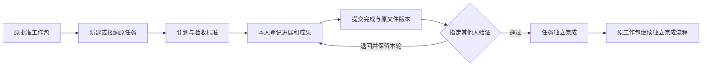
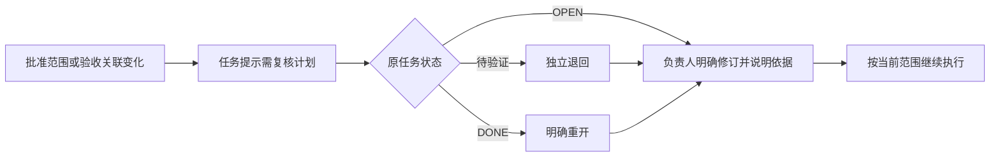

# 交付工作包下的任务与成果（SPEC-TASK-01）

> 版本：v0.2；Owner：Lusice；作者：Codex；2026-09-13  
> 状态：本地实现与验证通过；WI-012；所属 PRD：4.13.5 / P3；BRD：9.1、9.3、10。  
> 路径：原工作包 → 任务执行；原任务记录继续使用 `/work-items/{id}`。

## 1. 功能概览

P0。项目经理和工作包负责人在 DG-02 已批准的原工作包下拆解个人任务；任务负责人记录进展与成果，指定其他验证人确认完成。保留需求派生任务的身份和来源，任务完成不代替工作包、清单、里程碑或文件发布的独立结论。

## 2. 功能列表

建立任务、接纳本项目未完成的原任务、维护计划与验收标准、本人进度和完成事实、独立验证/退回、取消/重开、不可变历史与文件版本、原包完成门、基线变化提示。周滚动安排、按天/半天的实际投入及每周双方确认接续独立规格，不将预计投入写成实际工时。

采用原 `project_work_item` 的 TASK 身份和状态，另存任务执行正文与历史；不创建第二个任务状态机。接纳已有任务保持原 ID、来源需求、创建来源和历史。原工作包详情提供任务入口，不增加项目空间固定菜单。

## 3. 流程说明与流程图

项目经理或本包负责人选择新建或接纳，明确任务内容、负责人、指定独立验证人、完成标准、计划日期和可选预计人天/关联清单。新任务不伪造来源需求。接纳须选择同项目 OPEN、尚未纳入任何包的 TASK，并核对原版本。父包须为当前已批准、未提交完成的 WORK_PACKAGE。

项目或阶段未运行时可以读取。计划维护须项目 ACTIVE；进展/完成须项目 ACTIVE 且原阶段 IN_PROGRESS；已提交结果可以在项目暂停期间核验或退回。父包未完成时，项目经理或本包负责人可取消 OPEN 任务或明确重开 DONE/CANCELLED 任务；历史成果不删除。父包已有完成提交或完成结果时禁止继续改变子任务，防止下游结论失去依据。

## 4. 特殊业务

1. 任务计划 start≤due，位于所属工作包当前计划窗口内。实际可以早于计划，但不能早于阶段实际开始或晚于上海当前日期；完成实际不能早于本轮已记录的进展日期。
2. 进度 0–99 由本人报告；提交完成为 100 且待验证；统计“已完成”只计独立 DONE，取消数量单列，不计入完成分母。预计人天可空，填写时为正数且以 0.5 天为单位；不转成预算、工资或实际工时。
3. 关联清单只能为当前包下有效清单，最多 100 项。不会自动改变清单到货、安装、验收或里程碑状态。
4. 计划在 OPEN 状态可修订，原因必填；改责任人走既有正式责任交接，不能从计划编辑静默换人。待验证/已完成任务先退回/重开再修订。
5. 父包实质范围、验收标准、阶段/清单/里程碑关联或选中清单的范围发生变化，及原任务计划超出新窗口时，派生“需复核计划”；不覆盖原完成事实。待验证只允许退回，DONE 必须重开再明确修订。仅父包人员换任或不影响子日期的计划调整不使任务成果自动失效。
6. 父包有任何未完成且未取消任务、或未复核任务时，禁止 COMPLETE/VERIFY；子任务全完成仍不会自动完成父包或关闭源需求。归档有未取消任务的包、改换已有实际任务的阶段时拒绝整笔范围变更。
   Work 对外完成查询对需复核的旧 DONE 任务返回 NEEDS_REVIEW，防止需求池把过期成果当成有效完成依据；原 Work 持久状态和任务历史不覆盖。
7. 完成提交保留文本、实际日期及最多 20 个当前已发布且可读的项目文件版本；VERIFY 再查当前文件读取及有效发布。退回/重开后新轮文件不覆盖旧轮；撤销文件权限后，只给出受限数量，不泄漏标题和版本 ID。

## 5. 页面 / 状态说明

原包任务页：上方原包/阶段/计划窗口，紧凑四项事实栏；主要区域为可筛选任务表，右侧本人待核验和原包验收依据。独立任务详情展示内容与标准、计划/实际、版本文件和历史。390px 下待核验先显示，主表局部滚动，长说明折叠；空任务时提供合法新建/接纳入口。

状态为 OPEN（未开始/进行中按真实进度与开始日期区分）、PENDING_VERIFICATION、DONE、CANCELLED；需复核为派生提示，原状态继续展示。加载完成前不提供缺少父包/阶段参数的链接。错误保留输入和幂等键。

## 6. 查询条件

任务名称/负责人文本、执行状态、需复核、计划起止日期；本包全量授权数据内过滤，日期边界包含；每页默认 10，可选 20/50，超长表内部滚动。筛选保存在 URL，可刷新恢复。

## 7. 列表字段 / 状态字段

任务名称与原需求链接、负责人/独立验证人、计划起止日、本人报告进度、原执行状态/需复核、实际完成日、关联清单数、操作。右侧队列只显示当前账号实际可验证/退回的任务；无权验证者不能看到执行按钮。

## 8. 表单字段

- 新建/接纳：requestId、parentVersion；可选 existingTaskId/sourceVersion；title 160、description 8000、acceptanceCriteria 4000、ownerId/verifierId（不同的启用成员且具备 WORK_EDIT/WORK_REVIEW）、startsOn、dueDate、estimatedDays（可空，0.5 步长）、itemIds、reason 4000。
- 计划修订：上述计划正文与 reason，加 task profile version/workVersion；负责人沿用当前原 Work 记录。
- 执行动作：requestId、version、workVersion、action、note 4000；PROGRESS 有 occurredOn/progress；COMPLETE 有 occurredOn/fileVersionIds。验证、退回、取消、重开均说明原因。

## 9. 交互说明

新建成功进入同一任务；接纳前显示原任务和需求，保存后两个入口读取同一 ID。详情抽屉按实际动作显示表单；只读历史无保存按钮。打开文件调用现有受控版本详情。提交期间禁重复，失败不更新展示进度，成功刷新当前任务、任务列表及原包动作。执行中的个人不在任务页直接修改批准基线或资源承诺。

## 10. 提示说明

“任务完成不等于交付物已发布或工作包已验收。”“原工作包仍有未完成或需复核任务。”“父范围已变化，请先退回/重开并明确核对计划。”“请由当前任务负责人提交实际，由指定其他人核验。”“实际日期不能早于阶段开始。”“负责人变化请使用项目责任交接。”

## 11. 异常处理

字段/日期/跨包关联 400，当前权限不足 403，跨项目和不可读取对象 404，版本/状态/基线冲突 409。所有写入使用现有项目锁、双记录版本和 actor 范围幂等键；失败连同 Work、附件引用、事件、审计和幂等记录回滚。泛用 Work transition 对已接纳任务明确拒绝，避免绕过完成日期和文件检查。

## 12. 数据记录

`project_work_item` 保留唯一身份、标题描述、负责人/验证人、状态、源需求、原完成/验证事实；新增 `delivery_task_profile` 以同一 ID 引用，保存父包/阶段、计划开始、预计人天、标准/清单关系、范围签名和基线版、报告进度与本轮日期/文件。`delivery_task_event` 保存不可变前后快照与动作/人/时间/原因，文件 ID 仅存储、对外逐项按当前权限投影。

同模块 Work 服务管理任务记录。公开 `ExecutionDirectory` 提供原阶段可执行性及开始日；不跨模块读执行 Repository。`ApprovedDeliveryDirectory` 提供原非财务批准对象；BaselineApplied 在原事务校验。任务责任继续由 Work contributor 交接；已取消任务不阻断移除，历史提交人不换任。后续周计划/工时经 Work 的公开任务查询接入。

HTTP：GET/POST `/api/projects/{projectId}/work-packages/{id}/tasks`；GET/PATCH `/api/projects/{projectId}/tasks/{id}`；POST 该任务 `/commands`。普通 Work detail 增加可空 `taskWorkPackageId` 用于同 ID 页面接续。追加 V19 的任务正文/历史和 V20 的来源约束兼容，已应用迁移不改；新建仅允许 DELIVERY_TASK + TASK + 无来源需求，需求任务与原交付工作包规则保留。当前不增加业务权限和固定导航。

## 13. 权限与边界

WORK_READ 加项目读取及 DG2_READ；写 WORK_EDIT，核验/退回 WORK_REVIEW，均要求有效参与成员。新建/接纳/修订/取消/重开还须实际项目经理或本包负责人；实际进展/完成仅任务当前负责人。核验人为当前指定人，不能等于负责人或原提交人。项目已关闭一律只读。不得把 TASK、文件发布、清单或父包的独立结论合并成一个按钮。

## 14. 验收标准

1. 同包新建和原需求 TASK 接纳成功、原 ID/来源不变；跨包/跨项目/已完成/重复接纳拒绝。
2. 日期、人天、成员/独立验证、文件版本和权限在命令时检查；普通 Work 入口不能绕过。
3. 本人进展→完成→独立退回→第二轮完成→独立通过；两轮文本/文件原版本可回读。
4. 父包完成被未结/需复核任务拦截；全完成仍须原包独立完成，不自动改源需求或清单。
5. 取消/重开留痕；完成父包下不能再造任务；基线变化要明确核对、历史 DONE 事实保留。
6. 责任交接延续原 Work、旧提交人不改；移除/自验/权限撤销、并发及重放、失败回滚均有测试。
7. 实际桌面/390px、筛选/错误/历史文件及多账号流程通过，类型/Lint/测试/构建、V19–V20 真库/空库与重启回读有证据。

## 15. 待确认问题

暂无阻断本批的产品问题。周滚动默认周期和实际投入的周确认规则在后续规格按 BRD 细化；不先假定固定每日工时折算、审批金额或绩效评分。

## 16. 变更记录

v0.1｜Codex｜依据原工作包与四层计划补齐任务执行规格｜2026-09-13。

v0.2｜Codex｜任务、原位接纳、两轮核验与原文件、并发/回滚、390px 和 V19–V20 实库验证｜2026-09-13。详见 [ACCEPT-012](../../development-testing/accept/ACCEPT-012-delivery-tasks-local.md)。
