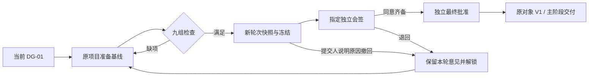
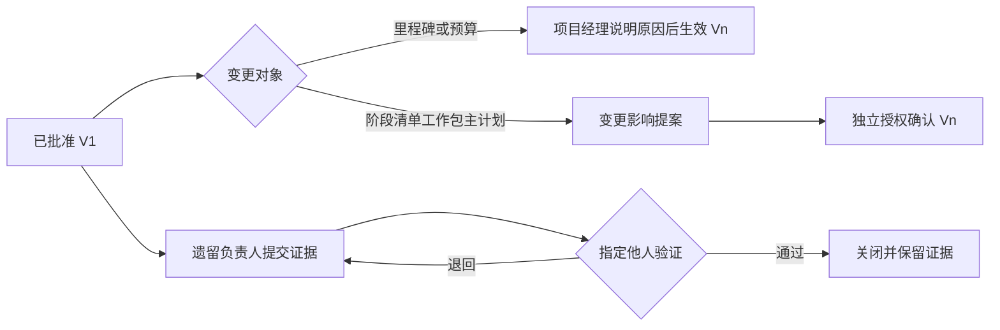

# DG-02 交付立项与项目基线（SPEC-DG2-01）

> 版本：v0.2；Owner：Lusice；作者：Codex；2026-09-13  
> 所属 PRD：[PRD 4.13](../PRD.md)；功能路径：项目中心 / 交付立项  
> 状态：ready-for-implementation；工作项：WI-010。

## 1. 功能概览

项目经理将当前 DG-01 移交包转化为原项目的可执行基线，由配置的会签人与独立最终批准人决定是否通过。优先级 P0。入口是系统二级菜单“交付立项”，详情回到同一项目的团队、阶段、里程碑/主计划、清单、工作包和预算；不新增项目或交付单元。

## 2. 功能列表

| 功能 | 详细边界 |
|---|---|
| P2 接续与配置 | 明确初始化，引用当前有效 DG-01；接收范围、验收、关键时间和遗留；选已发布模板及适用评审规则 |
| 准入预检 | 九组真实校验，返回缺项与原对象入口；通过预检不等于业务批准 |
| 联合评审 | 提交、冻结、独立会签、退回、撤回、重提、最终批准；轮次和引用版本不可变 |
| 原位基线 | 同一对象 ID 标记 V1，主阶段转交付；保留需求及移交关系 |
| 遗留闭环 | 分类、责任、证据、独立验证、期限和升级；批准后继续可跟踪 |
| 后续版本 | 里程碑/预算直接生效修订；其他实质范围修订独立授权确认；不改写 V1 |

### 2.1 背景与目标

避免交接已完成但交付责任、计划和预算仍分散，或把提前开工当作完整立项。P2 建立基线，P3 在原对象记录执行。

### 2.2 方案取舍

采用服务端管理的固定类型基线对象，保留 UUID、当前版本与不可变快照。对象内容按各 SPEC 的类型校验，不开放任意低代码字段。配置按版本发布，实例选择快照；不把本地示例模板或审批人当作公司制度。评审规则显式配置适用项目类型、金额范围、风险级别、会签人与最终批准人；没有匹配配置时阻断提交，不自动猜部门和阈值。

### 2.3 产品形态与范围边界

紧凑总览以九项检查为主、资源缺项/评审/遗留为辅；阶段时间轴和工作包表格接在下方。P2 不记录采购、到货、安装等执行事实，也不记财务实际。通过后的变更规则属于本功能，P3 执行另行接续。

## 3. 流程说明与流程图

### 3.1 准备与评审

项目经理从“交付立项”选择已移交原项目，初始化 P2，接收商务范围并补齐各基线对象。提交时重新核验当前移交包、对象和参与者权限，保存本轮完整快照并冻结。指定会签人只对自己范围作出同意或退回；最终批准人在全部必要会签同意后重新核验源与权限，批准原对象 V1 并转入交付。

### 3.2 生效后变更与遗留

批准后，责任人在原对象提交调整。里程碑与预算由有权项目经理注明原因、影响和依据后直接产生有效新版本；其他实质范围先保存提案，由配置的独立授权人确认。旧基线和评审保持不变。遗留负责人提交证据，指定验证人确认后关闭；未验证和逾期项持续显示。

### 3.3 成组新增与调整范围

新增工作包等互相依赖的范围，由实际项目经理建立一份范围变更草案，逐步维护阶段、里程碑、清单、工作包、计划、预算及资源差异。草案只保存拟变更内容与原版本引用，不提前覆盖当前有效范围；新对象 ID 由服务端预留，批准时沿用这些 ID 建立正式记录。原需求派生工作包可在同项目、未批准且未完成的条件下接纳，保留其 ID 和来源关系。

草案可修改、取消或退回后补齐；提交时冻结本份提案。现有批准工作继续执行，提交和最终批准都核对受到修改的原对象/工作包版本，已提交完成或已完成的工作包不能被范围覆盖。原基线或责任已有调整时明确提示过时；经理可撤回冲突项后显式更新引用依据，不能静默覆盖并发改动。每项目同时维护一份未结束的整组提案，原单对象变更记录继续保留。

新增或调整的资源请求须由其指定、有当前权限及部门范围的承诺人签认；容量核验合并本提案内全部拟投入与其他现有承诺。撤回原资源同样保留指定人确认。提交与批准前再次检查完整关系、预算覆盖和签认有效性；提案内未批准资源不提前计为正式承诺。

经理说明变更原因、影响和依据；需要新的金额/风险授权区间时，可明确选择适用的已发布评审规则。提案使用该规则中指定的独立公司授权人确认，选人不赋权。批准时在同一事务中应用差异、接续/建立原工作包、更新其基线状态、形成下一版完整快照；任一条件不满足均保持原有效基线，旧版本不可覆盖。

## 4. 特殊业务

九组校验：①当前有效 DG-01；②商务依据、范围、验收、关键时间及移交遗留的接收确认；③项目经理、技术负责人、工作包负责人、会签与资源承诺；④已发布模板快照、适用/跳过/新增阶段、责任、依赖/并行、重点、完成依据；⑤里程碑、主计划、工作包计划的追溯与日期/依赖一致；⑥非空清单、工作包、验收与关键采购关系；⑦预算映射和分阶段范围/额度/期限/补齐节点；⑧阻断项已独立验证关闭、非阻断项具备完整跟踪条件；⑨版本及提交/评审/敏感来源权限。

法律开工、范围验收、关键责任、首段资源、关键日期和预算范围影响类别强制阻断，不允许用客户端 `blocking=false` 降级。其他后续细化才可非阻断。资源冲突必须有明确协调结论。审批人不得是提交人或当前申报内容的准备者；资源承诺本身是责任人的签认，不视为代替项目经理编辑申报。

规则发布不赋予任何人员业务权限；系统管理员仅有配置权时不能发布公司审批授权规则或批准项目。已发布规则/模板退役只阻止新引用，已选项目保留旧快照；提交和最终批准仍校验审批账号当前状态与权限。匹配条件不满足时不能借选择另一条不适用规则越权。

## 5. 页面 / 状态说明

| 状态 | 操作 |
|---|---|
| PREPARING / RETURNED / WITHDRAWN | 维护同一工作对象、预检、提交新轮次 |
| SUBMITTED / IN_REVIEW | 冻结本轮内容；指定会签/最终审批、提交人撤回；只读快照 |
| APPROVED | 查看 V1 与当前版本、遗留处理、按对象规则提交变更；不可撤回通过 |

未初始化时展示当前移交情况及明确“开始立项准备”；GET 不写数据。预算无权时展示“受限”且响应不含金额。固定入口保留具体空态操作，不用虚构统计填充。

## 6. 查询条件

立项目录按可见项目先授权后统计，支持关键词（项目名/编号/客户）、状态、页码和 10/20/50 页大小。对象详情按类别过滤；审阅可选择轮次/基线版本。配置列表支持类型、发布状态、关键词。

## 7. 列表字段 / 状态字段

项目编号/名称/客户、主阶段、立项状态、项目经理、九组检查结果、当前轮次、基线版本、遗留数量/最高风险/最近期限/逾期；金额只对有预算阅读权者出现。每个检查返回代码、PASS/BLOCKED/RESTRICTED、具体缺项及同项目来源链接。

## 8. 表单字段

准备头：项目经理、技术负责人、项目类型、风险级别、当前移交包引用、范围/验收/时间约束/遗留接收说明、模板版与评审规则版。子对象字段见 TM/ST/MS/CL/WP/PL/BG。对象修改携带版本、请求标识和原因；服务端生成新 UUID，不接受跨项目对象或未知字段。

评审：当前轮次/版本、同意或退回、意见（必填，最长 4000）、退回责任人/需补内容；撤回须原因。遗留：类型、影响类别、风险级别、标题、责任人、不同验证人、期限、关闭标准、影响范围、升级对象与路径；证据/验证意见分别记录。配置：名称、类型、适用条件、版本说明、模板定义或评审分工。

## 9. 交互说明

每次成功修改刷新预检和来源摘要。编辑抽屉失败保留输入，取消不写库，重复请求复用幂等键。过时版本要求重新加载并比较；不自动覆盖。评审页明确“当前草案”与“本轮冻结快照”，展示两轮版本差异。待办由真实状态派生，保存来源和深链，不另建独立可变业务状态。

## 10. 提示说明

缺项：“请先处理列出的立项条件。”；来源受限：“当前账号无法完整核验此来源。”；冻结：“本轮正在评审，请退回或撤回后修改。”；独立审核：“须由指定的独立授权人处理。”；来源已变化：“DG-01 依据已变化，请回到移交重新核验。”；无规则：“尚未配置适用的已发布评审规则。”

## 11. 异常处理

无会话 401、无动作权 403、不可见对象 404、字段错误 400、重复/版本/状态冲突 409。任何一项失败使整次提交/批准回滚，不能只切主阶段。查询来源的预期受限或失效不能导致整页 500。并发按项目锁和对象版本串行；同一人员资源承诺另用人员锁，防止两项目同时占用而漏检。

## 12. 数据记录

立项主记录一项目一份；类型化基线对象（稳定 ID、类别、版本、归档标识、类型化正文）；资源申请/承诺；配置系列与版本；各轮提交快照/哈希、会签、最终意见；V1 与后续基线快照/替代关系；变更提案、遗留证据及审计。完整敏感快照仅存服务端，输出按预算/合同/文件权限投影；审计摘要不复制金额或正文。

## 13. 权限与边界

独立 `DG2_READ/EDIT/SUBMIT/REVIEW/APPROVE`、`DG2_RESOURCE_COMMIT`、`DELIVERY_BUDGET_READ/EDIT` 与配置读/模板维护/规则维护/规则发布。项目经理、技术负责人、工作包负责人均叠加实际责任范围；权限角色不能代替“本工作包负责人”等条件。正式批准权限由公司授权业务角色授予；初始化系统管理员标志不绕过。负责人移除前识别未结责任；评审期变更责任阻断，批准后按交接保留前后记录与收回权限。

## 14. 验收标准

按 WI-010 的十项逐一验证。至少覆盖真实 DG-01→补齐九组→提交→冻结拒写→独立退回→同 ID 修改→第二轮→会签→独立批准→主阶段交付；追加权限撤销、源失效、并发冲突、重放、金额不下发、阻断类别不能降级、遗留独立验证、V1 不变/当前版本演进、新模板不覆盖实例和空库迁移。

## 15. 待确认问题

公司正式阶段模板、项目类型与金额/风险适用规则、部门到人员映射、重大变更复审阈值和升级路径需试点配置确认。实现配置能力并以合成数据验收，不把缺少公司配置解释成自动放行。本地准备和测试在本次授权内继续。

## 16. 变更记录

| 版本 | 作者 | 修订内容 | 日期 |
|---|---|---|---|
| v0.1 | Codex | 依据 PRD 4.13 细化原项目基线、九组校验、版本评审和实现边界 | 2026-09-13 |
| v0.2 | Codex | 细化成组新增范围、渐进草案、资源签认、并发引用与一次生效的后续基线流程 | 2026-09-13 |
