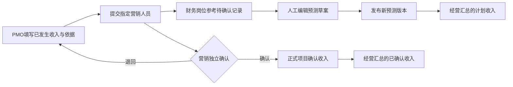

# 经营预测与收入确认（SPEC-INC-01）

> v0.2；Owner Lusice；作者 Codex；2026-09-13；本地验收通过；WI-013。  
> 依据：BRD 12、PRD P4 / 4.13.5、[9 月 8 日输入](../references/2026-09-08-business-finance-notes.md)。这是 FN-01 的首个完整子域，其余经营事实接续。

## 1. 功能概览

项目资金入口中保存月度收入预测及其版本，PMO 提交实际确认收入，由指定且有权限的营销人员独立确认；财务岗位可引用待确认收入，人工更新预测中的计划收入。经营汇总从当前已发布预测及已确认事实分别计算，展示项目管理口径，不冒充财务会计核算或法定报表。

## 2. 功能列表

月度预测草案、发布与版本比较；可追溯的合同/经营节点/待确认收入来源；实际收入草案、提交、退回、修改重提、独立确认；已确认事实整笔冲销；按项目、月份和币种的计划/已确认/待确认汇总及明细下钻。后续回款、开票、付款、采购分包独立接入，不以收入确认代替现金流、发票或成本。

## 3. 流程说明与流程图

预测发布后直接生效，有修订时建立下一版草案；新草案发布前原已发布版本继续供汇总使用。实际确认收入不能由预测发布或文件发布自动生成。确认后的错误事实提出单独冲销申请并经另一人确认，原记录继续保留。

## 4. 特殊业务

1. 预测按公历月份、项目和明确币种分册，这是检索与汇总窗口，不预设公司会计期间。金额使用精确十进制；单行大于零、最多两位小数，不自动四舍五入。各币种分别汇总，不自动汇率折算；未知币种不能发布。
2. 预测可涵盖未签约的项目机会，必须说明业务来源。选择合同来源时，合同属于同项目且已归档，保留提交时的合同/节点版本；当前无归档合同不阻止填写明确标注的项目预测。实际收入同样可引用已有归档合同或明确的其他收入依据，不伪造签约合同。
3. 待确认收入只作为预测来源，不能计入正式已确认金额。财务人员必须实际编辑金额、说明更新原因并发布；系统不把上传金额自动写成计划金额。
4. 预测每版行具有稳定节点 ID。修订保留节点身份和历史，移除行不删除已发生收入；实际记录保留所引用的预测版本/节点快照，不跟随新计划静默改写。引用其他币种或其他项目的节点拒绝；计划与实际差异不直接阻止真实收入提交。
5. 实际发生日期不得晚于上海今日；无固定提交截止、逾期锁定或自动补录限制。计划日期落在所选月内。项目暂停可补记既有事实和完成确认，关闭项目只读。
6. 收入提交人须有 PMO 收入提交权限，当前指定营销确认人须为启用项目成员且有收入确认权限，并且不能是提交人。退回保留原提交轮次；重提重新校验当前指定人和资料。角色交接不替换历史提交人或确认人。
7. 已确认收入正文不直接修改。整笔冲销有自己的日期、原因、依据、提交人和独立确认，币种/金额取自原记录；同一原记录最多一条确认冲销。冲销按自身实际月份计为负数，原月份历史事实不改写；更正金额另建收入并关联原记录，不能隐藏重复计入。
8. 单据、收入确认、预测发布和后续发票/回款是不同事实。税率、税额拆分、费用分摊、内部费率、会计凭证和财务系统对账不推断、不自动生成。

## 5. 页面 / 状态说明

沿用固定“资金计划”入口，新增“经营预测与收入”视图，保留原批准预算入口。上方项目、月份与币种，紧凑展示已发布计划收入、已确认净收入、待确认正向收入与待冲销金额；中间是预测明细/收入台账，右侧按当前角色展示本人待确认及预测更新来源。待确认与冲销使用明确状态颜色，不将申请金额显示为已实现。

预测册同时有当前发布版和可选草案；草案修改/放弃不影响发布版。收入状态 DRAFT、SUBMITTED、RETURNED、CONFIRMED、CANCELLED；已冲销为由确认冲销关系派生的提示，原确认状态及历史继续可读。加载、空记录、权限受限、失败及版本冲突均给出对应提示。手机优先本人待处理，表格局部滚动，金额/单位完整可读。

## 6. 查询条件

项目、月份、币种、记录标题/来源关键词、收入状态、正向/冲销类型；台账可指定实际日期区间，边界包含。默认当前上海月份与已选择币种，允许查询历史。筛选和分页保存在 URL；列表默认 10、可选 20/50。汇总在当前授权、月份和币种范围内计算，不以当前分页代替全范围统计。

## 7. 列表字段 / 状态字段

预测：经营节点、来源类型/可读合同、计划日期、金额/币种、当前版本与发布人、引用的收入状态、备注。收入：标题、金额/币种、实际日期、关联预测原版、可读合同/依据、提交人、指定确认人、状态、当前可执行动作。冲销单独标记负向影响及原记录链接。历史展示每轮前后字段、原因、当时责任及原文件版本。

## 8. 表单字段

- 预测册：projectId、period（YYYY-MM）、currency；版本、requestId；行数组（稳定 id、title 160、plannedOn、amount、sourceType CONTRACT/PROJECT、contractId/nodeId 可空、sourceNote 4000）；引用待确认收入 ID/版本、当前可读发布文件版本；修订/发布说明必填。
- 收入：requestId、version、projectId、kind INCOME/REVERSAL、title、amount、currency、occurredOn、sourceNote、contractId/nodeId 可空、forecastVersionId/lineId 可空、未按预测提交时的说明、指定 confirmerId、最多 20 个项目文件版本。来源合同/预测/冲销原记录均在服务端复核项目、版本和币种。
- 收入动作：版本、requestId、action SUBMIT/RETURN/CONFIRM/WITHDRAW/CANCEL；原因必填。已确认冲销通过新的 REVERSAL 收入记录执行，不能直接编辑原事实。

## 9. 交互说明

月度已发布预测和下一版草案明确分开；编辑草案载入原行 ID，保存并不切换有效版。发布前展示相对上一版的行/日期/金额差异和调整原因。打开待确认收入后可明确选择“作为预测更新依据”，进入可编辑草案且预填来源引用；不自动保存金额或发布。

收入提交后由指定其他人打开原依据和当轮文件，确认或退回。原历史引用可打开资料版本；权限变化即时按当前权利投影。失败保留输入与幂等键，版本冲突要求刷新核对，不覆盖他人修改。列表及汇总在成功后刷新，不能以乐观前端数字充当确认事实。

## 10. 提示说明

“项目管理口径，未经财务系统核对。”“当前汇总使用已发布预测，草案尚未生效。”“待确认收入可作为计划参考，确认后才进入已确认收入。”“不同币种分别汇总。”“此操作是整笔冲销申请，原收入和确认记录保留。”“当前记录须由指定营销确认人处理，提交人不能自验。”

## 11. 异常处理

字段/金额/日期/跨项目来源 400；当前功能权限不足 403；不可读取项目/记录/来源 404；状态、并发版本、重复确认冲销、失效来源版本 409。全部写入使用项目锁、乐观版本及 actor 范围幂等摘要；记录、发布指针、来源引用、历史和审计在同一事务回滚。文件不可用不能制造已上传或已核对事实。跨币种引用不以隐式折算放行。

## 12. 数据记录

finance 独立领域：`income_forecast_book`（项目/月/币种唯一、当前发布版、当前草案、版本）；`income_forecast_revision`（版号、完整行与来源快照、状态、发布人/时间）；`project_income`（唯一收入/冲销、当前草案正文、指定确认人、提交/确认事实、原收入关系、版本）；`project_income_event`（不可变前后快照、每轮文件/来源、动作/人/时间）。可复用既有审计/幂等基础；不建设通用流程引擎。

通过 Project、Contract、File 的公开目录获取上下文与当前授权，禁止跨模块 Repository。文件历史保存原 ID，响应单独投影授权引用，原 JSON 不直出受限文件/合同标题与标识。收入来源版本在提交/确认时校验，历史保留当时内容。未确认收入的待办责任参加既有项目成员移除/职责交接检查，历史提交人不更换。

预期接口：项目 `/api/projects/{id}/income-workspace?period=&currency=`；forecast book/revision 创建、修订、发布、放弃草案；income 创建、修订、commands、history；经营汇总仅读取当前已发布预测及确认事实。以 V21 起新增，已应用 V1–V20 不改。具体跨模块公开类型在实施时写入共享契约。

## 13. 权限与边界

新增项目范围功能权限 FINANCE_READ、FINANCE_FORECAST_EDIT、FINANCE_INCOME_SUBMIT、FINANCE_INCOME_CONFIRM；当前启用项目成员与有效授权共同生效，不自动赋予全部已有用户。财务岗位维护预测，PMO 提交收入，营销确认，以实际权限/指定确认人映射实现，人员姓名不写死。项目负责人可按授权读取项目经营口径；不接触个人工资和内部费率。合同和文件的详细读取/下载仍沿用其当前权限。

已提交草案仅原提交者可撤回后修改；指定确认人退回或确认，不代改其正文。确认人与当轮提交人不同，撤权立即失去确认资格。正在等待某人确认的记录不得通过简单移除成员遗弃；正式交接须指定有资格且独立的接任者，并保留当轮原提交者。

## 14. 验收标准

1. 当前已发布预测、下一版草案与历史分开；发布切换一次，重放不增加版本；放弃草案后旧版仍供汇总。修改来源/日期/金额可下钻原版。
2. PMO 提交→营销退回→补齐重提→指定其他人确认；待确认可被财务显式引用并人工更新预测，但在确认前正式收入为零。
3. 已确认记录不可直接改写；整笔冲销仍独立确认，原事实保留；并发两笔冲销最多一笔确认，更正新单与原单可追溯。
4. 计划和实际分开，混币不相加；按各自计划/实际月份与当前权限统计，冲销按自身月份产生负值；分页不改变总额。
5. 合同/预测/原收入/文件的同项目、版本和权限检查正确；历史受限来源不泄露标题/ID；责任交接不替换原提交者或继承旧确认。
6. 项目暂停可补记事实，关闭只读；未来实际拒绝；版本冲突、重复请求、文件校验失败及数据库约束均回滚，真实 PostgreSQL 并发另验。
7. 桌面/390px 的汇总、来源、表单、错误和两轮历史实际操作；类型/Lint/构建/领域测试、新旧库迁移及服务/文件重启回读有证据。

## 15. 待确认问题

公司真实财务表模板、会计期间、税额/汇率/费用口径和更正制度未提供，本批不推断，先提供明确标识的项目管理口径、显式币种和人工受控事实。付款计划与采购申请触发关系沿用已有待澄清项；不阻断收入预测和独立确认，也不擅自实现自动触发。

## 16. 变更记录

v0.1｜2026-09-13｜Codex：将原 9 月 8 日输入和 BRD P4 收入职责细化为可独立实施/验收的收入子域，其他财务链条接续原目标。

2026-09-13 / v0.2：完成 INC-01 本地实施与验收；事实来源及产品边界不变。增加独立的当前填报责任与原创建/本轮提交人记录，收入职责接入原正式交接；预测/收入来源按当前权限投影。连续筛选状态合并避免快速操作覆盖其他条件，手机详情自适应。后端 69 项、前端 49 项、真实 PostgreSQL/S3/多账号/桌面/390px/服务重启通过。证据见 [ACCEPT-013](../../development-testing/accept/ACCEPT-013-income-local.md)，剩余域接续原系统目标。
