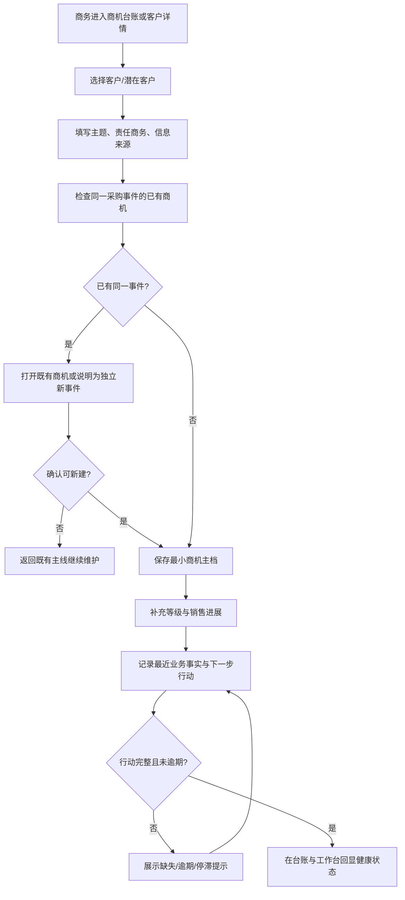
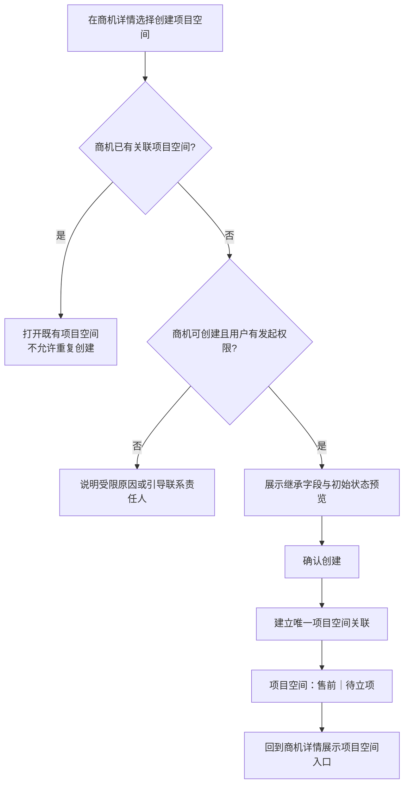

# 商机主档单功能需求规格说明书

> 文档信息  
> 版本：v0.2 本地实施基线  
> Owner：项目负责人  
> 作者：Codex  
> 最后更新：2026-09-12  
> 所属 PRD：[PRD V0.4](../PRD.md)  
> 功能路径：商机与客户 / 商机管理  
> 状态：ready-for-implementation（WI-008 本地范围）

## 1. 功能概览

| 项目 | 内容 |
|---|---|
| 功能名称 | SPEC-OM-01｜商机建档、等级、销售进展、责任、跟进与主线 |
| 优先级 | P1 |
| 使用者 | 商务、售前负责人、商务负责人、管理层、按授权参与商机的项目成员 |
| 入口位置 | 商机与客户 / 商机管理；客户详情的关联商机；工作台待办或消息深链 |
| 前置条件 | 已有客户/潜在客户主档、启用用户账号、销售进展与停滞规则配置；关闭/重开由 SPEC-OM-02 定义 |
| 相关模块 | 客户主档、项目空间、工作台与待办、商机分析、数据任务中心、角色权限、审计中心 |
| 相关文件或流程 | PRD-OM-01～OM-04、PRD 第 2.2/2.3/3.1、[客户主档 SPEC](customer_master_spec.md)、[前端组件规范](../../technical/designs/frontend/FRONTEND_COMPONENT_STANDARD.md) |

## 2. 功能范围与产品设计

### 2.1 功能列表

| 序号 | 功能点 | 功能描述 | 优先级 |
|---:|---|---|---|
| 1 | 商机台账 | 统一查询所有 A—D 商机，展示客户、主题、责任、等级、销售进展、行动完整度和项目空间关联 | P1 |
| 2 | 最小建档 | 首录只要求客户、机会主题、责任商务和信息来源；支持后续渐进补齐 | P1 |
| 3 | 唯一采购事件控制 | 建档时检查同客户下的同一采购事件，阻止平行主线并引导使用既有记录或建立有依据的新事件 | P1 |
| 4 | 等级与销售进展 | 分别维护 A—D 成交确定性和销售推进位置，分别展示、统计并留存变更历史 | P1 |
| 5 | 商机详情与跟进 | 在详情中维护最近业务事实、下一步动作、行动责任人和目标时间，并展示时间线 | P1 |
| 6 | 行动健康提示 | 按配置识别行动缺失、行动逾期、长期无进展，帮助责任商务修正而不替代其判断 | P1 |
| 7 | 项目空间发起入口 | 当需要正式售前支持时，从原商机发起创建同一项目空间；最多一个空间 | P1，空间细节由 SPEC-PW-01 定义 |
| 8 | 关联与历史 | 客户、项目空间、后续合同/DG-01 等均从本商机引用；等级/进展等关键变化保留历史 | P1 |

### 2.2 背景与目标

商机是从客户关系到售前投入、合同归档和项目空间的唯一业务主线。一条记录代表一个独立采购事件，所有 A—D 商机必须尽早建档。若每个团队用不同表格或为同一采购事件新建多条记录，会同时损坏销售统计、投入归集、项目空间继承和关闭复盘。

本功能的目标是让商务可以在信息还不完整时快速建立可信商机，随后以可追踪的等级、销售进展和下一步行动持续维护。商机详情应清楚显示“成交有多确定”和“商务推进到哪里”这两个不同问题，并在需要正式售前时把原有事实交给同一项目空间。系统可以发现陈旧或缺行动的记录，但不替用户推断业务结论或自动关闭商机。

### 2.3 方案取舍

| 方案 | 内容 | 结论 | 原因 |
|---|---|---|---|
| 最小建档＋渐进补齐 | 首录只要求客户、主题、责任商务、来源 | 采用 | 满足 D 级和早期信息不完整商机的及时入库要求 |
| 一开始要求完整报价/金额/阶段资料 | 复杂表单后才能保存 | 不采用 | 会促使用户绕开系统或延迟建档 |
| 等级与销售进展分开 | A—D 表示确定性，销售进展表示商务位置 | 采用 | 两者回答不同问题，统计和历史必须独立 |
| 用单一“商机状态”替代等级/进展 | 一个下拉框同时表示成败和推进 | 不采用 | 会混淆停滞、暂停、关闭和成交确定性 |
| 自动关闭无进展商机 | 超过阈值直接改为关闭/失败 | 不采用 | 业务结果和关闭必须由人员显式提交，留给 SPEC-OM-02 |
| 同一客户同主题可自由重复建档 | 不提示采购事件重复 | 不采用 | 与“同一主线不得重复建档”相冲突 |
| 项目空间可从菜单空白创建 | 绕过商机上下文 | 不采用 | 项目空间必须从原商机继承客户、责任商务和背景 |

### 2.4 产品形态与范围边界

商机管理是已确认浅色工作台中的核心“台账＋行动面板”页面：白色左侧导航、浅蓝灰内容区、顶部面包屑/页签/搜索，紧接一条轻量规则或提醒横幅。首屏不是堆叠图表，而是简洁的状态摘要卡（进行中、缺行动、已逾期、长期无进展）和一张可筛选高密度台账；以蓝色文字链接和状态标签强化可扫描性。

商机详情以标题区＋四项关键事实（客户、等级、销售进展、当前商机状态/业务结果摘要）开场，核心区放置“下一步行动”卡片和最近业务事实，下面用标签页或分区组织概览、跟进时间线、关联项目空间和历史。等级与进展均通过显式标签和变更记录呈现，禁止用一条视觉进度条掩盖两个概念。需要正式售前时，详情页的主操作是“创建项目空间”；成功后立即展示稳定项目空间链接，不再提供第二次创建。

本 SPEC 不定义业务结果、关闭原因、重开、输赢复盘和全部 Excel 导入行为，它们归入 SPEC-OM-02 和 SPEC-MIG-01。商机分析看板、DG-01、合同与售前规定动作也不在本页提前实现，只保留可追溯的关联入口。

## 3. 流程说明与流程图

### 3.1 主流程：最小建档并持续维护行动

商务从商机台账或客户详情新建商机，先选择已存在的客户或潜在客户。填写机会主题、责任商务和信息来源后，系统按客户和采购事件识别规则检查已有记录。确认不是同一事件后可立即保存。责任商务随后在详情中逐步补充等级、销售进展和商务事实，并持续维护下一步动作、行动责任人和目标时间；系统按配置给出缺行动、逾期或长期无进展提醒。

### 3.2 分支流程：从商机创建项目空间

当需要正式售前支持时，责任商务或有授权人员从商机详情发起创建项目空间。系统校验商机仍为可创建状态、当前用户有权发起且该商机尚未关联项目空间；创建时继承客户、商机、责任商务和已有背景。项目空间初始主阶段为“售前”，项目状态为“待立项”，该待立项仅指等待 SG-01，不等同于 DG-02 交付立项。

刷新后台账依据已保存的商机、行动和关联事实重新计算健康提示。取消新建/编辑/项目空间创建不写入草稿；关闭或重开商机时，页面必须跳转到后续的 SPEC-OM-02 流程，不能以普通编辑改变业务结果。

## 4. 特殊业务规则

1. 所有 A—D 商机都必须入库；最小建档只要求客户/潜在客户、机会主题、责任商务和信息来源，其他字段允许渐进补齐。
2. 一条商机对应一个独立采购事件；同一采购事件不得建立平行商机。系统按配置识别冲突并引导使用原记录，人员如确认是独立新事件必须填写可追溯说明。
3. 每条商机必须引用一个客户主档；客户变更和合并由客户主档规则处理，不在商机中复制客户文本。
4. A—D 商机等级只表示成交确定性；销售进展只表示商务推进位置。两者分别维护、分别统计、分别记录原值/新值/操作者/时间/说明。
5. 进行中商机必须具备责任商务、最近业务事实、下一步动作、行动责任人和计划时间。任何一项缺失都应显示行动完整度问题。
6. 长期无进展、行动缺失和行动逾期的阈值由配置决定。系统只提示和生成待办/消息候选，不自动判定失败、关闭、暂停或成交。
7. 同一商机最多创建一个项目空间；创建只能从原商机发起，项目空间必须继承客户、商机、责任商务和已有背景。
8. 商机的关闭、业务结果、重开和复盘必须使用 SPEC-OM-02 的独立流程；“已关闭”不能在本页普通编辑中替代独立结果。
9. 后续项目空间、合同归档和 DG-01 等对象必须引用或从原商机发起，不能为同一采购事件另建平行主线。
10. 商机责任人调动、停用或离职时，当前行动责任和业务责任的交接由组织/用户与对应业务流程共同控制，不得静默置空。

## 5. 页面与状态说明

| 页面 / 状态 | 说明 | 可用操作 |
|---|---|---|
| 商机台账 | 状态摘要、规则横幅、筛选器和高密度商机表；默认面向当前有权范围 | 搜索、筛选、新建、导出（按权限）、打开详情 |
| 新建商机 | 最小信息优先的表单；客户选择和事件重复检查始终可见 | 选择客户、快速建档、保存草稿/创建、取消 |
| 商机详情 | 标题区、行动卡、概览、跟进、关联项目空间和历史分区 | 编辑、记录跟进、维护行动、创建项目空间、跳转客户 |
| 等级/进展更新 | 在详情中的受控轻量编辑，不与普通备注混在一起 | 选择新值、填写说明、保存 |
| 跟进与行动面板 | 最近事实时间线、下一步动作、责任人、目标时间和健康提示 | 新增/完成/调整行动、记录事实、跳转待办（后续） |
| 项目空间创建确认 | 只展示可继承字段和初始状态，不要求重复输入客户/责任商务 | 查看既有空间、确认创建、取消 |
| 重复事件提示 | 在建档中显示同客户下的候选商机及匹配原因 | 打开既有商机、说明独立事件、返回编辑 |
| 加载 / 空态 / 无权限 / 失败 | 分别覆盖台账、详情、行动卡和关联区 | 重试、新建、返回、请求权限 |

## 6. 查询条件

| 字段 | 类型 | 内容 | 默认值 | 查询规则 |
|---|---|---|---|---|
| 关键词 | 文本 | 商机主题、编号、客户名称、责任商务 | 空 | 在有权记录范围内模糊匹配 |
| 客户 | 远程选择 | 一个或多个客户/潜在客户 | 空 | 选项来自可见客户主档 |
| 责任商务 | 用户多选 | 商机当前责任人 | 默认当前用户（可清除） | 仅可筛选有权用户范围 |
| 商机等级 | 多选 | A、B、C、D | 全部 | 与销售进展完全独立 |
| 销售进展 | 多选 | 公司配置的推进字典 | 全部 | 使用当前进展，不从等级映射 |
| 商机状态 / 业务结果 | 多选 | 当前状态和结果摘要 | 默认进行中/待定 | 值由 SPEC-OM-02 管理；本页只筛选回显 |
| 行动健康 | 多选 | 完整、缺行动、逾期、长期无进展 | 默认全部 | 根据已保存事实和配置阈值计算 |
| 项目空间 | 单选 | 未创建、已创建 | 全部 | 每条商机最多一个空间 |
| 来源 / 创建时间 | 多选 / 日期范围 | 信息来源、建档时间 | 空 | 来源使用配置字典；时间使用系统记录 |

## 7. 列表与状态字段

| 字段 | 内容 | 排序 | 显示规则 |
|---|---|---|---|
| 商机主题 / 编号 | 机会主题与稳定编号 | 支持 | 主题主视觉，编号次级；点击进入详情 |
| 客户 | 已关联客户主档 | 支持 | 显示名称并可下钻；无客户为数据异常，不能正常创建 |
| 责任商务 | 当前责任人 | 支持 | 头像/姓名摘要；停用账号显示历史状态并提示交接 |
| 等级 | A—D 成交确定性 | 支持 | 文本标签，独立于进展显示 |
| 销售进展 | 当前商务推进位置 | 支持 | 配置标签，独立于等级显示 |
| 最近业务事实 | 最近一条事实时间和摘要 | 支持 | 无记录明确显示“待补充” |
| 下一步行动 | 动作、责任人、目标时间 | 支持 | 缺失/逾期显示文字状态和图标，不只依赖颜色 |
| 健康提示 | 完整、缺行动、逾期、长期无进展 | 支持 | 由规则计算，可筛选且可下钻详情修正 |
| 项目空间 | 未创建或已关联项目空间 | 支持 | 已创建显示稳定链接；不显示第二个创建入口 |
| 最近变更 | 更新时间和操作者 | 支持 | 详情中可查看完整关键变更历史 |

## 8. 表单字段

| 字段 | 类型 | 内容 | 默认值 | 格式规则 |
|---|---|---|---|---|
| 客户 / 潜在客户 | 远程选择＋快速建档 | 唯一客户主档引用 | 从客户上下文预填 | 必填；不能保存自由文本；停用/已合并来源不可新选 |
| 机会主题 | 单行文本 | 对独立采购事件的可识别主题 | 空 | 必填；参与同一事件检查 |
| 责任商务 | 用户选择 | 对商务结果负责的当前人员 | 当前创建人（可改） | 必填；必须为启用账号 |
| 信息来源 | 选择器 | 商机信息来源 | 空 | 必填；选项由配置提供 |
| 商机等级 | 单选 | A、B、C、D 成交确定性 | 首录可为空或配置默认 | 与销售进展独立；变更需说明与历史 |
| 销售进展 | 选择器 | 当前商务推进位置 | 空 | 选项由配置提供；变更需说明与历史 |
| 采购方式 | 选择器 | 招投标/非招投标等配置事实 | 空 | 可渐进补齐；影响后续结果用语 |
| 预估金额 / 目标日期 | 数字 / 日期 | 商务估算信息 | 空 | 可渐进补齐；币种、精度和权限待配置 |
| 最近业务事实 | 富文本受限/多行文本 | 已发生且可核对的推进事实 | 空 | 进行中商机必需；记录时间和操作者 |
| 下一步动作 | 单行/多行文本 | 明确可执行的下一件事 | 空 | 进行中商机必填；不能用空泛状态替代 |
| 行动责任人 | 用户选择 | 完成下一步行动的人 | 责任商务（可改） | 进行中商机必填；须为启用账号 |
| 计划时间 | 日期时间 | 下一步行动目标时间 | 空 | 进行中商机必填；逾期按系统时间判断 |
| 独立事件说明 | 多行文本 | 与候选重复商机的差异依据 | 空 | 出现强相似候选且仍新建时必填 |
| 项目空间继承预览 | 只读区 | 客户、商机、责任商务、已有背景和初始状态 | 自动生成 | 不允许在该确认框改写原商机事实 |

## 9. 交互、提示与异常

| 场景 | 系统处理 | 用户反馈 | 是否阻塞 |
|---|---|---|---|
| 页面加载 | 先加载当前权限范围内的摘要和台账，再按需加载筛选项 | 骨架与上次筛选上下文；不以空表代替错误 | 否 |
| 最小建档 | 先校验客户、主题、责任商务、来源，再检查采购事件重复 | 通过后立即创建；字段错误和重复候选就地显示 | 是 |
| 重复事件 | 显示候选商机、匹配依据和已有项目空间状态 | 强冲突时引导打开原记录；独立新事件须补充说明 | 视配置规则 |
| 更新等级/进展 | 分别保存值、说明和历史 | 成功后独立刷新两个标签及历史 | 是 |
| 行动缺失/逾期 | 根据配置计算，不篡改商机状态 | 提示缺项、逾期天数或无进展时长，并提供直达编辑 | 否 |
| 创建项目空间 | 校验唯一关联、权限和可创建状态 | 成功后显示新空间链接；已有空间直接打开 | 是 |
| 关闭/重开尝试 | 不在普通编辑页修改结果或关闭状态 | 引导到后续受控流程并说明原因 | 是 |
| 无权限 / 服务异常 | 不泄露无权商机、客户或行动内容；保存失败保留表单 | 受限说明、字段级错误、可重试失败 | 视操作而定 |

## 10. 数据、权限与边界

### 10.1 数据记录

| 数据项 | 来源 | 用途 |
|---|---|---|
| 商机主档（OPPORTUNITY） | 商务最小建档与渐进补齐 | 独立采购事件、客户、责任、来源、等级、进展等唯一主线 |
| 商机等级历史 | 等级更新 | 分别追溯成交确定性变化 |
| 销售进展历史 | 进展更新 | 分别追溯商务推进变化 |
| 业务事实与下一步行动 | 责任商务/行动责任人维护 | 驱动行动完整度、待办和停滞识别 |
| 事件重复判定摘要 | 新建/导入时检查 | 辅助唯一主线控制和说明留存 |
| 项目空间关联 | 从商机创建项目空间 | 确保一条商机最多一个空间并可追溯 |
| 当前状态/业务结果摘要 | SPEC-OM-02 流程写入 | 在台账和详情中一致回显，不在本 SPEC 普通编辑 |

### 10.2 权限与边界

1. 商机查看、创建、编辑、等级/进展更新、行动维护、创建项目空间、导出和关闭/重开必须按动作、组织/客户数据范围、项目参与和状态分别控制。
2. 责任商务、行动责任人、金额及后续项目资金摘要等字段具有不同敏感等级；无权用户只能看到受许可的摘要，不能通过筛选、排序或错误信息推断受限值。
3. 商机详情中的客户、项目空间、合同和文件链接必须再次执行原对象权限校验；存在关联不代表自动可见。
4. 只有满足角色与商机状态条件的用户可从商机创建项目空间；创建后项目空间成员和权限仍由项目空间规则决定。
5. 商机删除不在 P1 正常操作范围内；关闭、结果、重开与历史保留遵循 SPEC-OM-02，不能用删除或普通状态编辑绕过。

## 11. 功能详细设计

WI-008 已补齐首批本地实施契约，具体约束见 11.8；公司制度配置与真实数据迁移仍需独立验证。

### 11.1 模块责任与复用边界

| 层次 | 责任 | 新增或复用 | 关联模块 / 共享设计 |
|---|---|---|---|
| 前端 | 商机台账、最小建档、详情、行动卡、重复事件提示、项目空间创建确认 | 后续新增，复用 AppShell、Table、Form、Drawer、Timeline、Tag | [前端组件规范](../../technical/designs/frontend/FRONTEND_COMPONENT_STANDARD.md) |
| 后端 | 商机主档、唯一事件校验、等级/进展历史、行动健康计算、项目空间发起校验、权限复核 | 后续新增 | 客户、项目空间、工作台、分析、审计 |
| 数据 | OPPORTUNITY、历史记录、行动/事实、项目空间关联 | 后续新增 | PRD 第 2.2 与第 3.1 |

### 11.2 前端页面与组件设计

| 页面 / 区域 | 建议路由 | 使用的共享组件 | 本功能组件 | 状态与数据来源 | 响应式 / 无障碍要求 |
|---|---|---|---|---|---|
| 商机台账 | `/opportunities` | AppShell、Breadcrumb、Card、Table、Select、Tag | `OpportunityListPage`、`HealthSummary` | 商机列表、筛选、健康聚合 | 窄屏保留主题/客户/健康/责任人，更多字段入详情 |
| 新建商机 | `/opportunities/new` 或抽屉 | Form、AutoComplete、Alert、Drawer | `OpportunityCreateForm`、`DuplicateEventPanel` | 客户选择、表单草稿、重复候选 | 字段级校验、候选可键盘选择，取消不污染客户数据 |
| 商机详情 | `/opportunities/:opportunityId` | Descriptions、Tabs、Timeline、Card、Dropdown | `OpportunityDetail`、`NextActionCard` | 主档、历史、行动、关联空间 | 关键事实与行动卡在窄屏单列，状态文字不依赖色彩 |
| 创建项目空间 | 详情内确认框 | Modal、Descriptions、Result | `CreateProjectSpaceDialog` | 可继承字段、创建状态 | 成功焦点转向空间链接；错误可重试且不重复创建 |

### 11.3 API 契约

当前冻结资源边界：商机目录/详情、最小创建与编辑、客户选择、采购事件候选校验、等级与进展更新、业务事实、行动、健康摘要、项目空间创建预览/提交和关联查询。关闭/重开、结果与导入为独立资源边界。具体 API、事件模型、错误码、分页、并发版本与待办同步在实现工作项中确定。

### 11.4 数据模型与迁移

| 对象 / 表 | 字段或关系 | 约束与索引 | 历史 / 审计 | 迁移与兼容 |
|---|---|---|---|---|
| OPPORTUNITY | 客户、主题、责任商务、来源、等级、进展、状态摘要 | 客户必填；唯一采购事件规则/索引待配置 | 主档变更与创建来源 | 历史 Excel 导入由 SPEC-MIG-01 定义 |
| OPPORTUNITY_LEVEL_HISTORY | 原值、新值、说明、操作者、时间 | 与商机关联且不可被普通编辑覆盖 | 完整保留 | 初始导入建立首个快照 |
| OPPORTUNITY_PROGRESS_HISTORY | 原值、新值、说明、操作者、时间 | 与等级历史独立 | 完整保留 | 字典映射待确认 |
| OPPORTUNITY_ACTION / FACT | 事实、动作、责任人、目标时间、完成状态 | 进行中完整度校验 | 变更与完成留痕 | 与待办映射待 WB-01 明确 |
| OPPORTUNITY_PROJECT_SPACE | 商机与项目空间一对零/一关系 | 商机唯一关联约束 | 创建人、时间、继承快照 | 项目空间从该关系接续 |

### 11.5 事务、并发、幂等与失败恢复

1. 最小建档必须原子写入客户引用、主题、责任商务、来源和首个商机标识；任何必填或重复冲突失败均不创建半条商机。
2. 等级与销售进展各自保存历史，重复提交或并发编辑不能导致两类历史混写或丢失说明。
3. 创建项目空间使用商机级唯一约束、幂等键和事务；并发请求只能创建一个空间，其余请求返回既有空间。
4. 行动健康以服务端时间和已保存事实计算；客户端离线/刷新不会改变正式状态，失败时保留未提交行动草稿。
5. 编辑版本冲突需要提示重新加载并比较最新值；禁止无提示覆盖最近事实或下一步行动。

### 11.6 安全、权限与审计实现

| 动作 | 权限判断 | 敏感数据处理 | 审计事件 | 失败控制 |
|---|---|---|---|---|
| 查看商机 | 菜单＋数据范围＋项目参与/状态 | 金额、联系人、关联对象按字段/对象权限过滤 | 视策略记录敏感查看 | 拒绝无权记录而不泄露存在性 |
| 新建/编辑 | 商机动作＋客户可见范围 | 客户引用、责任人、来源受控 | 创建/编辑前后值 | 必填、唯一事件和并发校验 |
| 更新等级/进展 | 对应动作权限＋业务状态 | 说明和原值仅向有权人员展示 | 独立历史事件 | 分开接口/命令，禁止混写 |
| 维护行动 | 商机参与＋行动动作权限 | 责任人/事实按范围控制 | 新增、修改、完成、逾期摘要 | 不能以无权用户覆盖责任人 |
| 创建项目空间 | 发起权限＋商机状态＋唯一关联 | 只传递可继承必要事实 | 发起、成功/失败关联事件 | 事务、幂等、已有空间回跳 |

### 11.7 配置、兼容与回退

- 新增配置：销售进展字典与进入/退出条件、商机编号、采购事件重复识别键、停滞/逾期阈值、行动待办映射、采购方式、金额字段和敏感等级；
- 浏览器或客户端兼容：遵守前端组件规范；高密度台账必须在窄屏提供关键字段与可达筛选；
- 灰度或数据兼容：先以经核验的 30—50 条迁移样本校准去重与健康提示；迁移后不保留长期双主表；
- 回退方式：不删除已创建商机或历史；如配置规则错误，修正规则版本并重新计算提示，关闭/重开仍走受控流程。

### 11.8 WI-008 本地实施冻结（2026-09-12）

本节补齐前述资源边界的实际契约，遵守[业务共享契约](../../technical/designs/shared/BUSINESS_DELIVERY_CONTRACT.md)。结果与关闭按 [OM-02](opportunity_result_spec.md)；Excel 导入和跨模块待办进入独立后续交付，不凭商机页面宣称实现。

- `GET/POST /api/crm/opportunities`、`GET/PATCH /api/crm/opportunities/{id}`；`POST /{id}/classification` 分别传 grade 或 progress 及原因；`POST /{id}/activities` 记录业务事实和下一步责任/日期；创建空间调用 `POST /api/projects`。
- Opportunity：UUID、code、customerId、title、ownerAccountId、organizationUnitId、source、eventKey、grade(A–D，默认 D)、progress(LEAD/QUALIFIED/SOLUTION/QUOTATION/NEGOTIATION)、procurementMethod(TENDER/DIRECT)、estimatedAmount(CNY 可空)、targetDate、background、status、result、projectId(可空且唯一)、version、timestamps。
- 最小首录仅客户/主题/商务/来源必填；`eventKey` 可选，存在时同客户同 key 强唯一，相同客户主题提示重复（精确同名要求填写独立 eventKey 后再建），不通过“已关闭”解除原事件唯一性。标题作为业务主题保留，不推断采购事件属于同一集团。
- Activity 保存 fact、nextAction、assigneeId、dueDate、recordedAt/By；三项行动字段一起有值或一起为空，缺失时显示缺行动。服务端当前日期之后为未到期，之前为逾期；30 日无新事实仅显示停滞提示。变更等级和进展分别生成历史事件，普通编辑不能直接改结果或状态。
- 客户合并在 CRM 事务内更新外键；创建项目锁定原商机，唯一关系由数据库和公开绑定接口共同约束。已关闭商机只能查看和受控重开。

## 12. 测试设计与验收标准

### 12.1 测试矩阵

| 场景 | 测试层次 | 前置数据 | 预期结果 | 关联验收项 |
|---|---|---|---|---|
| 最小商机建档 | 前端 / 集成 / E2E | 已有客户、启用商务账号 | 仅四项必填即可创建稳定商机 | PRD-OM-01 |
| 无客户尝试保存 | 集成 / E2E | 无客户引用 | 被阻止，无法用自由文本绕过 | PRD-CM-01、OM-01 |
| 同一采购事件 | 集成 / E2E | 已存在同客户同事件商机 | 强提示/阻止平行记录，能打开原主线 | PRD-OM-04 |
| 等级与进展独立 | 集成 / E2E | 已有商机 | 分别更新、分别统计、分别留下历史 | PRD-OM-02 |
| 行动完整度 | 集成 / E2E | 进行中商机 | 缺少事实/下一步/责任人/时间或逾期时正确提示 | PRD-OM-03 |
| 停滞阈值 | 集成 / 定时任务 | 超阈值但未关闭的商机 | 显示停滞，不自动关闭或判定结果 | PRD-OM-03 |
| 创建项目空间 | 集成 / E2E / 并发 | 可创建商机 | 继承事实、初始为售前/待立项且最多创建一个 | PRD-PW-01 |
| 权限与敏感字段 | 安全 / E2E | 不同组织/角色用户 | 列表、详情、筛选与关联对象均不越权 | PRD 第 6 章 |
| 窄屏与键盘 | 前端 / 人工 | 390px、键盘导航 | 台账筛选、表单、行动卡和确认框可完成 | 前端组件规范 |

### 12.2 验收标准

1. 所有 A—D 商机都可使用最小信息及时建档，并且每条记录持久关联唯一客户/潜在客户主档。
2. 系统能在建档时发现同一采购事件的候选记录，并阻止或受控解释平行商机，而不是允许静默重复。
3. 等级 A—D 和销售进展可独立维护、显示、统计和追溯，页面不将其合并成一个状态。
4. 进行中商机必须可查到责任商务、最近业务事实、下一步行动、行动责任人和目标时间；缺失、逾期和停滞能被识别但不会自动关闭。
5. 需要正式售前时，用户只能从原商机创建最多一个项目空间，项目空间继承客户、商机、责任商务和背景，并初始显示“售前｜待立项”。
6. 关闭、业务结果和重开不被普通编辑绕过，页面明确引导到独立流程。
7. 台账和详情遵守已确认浅色工作台视觉语言，且在加载、空态、无权限、冲突和服务失败时具有清晰可操作反馈。

## 13. 待确认问题

以下为生产制度及后续交付事项；本地初始值和安全兜底已在 11.8 及共享契约中明确，不自动推断公司最终规则。

1. ⚠️ 销售进展的首批字典、每个进展的进入/退出条件和是否强制填写说明由谁配置？
2. ⚠️ “同一独立采购事件”的最小识别键、强阻止与可说明新建的阈值如何定义，谁裁决边界案例？
3. ⚠️ 长期无进展、行动逾期、行动缺失的时限和待办/消息升级策略是什么？
4. ⚠️ 预估金额、采购方式、目标日期等渐进字段的必填节点、币种、敏感等级和审批边界待确认。
5. ⚠️ 关闭/重开、业务结果、原因分类及其与项目空间同步由 SPEC-OM-02 定义，需在实现前与本 SPEC 联合评审。

## 14. 变更记录

| 版本 | 作者 | 修订内容 | 日期 |
|---|---|---|---|
| v0.1 | Codex | 基于 PRD-OM-01～OM-04 创建商机主线、行动管理、唯一事件控制和页面设计草案 | 2026-08-26 |

| v0.2 | Codex | 按本次系统交付授权补齐 WI-008 的本地实施接口、数据与验证边界 | 2026-09-12 |
