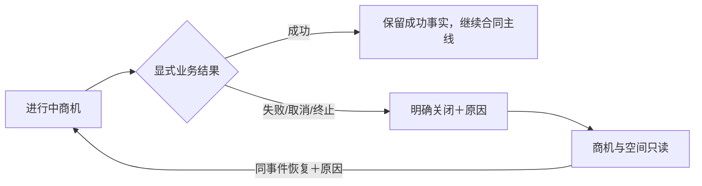

# 商机业务结果与关闭重开单功能需求规格说明书

> SPEC-OM-02 · v0.1 · ready-for-implementation · 2026-09-12  
> Owner：Lusice；作者 Codex；来源 PRD-OM-05～09；WI-008。

## 1. 功能概览

商务在原商机记录采购结果和复盘，未成功关闭时同一项目空间保留只读，恢复同一采购事件时受控重开。

## 2. 功能范围与产品设计

详情中的显式结果/关闭/重开抽屉。状态 ACTIVE/PAUSED/CLOSED 与结果 PENDING/SUCCESS/FAILURE/CUSTOMER_CANCELLED/TERMINATED 分开；TENDER 显示中标/未中标，DIRECT 显示成交/未成交；成功不等于合同已签。

## 3. 流程说明与流程图

责任商务填写结果、原因分类和依据；服务器同步商机与空间的只读事实。重开必须同一事件并有理由，恢复状态不删除历史。独立新事件新建并关联原记录。

## 4. 特殊业务规则

关闭必须独立提交状态与非待定结果及原因；成功结果不自动关闭项目，不进入本版本不支持的项目关闭流程。已存在交付批准基线的商机不得用售前失败关闭绕过交付治理。

## 5. 页面与状态说明

普通编辑不暴露生命周期字段。关闭后只有查看和受控重开。原投入、成果、需求、关闭原因仍可查；项目四类状态不合并成单个标签。

## 6. 查询条件

结果、状态、采购方式、客户和日期；沿用商机目录。

## 7. 列表与状态字段

状态、结果、原因分类、原因说明、依据、操作人和时间；结果显示使用同一服务端语义。

## 8. 表单字段

结果、状态、reasonCategory、reason、evidence、version；重开只允许原因与版本，不改客户或采购事件。

## 9. 交互、提示与异常

结果与关闭状态必须显式选择并确认影响；取消无写入。409 冲突展示最新状态；其他无关修改不可绕过关闭只读。

## 10. 数据、权限与边界

CRM 保存结果唯一事实和不可变事件。Project Module 通过同一事务事件接收只读状态；`CRM_OPPORTUNITY_RESULT` 独立授权，所有业务写入读取项目当前状态。

## 11. 功能详细设计

`POST /api/crm/opportunities/{id}/result`、`POST /{id}/reopen`；共享 [业务契约](../../technical/designs/shared/BUSINESS_DELIVERY_CONTRACT.md)。锁定商机与项目，核对版本，在一笔事务中保存前后状态及审计；客户/商机/项目相关视图均从 CRM 公开摘要消费结果，不客户端猜测。

## 12. 测试设计与验收标准

成功不自动签约；招标/非招标用语一致；失败缺少关闭选择/原因拒绝；关闭空间全部写入拒绝；重开保留投入和成果；版本冲突/重复请求不生成重复事实；无权限账号拒绝。

## 13. 待确认问题

公司最终原因分类允许配置；初始分类 PRICE/TECHNICAL/TIMING/CUSTOMER/OTHER，OTHER 必填解释。不自动推断原因。

## 14. 变更记录

v0.1：PRD 已确认语义的本地实施设计。
