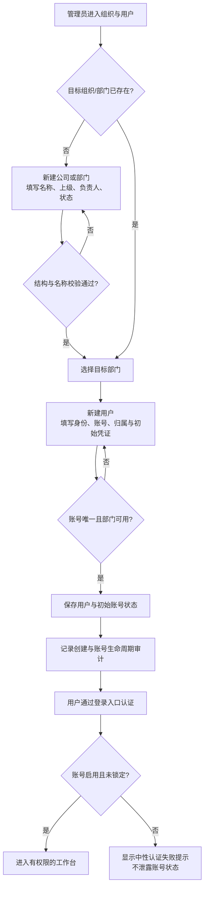
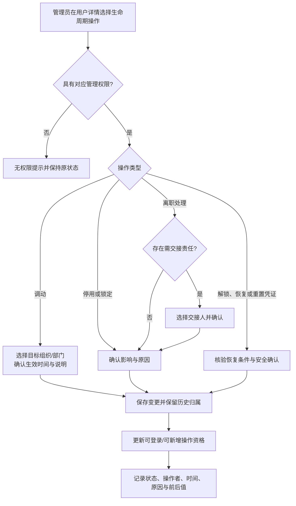

# 组织、用户与账号生命周期单功能需求规格说明书

> 文档信息  
> 版本：v0.3  
> Owner：项目负责人  
> 作者：Codex  
> 最后更新：2026-08-28  
> 所属 PRD：[PRD V0.4](../PRD.md)  
> 功能路径：系统管理 / 组织与用户  
> 状态：ready-for-implementation（登录与用户管理核心范围）

## 1. 功能概览

| 项目           | 内容                                                                                                                         |
| -------------- | ---------------------------------------------------------------------------------------------------------------------------- |
| 功能名称       | SPEC-IAM-01｜组织、部门、用户与账号生命周期                                                                                  |
| 优先级         | P1                                                                                                                           |
| 使用者         | 初始化管理员、系统管理员、被授权的组织管理员；普通用户使用登录入口                                                           |
| 入口位置       | 登录页；系统管理 / 组织与用户                                                                                                |
| 前置条件       | 已配置本地 PostgreSQL、初始化管理员与首批根组织；完整菜单/权限管理不作为本功能的前置条件                                     |
| 相关模块       | 菜单与权限管理、项目成员、审计中心、数据任务中心、工作台                                                                     |
| 相关文件或流程 | PRD-IAM-01、PRD-IAM-02、PRD 第 2.2 实体关系、[前端组件规范](../../technical/designs/frontend/FRONTEND_COMPONENT_STANDARD.md) |

## 2. 功能范围与产品设计

### 2.1 功能列表

| 序号 | 功能点         | 功能描述                                                                   | 优先级                          |
| ---: | -------------- | -------------------------------------------------------------------------- | ------------------------------- |
|    1 | 最小登录入口   | 使用账号和认证凭证识别可用账号；认证失败不泄露账号是否存在或账号状态       | P1                              |
|    2 | 组织与部门树   | 维护公司、部门及上下级关系，查看本系统所需的归属、负责人、状态和在职账号数 | P1                              |
|    3 | 用户目录       | 按组织、部门、账号状态和关键词检索用户，并从目录进入详情与受控操作         | P1                              |
|    4 | 用户建档与调动 | 创建用户账号、维护必要身份/联系方式、归属部门和账号状态；支持调动          | P1                              |
|    5 | 账号生命周期   | 启用、停用、锁定、解锁、重置凭证、离职处理与恢复；历史责任和审计持续保留   | P1                              |
|    6 | 批量创建入口   | 从用户目录发起批量导入，跳转或关联数据任务中心查看批次、错误行和重试结果   | P1，导入细节由 SPEC-OPS-01 定义 |
|    7 | 历史与关联查看 | 在用户详情展示当前归属、账号状态、生命周期与组织归属历史摘要               | P1                              |

### 2.2 背景与目标

组织、账号和权限是全部业务页面的共同前提，但它们不承担人力资源系统职能。系统需要能够回答“谁可以登录、属于哪里、当前是否可操作、历史责任仍归谁”，并为后续商机责任人、项目成员、敏感字段和审计提供稳定身份来源。

本功能的目标是让管理员先用少量、可信的信息建好组织和账号，再以受控操作处理调动、锁定、停用和离职，而不是删除记录或把历史业务责任改写为当前部门。首轮页面还必须建立统一、低干扰的登录体验，使后续所有工作台和业务页面可以可靠地按当前账号进入。

### 2.3 方案取舍

| 方案                     | 内容                                         | 结论   | 原因                                                                   |
| ------------------------ | -------------------------------------------- | ------ | ---------------------------------------------------------------------- |
| 组织树与用户目录分栏同屏 | 左侧展示组织树，右侧展示所选范围内的用户目录 | 采用   | 管理员可连续完成“先定位部门，再处理人员”的高频任务，且减少页面跳转     |
| 组织树和用户目录完全拆页 | 组织、部门和用户各自独立列表                 | 不采用 | 容易割裂部门归属与账号状态，不能满足基础管理的连续工作流               |
| 把组织用户做成 HR 档案   | 扩展劳动合同、绩效、薪资等人事字段           | 不采用 | 超出 PRD 的系统身份与权限范围                                          |
| 删除离职账号或被引用部门 | 直接物理删除无效记录                         | 不采用 | 会破坏商机、项目和审计的责任追溯                                       |
| 批量导入在当前页直接完成 | 上传后立即静默写入全部账号                   | 后续   | 导入批次、错误明细和重试应由数据任务中心统一承载，首轮只保留可发现入口 |

### 2.4 产品形态与范围边界

页面为“浅色工作台中的系统管理工作区”，而不是重型后台表单：白色左侧全局导航、浅蓝灰内容画布、紧凑顶部上下文栏、可关闭的业务页签（多对象打开时）、轻量提示横幅、12px 左右圆角的白色卡片，以及细边框的高密度表格。主要操作使用清晰蓝色，图标仅置于淡蓝色容器中辅助扫描；不使用深色大面积侧栏、过度渐变或默认组件堆砌式视觉。

“组织与用户”页内部采用树＋目录＋详情/抽屉的结构：树负责范围，目录负责批量判断，抽屉负责少量字段编辑，详情页负责历史与关联。页面实现必须遵守现有 Ant Design v6、项目主题 Token、响应式和无障碍规范；本 SPEC 不修改共享设计规范。

本功能的提交页使用“分块＋单字段行”布局：基础、组织、状态等信息按白色卡片区块分组；普通单行字段在同一行使用左侧固定标签与右侧控件，每行仅放一个字段，不使用一行两列的字段网格；多行说明、原因和备注使用标签在上、全宽输入。抽屉头部和操作栏固定，中部表单区域滚动。

本功能仅定义系统身份、组织归属、账号状态与服务端会话。菜单管理、权限项、角色、角色分配、数据范围与权限预览由独立的 [SPEC-IAM-02](role_permission_spec.md) 定义，不能以用户表单中的下拉框替代。项目成员和项目角色由项目空间及后续团队 SPEC 定义；审计事件的检索页由审计中心 SPEC 定义。

为保护首个系统，当前切片仅有一个不可由页面配置的“初始化系统管理员”安全桥接标记：它来自本机环境变量的首个管理员，并只用于保护登录后组织与用户管理接口。它不是可维护角色、不是菜单权限模型、也不能被普通用户表单授予；SPEC-IAM-02 交付后须迁移为正式的菜单与权限决策。

## 3. 流程说明与流程图

### 3.1 主流程：初始化组织并创建可用用户账号

初始化系统管理员进入“系统管理 / 组织与用户”，先在组织树创建或选择目标公司、部门，再在对应范围创建用户。保存时系统校验登录账号唯一性、部门有效性和必填身份信息；成功后账号按配置进入启用且首次登录需改密的状态。被创建用户使用登录入口认证，只有启用且未锁定的账号才能进入当前可用的工作台。

### 3.2 分支流程：账号状态变化、调动与离职恢复

管理员从用户目录或详情发起启停、锁定/解锁、重置凭证、调动、离职处理或恢复。系统先确认操作者具有相应管理权限，并检查目标用户是否为唯一的必要管理员或存在不能自动转移的待办责任；需要人工选择交接对象时，先完成交接再变更状态。停用、锁定或离职处理立即阻止后续登录和新增业务操作，但不得删除原有商机、项目成员、责任和审计记录。

无独立的刷新、关闭、取消流程：取消编辑不保存任何字段；刷新后仅显示已保存的当前状态；离开未保存表单时必须提示用户选择继续编辑、放弃或保存。

## 4. 特殊业务规则

1. 组织与用户仅保存本系统的身份、归属和权限关系，不替代完整 HR 系统。
2. 每个登录账号在当前系统内唯一；认证失败、账号不存在、密码错误、停用和锁定对登录者使用同一类中性提示。
3. 启用、停用、锁定、离职是账号可用性事实；停用、锁定或离职账号不得继续登录，也不得创建、修改或提交新的业务操作。
4. 停用、锁定、离职、调动、恢复和重置凭证必须记录操作者、时间、原因、变更前后状态；历史责任、业务记录与审计不能被删除或改写。
5. 调动改变当前组织归属，不得反向改写用户在既有商机、项目空间或历史审计中的当时归属快照。
6. 已被用户、业务记录或下级部门引用的组织单元不得物理删除；可停用并保留历史展示。
7. 用户离职处理前如存在需要转移的当前责任，系统必须提示，但不自动猜测交接对象；具体业务对象交接规则由对应 SPEC 定义。
8. 当前用户表单不得配置或回显通用系统角色。菜单、权限项、角色、角色分配、数据范围和实际权限预览均以 SPEC-IAM-02 为唯一事实源。
9. 初始和重置凭证由初始化系统管理员在受控表单中设定，使用一次性传递的临时密码；后续详情不回显明文，首次成功登录前必须改密。
10. 首期采用本地账号密码，密码仅保存为不可逆哈希；连续 5 次失败将锁定账号 15 分钟，成功认证后清零失败计数。
11. 服务端会话使用仅服务端可验证的随机会话标识；绝对有效期最多 8 小时、空闲超时 30 分钟。账号停用、锁定、离职或密码重置时必须撤销该账号的全部有效会话。
12. 仅初始化系统管理员可执行本切片内的组织与用户管理动作；不得停用、锁定、离职或降级最后一个初始化系统管理员。此桥接规则在 SPEC-IAM-02 交付后由正式权限决策替换。
13. 批量导入不得绕过账号唯一性、组织有效性、权限审计或错误行可追溯要求。

## 5. 页面与状态说明

| 页面 / 状态                 | 说明                                                                                 | 可用操作                                                  |
| --------------------------- | ------------------------------------------------------------------------------------ | --------------------------------------------------------- |
| 登录页                      | 无全局业务导航的简洁认证页；保留品牌识别、账号输入、密码输入、帮助入口和中性错误提示 | 登录、显示/隐藏凭证、进入帮助                             |
| 组织与用户工作区            | 树＋目录主页面；顶部显示面包屑、全局搜索、当前页签和主要操作                         | 切换组织、筛选、搜索、新建部门、新建用户、发起批量导入    |
| 组织节点详情                | 展示当前公司/部门的基础信息、负责人、状态、直属子部门与用户统计                      | 编辑、停用/恢复、添加子部门、查看范围内用户               |
| 部门编辑抽屉                | 低频字段在右侧抽屉编辑，关闭时保持目录上下文                                         | 保存、取消、查看校验错误                                  |
| 用户目录                    | 高密度可排序表格，支持批量查看但批量危险操作必须逐项确认或进入任务中心               | 查看详情、编辑、启停、锁定/解锁、调动、离职处理、重置凭证 |
| 用户详情                    | 显示身份、当前归属、账号状态、最近状态变更和关联责任摘要                             | 返回目录、编辑、生命周期操作、查看历史                    |
| 生命周期确认框              | 对可能阻断登录或新增操作的动作明确展示影响和原因输入                                 | 确认、取消                                                |
| 加载 / 空态 / 无权限 / 失败 | 使用骨架、空白引导、受限说明和可重试错误状态，不以空表伪装加载失败                   | 重试、请求权限、返回上页                                  |

## 6. 查询条件

| 字段         | 类型       | 内容                                                      | 默认值                 | 查询规则                             |
| ------------ | ---------- | --------------------------------------------------------- | ---------------------- | ------------------------------------ |
| 关键词       | 文本       | 姓名、登录账号、工号/内部标识、邮箱或手机号（按权限脱敏） | 空                     | 模糊匹配；输入防抖后查询             |
| 组织范围     | 组织树选择 | 公司、部门及是否包含下级部门                              | 当前选择节点，包含下级 | 切换节点后更新目录；无权范围不可查询 |
| 账号状态     | 多选       | 启用、停用、锁定、离职处理                                | 默认启用、锁定         | 多状态并集过滤                       |
| 最近变更时间 | 日期范围   | 创建、调动或账号状态变更时间                              | 空                     | 使用系统保存时间，不由前端推断       |

## 7. 列表与状态字段

| 字段            | 内容                                   | 排序 | 显示规则                                       |
| --------------- | -------------------------------------- | ---- | ---------------------------------------------- |
| 用户            | 姓名、头像占位和内部标识               | 支持 | 姓名主视觉，内部标识次级；无头像使用姓名首字母 |
| 登录账号        | 用于认证的唯一账号                     | 支持 | 按访问权限局部掩码；管理员可按规定查看完整值   |
| 当前组织 / 部门 | 当前归属路径                           | 支持 | 超长路径省略并可悬浮查看完整值                 |
| 账号状态        | 启用、停用、锁定、离职处理             | 支持 | 使用可读状态标签；不能仅用颜色表达             |
| 最近登录        | 最后一次成功认证时间                   | 支持 | 无记录显示“尚未登录”，不显示认证失败详情       |
| 最近变更        | 最近一次组织或账号状态变更时间与操作者 | 支持 | 详情页可展开历史                               |
| 操作            | 与当前权限和状态匹配的受控动作         | 否   | 危险操作收纳到更多菜单并需确认                 |

组织树节点显示名称、状态、直属用户数与折叠层级；停用节点灰化但保留可访问历史，不能作为新建用户的默认归属。

## 8. 表单字段

| 字段            | 类型          | 内容                         | 默认值           | 格式规则                                                             |
| --------------- | ------------- | ---------------------------- | ---------------- | -------------------------------------------------------------------- |
| 登录账号        | 单行文本      | 系统内唯一认证标识           | 空               | 必填；去除首尾空格；保存时做唯一性校验                               |
| 姓名            | 单行文本      | 用户展示名称                 | 空               | 必填；长度受配置限制                                                 |
| 内部标识        | 单行文本      | 工号或内部人员标识           | 空               | 可选；如启用唯一规则则校验唯一性                                     |
| 工作邮箱 / 手机 | 文本          | 受权限保护的联系方式         | 空               | 至少一项按公司配置必填；格式校验，目录默认脱敏                       |
| 公司 / 部门     | 级联选择      | 当前组织归属                 | 从当前树节点预填 | 必填；只能选择启用节点                                               |
| 临时密码        | 密码输入      | 新建/重置时的单次交付凭证    | 空               | 新建与重置时必填；最少 12 位，使用安全哈希保存；用户首次登录必须修改 |
| 账号状态        | 单选/只读状态 | 启用、停用、锁定、离职处理   | 新建按初始化配置 | 状态改变走确认流程，不能通过普通编辑静默修改                         |
| 部门名称        | 单行文本      | 公司或部门节点名称           | 空               | 同一上级下唯一；必填                                                 |
| 上级部门        | 树选择        | 节点父级                     | 当前选择节点     | 不能选择自身或下级；公司根节点按组织配置处理                         |
| 部门负责人      | 用户选择      | 负责组织节点的当前用户       | 空               | 仅可选启用账号；负责人离职/停用时提示调整                            |
| 部门状态        | 单选          | 启用、停用                   | 启用             | 停用后不可承接新用户，历史仍可查                                     |
| 状态变更原因    | 多行文本      | 启停、锁定、离职、恢复等原因 | 空               | 对风险操作必填；长度受配置限制                                       |

## 9. 交互、提示与异常

| 场景             | 系统处理                                                       | 用户反馈                                                                      | 是否阻塞   |
| ---------------- | -------------------------------------------------------------- | ----------------------------------------------------------------------------- | ---------- |
| 页面加载         | 先加载当前可见组织范围，再加载选中节点目录                     | 树和表格分别使用骨架；不显示伪数据                                            | 否         |
| 空组织 / 空用户  | 说明当前范围无节点或无用户，并给出具备权限时的首要动作         | 空态插画/文案与“新建部门/用户”按钮                                            | 否         |
| 提交新建或编辑   | 客户端基础校验后提交；服务端返回字段级错误时精确回填           | 成功轻提示并保留当前上下文；失败显示字段错误或可重试提示                      | 是         |
| 请求校验失效     | 写请求缺少、过期或无效 CSRF 令牌时拒绝请求，不写入任何业务数据 | 返回 `403 CSRF_VALIDATION_FAILED`；保留表单，提示再次提交；持续失败再刷新页面 | 是         |
| 登录失败         | 统一处理账号不存在、凭证错误、停用和锁定                       | “账号或凭证无效，请重试或联系管理员”                                          | 是         |
| 停用、锁定、离职 | 展示即时影响、原因和可能的责任交接                             | 二次确认；成功后状态立即更新                                                  | 是         |
| 调动             | 检查目标部门可用性，保存当前/历史归属                          | 成功后提示当前归属已更新、历史不变                                            | 是         |
| 取消 / 关闭      | 检查是否存在未保存变更                                         | 提示保存、放弃或继续编辑                                                      | 视用户选择 |
| 权限不足         | 不加载受限字段或操作，不通过前端隐藏替代后端校验               | 受限说明和申请权限入口                                                        | 是         |
| 网络或服务异常   | 保留未提交表单内容；列表使用可重试错误状态                     | 明确“加载失败/保存失败”，提供重试                                             | 视操作而定 |

## 10. 数据、权限与边界

### 10.1 数据记录

| 数据项                        | 来源                         | 用途                                           |
| ----------------------------- | ---------------------------- | ---------------------------------------------- |
| 组织单元（ORG_UNIT）          | 管理员维护                   | 作为用户当前归属、组织范围与层级展示来源       |
| 用户账号（USER_ACCOUNT）      | 管理员创建、导入或认证初始化 | 身份、登录资格与当前组织归属来源               |
| 账号状态历史                  | 账号生命周期操作             | 留存启停、锁定、调动、离职、恢复和原因         |
| 当前/历史组织归属             | 用户调动操作                 | 业务责任与审计在时间维度上的可追溯             |
| 服务端会话（ACCOUNT_SESSION） | 成功认证、退出或状态变更     | 会话有效性、撤销和失效追溯；不保存明文会话令牌 |
| 凭证事件摘要                  | 认证/重置流程                | 记录发生时间和发起人，不保存可回显明文凭证     |
| 导入任务关联                  | 数据任务中心                 | 追溯批量创建来源、错误行和重试结果             |

### 10.2 权限与边界

1. 在 SPEC-IAM-02 交付前，只有初始化系统管理员可创建、编辑或处理账号；它是临时安全桥接，不等价于可配置的系统角色。
2. 账号状态、联系方式、认证事件和凭证重置属于敏感管理信息；展示、导出和操作权限必须在 SPEC-IAM-02 中形成菜单与权限项。
3. 前端不得仅凭已隐藏按钮判断授权；加载目录、读取详情和提交生命周期操作均由服务端基于当前会话与初始化系统管理员桥接复核，并在 IAM-02 后切换为实际权限决策。
4. 项目成员、项目角色和阶段角色不在本页直接维护；在 IAM-02 未交付前，用户详情也不展示伪造的角色摘要。
5. 管理员不得删除或覆盖他人的历史责任和审计记录；系统拒绝停用、锁定、离职或删除最后一个初始化系统管理员。

## 11. 功能详细设计

本 SPEC 已冻结登录与用户管理核心范围的实现设计。完整菜单、角色、权限项、数据范围和权限预览不是本功能的延迟实现项，而是独立的 SPEC-IAM-02；当前只保留不可配置的初始化系统管理员安全桥接，防止在权限模块交付前出现未受保护的管理接口。

### 11.1 模块责任与复用边界

| 层次 | 责任                                                             | 新增或复用                                                                               | 关联模块 / 共享设计                                                                                              |
| ---- | ---------------------------------------------------------------- | ---------------------------------------------------------------------------------------- | ---------------------------------------------------------------------------------------------------------------- |
| 前端 | 登录、组织树、用户目录、详情、抽屉、状态确认和无权限状态         | 后续新增，复用 AppShell、Ant Design v6、项目主题                                         | [前端组件规范](../../technical/designs/frontend/FRONTEND_COMPONENT_STANDARD.md)                                  |
| 后端 | 身份与会话、组织与用户读写、状态转换、审计、初始化管理员保护     | 新增 `identity`、`organization`、`account`、`audit` Module，跨 Module 只经公开 Interface | [IAM Foundation Contract](../../technical/designs/shared/IAM_FOUNDATION_CONTRACT.md)、SPEC-IAM-02、审计中心 SPEC |
| 数据 | 组织单元、用户账号、状态历史、组织归属历史、服务端会话与审计事件 | 新增 Flyway 迁移                                                                         | PRD 第 2.2 实体关系、ADR-003                                                                                     |

### 11.2 前端页面与组件设计

| 页面 / 区域 | 建议路由                     | 使用的共享组件                                    | 本功能组件                            | 状态与数据来源                                             | 响应式 / 无障碍要求                                         |
| ----------- | ---------------------------- | ------------------------------------------------- | ------------------------------------- | ---------------------------------------------------------- | ----------------------------------------------------------- |
| 登录页      | `/login`                     | AntD Form、Input、Button、Alert                   | `LoginCard`                           | 当前认证会话与登录提交状态                                 | 小屏单列；标签、错误和焦点可读                              |
| 组织与用户  | `/system/organization-users` | AppShell、Breadcrumb、Tabs、Tree、Table、Dropdown | `OrganizationUserWorkspace`           | 当前组织范围与用户目录                                     | 窄屏改为树/目录分步抽屉；表格保留关键列                     |
| 用户详情    | `/system/users/:userId`      | Descriptions、Tag、Timeline、Drawer               | `UserDetail`、`AccountLifecyclePanel` | 用户、组织与账号状态历史                                   | 禁止仅用颜色传达状态；危险操作键盘可达                      |
| 新建用户    | 当前页右侧抽屉               | Drawer、Form、TreeSelect、Select                  | `UserForm`                            | 新用户草稿、字段校验与提交状态；分块单字段行               | 弹层焦点捕获、Escape 关闭、未保存提示；字段级错误与标签关联 |
| 部门编辑    | 当前页右侧抽屉               | Drawer、TreeSelect、Form                          | `DepartmentForm`                      | 组织节点草稿与提交状态；分块单字段行，变更说明全宽多行输入 | 弹层焦点捕获、Escape 关闭、未保存提示                       |

### 11.3 API 契约

HTTP 契约采用 JSON、`/api` 前缀和统一问题响应；共用字段、分页结构、CSRF、会话 Cookie 与关联 ID 以 [IAM Foundation Contract](../../technical/designs/shared/IAM_FOUNDATION_CONTRACT.md) 为准。除登录外，所有接口要求当前有效会话；在 SPEC-IAM-02 交付前，管理接口还要求初始化系统管理员桥接权限。

所有需要 CSRF 的写请求在令牌缺失、过期或无效时返回 `403 CSRF_VALIDATION_FAILED`，提示“请求校验已失效，请再次提交；如仍失败，请刷新页面后重试。”；该结果不表示账号没有业务权限。只有服务端实际授权决策拒绝时才返回 `403 ACCESS_DENIED`。客户端收到前者后清除已缓存的 CSRF 令牌，但不得自动重放写请求，以免产生重复写入。

| 方法    | 路径                                                      | 请求 / 返回重点                                                                                     | 失败语义                                                                           |
| ------- | --------------------------------------------------------- | --------------------------------------------------------------------------------------------------- | ---------------------------------------------------------------------------------- |
| `POST`  | `/api/auth/login`                                         | `loginName`、`password`；成功设置 HttpOnly 会话 Cookie，返回当前会话摘要                            | 任一账号/密码/状态失败均为 `401 AUTHENTICATION_FAILED`，不泄露状态                 |
| `POST`  | `/api/auth/logout`                                        | 无请求体；撤销当前会话                                                                              | 无有效会话也以 `204` 完成                                                          |
| `GET`   | `/api/auth/me`                                            | 返回账号 ID、姓名、登录名、账号状态、首次改密标记和初始化管理员标记                                 | 未登录/超时为 `401 AUTHENTICATION_REQUIRED`                                        |
| `POST`  | `/api/auth/password/change`                               | `currentPassword`、`newPassword`；成功撤销其他会话                                                  | 旧密码不符使用中性字段错误；新密码不合规为 `400 VALIDATION_FAILED`                 |
| `GET`   | `/api/iam/organization-units/tree`                        | 可选当前节点；返回可见组织树、状态、直属用户数                                                      | 无权为 `403 ACCESS_DENIED`                                                         |
| `POST`  | `/api/iam/organization-units`                             | 名称、编码、类型、上级、负责人、排序、状态、`version`                                               | 同级重名、循环或停用父级使用字段错误 / `409`                                       |
| `PATCH` | `/api/iam/organization-units/{unitId}`                    | 可编辑字段与 `version`                                                                              | 版本冲突为 `409 VERSION_CONFLICT`                                                  |
| `POST`  | `/api/iam/organization-units/{unitId}/status-transitions` | 目标状态、原因、`version`、`Idempotency-Key`                                                        | 被引用或存在启用子项时拒绝并返回可操作说明                                         |
| `GET`   | `/api/iam/users`                                          | `page`、`pageSize`、`keyword`、`organizationUnitId`、`includeDescendants`、`statuses`；返回分页目录 | 参数不合法为 `400 VALIDATION_FAILED`                                               |
| `POST`  | `/api/iam/users`                                          | 登录名、姓名、内部标识、联系方式、组织、临时密码；返回脱敏用户详情                                  | 重复登录名为 `409 DUPLICATE_LOGIN_NAME`；停用组织为 `409 ORGANIZATION_UNAVAILABLE` |
| `GET`   | `/api/iam/users/{accountId}`                              | 返回当前资料、账号状态、组织和历史摘要                                                              | 不存在为 `404 RESOURCE_NOT_FOUND`                                                  |
| `PATCH` | `/api/iam/users/{accountId}`                              | 可编辑资料与 `version`                                                                              | 版本冲突或无效组织拒绝，绝不静默覆盖                                               |
| `POST`  | `/api/iam/users/{accountId}/move`                         | 目标组织、原因、`version`、`Idempotency-Key`                                                        | 目标组织无效时不写入任何历史                                                       |
| `POST`  | `/api/iam/users/{accountId}/status-transitions`           | 目标状态、原因、`version`、`Idempotency-Key`                                                        | 保护最后初始化管理员；成功后撤销全部会话                                           |
| `POST`  | `/api/iam/users/{accountId}/password-resets`              | 新临时密码、原因、`version`、`Idempotency-Key`                                                      | 不回显密码；成功后强制首次改密并撤销全部会话                                       |

创建、变更、调动、生命周期和重置密码的响应都必须携带最新 `version`。相同 `Idempotency-Key` 与相同请求摘要返回先前结果；同一键搭配不同摘要为 `409 IDEMPOTENCY_CONFLICT`。

### 11.4 数据模型与迁移

| 对象 / 表                    | 字段或关系                                                                                                                            | 约束与索引                                           | 历史 / 审计                  | 迁移与兼容                                 |
| ---------------------------- | ------------------------------------------------------------------------------------------------------------------------------------- | ---------------------------------------------------- | ---------------------------- | ------------------------------------------ |
| ORG_UNIT                     | UUID、名称、代码、类型、上级、负责人、状态、排序、`version`                                                                           | 同上级启用名称唯一；不得形成循环；不可物理删除       | 停用和结构变更留痕           | 首次启动在受控环境下创建唯一根组织         |
| USER_ACCOUNT                 | UUID、规范化登录名、姓名、内部标识、联系方式、当前组织、账号状态、密码哈希、失败计数、锁定到期、首次改密、初始化管理员标记、`version` | 规范化登录名唯一；组织必须启用；密码仅保存不可逆哈希 | 生命周期与组织归属保留历史   | 首次启动从本机环境变量创建唯一初始化管理员 |
| ACCOUNT_ORGANIZATION_HISTORY | 账号、原/新组织、生效时间、原因、操作者                                                                                               | 当前组织与时间段不可冲突                             | 不可被普通编辑覆盖           | 调动与首次创建在同一事务写入               |
| ACCOUNT_STATUS_HISTORY       | 账号、原/新状态、原因、操作者、生效时间、关联 ID                                                                                      | 状态转换须校验规则                                   | 不可被普通编辑覆盖           | 与审计中心关联                             |
| ACCOUNT_SESSION              | 账号、会话令牌哈希、创建/绝对过期/空闲过期、撤销原因                                                                                  | 令牌哈希唯一；撤销后不得复用                         | 登录、登出、超时和撤销可追溯 | 原始令牌永不入库或日志                     |
| AUDIT_EVENT                  | 操作者、动作、对象、结果、关联 ID、脱敏前后值、时间                                                                                   | 追加写入；关联 ID 可检索                             | 管理与安全事件               | 与业务事务共同提交                         |

### 11.5 事务、并发、幂等与失败恢复

1. 用户创建、账号状态更新、组织调动和密码重置必须以单次业务事务保存；任一关键校验失败不得留下半创建账号。
2. 对启停、锁定、离职、恢复和重置凭证使用请求幂等标识或等效并发控制，重复提交只能产生一次有效状态变化。
3. 编辑详情需识别版本冲突；发生冲突时提示重新加载并对比最新内容，不允许静默覆盖。
4. 导入失败需保留批次、错误行、原因和可重试入口；不得以部分静默成功替代结果回执。

### 11.6 安全、权限与审计实现

| 动作          | 权限判断                                                | 敏感数据处理                   | 审计事件                         | 失败控制                                |
| ------------- | ------------------------------------------------------- | ------------------------------ | -------------------------------- | --------------------------------------- |
| 登录          | 账号启用、未锁定与密码哈希验证                          | 不回显账号是否存在或状态       | 成功/失败摘要按安全策略          | 连续 5 次失败锁定 15 分钟；统一中性错误 |
| 查看用户      | 初始化系统管理员桥接；IAM-02 后切换为菜单与数据范围决策 | 联系方式默认仅管理员可见       | 读取按策略记录                   | 无权返回受限结果，不泄露字段            |
| 创建/编辑用户 | 初始化系统管理员桥接；IAM-02 后切换为正式动作权限       | 凭证不写入普通日志或审计前后值 | 创建/编辑前后值                  | 服务端唯一性、组织、版本校验            |
| 生命周期操作  | 初始化系统管理员桥接＋最后管理员保护                    | 原因、责任交接受控显示         | 状态变更、操作者、原因、会话撤销 | 二次确认、幂等、版本校验与会话撤销      |

### 11.7 配置、兼容与回退

- 新增配置：本地 PostgreSQL 连接、初始化管理员、根组织名称、账号命名规则、初始凭证交付方式、锁定阈值、组织树、联系方式必填规则、最后初始化管理员保护规则；
- 浏览器或客户端兼容：遵守现有前端规范的现代桌面浏览器与 320px 以上窄屏基线；
- 灰度或数据兼容：首批组织和用户数据须完成核验后启用，导入失败不影响已验证账号；
- 回退方式：实现阶段的回退不得删除历史账号或审计；必要时停用新入口并恢复到只读管理模式，具体方案在实现 WI 制定。

## 12. 测试设计与验收标准

### 12.1 测试矩阵

| 场景             | 测试层次          | 前置数据                               | 预期结果                                   | 关联验收项          |
| ---------------- | ----------------- | -------------------------------------- | ------------------------------------------ | ------------------- |
| 新建部门和用户   | 前端 / 集成 / E2E | 已登录组织管理员、有效上级部门         | 成功创建并在正确组织范围可见               | AC-19               |
| 重复登录账号     | 集成 / E2E        | 已存在账号                             | 保存被拒绝，字段级提示且无半创建记录       | AC-19               |
| 停用/锁定账号    | 集成 / 安全 / E2E | 已有可登录用户                         | 后续登录和新增业务操作均被拒绝，历史可查询 | AC-19               |
| 调动与历史       | 集成 / E2E        | 有既有责任记录的用户                   | 当前部门更新，历史责任和当时归属不被改写   | AC-19               |
| 离职与恢复       | 集成 / E2E        | 有待交接责任的用户                     | 先提示人工交接；恢复保留完整历史           | AC-19、AC-20        |
| 初始化管理员保护 | 集成 / 安全 / E2E | 仅一个初始化系统管理员                 | 无法停用、锁定、离职或降级最后一个管理员   | AC-20               |
| 登录错误保密     | 安全 / E2E        | 不存在、错误凭证、停用、锁定账号       | 外部提示一致，不泄露状态                   | PRD 第 6 章身份安全 |
| 会话撤销         | 安全 / 集成 / E2E | 已登录用户被停用、锁定、离职或重置密码 | 原会话立即不可访问受保护接口               | ADR-005             |
| 窄屏与键盘       | 前端 / 人工       | 390px、键盘导航                        | 树/表格上下文可达，抽屉焦点正确            | 前端组件规范        |

### 12.2 验收标准

1. 管理员可维护公司和部门树，并且不能建立循环、重复的同级名称或把用户新建到停用部门。
2. 初始化系统管理员可创建用户并查看、检索、编辑其当前归属和账号状态；登录账号始终唯一，用户表单不包含伪造的角色配置。
3. 停用、锁定或离职账号立即失去登录和新增操作资格，但其历史责任、项目关联和审计仍可查询。
4. 调动、恢复、重置凭证和离职处理均有明确确认、原因/交接信息和可追溯历史。
5. 登录失败不区分账号不存在、凭证错误、停用或锁定；页面不泄露任何业务数据。
6. 加载、空态、无权限、保存失败和未保存离开均有明确且可操作的界面反馈。
7. 页面遵守已确认的浅色工作台视觉方向与共享组件规范，在桌面和窄屏下均可完成核心操作。

## 13. 待确认问题

1. ✅ 首期采用本地账号密码；服务端会话最多 8 小时、空闲 30 分钟；暂不引入 SSO/MFA，后续通过 Identity Adapter 扩展。
2. ✅ 首个根组织和初始化系统管理员由本机环境变量安全初始化；姓名、登录账号与启用组织必填，内部标识、邮箱与手机号首期可选。
3. ✅ 初始化和重置使用受控管理员设置的临时密码，首次登录强制修改；明文仅在管理员输入和线下传递时出现一次，服务端不回显。
4. ✅ 连续 5 次认证失败锁定 15 分钟；最后一个初始化系统管理员不可被停用、锁定、离职或降级。
5. ⚠️ 用户批量导入首批采用什么模板、校验规则和审批/复核责任；该细节应在 SPEC-OPS-01 中闭合。

## 14. 变更记录

| 版本 | 作者  | 修订内容                                                                                               | 日期       |
| ---- | ----- | ------------------------------------------------------------------------------------------------------ | ---------- |
| v0.1 | Codex | 基于 PRD-IAM-01、IAM-02 创建组织、用户、账号生命周期及页面设计草案                                     | 2026-08-26 |
| v0.2 | Codex | 冻结本地密码、会话、初始化管理员、接口、迁移与测试基线；将菜单、角色与权限从用户管理独立到 SPEC-IAM-02 | 2026-08-27 |
| v0.3 | Codex | 明确区分 CSRF 校验失效与真实授权拒绝，补充客户端手动重试边界                                           | 2026-08-28 |
