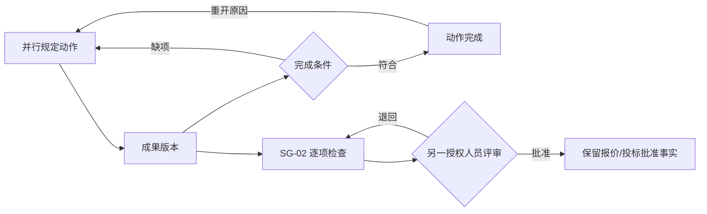

# 售前规定动作与报价评审单功能需求规格说明书

> SPEC-PS-02 · v0.1 · 2026-09-12 · ready-for-implementation  
> Owner：Lusice；作者：Codex；来源：[PRD](../PRD.md) PS-02～PS-05；[WI-008](../../development-testing/work-items/WI-008-business-delivery.md)。

## 1. 功能概览

售前成员在项目空间并行维护调研、需求、方案、估算、报价、投标及技术交底准备；对外报价/投标前通过 SG-02。规定动作不是宏观阶段。

## 2. 功能范围与产品设计

七项初始规定动作作为项目模板快照创建；使用 draw-ui 的宽动作列表及较窄评审栏。每项有负责人、目标日期、状态、说明及版本成果。取消动作需要理由，已完成可重开；不以严格串行步骤条表达。成果保留类型、版本、适用范围、评审结论和当前有效状态。

## 3. 流程说明与流程图

成员指定动作责任和时间，记录进展并提交成果。完成需要成果或明确无需成果的说明。成果修订添加新版本，旧版本保留。SG-02 提交时逐项记录技术、范围、工程量/估算、价格授权、交付约束、假设风险及最终版本的检查依据；另一名审核人批准或退回，历史保留。

## 4. 特殊业务规则

1. SG-01、SG-02、成功结果、合同签署互相独立；SG-02 不自动改变商机成功结果。
2. 计划和草稿可在 SG-01 前准备，实际投入须按 PS-01 检查。SG-02 需要 SG-01 有效批准及明确最终版本。
3. 已批准成果不原位覆盖；重开动作、产生更新成果会令旧 SG-02 对新版本不再有效，须重新评审。

## 5. 页面与状态说明

动作：NOT_STARTED/IN_PROGRESS/BLOCKED/COMPLETED/SKIPPED。成果：DRAFT/IN_REVIEW/APPROVED/SUPERSEDED。SG-02：DRAFT/SUBMITTED/APPROVED/RETURNED。页头保留项目四类事实，状态附文字；未选记录、无成果和失败各有可恢复说明。

## 6. 查询条件

项目、动作状态、负责人、目标时间；成果按动作与类型筛选。状态页签写入 URL。

## 7. 列表与状态字段

动作名称、状态、负责人、计划完成、当前成果、更新日期；评审栏显示 SG-01/SG-02 状态和待补条件。成果列表显示标题、类型、版本、范围、评审说明、状态和登记人。

## 8. 表单字段

动作维护：负责人、目标日期、状态、说明；完成/跳过/重开原因必填。成果：标题、类型、适用范围、成果正文或已上传文件引用、版本说明必填。SG-02：七项检查及证据、最终成果版本集合、评审意见。

## 9. 交互、提示与异常

动作可单独保存，失败不影响其他动作。提交中冻结按钮；缺字段逐项标出；过期版本 409 保留草稿；已关闭空间隐藏编辑并由服务端再次拒绝。权限不足时不返回无权成果正文。

## 10. 数据、权限与边界

Presales Module 管 `presales_action`、`presales_deliverable`、`presales_quote_review`。ProjectDirectory 提供成员和可写状态；文件引用由资料模块校验。读、编辑、复核分开授权。成果正文仅保存用户主动填写的业务说明。

## 11. 功能详细设计

遵守 [共享契约](../../technical/designs/shared/BUSINESS_DELIVERY_CONTRACT.md)。项目创建事务调用售前公开接口初始化动作快照。`GET /api/projects/{id}/presales` 聚合；`PATCH /actions/{actionId}` 携版本；`POST /actions/{actionId}/deliverables` 追加成果；`POST /quote-reviews` 提交七项依据及快照；`POST /quote-reviews/{reviewId}/review` 批准/退回。动作与成果归属必须匹配当前项目；项目锁保护成果版本递增与 SG-02 快照校验。图像为设计参考，代码使用 AntD Table/Form/Drawer，数据来自真实 API。

## 12. 测试设计与验收标准

验证不同动作同时进行、重开保留历史、成果版本单调且旧版不丢失；SG-02 缺项不能提交，自审拒绝，退回和重提留历史；成果变化后不能复用旧评审；关闭/越权/跨项目 ID/并发均被拒绝；真实页面完成动作与成果提交。

## 13. 待确认问题

各公司项目类型适用动作和成果模板待试点配置；首批明确的七项保持快照，不将新配置自动套入已有项目。

## 14. 变更记录

v0.1：按 PRD 冻结首批并行动作、版本与评审闭环，2026-09-12。
