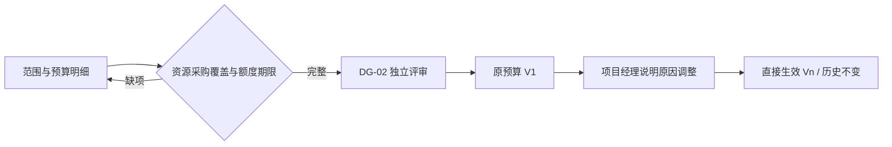

# 实施预算基线（SPEC-BG-01）

> 版本：v0.1；Owner：Lusice；作者：Codex；2026-09-13  
> PRD：4.13；状态：ready-for-implementation；WI-010。

## 1. 功能概览

P0；原项目“实施预算”，由有权项目经理整理范围、工作包、资源和采购预算，经 DG-02 形成批准基线。

## 2. 功能列表

全范围/分阶段预算、分类明细、资源/采购映射、总额与授权上限、首段期限/后续补齐、敏感隔离、V1 及直接生效修订。金额是预算，不替代采购申请、付款计划或实际支出。

## 3. 流程说明与流程图

项目经理选择全范围或分阶段，填写批准范围、金额及明细关联；预检核对资源和关键采购覆盖。独立 DG-02 评审批准原预算 V1。之后项目经理说明原因、依据和影响，直接产生有效新版本，同时保留 V1 和旧版。

无预算权限只展示受限说明；分阶段授权过期或后续范围未批准时不得借总预算推断执行许可。

## 4. 特殊业务

币种 CNY，精确非负两位小数，每行上限 999999999999.99。至少一行且总额>0；汇总以明细求和，不独立手填。预算映射实际阶段/工作包、人员资源请求或采购清单；已知关键需求不能漏掉。PHASED 必填首批阶段和范围、上限、有效截止、后续补齐日与后续范围，首批明细不超过上限；FULL 覆盖全部适用范围。不假设公司审批金额阈值，按已发布评审规则选择适用路径。

## 5. 页面 / 状态说明

草案/冻结/批准 V1/当前修订；紧凑分类条形图与明细表来自同一精确求和。无权限响应不含金额、费率、预算正文或敏感快照。

## 6. 查询条件

类别、阶段、工作包、资源/采购关联、版本。

## 7. 列表字段 / 状态字段

范围模式、批准范围、金额总计、期限/补齐日；行名称、类别、金额、阶段、工作包、资源/清单、依据、版本。

## 8. 表单字段

头：mode（FULL/PHASED）、scope（4000）、authorizedStageIds、authorizedCap、expiresOn、nextCompletionOn、remainingScope（4000）。行：title（160）、category（PERSONNEL/PROCUREMENT/SUBCONTRACT/TRAVEL/OTHER）、amount、stageId、workPackageId、resourceRequestId/itemId（按关联需求必填）、basis（4000）。修订必填原因、影响、依据，当前版本与 requestId。

## 9. 交互说明

金额输入明确人民币；保存后服务端返回精确分类总计。评审页敏感投影一致，浏览器不预装隐藏金额。修订显示前后差异，失败不丢输入。

## 10. 提示说明

“当前账号没有预算明细查看权限。”“关键采购/资源需求尚未覆盖。”“首批预算超过授权额度。”“请填写后续补齐节点。”

## 11. 异常处理

负数/小数精度/超限/跨项目引用拒绝；无敏感写权 403；冻结或版本冲突 409；事务失败不部分更新总额或主阶段。

## 12. 数据记录

类型化预算头/行、精确金额、映射、当前版本；不可变评审/V1/直接修订快照和替代关系。历史保存完整敏感事实，输出仍逐字段授权；审计摘要仅动作与版本。

## 13. 权限与边界

DELIVERY_BUDGET_READ/EDIT 独立于 DG2_READ/EDIT；编辑还需实际项目经理责任。最终审批和财务会签需要必要预算可见权限，但查看金额不带来审批权。其他角色只看到授权范围。

## 14. 验收标准

精确总计、全范围/分阶段覆盖、额度和日期、资源采购映射；无权 JSON 不含金额；独立审批/冻结；直接修订新版本且 V1 不变；不产生财务实际。

## 15. 待确认问题

具体公司授权金额、重大预算变更复审阈值待配置，系统不预置推测规则。

## 16. 变更记录

v0.1｜Codex｜预算范围、敏感权限与版本｜2026-09-13。
