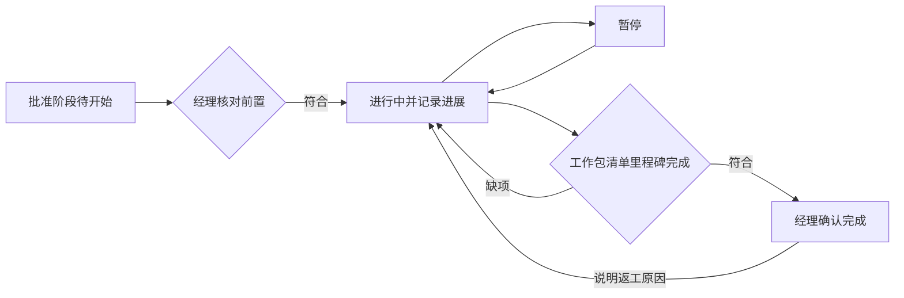
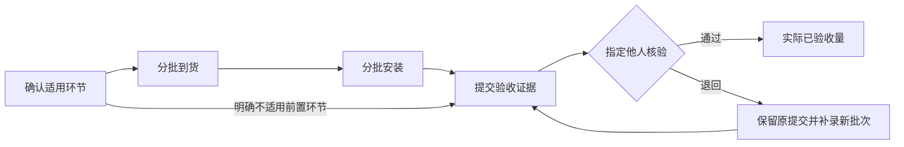

# 项目执行事实（SPEC-EXEC-01）

> 版本：v0.2；Owner：Lusice；作者：Codex；2026-09-13  
> PRD：2.2、5、AC-16；BRD：5、9、10；状态：本地实现与验证通过；待非作者评审；WI-011。

## 1. 功能概览

P0；项目经理、阶段/工作包负责人和指定验证人从原项目阶段、里程碑、清单及原工作包进入。前提是同一项目已形成 DG-02 批准基线、主阶段为交付。执行记录引用原对象，不复制第二套阶段/清单/工作包。

## 2. 功能列表

阶段实际状态与进展、清单适用环节与分批事实、独立数量验收、里程碑实际完成与验证、原因明确的冲回/重开、计划实际对照及原始文件版本。执行采用追加事实和独立状态；不通过编辑基线字段制造实际，不从计划日期推断完成。任务分解、周滚动/工时、报告会议、风险深化、经营实际及通知投递由接续规格实现。

## 3. 流程说明与流程图

### 3.1 阶段执行

经理核对当前批准范围和前置阶段后开始阶段；当前阶段负责人登记进展、实际日期与依据，经理可暂停/恢复。完成时核验本阶段当前工作包已独立完成、清单已达到批准验收数量、里程碑已验证，再记录经理确认。进度百分比是负责人报告，100% 只能由通过完成检查的命令形成，不由任务比例自动代填。需要返工时经理说明原因重开，原完成事件保留。

### 3.2 清单执行与验收

经理先明确此清单适用到货、安装哪些环节及必要说明。负责人按实际日期和数量登记；同一项支持多批，每次保存原批准版本和证据。到货/安装即时记录；验收先提交给指定其他人，指定人复核当时证据和当前范围后确认或退回。待验证数量也占用可验收数量，防止多人重复提交超量。

### 3.3 更正与重新验证

实际记录有误时不能覆盖原数量；有权人说明原因冲回整条原记录，原记录和反向关系均保留。涉及已安装、待验收或已验收数量时，先处理相应下游；已完成里程碑或阶段须先明确重开。补录正确事实使用新记录，不产生财务付款或会计冲销。里程碑重开后原验证历史保留，新提交再次指定独立验证。

## 4. 特殊业务

1. 实际日期允许补录，但不晚于当前业务日期；实际起止顺序合法，不能用未来计划日期记实际。经理手动设置的开始/暂停/恢复/完成都留日期、说明和责任，不据日历自动推进。
2. 适用的前置阶段未完成时拒绝开始新阶段；并行关系仍按已批准对象执行，不能用执行入口跳过已批准前置。阶段不适用/跳过、新增或范围变化沿用成组范围提案，执行页深链过去。
3. 适用环节由经理显式保存：可不要求到货/安装，若需要安装但不要求到货可表示现场已有设备；必须说明依据。存在有效实际记录后不得改适用性来绕过数量顺序。品牌/型号/供应商作为现场资料保存，变化留痕；不在此登记采购价格。
4. 所有数量正数、最多两位小数。净到货/安装/已验收/待验收均不得超过批准数量；需要到货时安装和验收不超过净到货，需要安装时验收不超过净安装。冲回后仍须满足这些关系，不能以负数输入代替冲回。
5. 当前阶段暂停、已完成或项目暂停/关闭时停止新增正式执行事实。计划准备和只读追溯继续可见；经理可在允许状态办理恢复或重开。已有提交的独立核验可在阶段暂停时完成，但不能扩大提交数量和范围。
6. 里程碑提交前核验关联当前工作包与清单，实际日期、完成证据、指定验证人必填；指定人不得为该次提交者或当前里程碑负责人。当前范围与证据失效时拒绝通过，允许退回补录。里程碑实际不会自动写合同节点或确认收入。
7. 工作包提交完成仍由实际负责人、指定他人验证。P3 开启后新增提交需阶段处于执行中；已有 DONE 不追溯补造阶段开始事件。历史已完成的工作包在当前只读汇总中显示原完成事实。
8. 范围生效时不能停用有有效执行事实或未结执行关系的原对象，清单数量不能低于已有净实际和待验收。改变已核验范围/验收条件时，当前关联清单、工作包的实质依据纳入阶段/里程碑完成摘要，受影响结果显示需重新核验，不能把旧结论贴到新版本。责任换任保留实际操作者，并纳入待验证责任交接。

## 5. 页面 / 状态说明

阶段：未开始、进行中、暂停、已完成；跳过是批准范围适用性的显示，不伪造完成。里程碑：未提交、待验证、已验证、需重新核验。清单事件：已记录、待验证、已验证、已退回、已冲回；冲回记录单独引用原记录。列表同时显示批准版本、原计划/当前计划、实际和差异；不存在的实际用“尚未发生”。

## 6. 查询条件

阶段按名称/负责人/实际状态；清单按类别/工作包/阶段/到货安装验收状态；事件按类型/状态/日期；里程碑按计划范围/责任/验证状态。列表分页，长历史按需展开；所有结果先经源项目读取权限过滤。

## 7. 列表字段 / 状态字段

阶段：名称、重点、当前计划窗口、前置、负责人、实际状态、报告进度、实际起止、完成缺项。清单：规格/数量/单位、工作包、适用环节、净到货/安装/验收/待验收、供应商、最近事件。里程碑：计划日、关联范围、实际日、提交人、指定验证人、核验结论。记录详情显示当时版本、证据、附件版本、操作人和时间。每轮里程碑提交的原附件版本进入不可变前后快照；当前资料后续更新不覆盖旧依据，查询按当前文件读取权投影。

## 8. 表单字段

所有命令含 requestId、当前执行 version（首次为 -1）、当前对象版本；对象引用仅同项目。stage：action、occurredOn、note（4000）、progress（0–99，仅进展）。itemProfile：requiresReceipt、requiresInstallation、brand/model（160）、supplier（240）、reason（2000）；itemEvent：kind、quantity、occurredOn、evidence（4000）、fileVersionIds（0–20）、verifierId（验收必填）；decision：action、note（4000）；milestone：occurredOn、evidence、fileVersionIds、verifierId。文件引用服务端验证归属与实际可读发布版本，不能提交任意外部 URL 代替受控文件。

## 9. 交互说明

固定项目页先显示紧凑事实条，再按阶段/清单组织计划实际对照与最近事件；主操作随本人职责与当前状态显示。桌面双列详情、窄屏单列；分批记录和历史表放入局部滚动容器。操作前显示当前对象、数量余量、前置缺项和独立验证人；失败保留输入，成功刷新原源对象与汇总。只读抽屉没有保存按钮，取消不保存。

## 10. 提示说明

“请先通过 DG-02，在原批准范围下记录执行。”“前置阶段尚未完成。”“当前验收数量超过可验收余量。”“已有下游记录，请先处理对应安装或验收。”“批准范围已变化，请重新核验。”“只有指定的其他验证人可以确认。”“记录已冲回，原事实仍保留。”

## 11. 异常处理

跨项目/无权读取返回 404；动作权限不足 403；版本、状态、范围变更和数量并发冲突 409；字段/日期/引用错误 400。项目锁串行化基线与实际命令，失败整个事务回滚；重放返回同一次结果且不重复数量。文件或人员不可核验时提交/通过受阻，已有历史按读取权限显示最小信息。

## 12. 数据记录

执行状态/清单资料引用原项目与原对象 UUID；事件保存当时对象/基线版本、日期、数量、证据引用、操作者、提交/验证/冲回关系及前后状态。不更新原 DG-02 快照。基线公开只读目录不含预算/内部费率等财务正文；执行模块不跨模块读取仓库，利用公开接口与事务内事件协作。

## 13. 权限与边界

注册 DELIVERY_EXECUTION_READ / EDIT / REVIEW / MANAGE 并叠加实际项目成员和源对象读取权限。MANAGE 仅实际项目经理可控制阶段和适用性；EDIT 限经理或当前阶段/工作包负责人；REVIEW 还要求当前指定验证人、启用成员和独立性。工作包原有 WORK_EDIT/WORK_REVIEW 不被替代。角色配置遵守原委派上限，不因新模块自动赋予公司批准权。敏感文件深链每次重新授权，不从历史摘要泄露标题或内容。

## 14. 验收标准

1. 同 ID 基线接续，阶段前置/暂停/恢复/完成/重开和实际日期检查可复现；旧 DONE 与所有批准快照不改写。
2. 至少两批分数量到货/安装/验收，累计、待验收预留与冲回守恒；并发超量、上游错误冲回拒绝且整笔回滚。
3. 指定独立里程碑/清单验收通过与退回，停用/撤权/源变更立即影响新命令。
4. 范围修订不会删除有实际的对象或使净数量超批准范围，受影响验证显示需重核；未结执行验证责任可交接。
5. 桌面与 390px 实际浏览器、多账号/API、重放/并发/跨项目、全新库迁移和重启读回通过。

## 15. 待确认问题

公司特定专业验收模板及 DG-03 起各专项阶段门仍需接续细化，不从本地示例推定公司制度。采购申请与付款计划的触发顺序继续等待此前问题答复，不影响本功能记录已发生的物理交付事实。工时不换算成本或薪酬。

## 16. 变更记录

v0.1｜Codex｜细化 P3 原阶段、清单与里程碑执行及核验边界｜2026-09-13。

v0.2｜Codex｜实现依赖范围重核、各轮原文件版本、指定核验职责交接及原项目筛选；本地验收见 [ACCEPT-011](../../development-testing/accept/ACCEPT-011-project-execution-local.md)｜2026-09-13。
