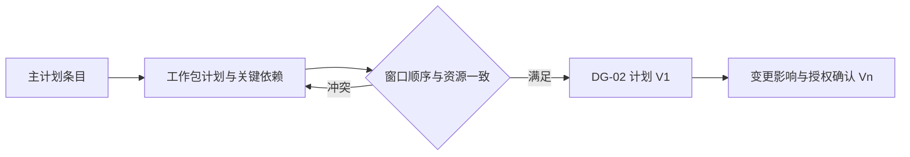

# 项目主计划与工作包计划（SPEC-PL-01）

> 版本：v0.1；Owner：Lusice；作者：Codex；2026-09-13  
> PRD：4.13；状态：ready-for-implementation；WI-010。

## 1. 功能概览

P0；原项目“里程碑/主计划”展示阶段和工作包的完整交付窗口、依赖与资源约束。

## 2. 功能列表

主计划、工作包计划、关键依赖、交付窗口、资源约束、版本差异与受控范围调整。采用日期轴加表格，保存真实日期和关系，不自动生成未经确认的执行计划。

## 3. 流程说明与流程图

项目经理组织主计划，负责人补齐各包计划并关联同项目阶段和里程碑。预检核验窗口包含、依赖无环、前后顺序及资源约束；DG-02 后保留 V1，实质计划变化经授权确认发布当前版本。

并行阶段可重叠，依赖顺序不能以并行标记绕过。计划变化不自动修改合同节点。

## 4. 特殊业务

至少一个主计划条目，每个适用工作包至少一个对应计划。所有日期 start≤end，包计划处于主计划和所属阶段窗口；节点在相关计划内。依赖引用同项目有效计划、禁止自身和环；完成到开始关系要求前项结束≤后项开始。关键资源冲突引用资源处理结论，不可仅填“无冲突”替代承诺事实。

## 5. 页面 / 状态说明

草案/冻结/V1/当前修订；显示原计划和当前差异，P3 实际另列。时间轴按日期计算，表格提供精确日期与键盘操作。

## 6. 查询条件

计划类型、阶段、工作包、日期范围和版本。

## 7. 列表字段 / 状态字段

条目、类型、所属阶段/包、起止日、交付窗口、前置依赖、资源约束、差异、版本。

## 8. 表单字段

title（160）、kind（MASTER/WORK_PACKAGE）、stageId、workPackageId（包计划必填）、startsOn/endsOn、deliveryWindowStart/End、dependsOnIds、resourceConstraints（4000）；版本/原因必填，后续提案增加依据与影响。

## 9. 交互说明

编辑抽屉保留准确日期，时间轴只作辅助；依赖冲突定位到两条原计划。提交期间所有关联计划冻结，退回原 ID 编辑。

## 10. 提示说明

“工作包计划超出主计划窗口。”“前置计划晚于本计划开始。”“请补齐资源约束和处理依据。”

## 11. 异常处理

日期/环/跨项目错误 400；并发或冻结 409；未经授权的范围修订不生效。

## 12. 数据记录

稳定计划 ID、类型化关系/日期、当前版本、不可变评审/V1/后续快照、变更影响和替代关系。

## 13. 权限与边界

DG2_READ；项目经理维护主计划，包负责人仅维护自己包计划且需 DG2_EDIT；负责人不能切主阶段。批准后实质变化独立授权确认。

## 14. 验收标准

日期窗口、无环与依赖、并行合理性、每包覆盖、资源关联；提交冻结；同 ID V1 和版本比较；越权修改他人包被拒绝。

## 15. 待确认问题

重大计划变更触发 DG-02 复审的阈值待公司配置，不自动回退项目。

## 16. 变更记录

v0.1｜Codex｜主计划与工作包计划一致性｜2026-09-13。
