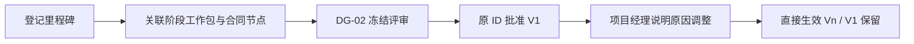

# 项目里程碑（SPEC-MS-01）

> P3 接续：原对象的实际执行、独立验收、冲回/重开与执行职责交接见 [SPEC-EXEC-01](project_execution_spec.md)，本文件继续定义批准基线。

> 版本：v0.1；Owner：Lusice；作者：Codex；2026-09-13  
> PRD：4.13；状态：ready-for-implementation；WI-010。

## 1. 功能概览

P0；项目经理在原项目“里程碑/主计划”维护合同、验收和关键交付日期，关联阶段、清单、工作包和主计划。

## 2. 功能列表

草案、合同节点引用、验收条件、V1 基线、项目经理调整的直接有效新版本与历史比较。里程碑是计划，不代表实际验收或收入。按 PRD 采用必填原因的直接调整，不引入额外审批流。

## 3. 流程说明与流程图

项目经理从移交依据登记里程碑，填写责任、计划日期、验收条件与源合同节点。预检检查同项目关系及日期，DG-02 通过标记原对象 V1；之后调整保存原因、影响和依据，产生替代版本并通知受影响责任人。

日期或引用错误回到原表单；评审期拒绝修改；退回恢复同对象编辑。

## 4. 特殊业务

至少一个合同/验收/关键交付里程碑；源合同节点必须同项目且可核验。若采用中标/委托/提前开工移交依据而无合同，合同节点可空但来源说明必填；不伪造合同。日期位于有效计划范围且能追溯关联对象。调整实际不直接修改合同约定节点，差异须明示。

## 5. 页面 / 状态说明

草案、评审冻结、批准基线、当前有效修订；列表与时间轴共用数据源，原计划/当前计划/实际预留独立列，未发生实际不填零或完成。

## 6. 查询条件

名称、类型、负责人、日期范围、基线版本。

## 7. 列表字段 / 状态字段

名称、类型、计划日、责任人、阶段、合同节点/来源、验收标准、关联工作包/清单、对象版本、基线版本。

## 8. 表单字段

title（160）、kind（CONTRACT/ACCEPTANCE/DELIVERY）、dueDate、ownerId、stageId、contractNodeId（可空）、sourceNote（2000）、acceptanceCriteria（4000）；修改携带版本和原因（2000），批准后影响（4000）、依据（4000）必填。

## 9. 交互说明

从日期轴打开原对象，查看源节点而不复制金额。修订前展示日期与关联对象差异，成功刷新主计划检查。取消不保存。

## 10. 提示说明

“里程碑超出计划范围。”“合同节点不属于此项目或不可核验。”“调整会生成新的有效版本，原基线保留。”

## 11. 异常处理

版本/冻结 409，输入/引用错误 400，无权记录 404；整个修订和审计同一事务，不部分生效。

## 12. 数据记录

稳定 UUID、当前版本、来源引用；DG-02 快照、V1、直接修订前后快照、原因/依据/影响/操作者/生效时间/替代关系。源合同仍由合同模块管理。

## 13. 权限与边界

读取 DG2_READ；草案维护 DG2_EDIT 加实际责任；批准后直接调整限有权项目经理。合同敏感信息另需原权限，不因里程碑阅读泄露金额。

## 14. 验收标准

有/无合同两类有效来源、跨项目拒绝、日期关系、评审冻结、原 ID V1、修改后旧日期可追溯、实际验收不被自动制造；版本并发和权限验证。

## 15. 待确认问题

具体节点内容由项目录入，不新增公司通用审批阈值。

## 16. 变更记录

v0.1｜Codex｜P2 里程碑与直接生效修订｜2026-09-13。
