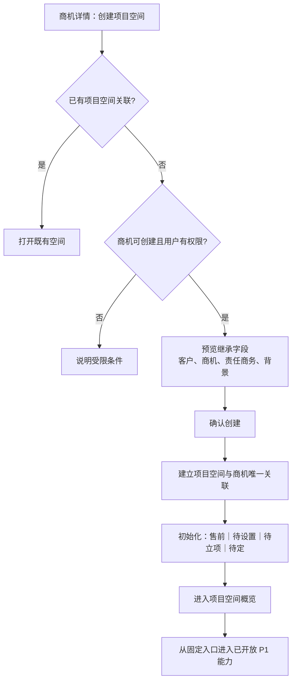
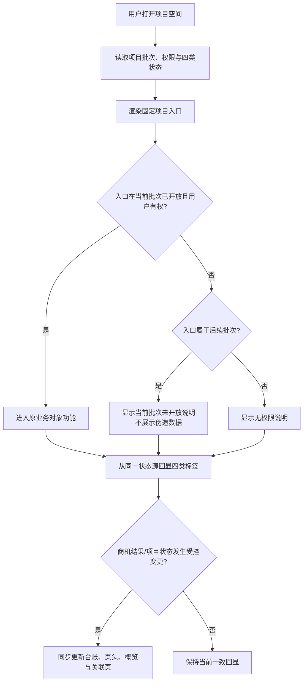

# 项目空间单功能需求规格说明书

> 文档信息  
> 版本：v0.2 本地实施基线  
> Owner：项目负责人  
> 作者：Codex  
> 最后更新：2026-09-12  
> 所属 PRD：[PRD V0.4](../PRD.md)  
> 功能路径：项目中心 / 项目空间  
> 状态：ready-for-implementation（WI-008 本地范围）

## 1. 功能概览

| 项目 | 内容 |
|---|---|
| 功能名称 | SPEC-PW-01｜项目空间、固定入口、状态回显与售前协同容器 |
| 优先级 | P1 |
| 使用者 | 责任商务、售前负责人、项目参与者、商务/管理负责人、按授权查看者 |
| 入口位置 | 商机详情的“创建/打开项目空间”；项目中心 / 项目台账；工作台待办或消息深链 |
| 前置条件 | 已有唯一商机、客户主档、可用账号和角色基础；正式售前需要从商机发起 |
| 相关模块 | 商机、客户、售前立项、售前规定动作、需求池、项目资料、项目成员、资金摘要、角色权限、工作台 |
| 相关文件或流程 | PRD-PW-01～PW-05、PRD 第 2.2/2.3/3.1、[商机主档 SPEC](opportunity_master_spec.md)、[前端组件规范](../../technical/designs/frontend/FRONTEND_COMPONENT_STANDARD.md) |

## 2. 功能范围与产品设计

### 2.1 功能列表

| 序号 | 功能点 | 功能描述 | 优先级 |
|---:|---|---|---|
| 1 | 从商机创建空间 | 仅从原商机发起；继承客户、商机、责任商务和已有背景，建立一对零/一稳定关联 | P1 |
| 2 | 项目空间台账 | 在项目中心按客户、责任、主阶段、重点阶段、状态、业务结果和关键行动查询项目空间 | P1 |
| 3 | 空间页头与概览 | 显示空间身份、来源商机、客户、责任商务、售前负责人、四类状态和当前协同摘要 | P1 |
| 4 | 固定项目入口壳层 | 为项目概览、阶段、里程碑、清单、需求、资金、风险、问题、例会、报告、成员和资料保留稳定入口，并按批次开放 | P1 起持续 |
| 5 | P1 入口状态 | 只开放当前 P1 已有业务能力的链接/占位说明；P2/P3/P4 不提前展示伪造表单或执行数据 | P1 |
| 6 | 双责任呈现 | 同时呈现责任商务与售前负责人；允许同一人兼任，并保留后续成员与角色关联边界 | P1 |
| 7 | 四类状态一致回显 | 在台账、页头、概览、关联商机与后续分析中并列使用主阶段、当前重点阶段、项目状态、业务结果 | P1 |
| 8 | 售前协同可见性摘要 | 对参与项目的责任商务与售前负责人提供受权的资金计划/实际摘要、风险、问题、成员入口；敏感明细默认隐藏 | P1，详情由对应 SPEC 定义 |

### 2.2 背景与目标

项目空间不是新建的业务层级或第二套项目主档，而是将从商机进入正式售前后的人员、资料、需求、阶段门和后续交付连续聚合到同一个协作容器。它可以在合同签署前存在，并在后续批次持续沿用；若另建“售前项目”和“交付项目”，会造成客户、商机、资料和责任的断裂。

本功能的目标是提供一个稳定、可识别的空间壳层：用户从唯一商机创建空间后，可在固定入口中持续找到当前阶段的工作；空间台账和页头能够清楚区分主阶段、当前重点阶段、项目状态和业务结果；责任商务与售前负责人既可同人也可不同人，并在用户可见范围内体现协同责任。P1 只开启售前所需的实际能力，其余入口保持稳定但不伪装成已交付功能。

### 2.3 方案取舍

| 方案 | 内容 | 结论 | 原因 |
|---|---|---|---|
| 从商机创建同一项目空间 | 在商机详情中继承既有事实并创建唯一空间 | 采用 | 保持客户、商机、责任和后续交付连续性 |
| 从项目中心空白新建空间 | 脱离商机直接填写项目资料 | 不采用 | 会造成平行主线并丢失前序采购事件上下文 |
| 售前与交付各建一个空间 | 不同阶段切换到新空间 | 不采用 | 与 PRD“同一空间贯穿售前、交付和维护”冲突 |
| 固定入口持续存在、能力渐进开放 | 项目导航长期稳定，未开放能力解释批次边界 | 采用 | 用户不必在 P2/P3 重学入口，也不提前实现后续模块 |
| P1 预览 P2/P3 的假表格和流程 | 用演示数据填满未实现入口 | 不采用 | 会模糊批次承诺，并误导用户以为功能可用 |
| 把四类状态折叠为一个进度条 | 只显示“项目进行中/已完成” | 不采用 | 主阶段、重点阶段、状态和业务结果回答不同问题，PRD 要求独立回显 |
| 默认公开完整成本/利润 | 所有参与人查看所有财务明细 | 不采用 | PRD 要求成本、采购价格、利润和内部费率默认受限 |

### 2.4 产品形态与范围边界

项目空间是选定浅色工作台风格的主要承载页：全局白色左栏提供一级模块导航；顶部紧凑显示面包屑、可关闭的对象页签、搜索和个人操作；内容画布为低饱和浅蓝灰。空间内页头是一张克制的白色信息卡，左侧为项目名称、客户和来源商机，右侧为“主阶段｜当前重点阶段｜项目状态｜业务结果”四枚清晰文本标签；绝不把四项塞进一条模糊进度条。

页头下方用两列布局：左侧为概览和当前协同重点，右侧为责任人、当前行动与提醒摘要；项目内的稳定入口以次级横向导航或侧栏呈现。入口在视觉上都可发现，但未开放能力只显示真实的“当前批次未开放/依赖某 SPEC”空态和说明，不能出现可填写的后续预算、甘特、执行任务或经营事实。背景卡片使用细边框、适度圆角、淡蓝图标承载信息，强调可扫描台账而非营销化大图。

本 SPEC 负责空间容器、入口壳层和跨页面状态表达。SG-01、售前动作、需求、资料、DG-01、合同、P2 团队/阶段/计划/预算以及 P3/P4 执行/经营各自由相应 SPEC 定义；本页只承接入口、摘要、权限与跳转，不重复实现这些业务对象。

## 3. 流程说明与流程图

### 3.1 主流程：从商机创建并进入售前项目空间

责任商务或有授权人员在商机详情中确认需要正式售前支持，选择创建项目空间。系统检查该商机不存在既有关联空间、用户具有发起权限且商机可创建；通过后创建持久空间，继承客户、商机、责任商务和已有背景。空间初始主阶段为“售前”、项目状态为“待立项”、业务结果为“待定”；当前重点阶段如尚未配置则明确显示“待设置”，不以 SG-01 或售前动作冒充重点阶段。用户进入空间概览后可从固定入口进入已开放的 P1 功能。

### 3.2 分支流程：固定入口的渐进开放与状态回显

用户进入任一项目空间后，系统先根据项目当前批次、用户权限和对象状态渲染固定入口。已由 P1 SPEC 实现的入口进入实际功能；后续入口保留位置和简短边界说明，不创建可提交数据的伪页面。空间台账、页头、概览和关联商机都从同一状态源读取四类字段；发生关闭或业务结果变化时，只有受控商机结果流程可以更新相关字段，空间仅同步回显。

取消创建空间不写入任何空间或关联；网络失败时不得在商机上标记“已创建”。刷新或重新进入空间时应读取持久空间和原商机关联，不生成第二个空间。关闭、重开和业务结果更新不在本 SPEC 中提供普通编辑入口。

## 4. 特殊业务规则

1. 项目空间是持久化协作聚合实体，拥有独立标识、成员、状态、权限和子对象关系，但不新增一层平行业务主档。
2. 一条商机最多创建一个项目空间；创建只能从原商机发起，并继承客户、商机、责任商务和已有背景。
3. 项目空间创建后初始主阶段为“售前”、项目状态为“待立项”、业务结果为“待定”。“待立项”只表示等待 SG-01 售前投入立项，不等同于 DG-02 交付立项。
4. 主阶段、当前重点阶段、项目状态和业务结果必须独立存储/计算，并在项目空间台账、页头、概览、关联商机和分析中从同一事实源并列回显。
5. 当前重点阶段若尚未设置，必须显示“待设置”或等效明确空值；不得将 SG-01、SG-02、招投标、技术交底或任一售前规定动作误称为项目主阶段或当前重点阶段。
6. 项目空间同时记录责任商务和售前负责人；两者可为同一人，但职责标签和历史变更必须分别保留。售前负责人何时强制指定由 SG-01/首批配置确认。
7. 固定入口包括项目概览、项目阶段、里程碑、项目清单、需求池、资金计划、风险管理、问题管理、项目例会、日报周报、成员和项目资料。入口持续存在，子功能按 P1—P4 渐进开放。
8. P1 页面不得以示例数据、可提交表单或伪进度提前实现 P2/P3/P4 功能；未开放入口必须说明可用批次或依赖能力。
9. 责任商务和售前负责人在参与空间内可查看被授权的资金计划与实际摘要、风险、问题和成员信息；成本明细、采购价格、利润和内部费率默认不可见，除非另行授权。
10. 已关闭空间的状态与业务结果由商机结果/关闭流程同步；关闭不能自动推断业务结果，且历史投入、资料和关联对象须保留。

## 5. 页面与状态说明

| 页面 / 状态 | 说明 | 可用操作 |
|---|---|---|
| 项目空间台账 | 查询所有有权项目空间，强调客户、责任、四类状态、当前行动和入口可用性 | 搜索、筛选、打开空间、下钻商机/客户 |
| 创建项目空间确认 | 从商机带入继承字段与初始状态，不重复填写或篡改原商机 | 查看继承信息、确认创建、取消、打开既有空间 |
| 项目空间概览 | 页头、四类状态、来源关系、双责任、当前协同重点和已开放入口摘要 | 打开来源商机/客户、进入入口、查看成员/资料等有权摘要 |
| 项目入口导航 | 固定的项目概览、阶段、里程碑、清单、需求、资金、风险、问题、例会、报告、成员、资料入口 | 打开已开放入口；查看未开放说明 |
| 责任与成员摘要 | 展示责任商务、售前负责人及参与成员摘要；成员变动进入专属流程 | 查看角色、跳转成员入口、申请变更（若有权限） |
| 资金/风险/问题摘要 | 只展示当前用户被允许的汇总和入口 | 查看摘要、进入原对象（按权限） |
| 后续批次入口空态 | 保持入口位置和名称，明确说明尚未开放且不展示可提交业务表单 | 返回概览、查看依赖说明 |
| 加载 / 空态 / 无权限 / 失效访问 | 对台账、空间详情、入口和关联对象分别处理 | 重试、返回台账、申请权限、打开来源商机 |

## 6. 查询条件

| 字段 | 类型 | 内容 | 默认值 | 查询规则 |
|---|---|---|---|---|
| 关键词 | 文本 | 项目空间名称/编号、来源商机、客户名称 | 空 | 在有权空间范围内模糊匹配 |
| 客户 | 远程选择 | 已关联客户/潜在客户 | 空 | 通过来源商机关联过滤 |
| 责任商务 / 售前负责人 | 用户多选 | 两类独立责任人 | 默认当前用户相关 | 可分别筛选，也可组合查询 |
| 主阶段 | 多选 | 售前、交付、维护 | 默认售前 | 当前 P1 主要为售前；后续批次值可作为历史/预留查询 |
| 当前重点阶段 | 多选 | 已配置重点阶段或待设置 | 空 | 不用售前动作或阶段门替代 |
| 项目状态 | 多选 | 待立项、进行中、暂停、已关闭等 | 默认非已关闭 | 状态与结果独立 |
| 业务结果 | 多选 | 待定、成功、失败、客户取消、主动终止及采购方式用语 | 空 | 值由受控结果流程维护 |
| 入口可用性 | 多选 | P1 已开放、仅后续批次、无权 | 默认已开放 | 依据批次与权限计算，不持久化为项目状态 |
| 最近活动 | 日期范围 | 最近有权可见协同事实时间 | 空 | 来源于原子对象，不复制事实 |

## 7. 列表与状态字段

| 字段 | 内容 | 排序 | 显示规则 |
|---|---|---|---|
| 项目空间 | 名称、稳定编号和入口链接 | 支持 | 名称主视觉；编号次级显示 |
| 来源商机 / 客户 | 唯一商机和客户主档引用 | 支持 | 两者可下钻，按对象权限分别校验 |
| 责任商务 / 售前负责人 | 两个独立责任人 | 支持 | 并列展示；同一人时保留两个职责标签，不合并成一个角色 |
| 主阶段 | 售前、交付、维护 | 支持 | 文本标签，与其余三项并列 |
| 当前重点阶段 | 当前重点或待设置 | 支持 | 空值明确显示“待设置”，不做猜测 |
| 项目状态 | 待立项、进行中、暂停、已关闭等 | 支持 | 不与业务结果合并 |
| 业务结果 | 待定、成功、失败、客户取消、主动终止等 | 支持 | 采购方式可改变显示用语，但不改变稳定事实 |
| 当前协同重点 | 最近行动/阶段门/待办摘要 | 支持 | 来源可点击下钻；不伪造成统一任务对象 |
| 入口状态 | 当前批次的已开放/后续/无权摘要 | 否 | 只描述能力可用性，非项目业务状态 |
| 最近活动 | 最近可见事实时间 | 支持 | 详情可查看来源对象 |

## 8. 表单字段

| 字段 | 类型 | 内容 | 默认值 | 格式规则 |
|---|---|---|---|---|
| 来源商机 | 只读关联 | 创建空间的唯一商机 | 从发起页带入 | 必填且不可在创建后改为另一商机 |
| 客户 | 只读关联 | 来源商机关联的客户主档 | 从商机继承 | 必填；客户合并后解析至主档并保留历史 |
| 项目空间名称 | 单行文本 | 用于识别协作空间的名称 | 从商机主题建议生成 | 必填；命名规则待配置；不能用名称替代来源商机 |
| 责任商务 | 只读/受控选择 | 商机责任商务 | 从商机继承 | 初始必须继承；后续变更保留与商机责任的差异说明 |
| 售前负责人 | 用户选择 | 对售前成果负责的人员 | 可由创建人/配置建议，未确定时显式待指定 | 可与责任商务相同；何时必填由 SG-01/配置决定 |
| 已有背景 | 只读摘要＋补充说明 | 商机中已录入的背景、最近事实或附件引用 | 从商机继承 | 不复制为独立矛盾版本；补充须注明来源 |
| 主阶段 | 只读状态 | 售前 | 售前 | 创建确认不可编辑；后续由受控阶段流程更新 |
| 当前重点阶段 | 只读/受控选择 | 当前重点阶段或待设置 | 待设置 | 不允许选择售前动作或阶段门代替 |
| 项目状态 | 只读状态 | 待立项 | 待立项 | 创建确认不可编辑；后续由受控流程更新 |
| 业务结果 | 只读状态 | 待定 | 待定 | 由商机结果流程维护，不在普通编辑中改写 |
| 成员摘要 | 只读/跳转 | 初始参与人及角色摘要 | 责任商务与售前负责人相关 | 具体成员增删和历史由专属流程定义 |

## 9. 交互、提示与异常

| 场景 | 系统处理 | 用户反馈 | 是否阻塞 |
|---|---|---|---|
| 打开项目空间台账 | 加载当前有权范围与四类状态 | 骨架、筛选上下文、空态引导 | 否 |
| 从商机创建空间 | 校验唯一关联、商机状态、权限和继承字段 | 成功后打开新空间；已有空间直接跳转 | 是 |
| 售前负责人未指定 | 不静默假设为责任商务 | 显示“待指定”与下一步配置/SG-01 提示 | 取决于后续阶段规则 |
| 访问项目入口 | 按批次、权限和对象状态判断 | 已开放进入真实对象；后续显示说明；无权显示受限 | 否 / 是 |
| 四类状态显示 | 从统一状态源读取并同步刷新 | 四项并列标签，缺少重点阶段时显示明确空值 | 否 |
| 关闭/业务结果尝试编辑 | 拦截普通编辑入口，转至受控业务结果流程 | 说明关闭不等于结果、需使用独立流程 | 是 |
| 查看资金/成员/风险摘要 | 执行对象和字段权限复核 | 展示有权摘要或受限说明，不显示敏感明细 | 否 |
| 失效链接 / 服务异常 | 区分空间不存在、无权或来源关联变更，保留上下文 | 返回台账/来源商机、重试或申请权限 | 视情况 |

## 10. 数据、权限与边界

### 10.1 数据记录

| 数据项 | 来源 | 用途 |
|---|---|---|
| 项目空间（PROJECT_SPACE） | 从商机创建 | 唯一持久协作容器、独立标识和权限/子对象聚合根 |
| 商机/客户继承关系 | 创建时从原商机读取 | 维持可追溯主线和一致回显 |
| 双责任字段 | 商机继承与空间配置 | 分别记录责任商务和售前负责人 |
| 主阶段/重点阶段/状态/结果 | 受控阶段、状态和商机结果流程 | 跨台账、页头、详情、分析的同一事实源 |
| 项目成员与角色摘要 | 项目成员流程 | 空间内协同可见性和角色展示 |
| 固定入口能力清单 | 产品批次/权限配置 | 决定入口可用性，不构成业务状态 |
| 关联对象摘要 | 售前、资料、需求、资金、风险等原始对象 | 空间概览快速扫读与下钻 |

### 10.2 权限与边界

1. 创建空间、查看空间、编辑概览、查看成员、查看资金摘要和进入各固定入口是独立权限；空间可见不等于所有子对象均可见。
2. 责任商务和售前负责人在参与项目中至少可查看被授权的资金计划/实际摘要、风险、问题和成员信息；成本明细、采购价格、利润和内部费率需独立字段授权。
3. 项目成员和阶段角色共同影响实际权限；系统角色不能自动绕过项目参与或敏感数据限制，具体计算由 SPEC-IAM-02 负责。
4. 商机、客户、资料、合同和后续业务对象链接均需要在跳转目标重新校验权限；空间内存在引用不表示可见完整内容。
5. 项目成员变动、责任人换任、临时授权和关闭/重开均须保留历史，并由对应专属流程保存；本页不得用普通覆盖编辑丢失责任时间线。

## 11. 功能详细设计

WI-008 已补齐首批本地实施契约，具体约束见 11.8；公司制度配置与真实数据迁移仍需独立验证。

### 11.1 模块责任与复用边界

| 层次 | 责任 | 新增或复用 | 关联模块 / 共享设计 |
|---|---|---|---|
| 前端 | 空间台账、创建确认、空间页头、固定入口导航、概览摘要、后续入口空态 | 后续新增，复用 AppShell、Tabs、Table、Card、Descriptions、Tag | [前端组件规范](../../technical/designs/frontend/FRONTEND_COMPONENT_STANDARD.md) |
| 后端 | 从商机创建空间、唯一关联、继承快照、状态聚合、入口可用性和权限复核 | 后续新增 | 商机、角色权限、售前/资料/需求等子域 |
| 数据 | PROJECT_SPACE、商机关联、责任、状态/结果引用、成员与子对象关系 | 后续新增 | PRD 第 2.2 实体关系 |

### 11.2 前端页面与组件设计

| 页面 / 区域 | 建议路由 | 使用的共享组件 | 本功能组件 | 状态与数据来源 | 响应式 / 无障碍要求 |
|---|---|---|---|---|---|
| 项目空间台账 | `/projects` | AppShell、Breadcrumb、Card、Table、Filter、Tag | `ProjectSpaceListPage` | 空间列表、四类状态、权限范围 | 窄屏优先显示空间、客户、四类状态中的关键标签和责任人 |
| 空间概览 | `/projects/:projectId` | Tabs、Descriptions、Card、Timeline、Dropdown | `ProjectSpaceOverview`、`ProjectStatusRail` | 空间、来源商机、责任、入口、摘要 | 四类状态在窄屏仍依次可读；不压缩成仅颜色 |
| 创建确认 | 商机详情受控弹层 | Modal、Descriptions、Alert、Result | `ProjectSpaceCreateDialog` | 继承字段、唯一校验、提交状态 | 键盘焦点和重复提交防护；成功后焦点到新空间链接 |
| 项目入口导航 | 空间内次级导航 | Menu/Tabs、Badge、Tooltip | `ProjectSpaceNavigation`、`UnavailableModuleState` | 批次、权限、入口注册表 | 未开放状态语义可读，不用禁用图标代替说明 |

### 11.3 API 契约

当前冻结资源边界：项目空间台账/详情、从商机创建的预览/提交、项目空间与商机关联、四类状态聚合、双责任摘要、固定入口注册/可用性、空间概览摘要。售前、成员、资料、需求、财务、风险、问题、阶段、里程碑及关闭等对象均以其独立 API 为准；创建接口必须保证“同一商机最多一个空间”。

### 11.4 数据模型与迁移

| 对象 / 表 | 字段或关系 | 约束与索引 | 历史 / 审计 | 迁移与兼容 |
|---|---|---|---|---|
| PROJECT_SPACE | 标识、名称、来源商机、客户、责任商务、售前负责人、四类状态 | 来源商机唯一关联；客户/商机必填 | 创建、责任与状态变更留痕 | 历史项目数据映射待后续迁移设计 |
| OPPORTUNITY_PROJECT_SPACE | 商机与空间一对零/一关系、创建人/时间 | 唯一约束与外键完整性 | 不可被普通编辑断开 | 从商机创建的事实来源 |
| PROJECT_MEMBER | 空间、用户、项目角色、有效期/状态 | 成员变更须留历史 | 加入、换任、退出、交接 | 细节由成员/团队 SPEC 定义 |
| PROJECT_STATUS_SNAPSHOT | 主阶段、重点阶段、状态、结果及来源 | 同一事实源版本与时间 | 关键变更可追溯 | 需要和商机结果同步策略 |
| PROJECT_MODULE_AVAILABILITY | 入口、批次、权限/状态条件 | 非业务事实，来自产品配置 | 配置变更留痕 | 不能替代业务状态 |

### 11.5 事务、并发、幂等与失败恢复

1. 从商机创建空间、建立唯一关联和初始化四类状态必须在同一事务中完成；失败时商机不得显示已创建空间。
2. 创建请求必须使用商机唯一约束与幂等机制。并发发起时，只有一个空间可成功创建，其他请求返回既有空间。
3. 四类状态的跨页回显应来自稳定的同一数据源或版本化聚合；禁止每个页面自行推导“已关闭/成功”等结论。
4. 空间概览编辑发生并发冲突时提示刷新并查看最新值；责任变更和成员变更不得互相静默覆盖。
5. 未开放入口或子对象加载失败不得影响空间基本信息和已开放入口可访问性；错误状态可独立重试。

### 11.6 安全、权限与审计实现

| 动作 | 权限判断 | 敏感数据处理 | 审计事件 | 失败控制 |
|---|---|---|---|---|
| 创建空间 | 商机发起权限＋商机状态＋唯一关联 | 仅继承必要事实 | 发起、成功、冲突/失败摘要 | 事务、幂等、权限复核 |
| 查看空间 | 空间可见性＋项目参与＋状态 | 关联对象/字段分别过滤 | 敏感空间查看按策略记录 | 不泄露无权空间存在性 |
| 修改责任/概览 | 空间动作权限＋角色范围 | 责任信息按权限最小展示 | 前后值、原因、时间 | 版本校验与交接规则 |
| 查看资金/成员等摘要 | 项目参与＋字段/对象权限 | 默认隐藏成本、采购价格、利润、内部费率 | 敏感查看按策略记录 | 目标对象二次鉴权 |
| 访问固定入口 | 批次＋菜单/动作＋对象状态＋数据范围 | 未开放不返回伪造数据 | 可记录入口访问/拒绝 | 明确状态、可重试失败 |

### 11.7 配置、兼容与回退

- 新增配置：项目空间编号/命名规则、首批售前负责人指定规则、空间可创建状态、固定入口批次映射、当前重点阶段词典、四类状态显示用语、资金/成本敏感字段策略；
- 浏览器或客户端兼容：遵守前端组件规范；项目台账和四类状态在 320px 以上窄屏保持顺序、文字和键盘可达；
- 灰度或数据兼容：首批从真实商机创建小范围试点空间，校验继承字段、唯一约束和四类状态同步；
- 回退方式：不删除已创建空间或断开商机关系；若配置/创建错误，按受控修复建立历史说明，未开放入口可关闭而不影响已存空间。

### 11.8 WI-008 本地实施冻结（2026-09-12）

本节补齐前述资源边界的实际契约，遵守[业务共享契约](../../technical/designs/shared/BUSINESS_DELIVERY_CONTRACT.md)。售前与需求子域分别进入 [PS-01](presales_initiation_spec.md)、[PS-02](presales_actions_spec.md)、[RR-01](requirement_pool_spec.md)。

- `GET/POST /api/projects`、`GET/PATCH /api/projects/{id}`、`GET/POST /{id}/members`，成员变更包含角色、原因和项目版本。只有 POST 从原商机创建，没有空白项目入口；继承客户、商务、背景，售前负责人创建时必选且可与商务兼任。
- Project：UUID、code、opportunityId(unique)、name、salesOwnerId、presalesOwnerId、organizationUnitId、mainStage(PRESALES)、focus(NOT_SET 起)、status(PENDING_INITIATION/ACTIVE/PAUSED/CLOSED)、version、时间。客户/采购方式/业务结果从 CRM 唯一记录读出。SG-01 批准切换 ACTIVE；OM-02 事务内同步关闭/重开，保留初始立项结果。
- 创建同时初始化责任成员和售前动作快照。同一人可拥有多个职责，按唯一(projectId,accountId,roleCode)约束。项目角色授权由 IAM 保存并纳入同一中央权限决策，实际参与关系由 ProjectDirectory 提供。移除仍有未完成责任的成员被拒绝，需先交接。
- ProjectDirectory 公开 `requireReadable/requireWritable/context/participant`，其他模块不得读取项目 Repository。只读状态检查在每个子域写入的同一事务内复核。
- 固定入口按 PRD 保持；已开放概览、项目阶段中的售前协同、需求、成员；资料随资料模块交付。未开放功能只说明范围，不提供假的保存按钮、统计或演示业务数据。

## 12. 测试设计与验收标准

### 12.1 测试矩阵

| 场景 | 测试层次 | 前置数据 | 预期结果 | 关联验收项 |
|---|---|---|---|---|
| 从商机创建空间 | 集成 / E2E | 可创建且未有关联空间的商机 | 继承客户、商机、责任商务和背景；初始为售前/待立项/待定 | PRD-PW-01 |
| 并发创建 | 集成 | 两个请求针对同一商机 | 只生成一个空间，其余返回既有空间 | PRD 第 2.2 关系规则 |
| 空白新建拦截 | E2E | 直接进入项目中心 | 无可绕过商机的空白创建路径 | PRD-PW-01 |
| 双责任呈现 | 前端 / 集成 / E2E | 责任商务与售前负责人为同人/不同人 | 两项角色独立显示、可同人且历史可追溯 | PRD-PW-03 |
| 四类状态一致 | 集成 / E2E | 正常、关闭、待设置等空间 | 台账、页头、概览和关联商机使用同一事实与标签 | PRD-PW-04 |
| 固定入口批次边界 | 前端 / E2E | P1 空间 | 入口持续可见，P2/P3/P4 不展示伪表单/伪数据 | PRD-PW-02 |
| 摘要敏感权限 | 安全 / E2E | 责任商务、售前负责人、普通参与者、敏感查看者 | 摘要与成本明细分别按权限可见 | PRD-PW-05、AC-21 |
| 无权关联对象 | 安全 / E2E | 有空间访问权但无资料/合同对象权 | 链接和摘要正确受限，不泄露内容 | PRD 第 6 章 |
| 窄屏与键盘 | 前端 / 人工 | 390px、键盘导航 | 台账、页头、项目入口和未开放状态均可理解/操作 | 前端组件规范 |

### 12.2 验收标准

1. 用户只能从原商机创建项目空间；同一商机最多一个空间，创建后客户、商机、责任商务和已有背景可以追溯。
2. 新建空间初始明确显示“售前｜待设置｜待立项｜待定”，并说明待立项是 SG-01 售前投入立项而非 DG-02。
3. 项目空间台账、页头、概览和关联页面都并列显示主阶段、当前重点阶段、项目状态和业务结果，不混用或自行推断。
4. 责任商务与售前负责人同时呈现、可以同一人，并且后续变更不会丢失历史责任。
5. 项目概览、阶段、里程碑、清单、需求、资金、风险、问题、例会、报告、成员和资料入口在空间内持续存在；P1 未开放入口不出现可提交的 P2/P3/P4 功能。
6. 参与空间的责任商务和售前负责人可按授权查看协同摘要，但成本明细、采购价格、利润和内部费率默认受限。
7. 创建冲突、无权限、加载失败、失效链接和未开放入口都有清晰、可操作的反馈；页面符合已确认浅色工作台视觉方向。

## 13. 待确认问题

以下为生产制度及后续交付事项；本地初始值和安全兜底已在 11.8 及共享契约中明确，不自动推断公司最终规则。

1. ⚠️ 项目空间名称和编号的生成规则、是否允许创建后重命名、以及历史项目迁移规则由谁确认？
2. ⚠️ 售前负责人必须在创建时指定、SG-01 前指定，还是允许先以“待指定”进入空间？
3. ⚠️ 当前重点阶段的首批字典、何时可设置及其与售前规定动作/阶段门的严格边界需要谁确认？
4. ⚠️ 固定入口在 P1 的实际开放清单需与 SPEC-PS-01、PS-02、RR-01、DOC-01、成员相关 SPEC 联合排期；未开放入口的产品文案由谁审核？
5. ⚠️ 商机关闭/结果变化向项目空间四类状态同步的事件契约和异常恢复需在 SPEC-OM-02 中闭合。

## 14. 变更记录

| 版本 | 作者 | 修订内容 | 日期 |
|---|---|---|---|
| v0.1 | Codex | 基于 PRD-PW-01～PW-05 创建项目空间、固定入口、状态回显和页面设计草案 | 2026-08-26 |

| v0.2 | Codex | 按本次系统交付授权补齐 WI-008 的本地实施接口、数据与验证边界 | 2026-09-12 |
