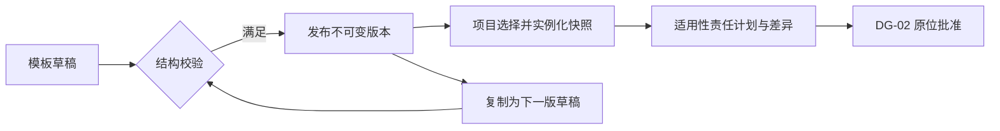

# 项目阶段与发布模板（SPEC-ST-01）

> P3 接续：原对象的实际执行、独立验收、冲回/重开与执行职责交接见 [SPEC-EXEC-01](project_execution_spec.md)，本文件继续定义批准基线。

> 版本：v0.1；Owner：Lusice；作者：Codex；2026-09-13  
> PRD：4.13 / P2 延续规则；状态：ready-for-implementation；WI-010。

## 1. 功能概览

项目空间固定“项目阶段”入口；公司模板在系统管理维护。P0。项目经理与阶段负责人把发布模板实例化为本项目适用执行阶段，DG-02 前准备、批准后原位接续。

## 2. 功能列表

版本化模板、项目快照、阶段适用性与差异、阶段责任/前置/并行/重点/完成条件、基线后的范围变更。采用固定类型模板定义，避免公司新模板静默覆盖项目；所有阶段正文由代码和数据呈现，不是图片。阶段执行事实由 P3 接续。

## 3. 流程说明与流程图

配置人员建立模板草稿并补齐阶段定义，验证代码唯一、关系合法与依赖无环后发布。项目经理选择发布版本，系统为每个阶段生成稳定 ID 并保存模板快照；逐项确认适用性、责任与日期，新增或跳过须理由。新模板发布后运行项目继续使用原快照。

已发布版本不能编辑或删除；退役仅禁止新选择。项目提交期间阶段冻结，退回后恢复编辑；批准后实质变更进入独立授权确认，不回退全项目。

## 4. 特殊业务

模板定义必选/可选/条件阶段。必选不可跳过；条件阶段保存条件及判定理由；新增阶段无模板代码但须差异理由。依赖不得引用自身、跨项目、已排除阶段或产生环；并行关系与强制顺序冲突时阻断。日期必须与主计划、里程碑一致。恰有一个适用阶段作为重点，重点不替代主阶段。模板的责任角色提示不自动授予权限。

## 5. 页面 / 状态说明

模板 DRAFT/PUBLISHED/RETIRED；项目阶段 PREPARING/BASELINED，适用与跳过分别显示。表格和紧凑日期轴展示计划关系，卡片详情承载动作/成果/完成条件。真实执行状态另行增加，不伪造开始/完成。

## 6. 查询条件

模板按名称、状态、项目类型、版本筛选；阶段按适用性/负责人筛选。

## 7. 列表字段 / 状态字段

名称、模板代码/版本、适用性、负责人、计划开始/结束、前置/并行、重点、完成条件、对象版本和基线版本。

## 8. 表单字段

模板：名称（160）、适用项目类型（至少 1）、版本说明（2000）、1–30 个阶段；阶段代码（大写字母/数字/下划线，40）、名称（80）、必选/可选/条件、条件（2000）、责任角色提示（160）、前置/并行代码列表、里程碑/动作/成果各最多 30 条（每条 300）、完成条件（2000）。项目阶段：模板代码或新增理由、适用、判定/跳过理由、实际负责人、日期、前置/并行对象 ID、重点标志、动作/成果/完成条件。正文只允许注册字段。

## 9. 交互说明

发布前显示结构问题，点击可定位；发布成功后只读，另有“创建下一版”。选模板展示阶段预览再执行明确选择；已有阶段不因切换下拉框被静默重置。长名称换行，窄屏表格容器横向滚动。

## 10. 提示说明

“请选择已发布且适用于此项目的模板。”“必选阶段不能跳过。”“前置关系存在循环。”“运行项目仍使用原模板快照。”

## 11. 异常处理

版本冲突 409；越权 403；无权记录 404；无环/引用/日期错误 400。发布重放返回同一版本；并行发布在系列锁下处理。

## 12. 数据记录

配置系列、不可变发布版本和发布人/时间；项目阶段稳定 UUID、模板版与完整快照、差异理由及对象版本。按 DG2 SPEC 保存评审/基线快照及审计。

## 13. 权限与边界

`DELIVERY_CONFIG_READ` 读取配置；`DELIVERY_TEMPLATE_MANAGE` 维护和发布模板。项目阶段叠加 DG2_EDIT 与实际项目经理/本阶段负责人范围；负责人不能改变项目主阶段。

## 14. 验收标准

草稿创建→校验→发布→项目快照；发布后不可改，下一版不覆盖旧项目；代码重复/循环/跨项目/必选跳过拒绝；提交冻结、批准原 ID、后续变更保留 V1；不同权限与桌面/窄屏验证。

## 15. 待确认问题

公司具体模板及角色名称由业务配置；不预置“已正式批准”的示例模板。

## 16. 变更记录

v0.1｜Codex｜按 PRD 细化阶段与模板发布｜2026-09-13。
