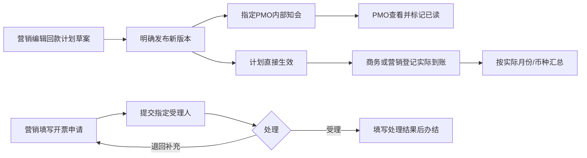

# 回款计划、实际回款与开票申请（SPEC-RCV-01）

> v0.1；Owner Lusice；作者 Codex；2026-09-13；ready-for-implementation；WI-014。  
> 事实源：BRD 12.3/12.4，PRD P4 / 4.13.5，[9 月 8 日输入](../references/2026-09-08-business-finance-notes.md)。为 FN-01 接续子域；收入沿用 INC-01。

## 1. 功能概览

项目“资金计划”进入“回款与开票”。营销按月、币种发布回款计划并知会指定 PMO；商务/营销登记已到账事实，部分到账、冲销和更正保留原依据。营销提交开票申请，指定受理人员处理，独立保存申请的流程与结果。项目管理记录不等同银行核销、会计核算或税务开票。

## 2. 功能列表

回款计划草案、发布、版本差异、弃版与历史；PMO 内部知会/本人已读；按原稳定节点分次到账与剩余金额、超计划提示；实际到账登记、文字/凭证修订、整笔冲销和更正；申请草案/提交/退回重提/受理/办结/取消；按当前权限的来源/旧文件追溯；月度币种汇总和可恢复筛选。

## 3. 流程说明与流程图

知会与计划发布在同一事务写入，重放不能重复通知。未读不阻止已发布计划生效。开票申请办结不自动生成回款或收入；现金已到账可早于或晚于所引用计划月份。

## 4. 特殊业务

1. 采用明确 ISO 币种与公历月份检索，单笔正金额最多两位小数、上限 999999999999.99，保持精确十进制，不折算汇率。实际日期不晚于上海今日；计划日期可在对应月份未来。
2. 同一项目/月/币种最多一册计划、一个草案；发布前旧有效版不变，历史版本不可覆盖；稳定节点 ID 在修订中延续。发布需原因及至少一位当前项目内、有回款读取权的“PMO知会人”；本系统不猜测公司岗位映射。
3. 计划及到账允许明确的项目其他依据；选择合同必须是同项目、已归档、签署资料有效的合同，并保存合同/经营节点版本。来源变动须重新核对，不把无合同项目假装成已签约。
4. 真实到账可分多笔关联同一已发布节点，不强制与本月计划相等，超计划只提示；无计划到账须说明原因。节点剩余按稳定节点下所有已登记净到账计算，不用未关联到账抵消其他节点；已移除节点的旧到账与历史引用保留。
5. 到账保存即记录事实，不新增公司审批环节。金额/币种/实际日期保存后冻结；可带原因修订付款方、到账方式、外部流水号、说明和资料。金额或日期错误通过整笔冲销后另建更正到账，原记录保留；一条原到账只能有一条有效整笔冲销，冲销日期不早于原日期，计入冲销实际月。冲销登记不表示系统发起银行退款。
6. 开票申请保存申请金额、币种、客户开票抬头、可选税号、要求日期、开票要求、依据、指定受理人及可选合同/回款节点。未提供税率/含税规则时不推断税額。申请金额不计入实际回款或收入。
7. 申请受理岗位通过权限配置；没有默认审批阈值或公司审批链。办结必填处理结果，可登记外部单号和已发布依据；状态明确为“申请已办结”，不表示本系统已开具税票。退回保留当轮申请，修改后重提形成新轮。
8. 当前申请负责人可撤回未受理提交；受理后不能由申请人直接覆盖；取消须保留原因及原轮。已办结只读，更正需新建关联原申请。人员退出须移交未结申请负责人/受理职责，旧提交人及处理者不替换。
9. ACTIVE/PAUSED 可维护项目管理计划或补录实际；CLOSED 只读。任何读写先校验当前权限和项目参与范围，受限合同/资料按当前权利隐藏；修改不能静默丢失原受限依据。

## 5. 列表 / 页面说明

页面头部为项目及月份/币种；紧凑汇总显示已发布计划、本月净到账、原节点尚待到账、待处理申请。主区三页签：回款节点、实际到账、开票申请；下方保留版本摘要。右侧展示逾期/待跟进节点、本人待处理申请和本人 PMO 知会。收入/预算入口互相可达，未授权部分不显示金额/数量或来源身份。

## 6. 查询条件

月份、币种；关键词；到账类型；申请状态与本人待处理；实际日期包含起止；分页 10/20/50。URL 保留筛选、选中记录、页签和版本，快速连续修改合并。汇总基于当前授权范围的整月数据，不随当前页缩减。

## 7. 列表字段 / 状态字段

计划节点：名称、原合同/项目依据、计划日期、计划金额、关联净到账、尚待金额、逾期/超计划、当前版。到账：标题、付款方、实际日期、币种金额、方式、流水引用、原节点/申请、冲销/更正链接、登记人及原资料。申请：标题、抬头、申请金额、期望日期、申请人、当前受理人、状态和本轮依据。

计划版本 DRAFT/PUBLISHED/DISCARDED；到账 RECEIPT/REVERSAL 分别正负影响，原正向到账有派生已冲销标记；申请 DRAFT/SUBMITTED/RETURNED/PROCESSING/COMPLETED/CANCELLED，完成/取消保留原记录。

## 8. 表单字段

- 计划：requestId、bookVersion/draftVersion；月份/币种；稳定 id、title、dueOn、amount、合同/节点来源及版本、sourceNote、fileVersionIds；修订说明。发布另含 PMO 知会人 ID 列表和发布原因。
- 到账：requestId、version；kind、title、amount、currency、receivedOn、payerName、channel BANK/CASH/OTHER、referenceNo、sourceNote、source、planRevisionId/lineId、invoiceRequestId/version 可空、unplannedReason、originalReceiptId/correctionOfId 可空、fileVersionIds、原因。最多 20 份当前可读发布资料。
- 申请：requestId、version；title、amount/currency、buyerName、taxpayerNumber 可空、expectedOn、billingRequirements、sourceNote、source、planRevisionId/lineId 可空、handlerId、originalRequestId 可空、fileVersionIds、原因。提交保留 submittedBy、submittedAt 和当轮快照。
- 处理：版本、requestId、动作及原因；完成另填 processingResult、externalReference 可空、依据文件。未提供税务票据原样时不补造正式发票数据。

## 9. 交互说明

编辑与明确发布分开，发布预览列出逐节点金额/日期/移除差异。部分到账既可从节点预填来源，也可独立登记；不会自动填完金额或保存。冲销预览原金额、原日期、本次日期及负向影响。申请提交后由指定受理人看原材料处理，退回理由和重提依据分轮展开。所有失败保留输入，版本冲突提示核对后重开。知会明确显示待阅读/已阅读，只有收件人可更改自己的已读状态。

## 10. 页面设计

沿用 draw-ui 的白底/浅灰蓝底、深蓝主操作、少量绿橙状态与紧凑表格。桌面主区加责任侧栏，避免大块无用途留白；信息不足时给出下一步说明，不填假统计。390px 先显示本人待办，复杂表内部滚动、表单单列、详情操作固定底部。设计图为合成示例，真实实现需另采集并验证。

## 11. 功能详细设计

Finance 内分别维护回款计划册/版本、实际到账、开票申请与事件、内部知会。共用财务金额/合同/文件的受控帮助能力，独立于 Income 状态机和汇总。POST/PATCH/commands 都检查项目锁、版本及 requestId，正文/快照/知会/幂等结果同事务。GET 不修复或新建事实。V22 起向前追加迁移；单册、单草案、同册版本外键、同项目原记录外键及单笔冲销唯一约束由数据库兜底。

读取投影按调用者拆分回款与申请权限；跨域申请引用在无相应读取权时隐藏身份/标题，原文件逐项按当前权利投影。回款节点匹配按原册/稳定行 ID 汇总所有相关净到账，月份实际指标仅用当月到账/冲销。合同目录与文件目录只走公开接口，不跨域 Repository。未结申请职责加入现有 ProjectResponsibilityContributor；正式交接使当前处理人变化，原轮次历史不变。

## 12. 权限

新定义 FINANCE_RECEIPT_READ、FINANCE_RECEIPT_PLAN_EDIT、FINANCE_RECEIPT_RECORD、FINANCE_INVOICE_READ、FINANCE_INVOICE_APPLY、FINANCE_INVOICE_HANDLE；写入同时要求相应读取权和当前项目参与。计划/到账职责由营销或商务的实际授权映射；申请负责人和指定受理人叠加职责限制。PMO 知会对象须当前项目成员及回款读取权。权限定义不自动授予公司角色；本地验证使用明确的合成角色。公开汇总不得暴露无读取权的申请数量/抬头/金额。

## 13. 非功能要求

请求幂等、乐观并发、数据库一致性与事务回滚；精确币种金额；源引用不可变且查询当前授权；键盘可用、表单错误可恢复、无页面横向溢出；操作日志去掉受限源原始 ID/文件对象键和税号，完整敏感正文只在有权明细中返回。

## 14. 验收标准

A 版本与直接生效、PMO 内部知会/读回；B 分次到账和节点余量、跨月/超额/无计划及更正冲销；C 申请两轮处理和办结结果，不产生实际到账；D 权限/文件/当前来源与正式职责交接；E 并发、幂等、反例回滚及 DB 约束；F 完整桌面/390px 操作与筛选恢复；G 真 PostgreSQL/S3 迁移、重启原字节、既有收入/任务/执行与基线回归。

## 15. 依赖与边界

依赖 Project/IAM、ContractDirectory、FileDirectory、原 DeliveryTransfer。后续统一通知聚合可读取内部知会，不能把本批视为已发送邮件/企业微信。付款/采购/分包和整合经营报表继续接续。未提供的税务制度、发票集成与会计对账模板保持外部边界，不以默认设置代替公司规则。

## 16. 变更记录

2026-09-13 / v0.1：依据既有 BRD/PRD 和用户经营输入建立实现规格，沿用已授权全系统范围；负责人、修改边界与验收见 WI-014。
