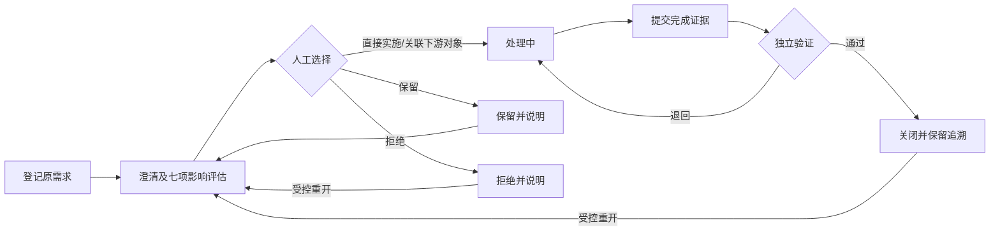

# 项目需求池单功能需求规格说明书

> SPEC-RR-01 · v0.1 · 2026-09-12 · ready-for-implementation  
> Owner：Lusice；作者：Codex；来源：[PRD](../PRD.md) RR-01～RR-05；[WI-008](../../development-testing/work-items/WI-008-business-delivery.md)。

## 1. 功能概览

项目空间内的独立需求池接收商务、售前、交付、客户及内部需求，全周期使用同一对象。全局“需求池”是有权项目需求的聚合快捷入口，不创建第二套事实。

## 2. 功能范围与产品设计

目录支持项目、来源、优先级、状态、关键词与责任人；详情用原始需求 → 澄清评估 → 处理关系 → 完成证据 → 验证记录的顺序。原文和提出人创建后不可覆盖，调整写入澄清和历史。复杂状态使用显式动作，不允许在普通编辑里任意更改状态。被拒绝或保留也保留理由和原文。

## 3. 流程说明与流程图

成员登记原需求并指定处理负责人和验证人；澄清后记录范围、技术、工期、成本、合同、验收、安全七项影响。人员选择直接实施、保留、拒绝，或人工派生/关联任务、问题、工作包、变更。完成时提交证据，指定验证人或提出方确认；验证不通过回到处理中并保留意见，处理人不得自关。

## 4. 特殊业务规则

1. 原文、原来源、提出人保持；关联处理不会删除或替换原需求。
2. 影响已批准基线时，必须选择 CHANGE 并有真实变更对象引用及理由。字符串备注不能冒充已生效的正式变更。尚未批准变更不能据此修改基线。
3. 处理人和验证人必须不同；提出人为外部客户时由内部责任人登记，重要客户需求关闭需客户确认或等效证据。
4. 完成证据和验证意见必填；服务端比较实际操作者与处理人，管理员也不能绕过自关约束。变更处理人必须留历史，不能通过临时换人绕过自身完成事实。
5. 同项目下游对象才可关联；取消关联保留历史。关闭空间只读；需求重开须原因且不解除项目关闭。

## 5. 页面与状态说明

NEW（待澄清）→ ASSESSED（已评估）→ IN_PROGRESS（处理中）→ PENDING_VERIFICATION（待验证）→ CLOSED（已关闭）；ON_HOLD（保留）、REJECTED（拒绝）。退回到处理中；重开回待澄清。处理状态与优先级独立，状态和错误均有文字。

## 6. 查询条件

q、projectId、status、source、priority、ownerAccountId、page/pageSize；默认全部可见项目、10 条。搜索只检索有权原文/标题，不包含受限费用明细。空结果可清除筛选。

## 7. 列表与状态字段

需求编号、标题、项目、来源、优先级、状态、负责人、期望完成、更新时间；详情加原文、原提出人、验证人、重要客户需求标记、影响评估、下游关系、完成和验证证据、事件历史。

## 8. 表单字段

新建：项目、标题（1–160）、原文（1–8000）、来源、提出人说明、负责人、验证人、优先级 LOW/NORMAL/HIGH/URGENT、期望日期、重要客户需求。评估：澄清、分类、七项影响（必填，可写“无影响”）、影响基线标记。处理：去向、说明、关联对象/新建下游对象。完成：实施证据。验证：通过/退回、意见、客户确认依据（必要时）。

## 9. 交互、提示与异常

保存成功刷新当前记录和计数；失败保留输入；未保存关闭需确认。未评估不得处理，未完成不得验证，证据不足不得关闭。详情版本冲突提示加载最新版本，不静默重试覆盖。404 同时用于不存在和不可见。

## 10. 数据、权限与边界

`project_requirement` 保存原始需求及当前处理状态，`requirement_assessment` 保存追加评估，`requirement_link` 保存下游对象关系，`requirement_event` 保存不可变事实。项目和身份通过公开接口验证。`REQUIREMENT_READ/CREATE/EDIT/VERIFY` 分开；重要客户确认不是外部账号登录。

## 11. 功能详细设计

遵守 [共享契约](../../technical/designs/shared/BUSINESS_DELIVERY_CONTRACT.md)。`GET/POST /api/requirements`，`GET/PATCH /api/requirements/{id}`，`POST /{id}/assess`、`/{id}/route`、`/{id}/complete`、`/{id}/verify`、`/{id}/reopen`，请求携版本。评估七项结构化保存；处理关系由实际工作对象公开接口创建/验证，原需求保持外键关系。修改和状态动作锁定需求，检查项目只读及版本，写事实和审计后提交；下游创建失败全部回滚。前端使用目录、筛选、详情和场景表单组件，服务端 `allowedActions` 提供当前入口。

## 12. 测试设计与验收标准

覆盖多来源登记、原文不可修改、七项评估缺失拒绝、人工去向、下游保留原需求、基线变更门、处理人自关与换人绕过拒绝、重要客户证据、验证退回/关闭/重开、同项目关系、并发和网络重复；另一账号/另一项目无法读取；浏览器以两个合成账号完成真实闭环。

## 13. 待确认问题

客户确认凭据的正式归档制度待企业试点；当前要求可追溯的确认文本或资料引用，不声称签字完成。跨全公司需求治理不在本入口改变项目归属。

## 14. 变更记录

v0.1：按现有 PRD 完成需求闭环及独立验证设计，2026-09-12。
