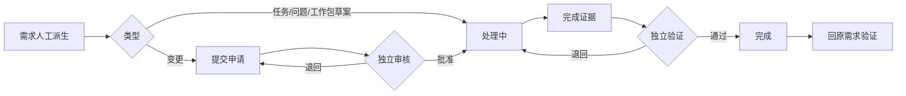

# 需求处理记录单功能需求规格说明书

> SPEC-RR-02 · v0.1 · ready-for-implementation · 2026-09-12  
> Owner：Lusice；作者：Codex；来源 PRD-RR-03/05、SPEC-RR-01、WI-008。

## 1. 功能概览

需求负责人将需求人工派生为任务、问题、工作包草案或变更申请，得到独立可打开、有责任、状态、证据和历史的处理对象。不是仅存一段关联文字。

## 2. 功能范围与产品设计

首批提供最小处理对象与完成/验证闭环，类型 TASK/ISSUE/WORK_PACKAGE/CHANGE。工作包此时是未进入交付批准基线的草案，不声称已具备 P2 的预算、资源承诺、阶段和主计划能力。CHANGE 保留申请、另一人批准、实施及验证事实，批准本身不改动任何交付基线。

## 3. 流程说明与流程图

派生在原需求处理操作中原子创建并保留双方引用。执行人提供证据，独立验证人确认；失败退回。变更需先提出具体影响范围和理由，由另一授权人员复核后才能提交实施完成。

## 4. 特殊业务规则

对象同属原项目；仅同项目、同类型、可见对象能建立关联。原需求无论是否完成均保留。影响批准基线时，原需求只能关联 CHANGE，完成前要求该变更已批准并完成验证。未来基线修改接口仍需核对批准变更引用；本功能不自动改写基线。

## 5. 页面与状态说明

`/work-items/:id` 显示类型、来源需求、责任/验证人、状态、原始说明、当前证据和事件历史。状态 OPEN/SUBMITTED/APPROVED/PENDING_VERIFICATION/DONE；退回保留意见。按钮与状态及权限一致。

## 6. 查询条件

项目、类型、状态、关键词；供需求关联选择器和项目问题/工作列表引用。

## 7. 列表与状态字段

编号、标题、类型、项目、来源需求、处理责任人、验证人、状态、完成证据、批准/完成/验证人及时间、版本。

## 8. 表单字段

标题、说明、责任人、验证人、期望日期；类型创建后不可改。变更提交需影响说明，评审、完成、退回和验证均需理由/证据。处理人与验证人不同。

## 9. 交互、提示与异常

重复派生返回原对象；无法关联时原需求操作回滚。未批准变更不能完成；完成者不能自验；项目关闭不可写；版本冲突需刷新，不覆盖最近证据。

## 10. 数据、权限与边界

Work Module 保存 `project_work_item`，通过公开 `WorkDirectory` 供需求模块创建/核验，不跨 Repository。`WORK_READ/EDIT/REVIEW` 独立中央权限；项目角色和记录状态共同生效。

## 11. 功能详细设计

`GET /api/work-items?projectId=&kind=`、`GET /api/work-items/{id}`、`POST /{id}/transition`，动作 SUBMIT/APPROVE/RETURN/COMPLETE/VERIFY；命令携 requestId/version/evidence。创建只由已鉴权的需求派生服务调用。记录保存 typed UUID 引用、类型、责任、状态、证据与乐观版本；事务内项目锁避免与关闭并发。关键状态和审批历史写入不可变事件；读取先验证项目与动作权限。

## 12. 测试设计与验收标准

需求派生后能打开并处理真实对象；跨项目关联拒绝；变更未审批不能完成；处理人和完成人均不能自验；失败/取消无半条关联；完成状态真实回显至原需求，旧事件可追溯。

## 13. 待确认问题

P2 工作包完整计划/资源模型及正式变更对各基线对象的应用，按各对应功能 SPEC 在后续阶段交付，不以此最小对象替代。

## 14. 变更记录

v0.1：为 RR-01 人工派生建立真实处理对象及严格完成边界。
