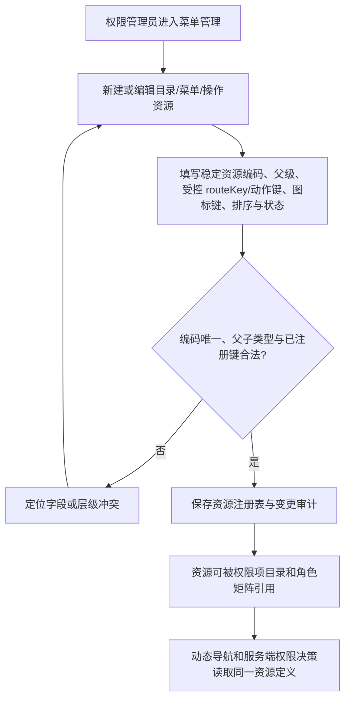
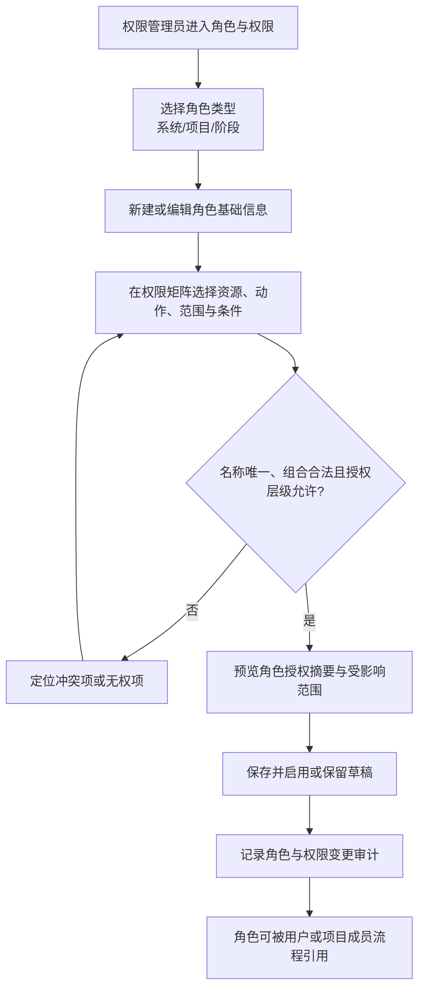
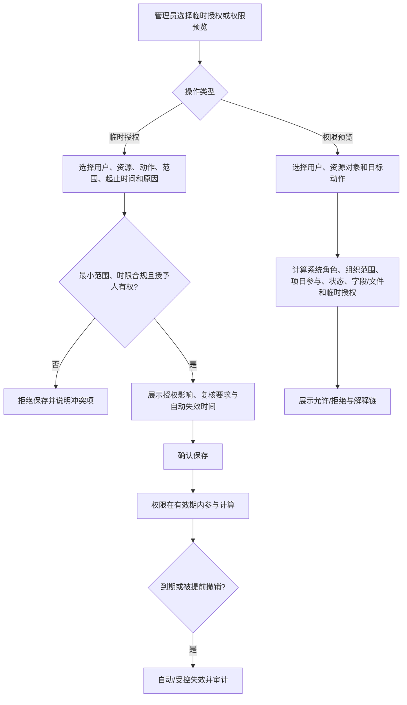

# 角色与权限单功能需求规格说明书

> 文档信息  
> 版本：v0.5（授权决策、导航契约与首轮工作区设计已冻结）  
> Owner：项目负责人  
> 作者：Codex  
> 最后更新：2026-08-28  
> 所属 PRD：[PRD V0.4](../PRD.md)  
> 功能路径：系统管理 / 菜单与权限  
> 状态：已完成本地实现与验收；后续业务能力接入继续按对应工作项验证，跟踪见 [WI-007](../../development-testing/work-items/WI-007-menu-permission-management.md)

## 1. 功能概览

| 项目           | 内容                                                                                                                     |
| -------------- | ------------------------------------------------------------------------------------------------------------------------ |
| 功能名称       | SPEC-IAM-02｜菜单、角色、数据范围与权限管理                                                                              |
| 优先级         | P1                                                                                                                       |
| 使用者         | 权限管理员、安全管理员、被授权的系统管理员；普通用户可查看自身有效权限摘要                                               |
| 入口位置       | 系统管理 / 菜单与权限；项目空间成员页中的角色模板跳转入口                                                                |
| 前置条件       | 已由 SPEC-IAM-01 建立可登录账号与组织来源；项目空间和阶段角色的实际成员分配由相关项目 SPEC 定义                          |
| 相关模块       | 组织与用户、项目空间、项目成员、文件、资金与成本、审计中心、临时授权                                                     |
| 相关文件或流程 | PRD-IAM-03～IAM-07、PRD 第 6 章权限要求、[前端组件规范](../../technical/designs/frontend/FRONTEND_COMPONENT_STANDARD.md) |

## 2. 功能范围与产品设计

### 2.1 功能列表

| 序号 | 功能点            | 功能描述                                                                                                    | 优先级 |
| ---: | ----------------- | ----------------------------------------------------------------------------------------------------------- | ------ |
|    1 | 菜单管理          | 维护目录、菜单页和操作资源的树、受控 `routeKey`、图标键、排序、状态与稳定资源编码；动态导航仅从该注册表生成 | P1     |
|    2 | 权限项目录        | 注册可授权的资源、动作、数据范围、敏感字段、文件动作和配置动作；菜单可见不等于业务动作授权                  | P1     |
|    3 | 角色目录          | 按角色类型、状态、关键词和适用范围检索系统角色、项目角色模板和阶段角色模板                                  | P1     |
|    4 | 系统角色管理      | 创建、编辑、停用系统级角色，并为已注册菜单、操作、组织数据范围、敏感字段、文件动作和配置动作授权            | P1     |
|    5 | 项目/阶段角色模板 | 定义项目角色和阶段角色的职责与可授权动作边界；不在本页把模板直接等同于项目成员                              | P1     |
|    6 | 权限矩阵          | 以“资源 + 动作 + 数据范围 + 字段/文件条件”显示和编辑授权，而非只勾菜单                                      | P1     |
|    7 | 系统角色授权      | 在本工作区为账号分配、撤销或查看系统角色；用户表单只显示引用，不在 IAM-01 中伪造角色下拉框                  | P1     |
|    8 | 临时授权          | 以最小范围、原因、开始/结束时间创建临时权限，到期自动失效并保留审计                                         | P1     |
|    9 | 实际权限预览      | 按指定用户、业务对象和场景解释其生效/不生效的权限条件，支持权限排查                                         | P1     |
|   10 | 历史与影响提示    | 菜单停用、角色停用、权限收缩、模板调整和临时授权到期前展示影响对象与历史留存说明                            | P1     |

### 2.2 背景与目标

项目的权限不是单一菜单开关。一个动作是否允许，至少由系统角色、组织数据范围、项目参与、项目角色、阶段角色、业务状态、字段密级、文件权限和临时授权共同决定。若把这些混成一个“管理员/普通用户”的概念，就会出现能看菜单却看不到正确记录、能看项目却误见成本、或临时协作结束后权限无法回收的问题。

本功能的目标是提供一套可理解、可追溯的菜单、角色和权限管理界面：管理员先维护稳定的菜单与权限资源注册表，再定义角色边界并将角色授权给用户或项目成员；查看者能在权限预览中理解某项权限为何生效；任何临时扩大访问范围都必须有原因、时限和审计。系统角色、项目角色和阶段角色在同一管理入口中可被对照，但它们必须分层，不能互相替代。

### 2.3 方案取舍

| 方案                       | 内容                                                                       | 结论   | 原因                                                       |
| -------------------------- | -------------------------------------------------------------------------- | ------ | ---------------------------------------------------------- |
| 分层角色＋权限矩阵         | 系统、项目、阶段角色分别定义；矩阵包含菜单、动作、记录范围、字段和文件条件 | 采用   | 符合 PRD 的组合权限模型，能解释敏感数据和项目参与边界      |
| 只做菜单勾选               | 每个角色仅配置可见菜单                                                     | 不采用 | 无法表达记录、字段、文件和临时授权边界                     |
| 将项目成员直接作为系统角色 | 在系统角色页直接授予/移除项目成员                                          | 不采用 | 会混淆项目责任、历史成员和系统管理权限                     |
| 删除历史角色               | 角色不再使用时物理删除                                                     | 不采用 | 已引用角色、历史权限和审计必须可追溯                       |
| 永久例外权限               | 用特殊角色长期覆盖正常权限模型                                             | 不采用 | 高风险且不可治理；例外必须使用受时限约束的临时授权         |
| 自动推导全量有效权限       | 仅展示“有/无权限”结论                                                      | 不采用 | 管理员无法理解被哪个条件拒绝，无法有效排查                 |
| 由前端静态菜单决定授权     | 将左侧导航、按钮显隐和路由写死在页面                                       | 不采用 | 菜单注册、可见性与操作权限必须可追溯，且服务端不能信任前端 |
| 允许后台录入任意路由或动作 | 让管理员把任意 URL、图标名或后端动作写入资源表                             | 不采用 | 容易产生不可访问入口和未受控的服务端动作；只能选择已注册键 |

### 2.4 产品形态与范围边界

“角色与权限”使用已确认的浅色高密度工作台语言：白色左侧导航、浅蓝灰画布、紧凑顶部上下文和多页签、白色卡片与细边框。主页面不是表格堆叠，而是“角色目录 + 权限摘要 + 可展开矩阵”的管理工作区；高风险保存、停用和临时授权使用带影响说明的确认面板。蓝色只用于主操作、已选状态和可追踪链接，敏感/危险状态通过文字、图标和色彩共同表达。

权限矩阵按资源域分组，每行显示“可见菜单、允许操作、记录范围、敏感字段、文件动作、附加条件”六类信息；默认收拢低频项，避免把数百个勾选项直接铺满。权限预览采用解释型结果卡，展示“允许/拒绝”以及支撑它的角色、组织范围、项目参与、状态或临时授权条件。

本功能负责菜单注册、角色和授权模型，不负责在某个项目中实际配置成员，不负责用户/账号生命周期，不负责审计日志的中心检索页，也不负责字典和规则配置。项目成员变动必须保留历史，具体操作入口由项目空间及后续团队 SPEC 定义。

首轮页面不从仪表盘或菜单树开始，而是从“角色与权限”作为默认页：桌面端在筛选行下呈现角色目录、授权摘要和可展开权限矩阵；资源树、系统角色授权、临时授权和权限预览分别作为同一工作区的专用页。所有页面沿用现有白色侧栏、浅蓝灰画布、紧凑卡片、表格和抽屉语言，不另建视觉体系。

### 2.5 独立交付边界

菜单管理与权限管理必须作为一个完整的独立功能交付：`MENU_RESOURCE` 是动态导航与权限资源的唯一注册表，`PERMISSION_ITEM` 是服务端授权判断的稳定权限点，角色和数据范围只是其授权载体。不得在登录或用户管理页面加入可编辑“角色”下拉框、静态菜单白名单或仅靠隐藏按钮的伪实现。

该独立交付范围由 [WI-007](../../development-testing/work-items/WI-007-menu-permission-management.md) 跟踪：菜单管理、权限项目录、角色与数据范围、临时授权、权限预览、动态导航和服务端授权决策必须作为同一条可验收能力链交付。只完成其中任意页面或表结构，均不构成本功能完成。

SPEC-IAM-01 仅提供不可配置的初始化系统管理员安全桥接，以保护第一个本地管理员和组织/用户写接口。该桥接不是本功能的验收替代；本 SPEC 交付后，必须由正式菜单资源与 `decide(subject, action, resourceContext)` 权限决策替换。

## 3. 流程说明与流程图

### 3.1 主流程：注册菜单与权限资源

权限管理员先在“菜单管理”维护目录、可导航菜单页和不直接显示的操作资源。每个资源拥有不可复用的稳定编码；`routeKey`、动作键和图标键只能从已由前端路由或后端 Module 注册的受控列表选择，数据库不接受任意 URL、图标名或服务端动作。排序和父子关系只描述产品导航，真正是否可见和是否能执行业务动作仍由权限决策负责。资源被角色、审计或历史导航引用后不得物理删除，只能停用或废弃并保留映射。

### 3.2 主流程：定义并启用一个角色

权限管理员在角色目录中选择角色类型，新建角色并填写名称、说明和适用范围。随后在分组权限矩阵中定义菜单、操作、记录范围、敏感字段和文件动作；系统在保存前检查角色名称/编码唯一性、权限组合是否存在冲突以及操作者是否有权授予该级别权限。通过后角色进入启用或待启用状态，可被用户账号或项目成员流程引用；已引用角色的后续改动必须留下版本化变更记录和影响提示。

### 3.3 分支流程：临时授权和实际权限预览

管理员在用户、项目或角色上下文发起临时授权，必须选择精确的资源范围、动作、适用对象、开始/结束时间和原因。系统检查授予人不能超出自身授权上限，且受授人当前没有通过正常角色获得同等权限时才建议创建临时授权。普通临时授权最长 7 天；标记为高敏感的范围最长 24 小时且必须通过指定复核。授权在有效期结束时自动失效，不需要人工回收；提前撤销和到期均保留原因、时间和审计。临时授权只能提供精确范围内的正向允许，不能绕过账号、资源、密级或其他硬约束。权限预览可在创建前后显示实际生效原因，但只对管理员可见完整解释。

取消角色编辑、临时授权或预览条件时不保存草稿；刷新后只显示已保存配置。没有独立的数据为空流程：角色目录为空时提供建立首个角色的引导，权限矩阵无可配置资源时提示先完成对应模块的权限注册。

## 4. 特殊业务规则

### 4.1 已冻结的授权决策规则

1. 角色和有效临时授权只提供正向 `ALLOW`。首期不提供可配置的通用“拒绝权限”行，避免角色矩阵因相互覆盖而不可解释。
2. `decide(subject, action, resourceContext)` 先验证账号/会话有效、权限项和资源处于注册且启用状态，再汇集有效角色与临时授权的正向允许；任一硬约束不满足即返回 `DENY`。硬约束至少包括账号状态、资源/权限项状态、必需的组织/项目/对象范围、记录状态、敏感字段或文件密级，以及资源自身的强制条件。
3. 多个有效角色的匹配 `ALLOW` 可以并集生效，但不能覆盖硬约束。临时授权只在精确的用户、资源、动作、范围和时间窗口内参与该并集；只有权限项显式允许例外时，它才可满足指定对象范围，不能绕过账号停用、资源停用、强制密级或不可下放限制。
4. 首期数据范围枚举固定为：`SELF`、`OWN_ORG`、`OWN_ORG_AND_DESCENDANTS`、`NAMED_ORG_UNITS`、`PARTICIPATING_PROJECTS`、`NAMED_PROJECTS`、`NAMED_OBJECTS`、`ALL_ORGANIZATION` 与 `ALL_PROJECTS`。后两项仅允许高等级受控角色使用；业务 Module 只能从该集合选择适用范围，不另造语义相同的范围类型。
5. 授权人必须同时拥有目标权限、目标范围和该权限的 `canDelegate` 标记；不能创建、修改、分配或临时授予等于或高于自身可下放层级的能力。高敏感权限和系统安全管理员角色只由指定安全管理员维护。
6. 临时授权必须最小化且有结束时间：普通授权最长 7 天；高敏感范围最长 24 小时并需指定复核。创建、撤销和到期都使用服务端时间、幂等键和审计，不能通过续期或重复请求变相延长。
7. 首期不使用跨请求或跨进程的授权结果缓存。每次服务端 `decide(...)` 以当前事实计算；`listNavigation(...)` 在登录、刷新和相关管理写入后重新获取。前端缓存只影响显示，永远不是访问放行依据。
8. `MENU_RESOURCE` 的受控注册表中，目录可以由权限管理员建立；可导航菜单页只可选择前端已实现的 `routeKey`，操作资源和权限项只可选择后端 Module 已注册的动作键。新增业务路由或动作必须先随其业务 SPEC 和 Module 注册，不能由管理页面凭空创建。
9. IAM-02 首次迁移必须在受控初始化中把现有初始化系统管理员映射为首个 `SYSTEM_SECURITY_ADMIN` 系统角色分配；待该角色能够通过正式 `decide(...)` 访问 IAM-01 管理接口后，删除 `BOOTSTRAP_ADMIN` 桥接。

### 4.1.1 本地收尾的独立复核与委派校验（2026-09-13）

高敏感临时授权创建后为 `PENDING_REVIEW`，不会因为填写复核人而生效。指定复核人必须具有 `IAM_TEMPORARY_GRANT_REVIEW`，且与授予人、受授人不同；本人提交批准或拒绝意见后，状态分别为 `ACTIVE` 或 `REJECTED`。批准不改变原起止时间，已到期不能批准；批准时重检授予人的当前权限及范围、受授人状态、权限项和指定复核权限。待复核也可撤销或到期，不提供延长期限的编辑入口。

高敏感权限的配置、分配及撤销只由当前正式安全管理员维护。普通角色必须严格低于操作者的可下放层级；更新、停用和撤销须检查原角色的级别与权限，不能通过降低新级别或提交空角色集跳过。受保护的 `SYSTEM_SECURITY_ADMIN` 是该规则的明确管理例外：仅已持有该正式角色的安全管理员可以维护/分配该角色，不能改变其保留级别或清空首个初始化管理员的安全角色。初始化标记只用于账号保护和一次性角色映射，永远不直接授予访问能力。

新增 `POST /api/access-control/temporary-grants/{id}/review`（decision、comment、version，沿用幂等键）与只返回自身管理能力的 `GET /api/access-control/capabilities`。授权记录追加 createdBy/reviewedBy/reviewedAt/reviewComment；无敏感业务正文。历史未核实的高敏感有效授权不得补造通过事实，应转待复核；无法确认原授予人的历史记录须撤销后重新申请。

### 4.2 业务规则

1. 菜单资源分为目录、可导航菜单页和不可直接导航的操作资源；每个资源编码全局唯一且一旦发布不可被重用。菜单停用仅阻止新的导航和授权，不删除历史引用。
2. 系统角色、项目角色和阶段角色必须分别定义、分别分配、分别计算；同一人可同时拥有多个角色，但不能因拥有系统角色自动成为项目成员。
3. 实际权限由系统角色、组织数据范围、项目参与、项目/阶段角色、业务状态、敏感字段、文件动作和临时授权等条件共同决定；任何单一角色页面不得宣称“拥有全部实际权限”。
4. 权限配置至少覆盖菜单与操作、记录数据范围、敏感字段、文件查看/下载/分享、系统管理配置五个维度。
5. 文件查看、下载、分享必须为可分开的权限；拥有文件查看权限不自动拥有分享权限。
6. 售前参与者可按授权查看项目资金计划与实际摘要，但成本明细、采购价格、利润和内部费率默认不可见，除非另有敏感字段授权。
7. 已被用户、项目成员、历史业务或审计引用的角色不得物理删除；可停用以阻止新的分配，历史显示继续保留。
8. 角色权限收缩、停用或模板变更不得改写过去的审计结论；系统应在生效前展示当前受影响用户或对象数量。
9. 临时授权必须记录范围、原因、生效起止时间、授予人和受授人，到期自动失效；不得以无限期临时授权代替角色设计。
10. 任何人只能授予其自身拥有且被允许下放的权限范围；前端显示不能代替服务端的授权上限校验。
11. 权限预览仅解释当前时点和指定对象的有效权限；它不是历史审计替代品，也不暴露无权查看的业务数据本身。

## 5. 页面与状态说明

| 页面 / 状态                 | 说明                                                                            | 可用操作                                      |
| --------------------------- | ------------------------------------------------------------------------------- | --------------------------------------------- |
| 菜单与权限工作区            | 以“菜单资源、权限项、角色、系统角色授权、临时授权、权限预览”分页组织的主入口    | 切换功能域、搜索、查看变更摘要                |
| 菜单管理                    | 目录、菜单页和操作资源的树形注册表；显示 `routeKey`、资源编码、图标、排序和状态 | 新建、编辑、调整层级/排序、停用、查看引用影响 |
| 权限资源目录                | 将菜单与操作资源映射为可授权的权限项，并标示数据范围、敏感字段和文件动作维度    | 搜索、查看资源、进入角色矩阵                  |
| 角色目录                    | 高密度表格或卡片列表，按系统/项目/阶段角色分组或筛选                            | 排序、筛选、进入详情、复制为草稿              |
| 角色详情                    | 展示职责、状态、有效权限摘要、用户/成员引用数量、变更历史                       | 编辑、启停、查看影响、打开权限预览            |
| 角色编辑                    | 分步或分组表单，先编辑基础信息再配置矩阵                                        | 保存草稿、启用、取消、查看冲突                |
| 权限矩阵                    | 资源分组、动作、范围、字段、文件、附加条件组成的可展开矩阵                      | 搜索权限项、批量选择分组、查看依赖/冲突       |
| 系统角色授权                | 选择启用账号并维护其系统角色分配、有效状态和影响摘要                            | 分配、撤销、查看分配历史和影响                |
| 临时授权                    | 高密度授权列表与抽屉；在明确对象和范围内创建、撤销或查看有效期                  | 保存、撤销、取消                              |
| 实际权限预览                | 选择用户、业务对象和动作后，返回解释型结果                                      | 修改条件、复制结果摘要、跳转关联角色          |
| 加载 / 空态 / 无权限 / 失败 | 分别显示骨架、首次角色引导、受限说明和可重试错误                                | 重试、返回、请求权限                          |

### 5.1 首轮工作区信息架构与导航映射

| 路由                                      | 页面重心     | 桌面端构成                                   | 首要任务                              |
| ----------------------------------------- | ------------ | -------------------------------------------- | ------------------------------------- |
| `/system/access-control`                  | 入口重定向   | 进入“角色”页，不单独建设仪表盘               | 从角色开始配置最小权限                |
| `/system/access-control/roles`            | 角色与矩阵   | 左侧筛选与角色目录；右侧角色摘要和可展开矩阵 | 建立、复制、启停并审查角色            |
| `/system/access-control/menus`            | 菜单资源     | 左侧资源树；右侧详情、影响摘要与编辑抽屉     | 注册目录、菜单页和操作资源            |
| `/system/access-control/permission-items` | 权限项目录   | 筛选条、资源域表格与只读注册来源             | 核对可授权动作和风险等级              |
| `/system/access-control/assignments`      | 系统角色授权 | 账号查找、当前角色标签与分配历史             | 为启用账号分配或撤销系统角色          |
| `/system/access-control/temporary-grants` | 临时授权     | 生效中列表、时间/范围筛选与编辑抽屉          | 建立最小例外或提前撤销                |
| `/system/access-control/preview`          | 有效权限预览 | 条件表单与允许/拒绝解释卡、原因时间线        | 排查指定用户对指定对象/动作的当前结果 |

首批动态导航仅注册已实现或由本工作项实现的页面：`SYSTEM_OVERVIEW`、`IAM_ORGANIZATION_USERS`、`ACCESS_CONTROL_MENUS`、`ACCESS_CONTROL_PERMISSION_ITEMS`、`ACCESS_CONTROL_ROLES`、`ACCESS_CONTROL_ASSIGNMENTS`、`ACCESS_CONTROL_TEMPORARY_GRANTS` 与 `ACCESS_CONTROL_PREVIEW`。现有侧边栏中尚无真实页面的业务入口不迁入首批注册表，也不得继续作为静态“允许”兜底。

## 6. 查询条件

| 字段         | 类型      | 内容                                               | 默认值     | 查询规则                     |
| ------------ | --------- | -------------------------------------------------- | ---------- | ---------------------------- |
| 关键词       | 文本      | 角色名称、编码、说明                               | 空         | 模糊匹配，输入防抖           |
| 角色类型     | 单选/多选 | 系统角色、项目角色、阶段角色                       | 全部       | 类型不互相混合统计           |
| 状态         | 多选      | 草稿、启用、停用                                   | 默认启用   | 停用角色默认可查但不能新分配 |
| 资源域       | 多选      | 系统管理、客户商机、项目空间、文件、资金等已注册域 | 空         | 只显示已注册权限项           |
| 数据范围     | 多选      | 已配置的组织/项目/对象范围类型                     | 空         | 用于定位范围过宽的角色       |
| 临时授权状态 | 多选      | 未生效、生效中、已到期、已撤销                     | 默认生效中 | 到期时间以系统时间计算       |

## 7. 列表与状态字段

| 字段       | 内容                                      | 排序 | 显示规则                               |
| ---------- | ----------------------------------------- | ---- | -------------------------------------- |
| 角色名称   | 名称、编码、职责摘要                      | 支持 | 名称主视觉，编码和类型次级显示         |
| 角色类型   | 系统、项目、阶段                          | 支持 | 标签＋文本，禁止只靠颜色区分           |
| 状态       | 草稿、启用、停用                          | 支持 | 停用角色仍可查看历史，但标注不可新分配 |
| 权限摘要   | 已授权资源域、动作数量、敏感/文件权限提示 | 否   | 简洁摘要，完整内容在详情矩阵查看       |
| 数据范围   | 组织、项目或对象范围规则摘要              | 支持 | 展示范围名称和是否含条件限制           |
| 已引用数量 | 当前用户、项目成员或模板引用数量          | 支持 | 权限不足者只见汇总，不见身份明细       |
| 最近变更   | 时间、操作者、变更类型                    | 支持 | 详情可查看前后差异                     |
| 操作       | 编辑、复制、启停、预览、查看影响          | 否   | 按当前角色状态和操作者权限控制         |

临时授权列表额外显示受授人、资源/动作、精确范围、开始时间、结束时间、状态、授予人和撤销原因；过期项默认不出现在“当前有效”筛选结果。

## 8. 表单字段

| 字段           | 类型               | 内容                                       | 默认值                 | 格式规则                                 |
| -------------- | ------------------ | ------------------------------------------ | ---------------------- | ---------------------------------------- |
| 角色名称       | 单行文本           | 面向管理员的角色名称                       | 空                     | 必填；同一角色类型内唯一                 |
| 角色编码       | 单行文本           | 稳定内部标识                               | 系统建议生成           | 必填；不可与历史有效编码冲突             |
| 角色类型       | 单选               | 系统角色、项目角色、阶段角色               | 从入口预填             | 创建后不可直接改类型；需复制新建         |
| 职责说明       | 多行文本           | 角色的业务职责和适用边界                   | 空                     | 必填；不以说明替代权限矩阵               |
| 适用范围       | 选择器             | 组织、项目类型、阶段或对象范围的适用条件   | 按角色类型提供         | 必须与角色类型兼容                       |
| 权限矩阵       | 分组多选/条件编辑  | 资源、动作、记录范围、字段、文件、附加条件 | 最小权限起始           | 每项必须可解释；冲突项禁止保存           |
| 角色状态       | 单选               | 草稿、启用、停用                           | 草稿                   | 启用前需完成必需矩阵项；停用需影响确认   |
| 临时受授人     | 用户选择           | 获得例外权限的启用账号                     | 空                     | 必填；用户来自 SPEC-IAM-01               |
| 临时资源与动作 | 级联选择           | 仅授予必要对象和动作                       | 空                     | 必填；不能超出授予人可下放权限           |
| 临时数据范围   | 组织/项目/对象选择 | 精确到可支持的最小范围                     | 空                     | 必填；禁止使用不受限全局范围代替例外     |
| 生效起止时间   | 日期时间范围       | 临时授权窗口                               | 立即生效至配置默认时长 | 必填；结束必须晚于开始且不可超过最大时长 |
| 授权原因       | 多行文本           | 业务必要性与审批依据摘要                   | 空                     | 必填；供审计与复核使用                   |

## 9. 交互、提示与异常

| 场景              | 系统处理                                         | 用户反馈                                         | 是否阻塞   |
| ----------------- | ------------------------------------------------ | ------------------------------------------------ | ---------- |
| 页面加载          | 先加载角色类型与目录，按需加载矩阵资源域         | 目录和矩阵分别骨架                               | 否         |
| 新建角色          | 校验基础信息和最小权限配置                       | 成功后显示角色摘要；字段级错误精确定位           | 是         |
| 权限冲突          | 检查互斥动作、范围不兼容和超出可下放上限         | 高亮冲突项并解释如何修正                         | 是         |
| 停用/收缩权限     | 计算当前引用和影响对象后再提交                   | 确认框展示影响数量、立即生效范围和历史留存说明   | 是         |
| 临时授权          | 检查有效期、最小范围、授予上限和重复授权         | 成功提示到期时间；拒绝时说明冲突，不泄露无权对象 | 是         |
| 权限预览          | 使用当前时点和指定对象计算                       | 以“允许/拒绝＋原因链”展示，明确这是即时结果      | 否         |
| 取消 / 关闭       | 检查角色矩阵或授权表单未保存变更                 | 保存、放弃或继续编辑选择                         | 视用户选择 |
| 无权限 / 服务异常 | 不暴露受限资源项或对象数据；保存失败保留本地草稿 | 受限说明或可重试错误                             | 视操作而定 |

## 10. 数据、权限与边界

### 10.1 数据记录

| 数据项                                              | 来源                               | 用途                                           |
| --------------------------------------------------- | ---------------------------------- | ---------------------------------------------- |
| 角色定义（SYSTEM_ROLE / PROJECT_ROLE / STAGE_ROLE） | 权限管理员维护                     | 角色名称、类型、职责和状态的事实来源           |
| 权限项与角色授权                                    | 已注册资源域与角色编辑             | 表达菜单、操作、记录范围、字段、文件和配置动作 |
| 用户角色分配引用                                    | 组织与用户、项目成员流程           | 将角色参与实际权限计算                         |
| 临时授权                                            | 被授权管理员创建                   | 有效期内的最小例外权限来源                     |
| 权限计算解释摘要                                    | 权限预览请求                       | 供管理员排查，不替代长期审计                   |
| 角色与授权变更历史                                  | 创建、编辑、启停、分配、撤销、到期 | 安全审计和历史追溯                             |

### 10.2 权限与边界

1. 角色查看、编辑、启停、分配、临时授权和权限预览必须拆分为独立操作权限，且都受组织范围和可下放上限约束。
2. 只有具有更高或等同可下放授权级别的管理员，才能创建或修改角色；任何客户端显示均不能绕过服务端判断。
3. 用户查看自己权限时只展示安全的摘要，完整角色矩阵、他人授权理由和敏感范围只对授权管理员开放。
4. 项目角色模板在本页定义，项目成员的实际加入、退出、换任和历史由项目空间/团队流程保存；两边以稳定角色标识关联，不共享可变的人员历史。
5. 敏感字段和文件动作必须在实际资源接口中再执行一次校验；矩阵配置和页面隐藏都不是单独的安全边界。

## 11. 功能详细设计

本 SPEC 已冻结权限项注册、正向授权合并、硬约束拒绝优先、数据范围、临时授权上限、无跨请求缓存、审计与接口边界，已达到 `ready-for-implementation`。跨 Module 的 `listNavigation(...)`、`decide(...)` 与初始化管理员迁移语义由 [IAM Foundation Contract](../../technical/designs/shared/IAM_FOUNDATION_CONTRACT.md) 维护；后续业务 Module 只注册自己的资源与动作，不重新定义本节规则。

### 11.1 模块责任与复用边界

| 层次 | 责任                                                                                   | 新增或复用                                           | 关联模块 / 共享设计                                                             |
| ---- | -------------------------------------------------------------------------------------- | ---------------------------------------------------- | ------------------------------------------------------------------------------- |
| 前端 | 菜单树、权限资源目录、角色目录、系统角色授权、详情、矩阵、临时授权、权限预览           | 后续新增，复用 AppShell、AntD Table/Form/Tree/Drawer | [前端组件规范](../../technical/designs/frontend/FRONTEND_COMPONENT_STANDARD.md) |
| 后端 | 菜单资源注册、权限项目录、角色定义、系统角色分配、实际权限计算、临时授权自动失效、审计 | 后续新增                                             | SPEC-IAM-01、IAM Foundation Contract、项目空间、文件与审计中心                  |
| 数据 | 菜单资源、角色、权限项、角色分配、授权关系、临时授权、变更历史                         | 后续新增                                             | PRD 第 2.2 与第 6 章                                                            |

### 11.2 前端页面与组件设计

| 页面 / 区域      | 建议路由                                  | 使用的共享组件                      | 本功能组件                                      | 状态与数据来源                   | 响应式 / 无障碍要求                      |
| ---------------- | ----------------------------------------- | ----------------------------------- | ----------------------------------------------- | -------------------------------- | ---------------------------------------- |
| 菜单与权限工作区 | `/system/access-control`                  | AppShell、Tabs、Table、Tag、Card    | `AccessControlWorkspace`                        | 当前功能分组、菜单资源、角色目录 | 窄屏将筛选和目录收纳为抽屉；保留主操作   |
| 菜单管理         | `/system/access-control/menus`            | Tree、Table、Drawer、Form           | `MenuResourceWorkspace`、`MenuResourceForm`     | 菜单资源树、编辑草稿、引用影响   | 支持键盘树导航；不以图标单独表达资源类型 |
| 权限项目录       | `/system/access-control/permission-items` | Table、Tag、Descriptions            | `PermissionItemCatalog`                         | 已注册权限项、风险级别、状态     | 注册来源可读；不将禁用原因只用颜色表达   |
| 角色详情/编辑    | `/system/access-control/roles/:roleId`    | Descriptions、Form、Collapse、Alert | `RoleDetail`、`PermissionMatrix`                | 角色、矩阵、引用数、变更摘要     | 矩阵需支持键盘定位和展开状态阅读         |
| 系统角色授权     | `/system/access-control/assignments`      | Select、Table、Drawer、Result       | `SystemRoleAssignmentWorkspace`                 | 启用账号、已分配角色、影响摘要   | 不暴露无权账号；分配结果需文字反馈       |
| 临时授权         | `/system/access-control/temporary-grants` | Drawer、Form、DatePicker、Result    | `TemporaryGrantWorkspace`、`TemporaryGrantForm` | 用户、资源、有效期、提交状态     | 明确结束时间；弹层焦点与错误朗读正确     |
| 权限预览         | `/system/access-control/preview`          | Select、Tree、Card、Timeline        | `EffectivePermissionPreview`                    | 用户、对象、动作与解释结果       | 结果不可只用图标表达允许/拒绝            |

### 11.3 API 契约

当前冻结资源边界：菜单资源树/详情/草稿、权限项目录、角色目录/详情/草稿、角色授权矩阵、系统角色分配、角色状态动作、角色影响预览、临时授权、临时授权撤销、有效权限预览和动态导航。所有高风险写操作必须支持并发版本校验、幂等键与审计关联 ID。

| 语义         | HTTP 契约                                                                                                                 | 关键约束                                                                                                 |
| ------------ | ------------------------------------------------------------------------------------------------------------------------- | -------------------------------------------------------------------------------------------------------- |
| 已授权导航   | `GET /api/access-control/navigation`                                                                                      | 只返回当前主体有菜单查看权、资源启用且 `routeKey` 已注册的导航节点；返回结果不替代服务端 `decide(...)`。 |
| 菜单资源     | `GET/POST/PATCH /api/access-control/menu-resources`；`POST /{id}/move`、`POST /{id}/status`、`GET /{id}/impact`           | `routeKey`/动作键来自受控注册表；移动、停用和编辑携带 `version`。                                        |
| 权限项目录   | `GET /api/access-control/permission-items`、`GET /{code}`                                                                 | 业务 Module 注册来源只读；管理员维护其授权使用和生命周期，不能伪造后端动作。                             |
| 角色与矩阵   | `GET/POST/PATCH /api/access-control/roles`；`POST /{id}/status`、`GET /{id}/impact`                                       | 完整矩阵单次版本化保存；服务端校验范围兼容、`canDelegate` 与影响。                                       |
| 系统角色授权 | `GET /api/access-control/system-role-assignments`；`PUT /api/access-control/accounts/{accountId}/system-role-assignments` | 仅对启用账号和启用角色生效；替换请求显式携带完整意图、版本与幂等键。                                     |
| 临时授权     | `GET/POST /api/access-control/temporary-grants`；`POST /{id}/revoke`                                                      | 普通最长 7 天；高敏感最长 24 小时且需复核；使用服务端时间源。                                            |
| 权限预览     | `POST /api/access-control/permission-preview`                                                                             | 请求携带主体、动作和最小资源上下文；只返回允许/拒绝、匹配授权与脱敏原因链。                              |

重要错误码在统一问题响应中使用稳定编码：`RESOURCE_KEY_NOT_REGISTERED`、`ROUTE_KEY_NOT_ALLOWED`、`AUTHORIZATION_SCOPE_EXCEEDED`、`GRANT_DURATION_EXCEEDED`、`HIGH_RISK_REVIEW_REQUIRED`、`VERSION_CONFLICT` 与 `IDEMPOTENCY_CONFLICT`。`403` 不泄露无权对象、角色或资源明细。

### 11.4 数据模型与迁移

| 对象 / 表            | 字段或关系                                                                   | 约束与索引                                                             | 历史 / 审计                    | 迁移与兼容                 |
| -------------------- | ---------------------------------------------------------------------------- | ---------------------------------------------------------------------- | ------------------------------ | -------------------------- |
| MENU_RESOURCE        | 资源编码、类型、父级、名称、`routeKey`/动作键、图标键、排序、状态、`version` | 编码全局唯一；树不得循环；键必须来自受控注册表；已引用资源不可物理删除 | 创建、改名、移动、停用、键变更 | 静态导航逐步迁移为注册资源 |
| ROLE                 | 名称、编码、类型、职责、状态                                                 | 类型内编码唯一；已引用角色不可删除                                     | 版本、启停和变更摘要           | 首批角色由受控初始化建立   |
| PERMISSION_ITEM      | 资源域、资源、动作、维度、风险级别                                           | 稳定唯一键；废弃项保留映射                                             | 注册/废弃历史                  | 与业务模块逐步注册         |
| ROLE_PERMISSION      | 角色、权限项、数据范围、条件                                                 | 组合去重；校验类型兼容                                                 | 授权前后差异                   | 旧角色导入待确认           |
| USER_ROLE_ASSIGNMENT | 用户、系统角色、生效状态、`version`                                          | 账号和角色均须启用；组合去重；服务端校验可下放范围                     | 分配、撤销、生效变更           | IAM-01 用户表单不直接维护  |
| TEMPORARY_GRANT      | 用户、资源范围、动作、起止时间、原因、复核、状态                             | 结束时间必填；限定授予上限和最大时长                                   | 创建、撤销、到期事件           | 使用服务端时间与幂等键     |

### 11.5 事务、并发、幂等与失败恢复

1. 角色基础信息和完整权限矩阵应以单次版本化保存提交，校验失败不产生部分生效矩阵。
2. 临时授权创建、撤销、到期失效使用幂等标识和服务端时间源；重复请求不得延长或重复授权。
3. 角色编辑发生版本冲突时，管理员必须重新加载并查看差异，不能静默覆盖他人改动。
4. 角色停用和权限收缩应在事务中记录影响摘要与审计。首期没有跨请求授权缓存；动态导航查询在登录、刷新和相关管理写入后重新拉取，任何客户端缓存都不能决定服务端放行。

### 11.6 安全、权限与审计实现

| 动作          | 权限判断                              | 敏感数据处理                 | 审计事件                 | 失败控制                      |
| ------------- | ------------------------------------- | ---------------------------- | ------------------------ | ----------------------------- |
| 查看角色矩阵  | 角色查看权限＋数据范围                | 敏感权限项仅向有权管理员展示 | 可按策略记录敏感配置查看 | 无权资源不泄露明细            |
| 编辑/启停角色 | 角色管理动作＋可下放上限              | 影响人员按权限汇总或脱敏     | 角色、矩阵、状态前后值   | 并发版本校验、二次确认        |
| 分配角色      | 用户/项目成员操作权限＋角色可分配条件 | 不暴露无权用户/项目          | 分配、撤销、生效时间     | 不允许向停用账号/角色静默分配 |
| 临时授权      | 临时授权动作＋授予上限                | 原因与范围按最小可见原则     | 创建、撤销、到期         | 受控时间、自动失效、幂等      |
| 权限预览      | 权限排查动作＋指定对象可查看权        | 不回显无权业务数据           | 视安全策略记录查询       | 仅返回解释摘要                |

### 11.7 配置、兼容与回退

- 新增配置：首批 `SYSTEM_SECURITY_ADMIN` 及其可下放层级、已冻结的数据范围枚举、敏感字段分级、文件动作、受控权限项/routeKey 注册表、临时授权普通 7 天/高敏感 24 小时上限，以及高风险授权复核规则；
- 浏览器或客户端兼容：遵守前端组件规范；权限矩阵支持键盘操作、屏幕阅读器摘要和窄屏分组查看；
- 灰度或数据兼容：先以最小角色集初始化和试点，再扩大权限项；旧权限来源如有必须提供映射和核验；
- 回退方式：角色/授权调整不得通过删除审计回退；如配置错误，建立新版本或撤销临时授权并重新计算有效权限。

## 12. 测试设计与验收标准

### 12.1 测试矩阵

| 场景               | 测试层次              | 前置数据                           | 预期结果                                                     | 关联验收项         |
| ------------------ | --------------------- | ---------------------------------- | ------------------------------------------------------------ | ------------------ |
| 菜单资源注册       | 前端 / 集成 / E2E     | 有菜单管理权限的管理员             | 可创建合法目录、菜单页和操作资源；编码、路由和树约束均被校验 | AC-20              |
| 菜单停用与引用     | 集成 / E2E            | 已被角色引用的菜单资源             | 禁止物理删除，停用后不再参与新导航/新授权，历史可追溯        | AC-20              |
| 新建系统角色       | 前端 / 集成 / E2E     | 有角色管理权限的管理员             | 可保存合法角色和最小权限矩阵                                 | AC-20              |
| 菜单可见但记录无权 | 集成 / E2E            | 有菜单权限、无组织或项目范围的用户 | 页面/接口均不能读取越权记录                                  | PRD 第 6 章权限    |
| 敏感字段与文件动作 | 集成 / 安全 / E2E     | 售前角色和敏感权限角色             | 摘要可见性、成本字段、查看/下载/分享分别正确                 | AC-21              |
| 项目角色分层       | 集成 / E2E            | 同一用户有系统角色但非项目成员     | 不因系统角色自动获得项目对象动作                             | AC-20              |
| 临时授权到期       | 集成 / 定时任务 / E2E | 有有效期的例外授权                 | 到期后自动失效，历史可审计                                   | AC-21              |
| 授权上限           | 安全 / 集成           | 低权限管理员                       | 无法创建超出自身可下放范围的角色或临时授权                   | PRD-IAM-04、IAM-07 |
| 硬约束拒绝优先     | Module / 集成 / 安全  | 多角色、临时授权与不满足范围的账号 | 正向授权并集不覆盖账号、资源、范围、状态或密级的硬性拒绝     | PRD-IAM-04、IAM-07 |
| 系统角色授权       | 前端 / 集成 / E2E     | 启用账号、启用/停用角色            | 分配独立于用户表单；停用账号/角色或越级分配被服务端拒绝      | PRD-IAM-03、IAM-04 |
| 权限预览解释       | 前端 / 集成 / 人工    | 多角色、多条件用户                 | 输出允许/拒绝和完整理由链，不泄露对象数据                    | AC-21              |
| 角色停用           | 集成 / E2E            | 被引用角色                         | 阻止新分配、展示影响、历史保持可查                           | AC-20              |

### 12.2 验收标准

1. 管理员能维护目录、菜单页和操作资源的树、稳定编码、受控 `routeKey`、排序和状态；动态导航与服务端权限资源来自同一注册表，已引用资源不可物理删除，不能录入任意 URL 或后端动作。
2. 管理员能分别维护系统角色、项目角色和阶段角色，页面和数据模型不将三者混为一个成员关系。
3. 权限矩阵至少能表达菜单/操作、记录范围、敏感字段、文件查看/下载/分享和系统配置动作。
4. 有菜单权限但无组织、项目或状态条件的用户不能通过页面或接口越权访问记录；前端隐藏不是唯一防护。
5. 敏感字段和文件动作能够独立于普通查看权限生效，售前默认只能查看被授权的资金摘要。
6. 临时授权必须有原因、最小范围、起止时间和审计，到期自动失效；普通授权不超过 7 天，高敏感授权不超过 24 小时且可复核，不能以永久例外代替正常角色。
7. 权限预览能解释当前时点特定用户对特定动作的允许或拒绝来源，不泄露其无权查看的业务数据。
8. 停用角色不会删除历史引用或审计，并能阻止新的分配；角色变更与影响提示可被管理员审查。
9. 角色与有效临时授权只提供正向允许；账号、资源、范围、记录状态、敏感字段/文件密级和资源强制条件属于硬约束，任一不满足必须拒绝，不能被多角色或临时授权覆盖。
10. 系统角色授权有独立的受控入口；用户表单不维护角色，且仅能向启用账号分配可下放的启用角色。

## 13. 后续业务 Module 待确认事项

1. ⚠️ 除首个 `SYSTEM_SECURITY_ADMIN` 外，首批系统角色、项目角色和阶段角色的业务名称、责任人和验收人由谁配置并验收？
2. ⚠️ 成本、采购价格、利润、内部费率等字段在各业务 Module 中对应的 L3/L4 分级、可授权人和查看人，需要随各自 SPEC 冻结。
3. ⚠️ 项目成员和阶段角色在 P1/P2 的实际分配入口、范围与权限项需要分别在项目空间和团队 SPEC 中闭合。
4. 高敏感临时授权按每笔指定的独立账号进行实际复核；公司岗位矩阵、到期提醒渠道和后续业务资源注册责任，在安全管理流程与对应业务工作项中落实。

## 14. 变更记录

| 版本 | 作者  | 修订内容                                                                                                                            | 日期       |
| ---- | ----- | ----------------------------------------------------------------------------------------------------------------------------------- | ---------- |
| v0.1 | Codex | 基于 PRD-IAM-03～IAM-07 创建角色、权限矩阵、临时授权和权限预览草案                                                                  | 2026-08-26 |
| v0.2 | Codex | 将菜单管理、权限资源注册、角色授权和数据范围明确为一个独立完整功能；与 IAM-01 的初始化管理员桥接解耦                                | 2026-08-27 |
| v0.3 | Codex | 记录项目负责人确认：菜单管理与权限管理必须作为同一 IAM-02 独立交付链，不以静态导航或角色标签替代                                    | 2026-08-27 |
| v0.4 | Codex | 项目负责人确认：冻结正向授权＋硬约束拒绝优先、范围枚举、授权下放、临时授权时限、受控导航键、无跨请求缓存、初始化迁移与首轮工作区 IA | 2026-08-28 |

2026-09-13 v0.5：补齐实际独立复核状态、原角色级别校验、初始化访问桥接删除及本地验收链接；实现证据见 [ACCEPT-007](../../development-testing/accept/ACCEPT-007-access-control-local.md)。
