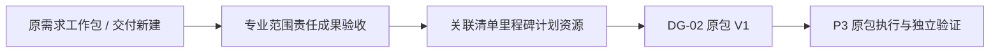

# 专业工作包（SPEC-WP-01）

> P3 接续：原对象的实际执行、独立验收、冲回/重开与执行职责交接见 [SPEC-EXEC-01](project_execution_spec.md)，本文件继续定义批准基线。

> 版本：v0.1；Owner：Lusice；作者：Codex；2026-09-13  
> PRD：4.13；状态：ready-for-implementation；WI-010。

## 1. 功能概览

P0；项目经理和专业负责人从交付立项汇总、阶段或原需求进入工作包，不新增固定项目空间菜单。

## 2. 功能列表

新建/接纳需求派生工作包、范围/责任/成果/验收、阶段/清单/里程碑/计划/资源关系、V1 与后续范围变更。沿用 WORK_PACKAGE 原记录 ID；新增工作包明确来源为交付立项，源需求可空，不能捏造需求。

## 3. 流程说明与流程图

项目经理选择原需求中的工作包草稿或建立交付工作包，专业负责人补齐范围、成果和验收，关联阶段和计划资源。DG-02 冻结评审并原位批准，P3 在原包分解任务和记录成果，完成后仍需指定独立验证人确认。

退回补齐不复制工作包。批准基线不等于工作完成，不能自动关闭来源需求。

## 4. 特殊业务

接纳仅同项目 WORK_PACKAGE，未完成且未被其他立项关联；原标题、负责人、验证人和源需求保持可追溯。责任人与验证人必须不同且为有效成员。DG-02 前禁止工作包作为正式交付对象完成/验证；售前需求中的普通任务和问题不因此全部冻结。评审期同步禁止从原工作入口改写引用包。

## 5. 页面 / 状态说明

工作包执行状态和基线状态分开显示：待立项/冻结/已批准 与 OPEN/PENDING_VERIFICATION/DONE；不以“批准”显示“已完成”。

## 6. 查询条件

名称、负责人、阶段、基线状态、原需求；关联只提供本项目候选。

## 7. 列表字段 / 状态字段

名称、原需求/立项来源、负责人、验证人、阶段、计划窗口、清单/里程碑数、资源情况、基线与执行状态。

## 8. 表单字段

workItemId（接纳时原 ID）、title（160）、scope（8000）、deliverables（4000）、acceptanceCriteria（4000）、ownerId、verifierId、stageId、startsOn/endsOn、resourceNotes（4000）、itemIds、milestoneIds；列表各上限 100，版本/原因必填。

## 9. 交互说明

接纳前展示原包及原需求链接，保存后两入口读取同一记录。工作包详情嵌计划、资源、清单和验收关系，缺项可直达维护位置。

## 10. 提示说明

“请先完成 DG-02，当前工作包尚不能记录正式交付完成。”“此包已关联当前立项。”“基线批准不会关闭原需求。”

## 11. 异常处理

跨项目/重复接纳/已完成包拒绝；写入在项目锁下同步原工作摘要与基线对象；失败整体回滚。

## 12. 数据记录

原 project_work_item 保存稳定身份、来源、处理/验证责任和执行状态；交付模块保存基线正文/计划关联及快照。通过公开 WorkDirectory 接续，不跨模块读取 Repository。

## 13. 权限与边界

读取同时遵守项目/工作读取；DG2_EDIT 加项目经理或本包负责人，原 Work 操作仍需原权限；审批权限不能代替工作包执行或独立验证。

## 14. 验收标准

接纳原需求包后 ID/链接不变；新建不造需求；跨项目和重复拒绝；冻结覆盖所有入口；V1 后同包执行；批准不自动完成或关闭来源需求。

## 15. 待确认问题

专业划分和公司授权规则由业务配置，不硬编码固定专业数量。

## 16. 变更记录

v0.1｜Codex｜接续原工作包与基线/执行分离｜2026-09-13。
