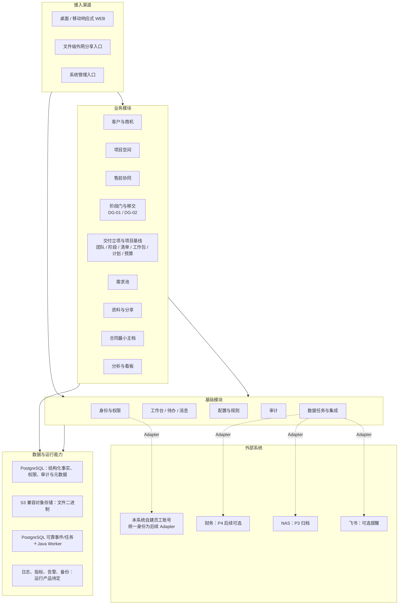
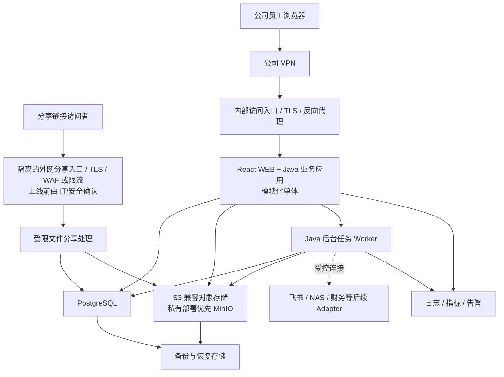
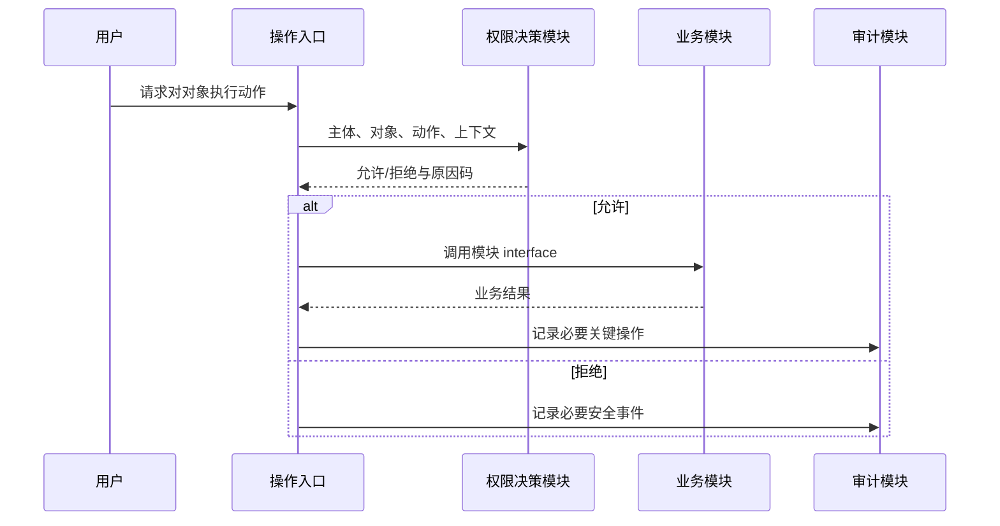
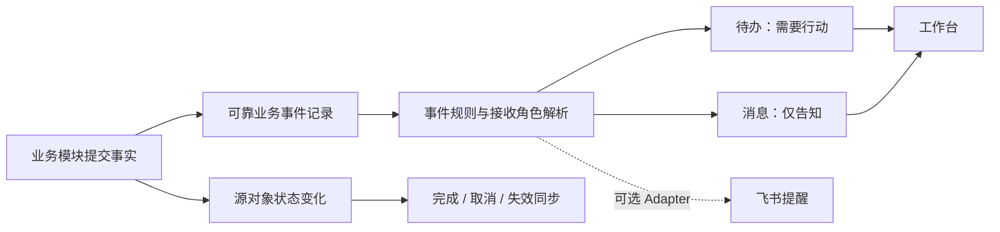

# 项目全生命周期管理系统总体技术方案 V0.3

> 文档状态：P1 技术选型与架构基线；上线运行参数仍需在实施前定标  
> 当前产品基线：P1 商机 → 售前 → DG-01；P2 交付立项 → DG-02 → 项目基线  
> 当前技术深化顺序：先建立可运行共用底座，再按功能完成对应 SPEC 并沿同一架构推进 P1/P2  
> 编制日期：2026-07-24  
> 最近修订：2026-08-26（Ant Design v6 组件基线通过 WI-002 验证并由 ADR-012 接受）  
> 正式需求来源：[PRD V0.4](../requirements/PRD.md)、[BRD V0.4](../requirements/BRD.md)  
> 技术决策入口：[ADR 索引](./adr/README.md)  
> 跨功能设计入口：[共享设计](./designs/README.md)

## 0. 文档定位与结论

本方案回答系统在技术上应如何分解、哪些质量和安全原则必须保留，以及哪些技术选择已成为实施基线。V0.3 的核心结论是：

1. P1 采用“模块化单体＋独立后台任务进程”；逻辑模块、数据责任、关键流程、权限与审计原则均已确定。P1 不以微服务、Kubernetes、独立缓存、独立消息队列或独立搜索集群起步。
2. P1 技术栈为 React＋TypeScript、Java 21＋Spring Boot 3.x、PostgreSQL 和 S3 兼容对象存储；私有部署时对象存储优先采用 MinIO。具体补丁版本、许可证、主机规格与交付制品在实施前按 ADR 的验证要求定标。
3. 员工主系统部署在公司私有环境，员工经公司 VPN 访问；系统自建员工账号，不建设公网员工注册或登录入口。PRD 所要求的文件级外网分享必须走隔离的分享入口，不能把主系统暴露公网。
4. 预计总用户数为 60—100 人；飞书和财务集成不阻塞 P1，NAS 自动归档留待 P3。数据需长期保留，但具体保留期限、RPO、RTO、文件容量和公开分享入口的 IT/安全条件仍是上线前必须关闭的事项。
5. 已接受的架构与前端组件决策记录在 ADR-001—ADR-007、ADR-012；ADR-009 和 ADR-010 仍需在恢复目标、运行责任和相关 SPEC 明确后定版。

本文提供架构级框架和跨功能共享设计入口，不替代对应 SPEC 中的功能详细设计，也不替代部署手册、测试方案与灾备演练方案。

## 1. 输入、事实与非基线材料

### 1.1 当前工作区事实

截至 2026-08-26，对工作区和已确认技术条件的盘点结果如下：

| 检查项 | 事实 | 技术影响 |
|---|---|---|
| 应用源代码 | 已建立 React/Vite 前端与 Spring Boot 最小后端骨架，尚无正式业务功能 | 后续功能沿当前模块边界实现，不把实验页当作产品事实 |
| 依赖与构建 | 已建立 pnpm lockfile、Node/pnpm/Java 版本入口和前后端统一检查命令 | 本地依赖可复现；GitLab CI 与共享环境仍待建立 |
| 部署与基础设施 | 未发现容器、编排、CI/CD、基础设施即代码或生产部署配置 | 部署方式、环境数、网络分区和运行平台均待确认 |
| 访问与网络基线 | 系统部署在公司私有环境；员工从外网时先接入公司 VPN | 主系统不提供公网员工登录入口；外网文件分享必须与主入口隔离 |
| 团队与技术约束 | 公司没有强制复用或禁止的既有技术栈；团队更熟悉 Java | 可采用 Java 技术栈，不因历史平台被迫迁就 |
| 初始规模与保留 | 预计总用户数 60—100 人；数据长期保留 | 采用低运维的模块化形态；并发、文件规模和恢复目标仍需在上线前验证 |
| 正式事实源 | 已建立 `docs/requirements/` 下的 BRD、PRD 和图形化附件 | 技术设计必须向正式需求追溯 |
| 原始与导出材料 | 存在 Excel、DOCX、PDF 和截图 | 可用于追溯或辅助阅读，但不能反向覆盖正式需求 |
| 版本控制 | 本地 Git 已初始化为 `main`，尚无初始提交和远程地址 | 已建立分支、评审和 AI 协作规范；GitLab 保护规则、发布、回滚和制品策略仍待配置 |

“约 30—50 条商机”只是已知的一次性迁移数据量，不等于用户规模、并发、项目量、文件量或生产容量基线。

### 1.2 正式技术输入

- [PRD V0.4](../requirements/PRD.md)：P1/P2 当前产品基线、基础能力、验收和 P3/P4 扩展关系。
- [BRD V0.4](../requirements/BRD.md)：业务对象、权责、权限密级、文件/NAS 和集成边界。
- [业务需求蓝图](../requirements/product-flows/index.html)：BRD/PRD 的正式图形化附件，用于核对跨阶段流程、责任、批次边界和对象连续性；若与 BRD/PRD 正文冲突，应先修订上游需求事实，不由技术方案自行选择口径。
- 后续单功能 SPEC：字段、状态、交互、异常和验收细节；尚未建立时，本技术方案不补造这些产品事实。

### 1.3 明确不作为正式技术基线的材料

- `outputs/` 下的建设方案 DOCX/PDF、预览与截图属于阶段性导出物。其团队规模、工期、MFA、接口和安全建议只能作为调研线索；若与 V0.4 正式需求不一致，以正式需求为准。
- [历史兼容业务文档](../history-archive/requirements/project-lifecycle-management-system-design-2026-07-15.md)开头已说明技术架构、技术选型和详细接口需另行编制，且其中部分业务模型已被 V0.4 校正。
- 原始 Excel 清单用于来源追溯，不直接等于系统模块、流程数量或技术实现范围。

## 2. 技术目标、范围与约束

### 2.1 技术目标

| 目标 | 可验证结果 |
|---|---|
| 业务事实唯一 | 客户、商机、项目空间、合同依据、DG-01 和后续基线对象互相追溯，不在看板、待办或集成侧复制第二套正式状态 |
| 规则可演进 | 字典、规则和模板版本化；新版本不静默修改历史事实或运行中项目快照 |
| 权限可解释 | 给定用户、对象和动作，可返回允许/拒绝、主要依据和临时授权到期信息 |
| 事件可闭环 | 待办、消息、审计和外部提醒由业务事件产生，并可回到有权限的原对象 |
| 文件可信 | 文件元数据、版本、当前有效状态、分享、访问日志与未来 NAS 快照可校验 |
| 批量任务可恢复 | 导入导出可查看进度、逐行结果、错误明细和重试，不因局部错误失去整体可追溯性 |
| P2—P4 可接续 | P1 预留稳定标识和关系，后续沿用同一项目空间和对象，不提前实现未进入批次的流程 |
| 可运营 | 部署、日志、指标、备份、恢复、容量和安全控制能够被验证，而非仅写在文档中 |

### 2.2 首轮技术落地范围（共用底座与 P1）

P1 需要支撑客户/商机、项目空间、售前规定动作、SG-01/SG-02、需求池、资料版本与分享、DG-01、提前开工、最小合同主档、分析看板，以及以下基础能力：

- 组织、用户、账号生命周期；
- 系统角色、组织数据范围、项目/阶段角色、字段和文件动作权限；
- 工作台、待办、消息与深链；
- 字典、参数、规则与模板版本；
- 审计中心；
- 导入导出和数据任务中心；
- 集成配置与运行记录框架。

P1 不建设通用 CRM、HR、通用工作流平台、通用集成平台或完整运维平台；不执行验收后 NAS 自动归档，不实现 DG-02 后的完整交付执行。

### 2.3 P2 技术架构范围

P2 已进入当前产品基线，总体技术架构必须为以下能力确定数据责任、模块边界和演进方式：

- DG-01 移交包在原项目空间接续，不复制项目、资料、需求或移交对象；
- 项目团队、阶段模板快照、并行执行阶段、里程碑、项目清单、专业工作包、主计划和实施预算草案；
- DG-02 提交预检、评审轮次、退回、撤回、重提、通过、阻断项和非阻断遗留；
- 通过时原草案对象原位转为批准基线，锁定评审快照并切换主阶段；
- 通过后以新版本、替代关系和影响记录演进，不改写 DG-02 批准事实；
- P3 只在 P2 的同一批批准对象上增加执行事实，不创建第二套执行对象。

P2 的产品范围已经确定，但字段、状态约束、跨对象事务、权限矩阵和实现验证仍需由 `SPEC-DG2-01` 及各对象 SPEC 细化。共用底座先落地，每个功能在进入编码前完成自己的 SPEC；不再等待一套平行 DES 清单。

### 2.4 已确认技术约束

| 编号 | 约束 |
|---|---|
| C-01 | 首期以桌面 WEB 为主要管理入口，提供移动响应式 WEB；不建设独立原生 APP 和完整离线能力 |
| C-02 | 仅公司员工建立账号；外部人员不获得项目空间账号或浏览权 |
| C-03 | 允许文件级“外网链接＋密码”分享；分享、查看和下载权限分别判断 |
| C-04 | 新系统保存正式项目事实和当前有效资料；飞书仅可作提醒、摘要和深链，不能直接关闭正式事项 |
| C-05 | NAS 只接收 P3 验收后的长期归档副本，不承担过程协作；P1 只预留归档关系 |
| C-06 | Excel 商机迁移是一次性导入，验收后不再与飞书商机表双向同步 |
| C-07 | 账号停用、锁定或离职后立即禁止登录和新增操作，同时保留历史责任与审计关系 |
| C-08 | 已批准、已发布或已归档事实通过替代、变更或冲销更正，不直接覆盖原记录 |
| C-09 | 主阶段、当前重点阶段、项目状态和业务结果必须使用同一事实来源并分别表达 |
| C-10 | 不预设通用工作流引擎；流程与规则实现应服务已确认业务，不把业务责任交给自动推断 |
| C-11 | 员工主系统部署在公司私有环境；员工在外网办公时必须先接入公司 VPN。主系统、管理后台、数据库和对象存储不直接暴露公网。 |
| C-12 | P1 的实现基线为 React＋TypeScript、Java 21＋Spring Boot 3.x、PostgreSQL 和 S3 兼容对象存储；私有部署时对象存储优先采用 MinIO。 |
| C-13 | P1 采用模块化单体与独立后台任务进程；不以微服务、Kubernetes、独立 Redis、消息队列或搜索集群作为首期前提。 |
| C-14 | 预计总用户数为 60—100 人。性能、并发、文件总量和单文件大小以实施前容量基线和验证结果为准，不能用总用户数替代这些指标。 |
| C-15 | P1 使用本系统自建的员工账号，不开放员工自助注册；账号、会话、停用、锁定和审计由系统负责，后续可通过 Adapter 接入统一身份。 |
| C-16 | NAS 自动归档仍为 P3 能力。NAS 连接由系统管理员或 IT 统一配置服务账号，普通业务用户不得配置或持有 NAS 凭据。 |
| C-17 | 飞书和财务接口不阻塞 P1 主线；系统只预留受控集成 seam、运行记录和重试边界。 |
| C-18 | 数据与审计需长期保留；具体保留期限、RPO、RTO、备份副本位置和恢复演练频率是上线前必须确认的运行基线。 |

### 2.5 架构设计原则

1. **深模块**：每个模块以小 interface 隐藏较多业务行为，调用方不需要掌握模块内部状态拼装方式。
2. **interface 即测试面**：调用方和自动化测试通过同一 interface 验证结果，不穿透模块实现断言内部细节。
3. **seam 必须有真实变化**：生产与测试、现有身份与本地替代、NAS 与模拟归档等确有两个 Adapter 时才建立 seam；不为假想扩展增加空转层。
4. **依赖注入、结果返回**：外部依赖从模块外注入，业务判断优先返回明确结果，再由外层执行副作用。
5. **单一事实、派生视图**：看板、消息摘要和搜索索引是派生数据，不拥有正式业务状态。
6. **先逻辑模块化、后物理拆分**：模块责任与 interface 先稳定；网络拆分只在独立扩缩、隔离、团队自治或可用性证据充分时进行。
7. **版本优于覆盖**：规则、模板、文件、关键基线和发布事实保留版本与适用范围。
8. **安全默认拒绝**：缺少明确授权、对象状态不允许或上下文不足时拒绝，并记录必要安全事件。

## 3. 已确认条件与剩余确认顺序

V0.3 已关闭足以决定 P1 技术形态的核心前置条件；以下表格区分“已接受的实施基线”和“仍会影响上线安全、容量或运行成本的事项”。

| 状态 | 优先级 | 条件 | 当前事实或结论 | 对实施的影响与关闭产物 |
|---|---|---|---|---|
| 已确认 | P0 | 主系统部署与员工访问 | 公司私有环境部署；员工外网办公时经公司 VPN 访问 | ADR-007 已接受。IT 仍需交付实际网络区、域名、证书、VPN 路由和主机资源。 |
| 已确认 | P0 | 员工身份源 | P1 采用本系统自建员工账号，不依赖现有统一身份系统 | ADR-005 已接受。密码、会话、停用、锁定和审计由系统实现；SSO 仅预留 Adapter。 |
| 部分确认 | P0 | 用户与业务容量 | 预计总用户数为 60—100 人 | 支撑模块化单体基线；仍需在上线前补齐峰值并发、文件类型/大小/总量和关键操作响应目标。 |
| 已确认 | P1 | 团队与技术能力 | 没有强制复用或禁止的公司技术栈；团队更熟悉 Java | 支撑 ADR-001—ADR-006 的选型。前端、后端和数据库的具体受支持版本在构建时锁定。 |
| 延后 | P1/P3 | NAS 接入 | P1/P2 仅预留归档关系；P3 再实现自动归档 | ADR-008 在 P3 前建立；IT 统一配置服务账号，普通用户不接触 NAS 凭据。 |
| 延后 | P1/P4 | 飞书与财务集成 | 飞书待具备条件后接入；财务属于后续批次 | 不阻塞 P1。接口事实包、沙箱和补偿规则在实际接入前补齐。 |
| 未关闭 | P0（上线门） | 可用性、恢复与长期保留 | 已确认数据长期保留；RPO、RTO、保留期限、备份位置和演练频率未定 | ADR-009、共享运行设计和上线验收前必须关闭。 |
| 未关闭 | P0（上线门） | 文件外网分享入口 | PRD 要求外网链接＋密码；员工主入口仅经 VPN | IT/安全需确认隔离公网域名或网关、TLS、WAF/限流、日志和应急失效。未确认前不得让主系统公网可达。 |
| 未关闭 | P1 | 安全、终端与运维细则 | MFA、密码和会话时长、浏览器基线、漏洞响应、CI/CD、值班与源码归属未定 | 在对应 SPEC、共享安全/运维设计和工程验证中定标；影响公网分享和生产发布的项必须在上线前关闭。 |

ADR-001—ADR-007 已据此形成实施基线。未关闭事项不应让已接受的模块化与技术栈选择重新回到空白，但必须作为对应 SPEC、共享设计、环境建设和上线验收的明确门槛。

## 4. 技术选型决策框架

### 4.1 决策状态

| 状态 | 含义 |
|---|---|
| 已确认约束 | 由正式需求明确，技术实现必须满足 |
| 评估基线 | 为便于验证而采用的默认假设，不是最终选型 |
| 待确认 | 缺少环境、规模、接口或运维证据，不能定版 |
| 已接受 | 对应 ADR 已完成对比、验证、批准并回写本方案 |
| 已接受（有上线前条件） | 技术或架构方向已批准；环境、容量或安全细则未关闭前不得进入生产 |

### 4.2 技术选型决策表

| 主题 | 候选方向 | 主要评价维度 | 当前结论 | ADR |
|---|---|---|---|---|
| 应用运行形态 | 模块化单体；少量独立进程；分布式模块 | 团队规模、事务一致性、独立扩缩、故障隔离、运维成熟度 | **已接受**：模块化单体＋独立后台任务进程；逻辑模块 interface 先稳定，不拆分业务微服务 | ADR-001 |
| 前端技术 | 主流类型化 SPA；SSR；服务端页面 | 响应式复杂度、权限路由、表格表单、文件上传、可维护性 | **已接受**：React＋TypeScript；首期不采用 SSR 或原生 APP | ADR-002 |
| 前端组件体系 | 项目自有源码；完整运行时组件库；从零实现 | 组件覆盖、维护成本、交互可靠性、无障碍、视觉演进 | **已接受**：Ant Design v6＋项目 Theme Token；Tailwind 负责布局，不并用第二套完整 UI 体系 | ADR-012 |
| 后端语言与框架 | Java；其他主流长期支持框架 | 团队能力、生态、安全支持、事务/任务/文件能力、长期维护 | **已接受**：Java 21＋Spring Boot 3.x；构建时锁定受支持补丁版本 | ADR-002 |
| 结构化数据存储 | 关系型数据库；其他类型作派生用途 | 事务、关系约束、版本历史、查询分析、运维与许可 | **已接受**：PostgreSQL；业务事实、权限、审计、任务和文件元数据均以关系模型为主 | ADR-003 |
| 缓存与会话 | 进程内；独立缓存；关系库会话 | 并发、水平扩展、失效一致性、运维成本 | **已接受**：P1 不引入独立缓存；会话撤销和账户状态以低运维的服务端机制实现，容量证据出现后再评估 Redis | ADR-003 |
| 异步任务与事件 | 数据库任务表；队列；平台事件能力 | 重试、幂等、可观测、峰值、运维和顺序要求 | **已接受**：PostgreSQL 事务内记录业务事件/任务，由独立 Java Worker 领取、重试和留痕；不以队列作为 P1 前置条件 | ADR-006 |
| 文件二进制存储 | 文件系统；S3 兼容对象存储；企业内容平台 | 容量、可靠性、版本、病毒扫描、预览、签名访问、备份 | **已接受（有上线前条件）**：元数据与二进制分离，私有部署优先 S3 兼容对象存储（MinIO）；容量、扫描、预览和外网分享入口须验证 | ADR-004 |
| 搜索 | PostgreSQL 检索；独立搜索引擎；企业搜索 | 中文检索、文件元数据、权限过滤、规模、重建能力 | **已接受**：P1 先使用 PostgreSQL 的受权限约束查询与检索；独立搜索引擎仅在真实容量或检索质量证据出现后评估 | ADR-004 |
| 规则与流程 | 代码＋版本化配置；轻量状态机；专用规则/流程产品 | 规则变化频率、可解释性、事务、运维、业务人员配置能力 | 不建设通用引擎；按 SG/DG 和配置场景验证最小实现 | ADR-010 |
| 身份与单点登录 | 现有统一身份；目录协议；系统自有账号 | 协议、MFA、离职时效、外网、设备、审计和应急访问 | **已接受**：系统自有员工账号＋服务端会话撤销；主系统仅允许 VPN 访问，后续保留统一身份 Adapter | ADR-005 |
| 部署平台 | 虚机；容器平台；托管运行平台 | 公司标准、网络、安全、弹性、监控、许可和运维能力 | **已接受（有上线前条件）**：公司私有环境中的容器化部署，员工主入口经 VPN；实际主机、网络、证书和分享网关由 IT/安全确认 | ADR-007 |
| NAS 归档 | 文件协议；归档网关；NAS 厂商接口 | 认证、网络、校验、幂等、不可变、恢复和失败重试 | P3 实现；P1 仅预留归档快照标识与状态 | ADR-008 |
| 可观测性 | 公司统一平台；开源组合；托管平台 | 日志、指标、链路、告警、审计隔离、成本与保留期 | 能力要求已确认，具体产品、留存期限和告警责任待 ADR-009 | ADR-009 |
| 备份与灾备 | 平台备份；数据库/文件原生；异地副本 | RPO/RTO、恢复验证、加密、保留、成本 | 待 RPO/RTO 与部署环境确认 | ADR-009 |

选型时至少记录：适用场景、候选版本、许可证、生命周期、团队掌握度、部署依赖、安全维护、退出方案、验证结果和总拥有成本。仅比较“流行度”或单项跑分不能形成 ADR。

## 5. 总体逻辑架构

图中方框表示逻辑模块或运行能力，不等于独立部署进程。P1/P2 可以合并部署多个模块，但模块 interface、数据责任和测试面不得因此混淆。

### 5.1 模块架构与分解

| 模块 | 负责的事实与行为 | 对外 interface 示例 | 不负责 |
|---|---|---|---|
| 身份与权限 | 用户映射、账号状态、角色授权、临时授权、实际权限决策 | 解析当前主体；判断主体对对象的动作；解释主要授权来源 | HR 档案、薪酬绩效、业务对象状态 |
| 客户与商机 | 客户、联系人、商机、进展、跟进、业务结果、关闭重开 | 建档/合并客户；推进商机；登记结果；重开采购事件 | 项目协作内容、合同审批 |
| 项目空间 | 空间标识、成员、固定入口、主阶段/重点阶段/状态/结果回显 | 从商机创建空间；维护成员；读取统一项目摘要 | 把空间变成新的业务主档层级 |
| 售前协同 | SG-01、投入授权、并行规定动作、成果与 SG-02 | 启动售前；推进/重开动作；提交成果；形成评审结论 | 把售前动作伪装成串行项目阶段 |
| 阶段门与移交 | DG-01 适用清单、缺项、移交包、提前开工和承诺控制；DG-02 评审轮次、结论与评审快照 | 评估完整性；发起/评审阶段门；登记承诺；提交/退回/撤回/重提/通过 DG-02 | 直接修改其他模块申报对象；以系统配置者代替业务批准人 |
| 交付立项与项目基线 | 团队责任、阶段模板快照、执行阶段、里程碑、项目清单、工作包、主计划、预算草案及批准版本 | 组织立项方案；校验跨对象一致性；生成申报版本；生效基线；发布后续替代版本 | 复制第二套正式对象；记录 P3 采购、到货、安装或验收事实 |
| 需求池 | 原始需求、澄清、影响、派生关系、验证和关闭 | 登记需求；关联下游对象；验证并关闭 | 自动替业务人员判断派生方向 |
| 资料与分享 | 文件元数据、版本、状态、关联、当前有效版本、分享与日志 | 新建版本；发布/替代；授权下载；创建/撤销分享 | P1 执行 NAS 归档、外部门户 |
| 合同最小主档 | 签署后主档、有效签署件、补充/变更/终止关系 | 归档签署事实；替代有效版本；查询合同关联 | 审批、法务、签署、用印和纸质管理 |
| 工作台与消息 | 待办、消息、已读/处理状态、深链和通知偏好 | 基于事件生成待办/消息；同步源对象状态；查询本人列表 | 保存第二套业务结论 |
| 配置与规则 | 字典、阈值、编号、清单和规则版本及适用范围 | 发布版本；解析某对象适用规则；停用字典值 | 通用低代码/通用流程平台 |
| 审计 | 关键操作和安全访问的不可编辑记录、查询与导出 | 追加审计事件；按授权检索；导出证据 | 替代业务版本历史或应用日志 |
| 数据任务与集成 | 导入导出任务、逐项结果、重试、连接和同步记录 | 提交任务；报告进度；重试失败项；查询连接状态 | 拥有外部系统或正式业务状态 |
| 分析与看板 | 经权限过滤的派生指标、口径、更新时间和下钻 | 查询指标；下钻正式记录；重建派生视图 | 独立维护商机、结果或投入事实 |

### 5.2 跨模块协作规则

- 同一业务操作需要多个模块参与时，由应用用例协调；各模块只暴露稳定 interface，不允许调用方直接修改其他模块数据。
- 业务事实与待发布事件必须采用同一事务提交或等价的一致性机制，避免“业务成功但待办/审计/集成事件丢失”。
- 跨网络或外部系统默认采用最终一致；每个操作必须有业务幂等键、重试策略、最终状态和人工处置入口。
- 审计记录与业务版本历史职责不同：前者回答“谁在何时做了什么”，后者回答“当前事实如何从旧版本演进而来”。
- 派生数据必须可从正式事实重建；重建期间不得反向覆盖正式数据。
- 若未来拆分网络部署单元，应先稳定模块 interface，再将传输实现放到 seam 的 Adapter 中；业务规则不得散落到传输层。

## 6. 部署架构框架

### 6.1 P1 参考拓扑

P1 的主系统、管理后台、数据库和对象存储只允许从公司内网或 VPN 访问；它们不得因文件分享需求而直接暴露公网。外网分享入口只处理经过授权的单个分享记录，不能成为员工登录、项目空间浏览或内部 API 的旁路。若 IT/安全无法提供隔离的公网入口，文件外网分享必须延后或关闭，而不能将主系统改为公网可达。

应用进程与 Worker 可以先在同一私有环境部署、以独立进程运行；是否分配独立主机由容量、故障隔离和运维证据决定。图中对具体主机、虚机、容器编排和监控产品不作预设。

### 6.2 环境与发布

至少需要区分开发、测试/验收和生产数据；是否增加预生产环境，取决于部署与发布风险。后续部署设计必须明确：

- 员工入口的 VPN 路由、内部域名、TLS 证书、反向代理与网络访问控制；外网分享入口的独立域名、网关/WAF、限流、日志和应急失效路径；
- 各环境网络、域名、证书、身份租户/应用、外部接口沙箱和数据隔离；
- 配置与密钥的存储、轮换、最小权限和禁止进入代码仓库的规则；
- 数据库迁移、文件元数据迁移、规则版本迁移的前向兼容和回滚策略；
- 构建制品唯一标识、依赖清单、安全扫描、批准与发布记录；
- 灰度或停机发布选择、失败回滚、数据变更不可逆时的恢复方案；
- 生产数据进入非生产环境前的脱敏和审批。

### 6.3 伸缩与故障域

在容量确认前，不预设水平扩展。若需要多实例，必须验证会话共享、任务唯一领取、定时任务防重、文件访问一致性和缓存失效。数据库、文件和备份不能因应用多实例而形成单点盲区。

## 7. 数据架构

### 7.1 数据责任分区

| 数据分区 | 主要对象 | 责任 |
|---|---|---|
| 身份与授权 | 用户映射、账号状态、角色、组织范围、项目成员、临时授权 | 支撑认证后的权限决策与责任追溯 |
| 业务主档 | 客户、联系人、商机、项目空间、合同最小主档 | 保存唯一业务身份与关联 |
| 售前过程与 DG-01 | 售前动作、成果关联、需求、DG-01、提前开工与承诺 | 保存 P1 可验证的过程、准入和例外事实 |
| 交付立项与项目基线 | 团队责任快照、项目阶段快照、执行阶段、里程碑、项目清单、工作包、主计划、实施预算、DG-02 评审轮次与快照、阻断项和非阻断遗留 | 保存 P2 待评审工作版本、每轮评审证据和批准基线；P3 沿用原对象标识追加执行事实 |
| 配置与规则版本 | 字典、规则、阶段模板版本、适用范围与发布记录 | 保证历史口径稳定；项目采用的模板版本和差异进入项目阶段快照 |
| 文件元数据 | 文件、版本、状态、密级、关联、校验值、分享 | 描述文件事实；二进制存储位置不直接暴露给调用方 |
| 待办与消息 | 来源事件、接收人、状态、期限、深链 | 派生协作状态，不替代原业务事实 |
| 审计与安全事件 | 操作主体、时间、对象、动作、结果、必要前后值 | 只追加、不可由普通业务功能编辑或删除 |
| 任务与集成 | 任务、分项、幂等键、重试、连接和同步结果 | 支持可恢复执行与对账 |
| 分析派生 | 指标、维度、口径版本、刷新时间和来源定位 | 可重建且权限过滤 |

数据责任边界遵循以下规则：阶段门与项目基线可以在同一应用用例中协作，但阶段门与移交模块拥有 DG-02 评审轮次、评审快照和结论，交付立项与项目基线模块拥有团队、阶段、里程碑、项目清单、工作包、计划和预算的工作版本及批准版本。DG-02 不直接复制或改写这些对象；它引用确定版本并在通过时触发原对象版本生效。

### 7.2 标识、关系与版本

- 业务对象使用内部稳定标识；展示编号和外部系统编号分别保存，禁止以可变展示编号替代内部关系。
- 外部标识记录来源系统、来源租户/组织和来源键，避免不同系统键值碰撞。
- 项目空间与商机、合同、阶段门、团队、阶段、里程碑、项目清单、工作包、计划和预算等保持明确基数；物理表结构必须以 PRD 概念模型和后续 SPEC 为输入。
- 规则、模板、文件和批准事实使用显式版本、发布时间、适用范围和替代关系。
- DG-02 每个评审轮次引用一组确定的对象标识与版本；评审快照和结论不可因后续修改、重提或基线变更被覆盖。
- DG-02 通过时，工作对象保留原标识，被批准的对象版本转为首个批准基线；后续当前有效版本通过替代关系演进，不复制第二套执行对象，也不改写批准时快照。
- 运行中对象采用规则/模板快照或绑定版本，不因后台发布新版本而静默变化。
- 已批准、已发布、已归档记录不可直接覆盖；更正形成新版本、替代、变更或冲销关系。
- 删除策略按对象确定。被业务引用或影响审计的对象原则上停用/归档，不物理删除；法定删除要求待合规确认。

### 7.3 事务、一致性与并发

- 单一业务不变量尽量在拥有该事实的模块内以一个事务完成。
- 跨模块副作用使用事务性事件记录或等价机制；消费者按幂等键处理。
- DG-02 提交必须在同一业务一致性边界内完成对象版本校验、提交条件确认、评审轮次与快照创建以及本轮引用冻结；任一步失败不得留下可评审但版本不完整的轮次。
- DG-02 通过必须幂等地保存最终结论、批准版本关系和主阶段切换，并可靠产生基线生效事件；对应 SPEC 必须定义可恢复状态、重试和人工处置，禁止出现“阶段已切换但基线未生效”或相反状态。
- 对负责人唯一、状态迁移、承诺额度、文件当前版本、DG-02 重复提交/通过和基线版本生效等并发敏感操作，对应 SPEC 必须定义乐观/悲观控制、幂等键和冲突提示。
- 看板、搜索、外部通知和 NAS 归档允许最终一致，但必须显示更新时间或同步状态。
- Excel 导入按批次保存原文件摘要、映射版本、预览结果、逐行结果和操作者；成功行与失败行分别可追溯。

### 7.4 数据容量调研表

工程与上线定标前至少收集：

- 注册用户、月活/日活、峰值并发和地域；
- 每年客户、商机、项目、需求、动作、待办和审计事件增量；
- 文件类型、平均/最大文件大小、每日上传下载量、版本数和保留年限；
- 看板刷新频率、最大导入导出行数、批量任务峰值；
- 日志与审计保留期限、备份窗口和恢复数据量。

容量模型须包含正常值、两年/五年增长和峰值系数，并用压测与恢复演练校准。

## 8. 身份、账号与权限

### 8.1 身份与账号模型

认证负责证明“是谁”，授权负责判断“可以对哪个对象做什么”。两者不得混成单一角色字段。

- 系统用户保存稳定内部标识。P1 使用本系统自建员工账号，并预留一个或多个外部身份标识的关联能力，供后续统一身份 Adapter 使用。
- 账号状态至少能表达正常、锁定、停用等认证结果；产品完整状态进入 IAM SPEC。
- 离职/停用必须阻止新会话和新增操作，并撤销已有会话；不得依赖外部身份同步才能生效。
- 本地密码采用受维护的单向哈希、登录限流和锁定策略；MFA、密码复杂度、会话时长、设备控制、应急管理员和恢复流程在上线前安全基线中定标。
- 后续接入外部身份时，身份同步失败必须可见、可告警、可重试，并有人工核查入口；P1 自建账号不依赖该同步。

### 8.2 权限决策

权限决策输入至少包括：

`主体 + 组织范围 + 系统角色 + 项目参与 + 项目/阶段角色 + 对象 + 动作 + 数据密级 + 记录状态 + 临时授权 + 当前时间`

输出至少包括：

`允许/拒绝 + 决策原因码 + 主要授权/拒绝来源 + 临时授权到期 + 可审计关联号`

执行要求：

- 列表查询、详情读取、字段返回、文件查看、下载、分享、修改和导出分别执行权限判断。
- 工作台和消息只能展示有权读取的最小摘要；深链访问时重新判断，不信任消息产生时的旧权限。
- 权限预览必须与生产决策使用同一 interface，避免“预览允许、实际拒绝”由两套逻辑造成。
- 管理员不自动拥有全部业务敏感数据；审计查询权限与业务修改权限分开。
- 临时授权到期由实时决策保证失效，后台任务用于清理和通知，不能仅依赖定时任务。

## 9. 消息、待办与工作台

### 9.1 事件到协作项

### 9.2 关键规则

- 业务事件使用稳定事件类型、对象标识、发生时间、事件版本和幂等键。
- 待办保存源对象、动作意图、接收人/角色、期限和状态；不复制源对象完整敏感内容。
- 完成待办必须通过源业务模块 interface 验证，不能直接把待办标为完成来绕过业务规则。
- 源对象完成、取消、重开或权限变化时，相关待办同步更新并保留历史。
- 同一事件重复投递不得生成重复有效待办或重复外部通知。
- 外部渠道失败不回滚已完成业务事实；失败进入重试和人工处置，并显示最终发送结果。
- 飞书 Adapter 只在接口和实施批次确认后建立；P1 站内待办与消息不依赖飞书上线。

## 10. 审计、数据任务与运行任务

### 10.1 审计

审计事件至少包含：事件标识、主体、主体来源、时间、对象类型与标识、动作、结果、请求/任务关联号、必要前后值、网络/终端上下文和风险等级。敏感字段写入审计前需脱敏，禁止记录密码、令牌、密钥或完整文件内容。

审计覆盖：

- 登录、失败、锁定、停用和会话安全事件；
- 组织、角色、项目成员、临时授权及权限预览；
- 客户/商机建档、责任变更、结果、关闭与重开；
- 导入导出、敏感字段访问和看板下钻；
- 文件上传、版本、查看、下载、分享、撤销和分享访问；
- SG/DG 结论、提前开工、承诺、冻结、例外与更正；
- 配置/规则发布、集成配置和任务人工重试。

审计存储产品、不可篡改强度、在线查询周期、归档周期和导出水印/审批均待安全与合规确认。

### 10.2 数据任务状态框架

建议统一表达为：

`待执行 → 执行中 → 部分成功 / 成功 / 失败 / 已取消`

重试创建新的执行尝试并关联原任务，不覆盖原失败证据。任务与分项分别保存状态，支持：

- 发起人、任务类型、输入摘要、参数版本和幂等键；
- 总数、成功数、失败数、跳过数、进度和最近心跳；
- 可下载错误明细和结果文件；
- 自动重试上限、退避、人工重试和不可重试原因；
- 卡死检测、租约/锁恢复和任务取消；
- 结果文件的权限、有效期和清理策略。

P1 按 ADR-006 采用 PostgreSQL 中的可靠任务/事件记录和独立 Java Worker。Worker 以租约或等价锁领取任务，按幂等键重试并保留人工处置入口；不以外部队列作为首期前提。只有任务峰值、独立扩缩或外部投递可靠性出现明确证据时，才通过新的 ADR 评估队列。

## 11. 文件、版本、分享与 NAS

### 11.1 文件模型

文件模块把“文件记录”“文件版本”“二进制对象”和“业务关联”分开：

- 文件记录保存业务身份、项目、密级、当前有效版本和状态；
- 文件版本保存上传者、时间、大小、媒体类型、校验值、存储引用、状态和替代关系；
- 业务关联保存与售前动作、需求、DG-01、合同等对象的关系；
- 二进制存储通过模块内部 Adapter 访问，调用方不获得底层路径或永久凭证。

上传流程需验证大小、类型、校验值、权限和配额。恶意文件扫描、内容预览、Office/PDF 转换、断点续传和大文件分片是否进入 P1，需结合文件样本与安全平台确认；未扫描或扫描失败文件的访问策略必须在上线前明确。

### 11.2 版本与当前有效文件

- 草稿、评审中、已批准/已发布、已替代/已作废等状态由后续 SPEC 定义完整迁移。
- 新版本不覆盖旧二进制；已替代版本保留并指向当前有效版本。
- “当前有效”必须由受控发布/替代操作产生，不能以文件名或最近上传时间推断。
- 下载时同时判断文件记录、具体版本、动作权限、密级、项目参与和记录状态。
- 文件校验值用于完整性检查和归档清单，不作为跨权限去重后泄露文件存在性的依据。

### 11.3 外网分享

- 创建者必须同时具备目标文件及实际可分享版本的查看/下载权和独立分享权。
- 分享记录只绑定获授权的所选文件及允许的查看/下载方式，不暴露目录或项目空间；链接固定到创建时的特定版本，还是随该文件的当前有效版本更新，由 `SPEC-DOC-02` 根据业务场景明确，技术方案不提前固化。
- 无论采用哪种版本绑定方式，每次访问、预览和下载都必须解析并记录实际提供的文件版本；文件替代、作废或密级变化不得静默扩大原分享范围，并应按 SPEC 定义继续有效、重新确认或自动失效。
- 分享标识使用不可猜测随机值；访问密码只保存强哈希，不明文记录。
- 支持有效期、主动撤销、紧急全局失效、失败限流、访问日志和异常告警。
- 下载/预览使用短时授权结果，不暴露底层永久路径。
- 分享页面和接口返回最少信息；无效、过期、撤销或密码错误不得泄露项目、文件名或账号状态。
- 是否增加水印、二次验证、下载次数、地域/IP 限制和病毒扫描门槛，待安全策略与实际场景确认。

### 11.4 NAS 演进

P1 只在数据模型预留归档要求、归档快照标识和同步状态，不执行 NAS 自动同步。P3 的归档流程应满足：

1. 根据适用性、当前有效版本和必要评审状态生成归档清单；
2. 生成包含文件目录、版本、校验值和批准证据的不可变快照清单；
3. 通过 NAS Adapter 单向写入，按快照幂等，断点重试不产生重复归档；
4. 写后校验文件数、大小和校验值，记录 NAS 路径/标识、同步时间和结果；
5. 系统保留在线只读版本；NAS 链接不替代系统内权限和过程资料；
6. 定期抽样恢复并记录证据。

NAS 协议、网络、目录、配额、不可变能力和灾备在 P3 前确认。NAS 账号由系统管理员或 IT 配置为服务账号，并由密钥管理能力注入；普通业务用户不得在系统中配置、查看或持有 NAS 凭据，也不提前创建假想 Adapter。

## 12. 集成架构

### 12.1 集成清单

| 系统 | 方向与批次 | 正式事实归属 | 当前状态 |
|---|---|---|---|
| 本系统自建员工账号 | 账号认证、会话撤销与账号生命周期；P1 | 认证和业务授权均由新系统负责 | 已接受；后续可增加统一身份 Adapter |
| Excel | 一次性导入商机；P1 | 导入验收后新系统 | 已确认范围，模板与映射待 SPEC |
| 飞书 | 新系统到提醒/深链，可能接收行政审批结果；按实施排期 | 正式项目状态在新系统 | 不进入 P1 必验，接口待确认 |
| NAS | 新系统到只读归档；P3 | 过程资料在新系统，NAS 为长期副本 | P1 不实现，条件待确认 |
| 财务 | P4 后续可选对账/回写 | 会计/交易事实在财务系统，项目经营视图在新系统 | 待 P4 和接口确认 |

### 12.2 集成规则

- 每个外部系统在 seam 定义最小 port，生产 Adapter 负责协议、认证、限流和字段转换；测试使用内存或沙箱 Adapter。
- 外部错误转换为内部稳定错误类别，业务模块不依赖厂商错误码。
- 请求携带业务幂等键、关联号和对象版本；接收重复回调时不得重复生效。
- 保存发送/接收摘要、时间、结果和重试，不记录明文凭证或不必要的敏感正文。
- 接口不可用时，核心 P1 站内闭环应能继续运行；待恢复后可重放或人工补偿。
- 字段映射、枚举对照、时间格式、附件规则和责任人匹配进入对应集成 SPEC。
- 外部凭证通过密钥管理能力注入和轮换，不能保存在普通配置表、日志或代码中。

## 13. 安全设计框架

### 13.1 主要威胁与控制

| 威胁 | 必要控制 |
|---|---|
| 越权读取或修改 | 服务端逐对象/动作鉴权、字段过滤、项目和密级联合判断、默认拒绝、越权审计 |
| 停用账号仍可访问 | 本系统账号状态实时判断、会话撤销和敏感操作复核；后续接入外部身份时再增加同步失败告警 |
| 员工主系统暴露公网 | 主入口仅允许公司内网/VPN；数据库、对象存储和管理接口不配置公网入口；文件外网分享使用隔离网关和最小路由 |
| 分享链接转发泄露 | 高熵标识、密码强哈希、有效期、撤销、限流、最小元数据、访问日志和紧急失效 |
| 文件恶意内容 | 文件类型/大小限制、扫描策略、隔离区、预览转换隔离、下载安全响应头 |
| 批量导入污染 | 预览、映射版本、逐行校验、去重、权限校验、批次审计和可回滚/补偿边界 |
| 规则版本误伤历史 | 发布审批/权限、适用范围、快照、影响预览和回滚/替代 |
| 审计被篡改或泄露 | 只追加、权限隔离、完整性保护、敏感脱敏、导出控制和保留策略 |
| 外部接口重放或伪造 | 双向认证/签名、时间窗、幂等键、来源校验、密钥轮换和重放检测 |
| 供应商或产品锁定 | 数据导出、开放格式、接口文档、源码/制品归属、许可清单和退出验证 |

### 13.2 安全基线待确认项

TLS 版本、静态加密范围、密钥托管、MFA、密码复杂度、会话时长、设备控制、水印、漏洞修复时限、日志保留、渗透测试范围、软件成分清单和安全事件响应 SLA，均需结合公司制度和部署环境定标。

## 14. 非功能需求与验证框架

### 14.1 当前不可伪造的指标

| 类别 | 当前状态 | 定标输入 | 验证方式 |
|---|---|---|---|
| 可用性 | 待确认 | 服务窗口、业务关键期、维护窗口 | 故障注入、可用性统计 |
| 页面/操作响应 | 待确认 | 关键用户旅程、网络条件、数据规模 | 端到端性能测试 |
| 并发与吞吐 | 总用户数已确认（60—100），峰值待确认 | 活跃/并发用户、导入导出和文件峰值 | 分层压测和容量余量 |
| 文件能力 | 待确认 | 文件类型、最大/平均大小、日增量、预览 | 上传下载、扫描、预览和中断恢复测试 |
| RPO/RTO | 待确认 | 业务可接受数据损失与中断 | 备份恢复、切换和数据校验演练 |
| 数据与日志保留 | 长期保留原则已确认，具体期限待确认 | 法务、安全、审计和成本 | 到期策略、抽样恢复与删除验证 |
| 浏览器/终端 | 待确认 | 公司设备和浏览器清单 | 兼容矩阵与响应式验收 |
| 可观测性 | 能力要求已确认，产品待确认 | 运维责任、告警渠道、保留期 | 告警演练、关联号定位 |
| 可维护性 | 技术栈已确认，运行责任待确认 | Java 团队、发布频率、值班与供应模式 | 模块 interface 测试、变更演练、依赖与制品审计 |

### 14.2 必须保留的验证场景

- 真实组织与项目角色组合的允许、拒绝、临时授权到期和权限预览；
- 停用账号、权限撤回和历史责任保留；
- 同一商机/项目在列表、详情、工作台和看板中的事实一致；
- 业务完成与待办同步，重复事件不生成重复待办；
- 文件版本替代、受控下载、分享转发、密码爆破、撤销和日志；分别验证链接固定版本与跟随当前有效版本的候选模式，并核对每次实际提供的版本记录；
- Excel 部分成功、重复数据、责任人无法映射、失败重试与批次审计；
- 规则/模板新版本不改变历史对象和运行中项目快照；
- DG-01 通过后在原项目空间启动 P2，团队、阶段、里程碑、项目清单、工作包、计划、预算、需求和资料不复制第二套对象；
- DG-02 提交时校验跨对象版本和提交条件，原子创建评审轮次与快照并冻结本轮引用；并发修改被拒绝或明确提示，退回/撤回后只解锁工作版本；
- 重复提交、重复评审回调、网络超时重试和重复“通过”请求具有幂等结果，不产生重复轮次、重复基线、重复主阶段切换或重复有效待办；
- DG-02 通过过程进行故障注入，验证最终结论、批准版本关系、主阶段切换和基线生效事件保持一致；部分失败可自动恢复或进入明确人工处置状态；
- 各轮退回、撤回、重提、意见和版本差异永久保留；批准快照与基线 V1 不可改写，后续版本通过替代关系演进，P3 沿用原对象标识追加执行事实；
- 阻断项无法提交或通过；非阻断遗留在通过后生成权限正确、状态同源、可验证关闭和可逾期升级的待办；无预算或合同敏感权限的角色不能从评审快照、消息或审计摘要读取受限内容；
- 备份恢复后结构化事实、DG-02 评审快照、批准版本关系、文件版本和校验值一致；
- 外部系统超时、重复回调、限流和恢复重放；
- P1 不因实现便利提前通过 DG-02 或执行 NAS 归档；P2 不提前记录 P3 任务、采购、到货、安装、验收或 NAS 归档执行事实。

## 15. 功能 SPEC 与共享设计边界

P1/P2 的单功能详细设计统一进入对应 SPEC。每个功能在进入编码前补齐自己的页面、接口、数据、事务、权限、异常、测试和验收设计；不要求在工程搭建前一次性完成全部 P1/P2 SPEC。

[跨功能共享设计](./designs/README.md)只在以下条件成立时建立：

1. 至少两个功能需要共同遵守同一组件、接口、权限、数据或运行约束；
2. 设计跨越构建、部署、安全、可观测性或数据迁移边界；
3. 将规则集中维护能消除多份 SPEC 的重复和漂移；
4. 规则可通过代码、自动化检查或可重复场景验证。

前端脚手架与 Ant Design v6 组件路线已通过本地 `component-lab` 验证，并固化为[前端共享组件规范](./designs/frontend/FRONTEND_COMPONENT_STANDARD.md)和 ADR-012；ADR-011 仅保留历史追溯。后端 API、数据库迁移、权限、文件、事件、审计和运行设计在出现真实的跨功能复用需求时再建立，不预先创建 `DES-XXX` 空白分册。

## 16. P2—P4 演进

### 16.1 P2：交付立项与项目基线

- 沿用 P1 的项目空间、成员、资料、需求和权限标识；
- 新增版本化阶段模板、并行执行阶段、项目清单、工作包、主计划和预算草案；
- DG-02 通过时，同一批草案对象转为批准基线并切换主阶段，不复制新对象；
- 阶段/清单/工作包模块是否从现有进程拆分，仍由容量和团队证据决定。

### 16.2 P3：交付执行、报告与 NAS

- 在 P2 已批准对象下记录任务、采购、到货、安装、验收和执行事实；
- 新增风险、问题、日报、成员周报、项目周报、例会和会后待办；
- 报告草稿可由事实汇总，但项目经理手写日报和周报审核责任不被自动生成替代；
- 启用不可变归档快照和 NAS Adapter，并完成恢复校验。

### 16.3 P4：经营与合同深化

- 在合同最小主档上扩展履约和经营节点；
- 区分计划、发布、确认、实际、更正和冲销，不把经营视图变成财务会计系统；
- 财务 Adapter 可选，必须明确双方事实归属和对账差异处置；
- 分析继续由正式事实派生，指标带口径版本和下钻。

### 16.4 演进规则

- 不为未来批次提前实现流程，但稳定标识、版本、关联和审计字段应避免阻断演进。
- 只有出现独立扩缩、强隔离、独立发布或明确团队自治需求时，才评估物理拆分。
- 新 Adapter 必须由真实第二实现或测试替代需要证明；删除模块后复杂度若不会回到多个调用方，该模块可能只是浅层转发，应合并或加深。
- 每个批次进入实现前，重新核对 PRD、对应 SPEC、容量、部署和外部接口事实。

## 17. 风险与未决项

### 17.1 技术风险

| 风险 | 影响 | V0.3 控制 |
|---|---|---|
| 将已接受的 P1 基线实现为过度分布式架构 | 事务复杂、运行成本上升、交付延期 | ADR-001 明确模块化单体与 Worker 基线；拆分网络部署单元必须以容量、隔离或团队自治证据触发新的 ADR |
| 把模块化误解为网络拆分 | 事务复杂、运行成本上升 | 先稳定逻辑模块，物理形态由证据决定 |
| 权限只做到菜单级 | 敏感字段、文件和项目数据越权 | 统一权限决策 interface，按对象与动作验证 |
| 待办形成第二套状态 | 业务与工作台冲突 | 待办只派生，完成回到源模块 |
| 文件底层路径泄露 | 绕过权限与撤销 | 文件模块发放短时授权，不暴露永久路径 |
| 分享便利性扩大攻击面 | 链接转发、爆破和数据泄露 | 高熵标识、强哈希、限流、撤销、最小信息和日志 |
| 审计与业务历史混用 | 无法重建事实或证明责任 | 分开职责并以关联号串联 |
| 外部系统阻塞 P1 | 身份/飞书/NAS 延迟拖累核心闭环 | 核心站内闭环解耦；Adapter、模拟和重放 |
| P1 过度预建 P2—P4 | 范围失控和错误抽象 | 仅预留标识与关系，按批次深化 |
| 无恢复演练 | 有备份但不可恢复 | RPO/RTO 定标后纳入发布门和定期演练 |

### 17.2 未决事项清单

| 编号 | 未决事项 | 建议责任角色 | 关闭产物 |
|---|---|---|---|
| O-01 | 实际主机/虚机、网络区划、VPN 路由和文件外网分享入口 | IT/安全/技术负责人 | 部署约束清单＋ADR-007 实施验证 |
| O-02 | 自建账号的 MFA、密码、会话、设备与离职操作细则 | IT/安全/系统管理员 | IAM 安全基线＋SPEC-IAM-01 |
| O-03 | 峰值并发、文件与任务容量 | 产品/业务/技术 | 容量模型＋压测基线 |
| O-04 | SLA、RPO、RTO 和保留期 | 业务负责人/IT/安全 | NFR 基线＋ADR-009 |
| O-05 | 生产运行平台、CI/CD、监控和制品治理 | 技术/运维 | 工程与发布规范＋共享运行设计 |
| O-06 | NAS 协议、认证、网络、配额和不可变能力 | IT/NAS 管理员 | NAS 可行性验证＋ADR-008 |
| O-07 | 文件样本、最大尺寸、预览/扫描/水印要求 | 业务/安全/技术 | 文件能力基线＋ADR-004 |
| O-08 | 飞书、财务及未来统一身份接口能力与沙箱 | 外部系统负责人/技术 | 接口事实包＋对应集成 SPEC / 共享契约 |
| O-09 | L1—L4 数据规则和审计保留 | 安全/业务/法务 | 安全基线＋权限矩阵 |
| O-10 | 交付模式、源码与运维责任 | 项目决策层/采购/技术 | 交付责任矩阵＋退出条款 |
| O-11 | 终端浏览器与弱网情况 | IT/试点用户 | 兼容矩阵 |
| O-12 | 仓库、评审、CI/CD 和发布治理 | 技术/运维 | 工程与发布规范 |

## 18. V0.3 后续执行门

### 18.1 已完成的技术定基线事项

1. 确认公司私有环境部署，员工主系统访问经 VPN；
2. 确认 P1 使用本系统自建员工账号；
3. 确认预计总用户数为 60—100 人；
4. 确认没有必须复用或禁止的公司既有技术栈，团队更熟悉 Java；
5. 确认数据和审计需要长期保留；
6. 确认飞书后接入、财务后续批次接入、NAS 自动归档留待 P3；
7. 已形成 ADR-001—ADR-007 的 P1 实施基线。
8. 已完成 React/Vite、Spring Boot 本地骨架和 Ant Design v6 组件实验，接受 ADR-012 作为前端组件基线；正式视觉方向仍待从原型中确认。

### 18.2 本地工程搭建与功能实现顺序

1. 本地前端、后端、组件实验、健康检查和基础质量检查已经通过；本阶段不提前引入数据库；
2. 下一步先完成 `SPEC-IAM-01`，把页面、接口、账号数据、会话、安全、实现、测试和验收设计统一写入该 SPEC；
3. 登录实现阶段引入 PostgreSQL、Flyway 与 Spring Security，完成首个真实前后端与数据库闭环；
4. 公司 GitLab 远程、主分支保护和 CI 在三人开始并行编码前完成；
5. 每个后续功能在编码前完成自己的 SPEC；跨功能复用约束按实际需要进入共享设计，重大取舍进入 ADR。

本地骨架不等待全部 P1 SPEC、生产主机或外网分享条件。公司 GitLab 远程、主分支保护和 CI 在三人开始并行编码前完成；实际网络、域名、证书、对象存储和外网分享安全条件在共享环境或相关功能部署前关闭。

### 18.3 上线前必须关闭

1. RPO、RTO、备份副本位置、恢复演练频率和数据/审计的具体保留期限；
2. 文件类型、单文件大小、总量、预览、扫描、水印和下载控制策略；
3. 自建账号的 MFA、密码、会话、锁定、漏洞响应和安全测试基线；
4. 浏览器/终端兼容矩阵、峰值并发与关键旅程性能指标；
5. 生产告警责任、日志与指标保留、发布/回滚和值班处置流程。

## 19. 变更记录

| 版本 | 日期 | 说明 |
|---|---|---|
| V0.3 | 2026-08-26 | 取消功能级平行 DES 清单；单功能详细设计统一归入 SPEC，共享设计只承载跨功能约束；允许先建立本地最小骨架，再按功能补齐 SPEC |
| V0.2 | 2026-08-26 | 基于已确认的私有部署＋VPN、自建账号、60—100 用户规模、Java 团队能力与后置集成边界，接受 P1 技术栈、运行形态和访问边界；保留上线前运行与安全定标项 |
| V0.1 | 2026-07-24 | 建立总体技术架构、选型约束、详细设计索引、演进与未决项框架；未锁定技术栈 |
